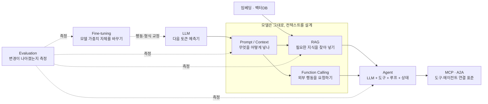

# AI 개요

AI 엔지니어링은 모델을 만드는 일이 아니라 **이미 있는 LLM에 무엇을 넣고(컨텍스트), 무엇을 하게 하고(도구), 어떻게 검증할지(평가)를 설계하는 일**입니다. 이 섹션은 LLM 기초에서 출발해 프롬프트 → RAG → Function Calling → Agent → 파인튜닝 → 평가 순으로 쌓아 올립니다. 이 페이지는 전체 지도와 학습 순서를 보여주는 허브이고, 자세한 설명은 각 문서로 넘깁니다.

## AI 엔지니어링 지도

읽는 법은 세 줄이면 충분합니다.

- **LLM은 입력(컨텍스트)만 보고 답합니다.** 프롬프트·RAG·Function Calling은 전부 "컨텍스트에 무엇을 넣을지"를 다루는 방법이고, 모델 가중치는 건드리지 않습니다.
- **Agent는 이 부품들을 루프로 묶은 것**입니다. 모델이 도구 호출 결과를 보고 다음 행동을 스스로 정합니다. MCP·A2A는 그 연결을 표준화합니다.
- **파인튜닝은 유일하게 모델 자체를 바꾸는 선택지**이고, **평가는 모든 단계에 걸립니다.** 측정 없이 바꾼 프롬프트·청킹·모델은 개선인지 퇴행인지 알 수 없습니다.

## 학습 순서

| 단계 | 무엇을 배우나 | 문서 |
|---|---|---|
| 1. LLM 기초 | 토큰, 추론 모델, 학습 과정, 샘플링 파라미터 | [LLM 기초](/ai/02-llm/01-llm) |
| 1. LLM 기초 | 텍스트를 벡터로 바꾸는 원리, 유사도 검색, 벡터DB | [임베딩 · 벡터DB](/ai/02-llm/02-embedding) |
| 2. 프롬프트 | 구성 요소, CoT·ReAct 등 기법, 인젝션 | [프롬프트 엔지니어링](/ai/03-prompt/01-promptengineering), [기법별 샘플](/ai/03-prompt/02-sample) |
| 2. 프롬프트 | 용도별 실전 프롬프트 | [RAG 프롬프트](/ai/03-prompt/03-rag), [Figma → 코드](/ai/03-prompt/04-figma) |
| 2. 프롬프트 | 상주 프롬프트(규칙)와 필요 시 로딩(스킬) | [Rule](/ai/03-prompt/05-rule), [Skill](/ai/03-prompt/06-skill), [CLAUDE.md 생성](/ai/03-prompt/07-claude) |
| 3. RAG | 검색 → 증강 → 생성 흐름, Advanced·Modular RAG, Rerank | [RAG 개요](/ai/04-rag/01-rag) |
| 3. RAG | 검색 전에 질의를 고치는 기법 | [Clearly](/ai/04-rag/techniques/01-clearly), [Lexical](/ai/04-rag/techniques/02-lexical), [Stopword](/ai/04-rag/techniques/03-stopword), [Normalization](/ai/04-rag/techniques/04-normalization), [Multi-Query](/ai/04-rag/techniques/05-multiQuery), [Injection](/ai/04-rag/techniques/06-injection), [HyDE](/ai/04-rag/techniques/07-hyde), [Expansion](/ai/04-rag/techniques/08-expansion), [Decomposition](/ai/04-rag/techniques/09-decomposition) |
| 4. Agent | 에이전트의 정의·구성 요소 | [Agent 개요](/ai/05-agent/01-agent) |
| 4. Agent | 모델이 도구 호출을 구조화된 출력으로 요청하는 방식 | [Function Calling](/ai/05-agent/03-function-calling) |
| 4. Agent | Prompt Chaining, Routing, Orchestrator-Workers 등 | [디자인 패턴](/ai/05-agent/02-pattern) |
| 4. Agent | 가드레일, 모니터링, 실패 유형 | [프로덕션 운영](/ai/05-agent/04-production) |
| 4. Agent | 도구 연결 표준과 에이전트 간 통신 | [MCP](/ai/05-agent/05-mcp), [A2A](/ai/05-agent/06-a2a) |
| 5. 파인튜닝 | Full·PEFT·LoRA·QLoRA, 데이터셋 구축과 실습 | [파인튜닝](/ai/06-fine-tuning/01-fine-tuning), [실습 예제](/ai/06-fine-tuning/02-sample) |
| 6. 평가 | 지표, 자체 벤치마크, 평가 도구 | [평가](/ai/07-evaluation/01-evaluation) |
| 6. 평가 | LLM을 심판으로 쓰는 자동 평가와 그 편향 | [LLM Judge](/ai/07-evaluation/02-llm-judge) |
| 확장 | 물리 세계와 상호작용하는 AI | [체화 지능](/ai/08-embodied) |
| 도구 | 코딩 에이전트, 로컬 모델, 프레임워크 | [Claude Code](/ai/09-tools/01-claude-code), [Ollama](/ai/09-tools/02-ollama), [LangChain](/ai/09-tools/03-langchain), [LangGraph](/ai/09-tools/04-langgraph), [Deep Agents](/ai/09-tools/05-deepagents) |

> 순서는 권장일 뿐입니다. 다만 **평가(6단계)는 마지막에 몰아서 배우지 말고 프롬프트를 처음 고칠 때부터 곁에 두세요.** "몇 개 돌려보니 좋아 보인다"는 판단이 가장 흔한 실패 원인입니다.

## 심화 시리즈

기초 문서를 한 번 훑은 뒤, 실무에서 막히는 지점을 질문 단위로 파고드는 시리즈입니다.

| 시리즈 | 한 줄 설명 |
|---|---|
| [LLM 심화 (16편)](/ai/advanced/llm/LLM) | Transformer·KV Cache·MoE부터 컨텍스트 윈도우, 파인튜닝·정렬까지 — 추론 성능과 비용이 왜 그렇게 나오는지 |
| [RAG 심화 (20편)](/ai/advanced/rag/RAG) | 청킹·검색 전략·Top K·Rerank·인덱스 운영·지식 그래프 — 파이프라인 단계별로 설계 판단 기준을 정리 |
| [Agent 심화 (54편)](/ai/advanced/agent/AGENT) | 입력 수신 → 라우팅 → 계획 → 도구 결정 → 권한 → 실행 → 컨텍스트 관리 → 평가까지, 에이전트 한 번의 실행을 단계별로 해부 |

## 컨텍스트 엔지니어링

**컨텍스트 엔지니어링**은 모델이 작업을 수행하는 데 필요한 정보·도구·환경을 체계적으로 설계하고 구성하는 접근 방식입니다. 프롬프트 엔지니어링이 "지시문을 어떻게 쓸까"라면, 컨텍스트 엔지니어링은 **매 추론 시점마다 제한된 컨텍스트 창에 어떤 토큰을 올릴지** 고르는 일입니다. 시스템 프롬프트, 대화 이력, 검색 결과, 도구 정의와 도구 결과, 메모리가 모두 대상입니다.

- 컨텍스트는 **요청에 맞춰 동적으로** 바뀌어야 합니다. 모든 것을 항상 넣는 것은 설계가 아니라 포기입니다.
- 목표는 모델이 **중요한 정보를 놓치지 않게** 하는 것입니다. 무관한 정보가 많을수록 중요한 정보가 묻힙니다.

> ⚠️ **함정**: 컨텍스트 창이 커졌다고 다 넣으면 해결되는 게 아닙니다. 창은 창고가 아니라 **주의력 예산**이라, 길어질수록 중간 내용을 놓치고 비용·지연도 늘어납니다. → [LLM 심화](/ai/advanced/llm/LLM)

## RAG vs Function Calling

둘 다 "모델이 모르는 것을 컨텍스트에 넣는" 방법이지만, 가져오는 대상이 다릅니다. RAG는 **읽을 문서**를, Function Calling은 **실행 결과**를 가져옵니다.

| 능력 차원 | RAG | Function Calling |
|---|---|---|
| 가져오는 것 | 관련 문서 조각(청크) | API·DB·함수의 실행 결과 |
| 데이터 신선도 | 인덱스 갱신에 의존(지연 가능) | 실시간 또는 준실시간(API 직접 호출) |
| 구현 복잡도 | 청킹·임베딩·검색 파이프라인 구축 | 명확한 인터페이스와 파라미터 스키마 정의 |
| 부작용 | 없음(읽기 전용) | 쓰기·결제·삭제 등 **실제 행동** 가능 → 권한 설계 필요 |
| 적합한 시나리오 | 정적인 지식(사내 문서, FAQ, 정책) | 동적인 상호작용(주문 조회, 날씨, 예약) |

실무에서는 둘을 섞습니다. "검색"을 하나의 도구로 노출하면 RAG가 Function Calling 위에 올라가고, 에이전트가 **언제 검색할지**를 스스로 정하게 됩니다(Agentic RAG). → [RAG 개요](/ai/04-rag/01-rag), [Function Calling](/ai/05-agent/03-function-calling)

## 프롬프트 vs RAG vs 파인튜닝

셋은 대체재가 아니라 **서로 다른 문제를 푸는 도구**입니다. OpenAI의 정확도 최적화 가이드는 이를 두 축으로 나눕니다. **모델이 모르는 정보가 문제**면 컨텍스트 최적화(RAG), **모델이 일관되게 행동하지 않는 게 문제**면 모델 최적화(파인튜닝)이고, 프롬프트는 둘 모두의 출발점입니다.

| 기준 | 프롬프트 | RAG | 파인튜닝 |
|---|---|---|---|
| 푸는 문제 | 지시·형식·추론 방식 | 모델이 **모르는 지식**(사내·최신·전문 자료) | 모델의 **행동·어조·형식의 일관성** |
| 바꾸는 것 | 입력 | 입력(검색 결과를 추가) | 모델 가중치 |
| 지식 갱신 | 매번 직접 넣음 | 문서만 추가·재색인하면 즉시 반영 | 재학습 필요 |
| 초기 비용 | 거의 없음 | 중간(검색 파이프라인) | 높음(고품질 학습 데이터 구축, 학습·서빙·재학습) |
| 출처 제시 | 어려움 | 쉬움(검색된 문서를 인용) | 어려움 |
| 잘 맞는 예 | 요약, 번역, 코드 생성 | 사내 문서 Q&A, 정책 안내 | 특정 말투의 상담봇, 고정 포맷 추출, 작은 모델로 비용 절감 |

- **파인튜닝**은 모델의 **제어 가능성**을 높입니다. 원하는 어조나 성향 쪽으로 모델을 기울일 수 있습니다.
- **임베딩 기반 RAG**는 새로운 자료를 **그때그때 계속 추가**할 수 있게 해 줍니다.
- 무엇이 나은지는 상황에 크게 좌우되므로, 결과물의 좋고 나쁨은 **해당 업무를 잘 아는 사람**이 판단해야 합니다(예: 고객 상담이라면 숙련된 상담사).

> ⚠️ **함정**: "지식을 넣으려고 파인튜닝"은 가장 흔한 오판입니다. 파인튜닝은 새 사실을 안정적으로 주입하는 데 약하고, 갱신할 때마다 재학습이 필요합니다. **프롬프트 → RAG → (그래도 행동이 안 맞으면) 파인튜닝** 순으로 올라가고, 필요하면 RAG와 파인튜닝을 함께 씁니다. → [파인튜닝](/ai/06-fine-tuning/01-fine-tuning)

## Agent와 Workflow의 차이

Anthropic의 [Building effective agents](https://www.anthropic.com/engineering/building-effective-agents)(2024-12)는 둘을 이렇게 구분합니다.

| | Workflow | Agent |
|---|---|---|
| 정의 | LLM과 도구가 **미리 정의된 코드 경로**를 따라 실행되는 시스템 | LLM이 **스스로 과정과 도구 사용을 결정**하며 작업 방식을 통제하는 시스템 |
| 흐름 결정 | 개발자(코드) | 모델(런타임) |
| 장점 | 예측 가능, 디버깅·테스트 쉬움, 비용 일정 | 경로를 미리 알 수 없는 열린 문제에 대응 |
| 단점 | 설계하지 않은 상황에 약함 | 지연·비용 증가, 오류가 누적될 수 있음 |
| 예 | n8n·Zapier식 자동화, Prompt Chaining, Routing | 코딩 에이전트, 리서치 에이전트 |

즉 정해진 흐름 위에서 각 단계만 LLM이 수행한다면 그것은 Agent가 아니라 Workflow입니다. Anthropic의 권고도 명확합니다. **가장 단순한 해법에서 시작하고, 복잡도는 결과가 실제로 좋아질 때만 올리라**는 것입니다. 많은 애플리케이션은 검색과 예시를 곁들인 단일 LLM 호출로 충분합니다.

> ⚠️ **함정**: 에이전트를 잘 만드는 핵심은 모델을 믿는 것이 아니라 **무엇을 코드로 고정하고(이산화), 무엇을 상태로 관리할지** 판단하는 것입니다. 모든 걸 모델에 맡기면 재현도 디버깅도 안 됩니다. → [디자인 패턴](/ai/05-agent/02-pattern), [Agent 심화](/ai/advanced/agent/AGENT)

## 어떻게 성장할 것인가

- **원리를 이해한다** — 모델과 기술이 왜 그렇게 동작하는지 알아야 새 도구가 나와도 흔들리지 않습니다.
- **도구를 능숙하게 다룬다** — 코딩 에이전트와 프레임워크를 매일 씁니다.
- **프로토타입을 만든다** — 개념을 실제로 동작하는 애플리케이션으로 옮겨 봅니다.
- **측정한다** — 작은 평가 세트라도 만들어 두고 변경마다 돌립니다.
- **커뮤니티에서 정보를 얻고, 꾸준히 실전 프로젝트를 한다.**

## 참고 자료

- [Anthropic — Building effective agents](https://www.anthropic.com/engineering/building-effective-agents)
- [Anthropic — Effective context engineering for AI agents](https://www.anthropic.com/engineering/effective-context-engineering-for-ai-agents)
- [OpenAI — Optimizing LLM accuracy (프롬프트·RAG·파인튜닝 선택)](https://developers.openai.com/api/docs/guides/optimizing-llm-accuracy)
