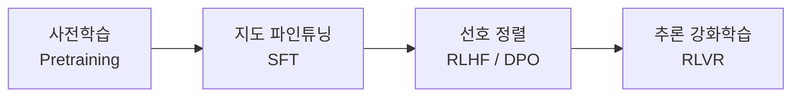

# LLM 기초

대형 언어 모델(LLM, Large Language Model)은 **방대한 텍스트로 "다음 토큰 예측"을 학습한 Transformer 모델**입니다. 대화·요약·코드 생성·추론은 모두 이 한 가지 동작을 반복한 결과입니다. 이 문서는 구조·토큰·학습 단계·호출 파라미터·한계·모델 선택 기준을 한 번에 훑고, 깊은 내용은 [LLM 심화 시리즈](/ai/advanced/llm/LLM)로 연결합니다.

## 텍스트가 생성되는 과정

LLM은 답을 한 번에 만들지 않습니다. **토큰 하나를 예측해 입력 뒤에 붙이고, 다시 전체를 넣어 다음 토큰을 예측하는 과정(자기회귀, autoregressive)** 을 종료 토큰이 나올 때까지 반복합니다.


이 구조에서 실무적으로 중요한 사실이 두 가지 나옵니다.

- **입력 처리(Prefill)와 출력 생성(Decode)은 성격이 다릅니다.** 입력은 한 번에 병렬로 계산하지만 출력은 토큰마다 한 번씩 순차로 계산합니다. 그래서 첫 토큰 지연(TTFT)은 입력 길이에, 전체 응답 시간은 출력 길이에 크게 좌우됩니다. → [Prefill과 첫 글자 지연](/ai/advanced/llm/LLM/08-Prefill과-첫-글자-지연)
- **이전 토큰의 계산 결과를 재사용하려고 KV Cache를 씁니다.** 속도를 얻는 대신 메모리를 쓰고, 컨텍스트가 길수록 메모리가 커집니다. → [KV Cache](/ai/advanced/llm/LLM/04-KV-Cache)

전체 흐름은 [LLM 추론 전 과정](/ai/advanced/llm/LLM/03-LLM-추론-전-과정)에서 자세히 다룹니다.

## Transformer

2017년 논문 *Attention Is All You Need*에서 제안된 구조로, 현재 거의 모든 LLM의 기반입니다.

| 구성 요소 | 역할 |
|---|---|
| **Self-Attention** | 각 토큰이 문장 안의 다른 토큰 중 무엇을 참고할지 계산합니다. Query·Key·Value 세 벡터로 "무엇을 찾나 / 나는 무엇인가 / 무엇을 줄 수 있나"를 표현합니다. |
| **Multi-Head Attention** | 어텐션을 여러 개 병렬로 두어 문법·지시 대상·의미 등 서로 다른 관계를 동시에 포착합니다. |
| **Feed-Forward Network** | 토큰마다 독립적으로 적용되는 MLP입니다. 파라미터의 상당 부분이 여기 있습니다. |
| **위치 정보** | 어텐션 자체는 순서를 모르므로 위치 인코딩(최근에는 RoPE 계열이 흔함)으로 순서를 주입합니다. |
| **Residual + Normalization** | 층을 깊게 쌓아도 학습이 안정되도록 합니다. |

RNN을 밀어낸 이유는 **장거리 의존성, 병렬 계산, 규모 확장**을 동시에 만족했기 때문입니다. RNN은 앞 토큰 계산이 끝나야 다음 토큰을 계산할 수 있어 GPU를 충분히 활용하지 못했습니다.

- 왜 Transformer인가 → [Transformer를 선택한 이유](/ai/advanced/llm/LLM/01-Transformer를-선택한-이유)
- Q·K·V 직관 → [QKV 이해하기](/ai/advanced/llm/LLM/02-QKV-이해하기)
- 일부 전문가만 활성화하는 MoE(Mixture of Experts) 구조 → [MoE 메모리](/ai/advanced/llm/LLM/05-MoE-메모리)

## 토큰과 토큰화

토큰화(tokenization)는 텍스트를 모델이 다루는 최소 단위인 **토큰**으로 쪼개고, 각 토큰을 어휘 사전(vocabulary)의 정수 ID로 바꾸는 과정입니다. 모델은 글자가 아니라 이 ID 열을 봅니다.

### 분할 단위

| 단위 | 예시 (`unhappiness`) | 장점 | 단점 |
|---|---|---|---|
| 단어 | `unhappiness` | 직관적 | 어휘가 폭발하고 처음 보는 단어(OOV)를 처리 못 함 |
| 문자 | `u n h a p p ...` | OOV 없음 | 시퀀스가 너무 길어짐 |
| **서브워드** | `un` `happi` `ness` | 어휘 크기와 시퀀스 길이의 균형 | 분할 결과가 사람 직관과 다를 수 있음 |

현대 LLM은 거의 전부 **서브워드** 방식을 씁니다.

### 대표 알고리즘

| 알고리즘 | 방식 | 주요 사용처 |
|---|---|---|
| **BPE** (Byte Pair Encoding) | 가장 자주 붙어 나오는 쌍을 반복적으로 병합해 어휘를 만듭니다. | GPT 계열 등 |
| **Byte-level BPE** | 문자 대신 UTF-8 **바이트**에서 시작하는 BPE. 어떤 문자열이든 표현할 수 있어 OOV가 없습니다. | GPT-2 이후 OpenAI 모델(`tiktoken`), Llama 3 등 |
| **WordPiece** | BPE와 비슷하지만 단순 빈도 대신 병합 시 말뭉치 우도(likelihood)가 가장 커지는 쌍을 고릅니다. | BERT |
| **Unigram LM** | 큰 후보 어휘에서 시작해 확률 모델 기준으로 기여가 적은 토큰을 제거합니다. 추론 시 가장 그럴듯한 분할을 선택합니다. | T5 등 |
| **SentencePiece** | 알고리즘이 아니라 **Google의 토크나이저 라이브러리**입니다. BPE와 Unigram을 지원하고, 공백까지 문자로 취급해 언어별 사전 분리 없이 원문을 바로 학습합니다. | T5, Llama 2 등 |

### 토큰 수 확인

```python
import tiktoken

enc = tiktoken.get_encoding("o200k_base")  # GPT-4o 계열 인코딩
for text in ["Hello, world!", "안녕하세요, 세계!"]:
    ids = enc.encode(text)
    print(text, len(ids), ids)
```

브라우저에서 바로 확인하려면 [Tiktokenizer](https://tiktokenizer.vercel.app/)가 편합니다.

### 토큰이 실무에 주는 영향

- **과금·컨텍스트 한도·출력 한도가 전부 토큰 단위**입니다.
- **같은 문장도 토크나이저마다 토큰 수가 다릅니다.** 한국어는 토크나이저에 따라 같은 의미의 영어 문장보다 토큰이 더 많이 드는 경우가 흔합니다. 모델 세대가 바뀌며 토크나이저가 바뀌기도 합니다. 예를 들어 Anthropic은 Claude Opus 4.7부터 새 토크나이저를 도입했고, 공식 문서 기준 1M 토큰에 들어가는 영어 단어 수가 약 75만 개에서 약 55.5만 개로 줄었습니다.
- **글자 수 세기, 뒤집기, 자릿수 계산에 약한 이유**가 여기 있습니다. 모델은 `strawberry`를 글자가 아니라 몇 개의 토큰 덩어리로 봅니다.

> ⚠️ **함정**: "한글 1자 ≈ 1토큰" 같은 어림셈으로 비용과 한도를 계산하면 모델을 바꿀 때 조용히 틀어집니다. 운영 비용 추정은 반드시 **해당 모델의 토크나이저나 토큰 카운트 API**로 실제 데이터를 세서 하세요.

## 컨텍스트 윈도우

컨텍스트 윈도우는 **모델이 한 번의 호출에서 다룰 수 있는 토큰의 최대치**입니다. 시스템 프롬프트, 대화 이력, 첨부 문서, 도구 정의, 그리고 모델이 생성하는 출력(추론 모델의 사고 토큰 포함)이 모두 이 안에 들어갑니다.

2026년 기준 주요 프런티어 API 모델은 **100만(1M) 토큰 전후**의 윈도우를 제공합니다(예: Claude Opus 5·Sonnet 5는 1M 토큰). 하지만 **담을 수 있다는 것과 잘 활용한다는 것은 다릅니다.**

| 긴 컨텍스트의 비용 | 설명 |
|---|---|
| **주의력 희석** | 문서 중간에 있는 정보를 놓치는 경향이 보고되었습니다(*Lost in the Middle*). 넣을수록 핵심이 묻힙니다. |
| **지연** | 입력이 길수록 Prefill 시간, 즉 첫 토큰까지의 시간이 늘어납니다. |
| **비용** | 매 호출마다 입력 토큰 전체가 과금됩니다. 다중 턴 대화는 이력이 누적되어 비용이 가파르게 늘어납니다. |
| **메모리** | 서빙 측 KV Cache가 컨텍스트 길이에 비례해 커집니다. |

> ⚠️ **함정**: "윈도우가 크니 문서를 통째로 넣자"는 설계는 데모에서는 잘 되다가 운영에서 정확도·지연·비용이 함께 무너집니다. 필요한 부분만 골라 넣는 [RAG](/ai/04-rag/01-rag), 이력 요약, 프롬프트 캐싱을 먼저 검토하세요.

- [컨텍스트 윈도우는 주의력 예산](/ai/advanced/llm/LLM/09-컨텍스트-윈도우는-주의력-예산)
- [다중 턴 대화 이력 압축](/ai/advanced/llm/LLM/10-다중-턴-대화-이력-압축)
- [접두사 캐시와 시맨틱 캐시](/ai/advanced/llm/LLM/11-접두사-캐시와-시맨틱-캐시)
- [프롬프트가 너무 길 때의 함정](/ai/advanced/llm/LLM/13-프롬프트가-너무-길-때의-함정)

## 모델 분류

### 구조에 따른 분류

| 구조 | 대표 모델 | 주 용도 |
|---|---|---|
| **Decoder-only** | GPT, Llama, Qwen, DeepSeek 등 | 텍스트 생성. 현재 생성형 LLM의 표준 구조 |
| **Encoder-only** | BERT, RoBERTa | 문장 이해·분류. 오늘날에는 **임베딩 모델, 리랭커**의 기반으로 많이 쓰임 |
| **Encoder-Decoder** | T5, BART | 번역·요약처럼 입력을 다른 형태로 바꾸는 작업 |

같은 decoder-only 안에서도 모든 파라미터를 매번 쓰는 **Dense** 모델과, 토큰마다 일부 전문가(expert)만 활성화하는 **MoE** 모델로 나뉩니다. MoE는 계산량은 활성 파라미터 기준이지만 **메모리는 전체 파라미터를 올려야** 합니다.

### 규모에 따른 분류

경계는 관례적이며 시기에 따라 계속 올라갑니다.

| 구분 | 대략적 규모 | 특징 |
|---|---|---|
| 소형(SLM) | 수억 ~ 수십억(B) 파라미터 | 노트북·모바일·엣지에서 실행 가능. 분류·추출·라우팅 같은 좁은 작업에 적합 |
| 중형 | 수십억 ~ 수백억 | 단일 GPU 서버에서 운영 가능한 범위. 파인튜닝 대상으로 흔함 |
| 대형 | 수천억 이상 (MoE는 조 단위 총 파라미터도 존재) | 범용 추론·코딩·에이전트 작업의 상한 성능 |

> 상용 API 모델 대부분은 파라미터 수를 공개하지 않습니다. 규모는 **성능·비용·지연의 대리 지표**일 뿐, 모델을 고를 때는 직접 평가한 결과를 보세요.

### 모달리티에 따른 분류

| 구분 | 설명 |
|---|---|
| 텍스트 전용 | 텍스트 입력 → 텍스트 출력 |
| 멀티모달 입력 | 이미지·오디오·영상·PDF 등을 함께 입력받아 텍스트로 답합니다. 현재 주요 상용 모델은 대부분 최소한 이미지 입력을 지원합니다. |
| 멀티모달 출력 | 이미지·음성 등을 직접 생성합니다. |

Transformer는 텍스트는 단어 조각, 이미지는 패치, 오디오는 음향 조각처럼 **무엇이든 토큰으로 바꾸면** 같은 구조로 처리할 수 있어 멀티모달 확장이 자연스럽습니다. 로봇 행동까지 토큰으로 다루는 사례는 [체화 지능](/ai/08-embodied)을 참고하세요.

### 튜닝 단계에 따른 분류

| 구분 | 만들어지는 방법 | 특징 | 쓰는 곳 |
|---|---|---|---|
| **Base 모델** | 사전학습만 거침 | 지시를 따르지 않고 문서를 "이어 씀" | 추가 학습의 출발점 |
| **Instruct / Chat 모델** | SFT + 선호 정렬 | 지시를 따르고 대화 형식으로 답함 | 일반 애플리케이션 |
| **추론(Reasoning) 모델** | 위 단계 + 추론 강화학습 | 답하기 전에 긴 사고 과정을 생성 | 수학·코딩·복잡한 계획 |

## 추론 모델 vs 비추론 모델

추론 모델은 **최종 답 전에 사고(thinking) 토큰을 길게 생성**하도록 강화학습으로 훈련된 모델입니다. OpenAI o1(2024년 9월)이 대중화했고, DeepSeek-R1(2025년 1월)이 정답을 검증할 수 있는 문제에 강화학습을 적용하는 방법을 공개하면서 널리 퍼졌습니다.

| 항목 | 추론 모델 | 비추론 모델 |
|---|---|---|
| 문제 해결 방식 | 단계적으로 사고한 뒤 답함 | 곧바로 답을 생성 |
| 강한 영역 | 수학, 논리, 코딩, 다단계 계획, 복잡한 의사결정 | 일반 대화, 요약, 번역, 글쓰기, 단순 추출 |
| 지연 | 김 (사고 토큰만큼 늘어남) | 짧음 |
| 비용 | 높음 (사고 토큰도 출력 토큰으로 과금) | 낮음 |
| 실패 패턴 | 과도하게 생각함(overthinking), 쉬운 문제에 시간 낭비 | 긴 문제에서 중간 논리 점프, 그럴듯하지만 피상적인 답 |

최근에는 둘을 별도 모델로 나누기보다 **하나의 모델에서 사고량을 조절**하는 방식이 일반적입니다. OpenAI는 `reasoning_effort`, Anthropic은 `effort` 파라미터와 모델이 스스로 사고량을 정하는 adaptive thinking을 제공합니다.

> ⚠️ **함정**: 추론 모델에 "단계별로 생각해"(CoT 프롬프트)나 긴 풀이 예시를 넣는 것은 대개 효과가 없거나 오히려 방해가 됩니다. 모델이 이미 내부적으로 사고합니다. 추론 모델에는 **목표·제약·완료 조건을 명확히** 주는 편이 낫습니다. → [프롬프트 엔지니어링](/ai/03-prompt/01-promptengineering)

## 학습 과정



| 단계 | 데이터 | 목표 | 결과 |
|---|---|---|---|
| **사전학습** | 웹·책·코드 등 수조 토큰 규모의 원문 | 다음 토큰 예측 (자기지도 학습) | 언어·지식·패턴을 익힌 Base 모델 |
| **SFT** (Supervised Fine-Tuning) | 사람이 작성하거나 선별한 (지시, 응답) 쌍 | 정답 응답을 모방 | 지시를 따르고 형식을 지키는 모델 |
| **RLHF** (Reinforcement Learning from Human Feedback) | 같은 질문에 대한 응답들의 사람 선호 비교 | 선호를 학습한 보상 모델을 기준으로 정책 최적화 (InstructGPT에서 PPO 사용) | 도움이 되고 안전한 방향으로 정렬 |
| **DPO** (Direct Preference Optimization) | RLHF와 같은 선호 쌍 | 보상 모델·강화학습 없이 선호 데이터로 직접 최적화 | RLHF보다 단순하고 안정적인 대안 |
| **RLVR** (RL with Verifiable Rewards) | 정답을 자동 검증할 수 있는 수학·코딩 문제 | 정답 여부를 보상으로 강화학습 (DeepSeek-R1은 GRPO 사용) | 긴 사고 과정을 스스로 만드는 추론 모델 |

사람 대신 AI가 선호 판단을 하는 **RLAIF**, 원칙 목록으로 AI 피드백을 유도하는 Anthropic의 **Constitutional AI**도 선호 정렬 단계의 변형입니다.

- 파인튜닝이 실제로 무엇을 바꾸는지 → [파인튜닝은 무엇을 조정하는가](/ai/advanced/llm/LLM/14-파인튜닝은-무엇을-조정하는가), [SFT와 RLHF](/ai/advanced/llm/LLM/15-SFT와-RLHF)
- 직접 해보기 → [파인튜닝](/ai/06-fine-tuning/01-fine-tuning), [파인튜닝 7단계](/ai/advanced/llm/LLM/16-파인튜닝-7단계)

### 학습 방식 관련 용어

자주 섞여 쓰이는 용어들입니다. 핵심 구분은 **모델 가중치가 바뀌는가**입니다.

| 용어 | 설명 | 가중치 변경 |
|---|---|---|
| **전이학습** (Transfer learning) | 한 데이터·과제로 사전학습한 모델을 다른 과제에 옮겨 활용합니다. LLM 활용 전체가 사실상 전이학습입니다. | 경우에 따라 |
| **파인튜닝** (Fine-tuning) | 특정 용도의 추가 데이터로 사전학습 모델의 파라미터를 조정합니다. LoRA 같은 PEFT는 일부 파라미터만 학습합니다. | O |
| **제로샷** (Zero-shot) | 예시 없이 지시만으로 과제를 수행합니다. | X |
| **퓨샷** (Few-shot) | 프롬프트에 예시 몇 개를 넣어 성능을 올립니다. 이름과 달리 학습이 아니라 **문맥 내 학습(in-context learning)** 입니다. | X |
| **지속학습** (Continual learning) | 새 데이터를 계속 학습하면서 기존 지식을 잊지 않게 합니다. 새 학습이 기존 능력을 덮어쓰는 **파국적 망각**이 핵심 난제입니다. | O |
| **멀티태스크 학습** | 여러 관련 과제를 함께 학습해 일반화 성능을 높입니다. | O |
| **강화학습** (RL) | 행동의 결과로 받은 보상 신호를 기준으로 정책을 최적화합니다. | O |

> ⚠️ **함정**: 퓨샷으로 안 되면 곧바로 파인튜닝으로 가기 쉽지만, 문제가 **모델이 모르는 지식**이라면 파인튜닝보다 RAG가 맞습니다. "지식이 없으면 RAG, 행동(형식·스타일·판단 기준)이 틀리면 파인튜닝"이 기본 판별 기준입니다.

## 샘플링 파라미터

모델은 매 단계 어휘 전체에 대한 점수(logit)를 내고, 이를 확률 분포로 바꾼 뒤 **어떤 토큰을 뽑을지**를 샘플링 파라미터로 제어합니다.

```text
logits ──(÷ temperature)──> softmax ──> 후보 자르기(top-k / top-p / min-p) ──> 샘플링 ──> 다음 토큰
```

| 파라미터 | 역할 | 설정 가이드 |
|---|---|---|
| **temperature** | 분포를 뾰족하게(낮음) 또는 평평하게(높음) 만듭니다. 낮으면 확률 높은 토큰이 거의 항상 선택되어 결정적이고, 높으면 다양하지만 엉뚱한 토큰도 뽑힙니다. | 추출·분류·사실 질의응답은 낮게, 브레인스토밍·창작은 높게 |
| **top_p** (nucleus sampling) | 확률 높은 순으로 누적 확률이 p에 도달할 때까지의 토큰만 후보로 남깁니다. | 보통 temperature와 **둘 중 하나만** 조정 |
| **top_k** | 확률 상위 k개만 후보로 남깁니다. | 긴 꼬리의 저확률 토큰 제거용 |
| **max tokens** | 생성할 최대 토큰 수. 도달하면 문장 중간이라도 잘립니다. | 비용·지연 상한. 추론 모델은 사고 토큰까지 포함해 여유 있게 |
| **stop sequences** | 이 문자열이 생성되면 즉시 멈춥니다. | 예: 번호 목록을 10개까지만 받으려면 `11.`을 지정 |
| **frequency penalty** | 이미 **등장한 횟수에 비례해** 해당 토큰의 점수를 깎습니다. 같은 단어의 반복을 줄입니다. | OpenAI 기준 -2.0~2.0, 기본 0 |
| **presence penalty** | 한 번이라도 **등장했는지 여부만** 보고 똑같이 깎습니다. 2회 등장한 토큰과 10회 등장한 토큰이 같은 페널티를 받습니다. 새로운 주제로 넘어가게 유도합니다. | OpenAI 기준 -2.0~2.0, 기본 0 |

> `verbose`는 모델 파라미터가 아니라 LangChain 같은 **프레임워크의 로깅 옵션**으로, 실행 과정을 출력할지 정합니다.

### 제공자별 지원 차이

샘플링 파라미터는 **모델과 제공자에 따라 지원 여부가 크게 다릅니다.** 특히 추론 모델은 내부 사고 과정의 보정을 깨뜨리지 않도록 샘플링 제어를 막는 추세입니다.

| 제공자 | 현황 (2026-09 기준) |
|---|---|
| **OpenAI** | o 시리즈·GPT-5 계열 추론 모델은 temperature·top_p 같은 샘플링 파라미터를 제한합니다. 허용 범위는 모델과 추론 강도(`reasoning_effort`) 설정에 따라 다르며(예: 추론을 끈 `none`에서만 허용), 대신 `reasoning_effort`와 `verbosity`로 조절하도록 안내합니다. top_k는 제공하지 않습니다. |
| **Anthropic** | Claude Opus 4.6 이후 출시된 모델은 temperature·top_p·top_k를 **지원하지 않으며**, 기본값이 아닌 값을 보내면 400 에러를 반환합니다. 그 이전 모델도 temperature와 top_p를 동시에 지정하지 않도록 권장했습니다. |
| **오픈 웨이트 (Ollama, vLLM, llama.cpp 등)** | temperature, top_p, top_k, min_p, 반복 페널티, seed 등 전체 샘플링 옵션을 직접 제어할 수 있습니다. |

```bash
# Ollama 로컬 모델 호출 예시 — 옵션을 직접 지정
curl http://localhost:11434/api/generate -d '{
  "model": "llama3.2",
  "prompt": "다음 문장에서 날짜만 추출해줘: 회의는 2026년 9월 22일에 열린다.",
  "stream": false,
  "options": { "temperature": 0, "top_p": 0.9, "num_predict": 64, "stop": ["\n\n"] }
}'
```

> ⚠️ **함정**: `temperature: 0`이어도 출력이 **완전히 결정적이라는 보장은 없습니다.** 서버의 배치 구성, 부동소수점 연산, 모델 업데이트에 따라 결과가 달라질 수 있습니다. 재현성이 필요한 테스트는 파라미터가 아니라 **평가 데이터셋과 반복 측정**으로 확보하세요. 또한 프레임워크가 기본값으로 temperature와 top_p를 함께 보내 새 모델에서 400 에러가 나는 사례가 흔하므로, 모델을 바꿀 때 요청 페이로드를 확인하세요.

생성 품질 문제를 진단할 때는 **"분포 자체가 나쁜가(모델·프롬프트 문제)" vs "분포에서 잘못 뽑는가(디코딩 설정 문제)"** 를 먼저 구분하면 빠릅니다. 같은 말을 반복하면 디코딩 설정부터 확인하세요.

## 환각과 한계

**환각(hallucination)** 은 모델이 사실이 아닌 내용을 그럴듯하고 자신 있게 생성하는 현상입니다. 버그가 아니라 구조에서 나오는 성질입니다.

### 원인

| 원인 | 설명 |
|---|---|
| **목표 함수** | 모델은 "사실"이 아니라 "그럴듯한 다음 토큰"을 학습합니다. 창의성과 환각은 같은 뿌리입니다. |
| **추측을 보상하는 평가** | OpenAI 연구진의 *Why Language Models Hallucinate*(2025)는 정답률 위주의 학습·평가가 "모른다"고 답하기보다 **추측하는 쪽을 보상**하기 때문에 환각이 유지된다고 분석합니다. |
| **지식 컷오프** | 학습 데이터 이후의 사건, 사내 문서 등 학습에 없던 정보는 알 수 없습니다. |
| **토큰 단위 처리** | 글자 수 세기, 긴 숫자 연산, 정확한 인용에 약합니다. |
| **긴 컨텍스트 열화** | 입력이 길어질수록 중간 정보를 놓치거나 섞습니다. |
| **아첨(sycophancy)** | 사용자의 전제나 의견에 맞춰 틀린 답에 동조하는 경향이 있습니다. |

### 완화 방법

| 방법 | 효과 | 관련 문서 |
|---|---|---|
| 근거 문서 제공 (RAG) | 모르는 지식을 외부에서 공급하고 답을 근거에 묶음 | [RAG](/ai/04-rag/01-rag) |
| 도구 사용 | 계산·검색·날짜 처리를 코드와 API에 위임 | [Function Calling](/ai/05-agent/03-function-calling) |
| "근거가 없으면 모른다고 답하라" + 출처 인용 요구 | 추측 대신 거절을 허용하고 검증 가능하게 만듦 | [프롬프트 엔지니어링](/ai/03-prompt/01-promptengineering) |
| 구조화 출력 + 스키마 검증 | 형식 오류를 코드에서 잡음 | |
| 평가 체계 | 환각률을 수치로 추적하고 회귀를 감지 | [평가](/ai/07-evaluation/01-evaluation), [LLM-as-a-Judge](/ai/07-evaluation/02-llm-judge) |

> ⚠️ **함정**: 같은 모델에게 "방금 답 확실해?"라고 되묻는 것은 검증이 아닙니다. 모델은 쉽게 입장을 바꾸거나 틀린 답을 더 그럴듯하게 방어합니다. 검증은 **외부 근거(문서·코드 실행·테스트)** 로 해야 합니다.

## 모델 선택 기준

### 오픈 웨이트 vs API

| 기준 | API 모델 (OpenAI, Anthropic, Google 등) | 오픈 웨이트 모델 (Llama, Qwen, DeepSeek, Mistral, gpt-oss 등) |
|---|---|---|
| **성능 상한** | 일반적으로 최상위 | 빠르게 추격 중. 특정 과제에서는 충분하거나 동등 |
| **데이터 통제** | 외부 전송 필요 (보존·학습 정책 확인) | 자체 인프라에서 완결 가능 |
| **비용 구조** | 토큰당 종량제. 초기 비용 없음 | GPU 고정비. 트래픽이 크고 일정할수록 유리 |
| **운영 부담** | 거의 없음 | 서빙·스케일링·모니터링·업데이트를 직접 담당 |
| **커스터마이징** | 프롬프트, 일부 제공자의 파인튜닝 API | 파인튜닝·양자화·디코딩까지 전부 가능 |
| **변경 통제** | 제공자가 모델을 폐기·교체함 | 버전을 영구 고정 가능 |
| **라이선스** | 이용약관 | **모델마다 다름** — 예: gpt-oss·Qwen3는 Apache 2.0, DeepSeek-R1은 MIT, Llama는 월간 활성 사용자 7억 명 초과 시 별도 허가가 필요한 자체 라이선스 |

"오픈 소스"와 "오픈 웨이트"는 다릅니다. 가중치만 공개하고 학습 데이터·코드는 공개하지 않는 경우가 대부분이므로, 상업적 사용 전 **라이선스 조항을 직접 확인**하세요. 로컬 실행은 [Ollama](/ai/09-tools/02-ollama)로 쉽게 시작할 수 있습니다.

### 체크리스트

1. **과제 난이도** — 분류·추출은 작은 모델로 충분한 경우가 많습니다. 작은 모델부터 평가하고 부족할 때 올리세요.
2. **품질** — 공개 벤치마크가 아니라 **내 데이터로 만든 평가셋** 기준으로 비교합니다.
3. **지연과 처리량** — 실시간 UI인지 배치 작업인지에 따라 허용 범위가 다릅니다.
4. **비용** — 입력·출력·캐시 단가, 추론 모델의 사고 토큰까지 포함해 요청당 비용을 계산합니다.
5. **컨텍스트 길이** — 필요한 입력 크기와 출력 최대 길이를 확인합니다.
6. **기능 지원** — 도구 호출, 구조화 출력, 이미지 입력, 프롬프트 캐싱, 배치 API.
7. **한국어 품질** — 영어 벤치마크 순위가 한국어 성능을 보장하지 않습니다.
8. **데이터 거버넌스와 라이선스** — 개인정보·사내 데이터 반출 가능 여부, 리전, 상업적 이용 조건.

> ⚠️ **함정**: 리더보드 1위 모델을 그대로 고르는 것. 벤치마크는 학습 데이터 오염, 과제 불일치 문제가 있고 순위는 몇 주 만에 바뀝니다. 모델을 쉽게 교체할 수 있도록 **호출부를 추상화하고 평가셋을 먼저 만들어 두는 것**이 모델 선택보다 오래 가는 투자입니다.

## 모델 개발 흐름

모델을 직접 학습하거나 파인튜닝하는 프로젝트의 일반적인 단계입니다.

1. 목표와 요구사항 정의 — 프롬프트나 RAG로 해결되지 않는지 먼저 확인
2. 데이터 수집과 전처리 — 품질 필터링, 중복 제거, 개인정보 제거
3. 베이스 모델 선택과 아키텍처 결정
4. 학습 — 사전학습(드묾) 또는 파인튜닝(SFT, 선호 정렬)
5. 평가와 최적화 — 과제 평가셋, 기존 능력 퇴화 확인, 양자화·증류
6. 배포와 서빙
7. 모니터링과 유지보수 — 품질 드리프트, 비용, 사용자 피드백 수집

직접 소형 LLM을 처음부터 학습해 보고 싶다면 [MiniMind](https://github.com/jingyaogong/minimind) 같은 교육용 프로젝트가 좋은 출발점입니다.

## 용어

| 용어 | 설명 |
|---|---|
| **NLP** (Natural Language Processing) | 자연어 처리. 컴퓨터가 인간 언어를 이해·생성하도록 하는 분야 |
| **RNN** (Recurrent Neural Network) | 순환 신경망. 이전 상태를 다음 계산에 넘기며 순차 데이터를 처리 |
| **LSTM** (Long Short-Term Memory) | 게이트로 정보 흐름을 조절해 RNN보다 먼 거리의 의존 관계를 잘 포착하는 변형 |
| **Transformer** | 셀프 어텐션 기반 아키텍처. 현재 LLM의 표준 |
| **Word2Vec** | 단어를 벡터 공간에 매핑해 의미 관계를 담는 초기 임베딩 기법 → [임베딩](./02-embedding) |
| **BERT** | 문맥을 양방향으로 보는 encoder-only 사전학습 모델 |
| **GPT** (Generative Pre-trained Transformer) | decoder-only 생성형 사전학습 모델 계열 |
| **MoE** (Mixture of Experts) | 토큰마다 일부 전문가 네트워크만 활성화하는 구조 |
| **SFT / RLHF / DPO / RLVR** | 학습 단계 용어. 위의 학습 과정 표 참고 |
| **TTFT** (Time To First Token) | 요청 후 첫 토큰이 나올 때까지의 시간 |
| **AIGC** (AI Generated Content) | AI가 생성한 콘텐츠. 전문가 제작 콘텐츠(PGC), 일반 사용자 제작 콘텐츠(UGC)와 대비되는 용어 |

## 참고 자료

- [Vaswani et al. — Attention Is All You Need (2017)](https://arxiv.org/abs/1706.03762)
- [Brendan Bycroft — LLM Visualization (GPT 내부 동작 3D 시각화)](https://bbycroft.net/llm)
- [Hugging Face — Summary of the tokenizers](https://huggingface.co/docs/transformers/tokenizer_summary)
- [Ouyang et al. — Training language models to follow instructions with human feedback (InstructGPT)](https://arxiv.org/abs/2203.02155)
- [Rafailov et al. — Direct Preference Optimization](https://arxiv.org/abs/2305.18290)
- [DeepSeek-AI — DeepSeek-R1: Incentivizing Reasoning Capability in LLMs via Reinforcement Learning](https://arxiv.org/abs/2501.12948)
- [Liu et al. — Lost in the Middle: How Language Models Use Long Contexts](https://arxiv.org/abs/2307.03172)
- [Kalai et al. — Why Language Models Hallucinate](https://arxiv.org/abs/2509.04664)
- [Anthropic — Models overview](https://platform.claude.com/docs/en/about-claude/models/overview)
- [Anthropic — Messages API reference (sampling 파라미터 지원 현황)](https://platform.claude.com/docs/en/api/messages/create)
- [Hugging Face](https://huggingface.co/), [ModelScope](https://www.modelscope.ai/) — 오픈 웨이트 모델 허브
- [MiniMind — 소형 LLM을 처음부터 학습하는 교육용 프로젝트](https://github.com/jingyaogong/minimind)
