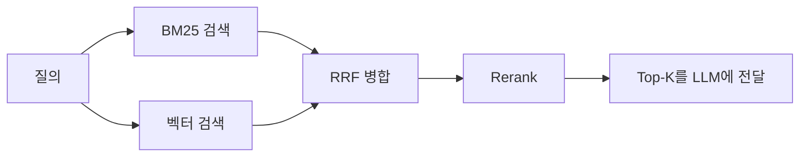

# 임베딩과 벡터 검색

임베딩(embedding)은 텍스트·이미지 같은 데이터를 **의미가 비슷할수록 서로 가까이 놓이도록 학습된 고정 길이 벡터**로 바꾼 것입니다. 벡터 검색은 질의 벡터와 가장 가까운 벡터를 찾는 일이고, 이것이 [RAG](/ai/04-rag/01-rag)의 검색 단계를 떠받치는 기반입니다.

## 임베딩이란

```text
"환불은 어떻게 받나요?"      → [ 0.021, -0.113,  0.087, ...]   (예: 1024차원)
"결제 취소 절차를 알려주세요" → [ 0.019, -0.098,  0.091, ...]   ← 단어는 달라도 가까움
"오늘 서울 날씨"             → [-0.142,  0.051, -0.033, ...]   ← 멀리 떨어짐
```

- 초기에는 **Word2Vec**처럼 단어 하나에 벡터 하나를 대응시켰습니다. 문맥을 보지 못해 "배(과일)"와 "배(선박)"가 같은 벡터였습니다.
- 지금은 Transformer 인코더로 **문장·문단 전체의 의미를 벡터 하나로 요약**하는 문장 임베딩 모델(Sentence-BERT 계열 등)을 씁니다. 질의와 문서를 각각 독립적으로 인코딩하는 이 구조를 **bi-encoder**라고 부르며, 문서 벡터를 미리 계산해 둘 수 있어 대규모 검색에 적합합니다.
- 임베딩 공간이 어떻게 생겼는지는 [Embedding Projector](https://projector.tensorflow.org/)에서 시각적으로 확인할 수 있습니다.

> LLM 내부의 **토큰 임베딩**(입력 토큰 ID를 벡터로 바꾸는 첫 층)과 검색에 쓰는 **임베딩 모델의 출력 벡터**는 다른 개념입니다. 검색용 벡터는 대조 학습(contrastive learning) 등으로 "의미 유사도"를 직접 목표로 학습된 별도 모델에서 나옵니다. → [LLM 기초](./01-llm)

### 주요 용도

| 용도 | 예시 |
|---|---|
| 의미 검색 | RAG 문서 검색, 사내 위키 검색 |
| 분류·클러스터링 | 문의 유형 자동 분류, 비슷한 리뷰 묶기 |
| 중복 탐지 | 유사 질문·중복 티켓 찾기 |
| 추천 | 비슷한 상품·콘텐츠 찾기 |
| 시맨틱 캐시 | 의미가 같은 질문에 이전 LLM 응답 재사용 → [접두사 캐시와 시맨틱 캐시](/ai/advanced/llm/LLM/11-접두사-캐시와-시맨틱-캐시) |

### 최소 예제

```python
# pip install -U sentence-transformers
from sentence_transformers import SentenceTransformer

model = SentenceTransformer("nlpai-lab/KURE-v1")  # 한국어 검색 특화, 1024차원

docs = ["환불은 결제일로부터 7일 이내에 신청할 수 있습니다.",
        "배송은 영업일 기준 2~3일이 소요됩니다."]
query = "돈 돌려받으려면 어떻게 해?"

doc_vecs = model.encode(docs, normalize_embeddings=True)
query_vec = model.encode([query], normalize_embeddings=True)

scores = query_vec @ doc_vecs.T   # 정규화했으므로 내적 = 코사인 유사도
print(scores)                     # 환불 문서 점수가 더 높게 나옵니다
```

## 유사도 측정

| 지표 | 계산 | 값의 의미 | 특징 |
|---|---|---|---|
| **코사인 유사도** | `a·b / (‖a‖‖b‖)` | -1 ~ 1, 클수록 유사 | 벡터 길이를 무시하고 **방향**만 비교. 텍스트 임베딩의 기본값 |
| **내적** (dot product) | `a·b` | 클수록 유사 | 길이도 반영. 정규화된 벡터면 코사인과 동일하고 계산이 가장 빠름 |
| **유클리드 거리** (L2) | `‖a − b‖` | 작을수록 유사 | 공간상 직선 거리. 정규화된 벡터면 코사인과 **순위가 같음** |

벡터를 길이 1로 정규화하면 세 지표의 **검색 순위가 같아집니다.** 예를 들어 OpenAI 임베딩은 길이 1로 정규화되어 나오므로 코사인 대신 내적으로 계산해도 됩니다.

> ⚠️ **함정**: 모델은 특정 지표를 기준으로 학습됩니다. 모델 문서가 권장하는 지표와 **벡터 DB 인덱스에 설정한 지표가 다르면** 에러 없이 검색 품질만 조용히 떨어집니다. 정규화하지 않은 벡터를 내적 인덱스에 넣는 실수도 흔합니다. 인덱스를 만들 때 지표와 정규화 여부를 함께 확인하세요.

## 키워드 검색 vs 의미 검색

### 키워드(어휘) 검색

- **TF-IDF** (Term Frequency–Inverse Document Frequency): 문서 안에서 자주 나오고(TF), 전체 문서에서는 드문(IDF) 단어일수록 그 문서에서 중요하다고 보는 통계적 가중치입니다.
- **BM25** (Best Matching 25): TF-IDF를 개선한 랭킹 함수로, 현재 검색 엔진의 사실상 표준입니다. 두 가지를 보정합니다.
  - **TF 포화** (`k1`): 같은 단어가 10번 나온다고 1번보다 10배 관련 있지는 않으므로, 빈도 효과를 점점 둔화시킵니다.
  - **문서 길이 정규화** (`b`): 긴 문서가 단지 길어서 점수를 많이 받는 것을 막습니다.

### 의미 검색

질의와 문서를 임베딩으로 바꾸고 **벡터 간 거리**로 관련성을 판단합니다. 단어가 하나도 겹치지 않아도 의미가 같으면 찾을 수 있습니다.

### 비교

| | 키워드 검색 (BM25) | 의미 검색 (임베딩) |
|---|---|---|
| 매칭 대상 | 단어(토큰) 일치 | 의미 공간상의 거리 |
| 강점 | **고유명사·코드·번호**(`AX-9901`, `제23조`, 에러 코드), 결과 설명 가능 | **동의어·바꿔 쓴 표현**("돈 돌려받기" ↔ "환불 절차"), 다국어 |
| 약점 | 표현이 달라지면 못 찾음 | 정확한 식별자 매칭에 약함, 학습 도메인 밖에서 엉뚱한 결과 |
| 비용 | 가벼움. 별도 모델 불필요 | 임베딩 모델 호출·벡터 저장 비용 |
| 장애 서명 | "표현만 바꾸면 안 나온다" | "주문번호·모델명을 못 찾는다" |

한국어 키워드 검색은 조사·어미 때문에 공백 단위 분리로는 잘 맞지 않습니다. Elasticsearch·OpenSearch의 **Nori** 같은 형태소 분석기를 쓰거나, 질의 전처리를 함께 설계하세요. → [Lexical](/ai/04-rag/techniques/02-lexical), [Stopword](/ai/04-rag/techniques/03-stopword), [Normalization](/ai/04-rag/techniques/04-normalization)

더 깊은 비교는 [BM25와 벡터 검색](/ai/advanced/rag/RAG/05-BM25와-벡터-검색)을 참고하세요.

## Sparse · Dense · Hybrid

| 구분 | 벡터 모양 | 만드는 방법 | 적합한 검색 |
|---|---|---|---|
| **Sparse (희소)** | 어휘 크기(수만~수십만) 차원, 대부분 0 | BM25/TF-IDF 가중치, 또는 SPLADE·BGE-M3 sparse 같은 **학습된 희소 표현** | 키워드·식별자 정확 매칭 |
| **Dense (밀집)** | 수백~수천 차원, 모든 값이 채워짐 | 임베딩 모델 | 의미 유사도 |
| **Hybrid (혼합)** | 둘을 함께 사용 | 두 검색 결과를 병합 | 실무 RAG의 기본값 |

- 희소 벡터는 0이 대부분이라 **0이 아닌 값만 저장**하므로 메모리 효율이 좋고, 각 차원이 특정 단어에 대응해 결과를 설명하기 쉽습니다.
- 밀집 벡터는 차원 하나하나에 사람이 읽을 수 있는 의미가 없지만, 전체로 의미를 압축해 담습니다. 모든 차원을 저장하므로 메모리를 더 씁니다.

### 하이브리드 검색과 RRF

BM25 점수(상한 없음)와 코사인 유사도(-1~1)는 **척도가 달라 그대로 더할 수 없습니다.** 가장 널리 쓰는 병합 방법은 점수 대신 **순위**만 쓰는 RRF(Reciprocal Rank Fusion)입니다.



```python
def rrf(result_lists: list[list[str]], k: int = 60) -> list[tuple[str, float]]:
    """각 검색 결과(문서 ID 순위 리스트)를 RRF 점수로 병합합니다."""
    scores: dict[str, float] = {}
    for results in result_lists:
        for rank, doc_id in enumerate(results, start=1):
            scores[doc_id] = scores.get(doc_id, 0.0) + 1.0 / (k + rank)
    return sorted(scores.items(), key=lambda x: x[1], reverse=True)

bm25_hits = ["doc3", "doc1", "doc7"]
vector_hits = ["doc1", "doc5", "doc3"]
print(rrf([bm25_hits, vector_hits]))  # 양쪽에서 모두 상위인 doc1, doc3가 앞으로
```

`k=60`은 RRF 원 논문에서 쓴 값으로, 관례적인 기본값입니다. 병합 뒤에는 질의-문서 쌍을 함께 보고 점수를 다시 매기는 **리랭커(cross-encoder)** 를 붙이는 경우가 많습니다. → [Rerank는 언제 필요한가](/ai/advanced/rag/RAG/09-Rerank는-언제-필요한가), [검색 전략 3층 설계](/ai/advanced/rag/RAG/06-검색-전략-3층-설계)

## ANN 인덱스

질의 벡터를 모든 문서 벡터와 비교하는 정확한 검색(Flat, brute-force)은 문서 수에 비례해 느려집니다. **ANN(Approximate Nearest Neighbor)** 인덱스는 약간의 재현율(recall)을 포기하는 대신 검색을 크게 빠르게 합니다. 모든 ANN은 **재현율 · 속도 · 메모리** 사이의 트레이드오프입니다.

| 인덱스 | 원리 | 장점 | 단점 | 주요 파라미터 |
|---|---|---|---|---|
| **Flat** | 전수 비교 | 재현율 100% | 규모가 커지면 느림 | — |
| **HNSW** (Hierarchical Navigable Small World) | 여러 층의 근접 그래프를 만들어 위층에서 대략 찾고 아래층에서 정밀하게 탐색 | 빠르고 재현율 높음. 가장 널리 쓰임 | 그래프 때문에 메모리 사용이 크고 빌드가 느림 | `M`(이웃 수), `ef_construction`, `ef_search` |
| **IVF** (Inverted File) | k-means로 벡터를 여러 클러스터로 나누고, 질의와 가까운 몇 개 클러스터만 탐색 | 메모리 효율적, 빌드 빠름 | 클러스터 경계 근처 벡터를 놓칠 수 있음. 데이터 분포가 바뀌면 재학습 필요 | `nlist`(클러스터 수), `nprobe`(탐색 클러스터 수) |
| **PQ** (Product Quantization) | 벡터를 여러 하위 벡터로 쪼개 각각을 코드북 번호로 양자화(압축) | 메모리를 크게 절감. IVF와 결합(IVF-PQ)해 대규모에 사용 | 압축 손실로 정확도 하락 | 하위 벡터 수, 코드 비트 수 |
| **LSH** (Locality-Sensitive Hashing) | 가까운 벡터가 같은 해시 버킷에 들어가도록 해싱 | 구현 단순, 이론적 보장 | 고차원 밀집 벡터에서는 HNSW·IVF보다 효율이 낮은 편 | 해시 테이블 수, 해시 길이 |
| **DiskANN** (Vamana 그래프) | 그래프 인덱스를 SSD에 두고 메모리에는 압축 벡터만 유지 | 메모리보다 큰 데이터셋 처리 | 디스크 I/O 지연 | 그래프 차수, 탐색 리스트 크기 |

벡터 자체를 줄이는 **스칼라 양자화**(float32 → int8, 약 4배 절감)와 **이진 양자화**(부호만 남김, 약 32배 절감)도 인덱스와 함께 자주 씁니다. 압축 벡터로 후보를 넓게 찾고 원본 벡터로 다시 정렬(rescoring)하는 방식이 일반적입니다.

> ⚠️ **함정**: "카테고리 = 가전" 같은 **메타데이터 필터와 ANN을 함께 쓸 때** 조심하세요. ANN으로 상위 10개를 먼저 찾고 나중에 필터링(post-filter)하면, 조건에 맞는 문서가 드물 때 결과가 0~2개로 줄어듭니다. 필터를 인덱스 탐색 중에 적용하는지(필터링 인식 HNSW 등) 벡터 DB의 방식을 확인하고, 선택도가 낮은 필터로 재현율을 꼭 측정하세요.

## 벡터 DB · 라이브러리 비교

**라이브러리**는 인덱스 알고리즘만 제공하고, **벡터 DB**는 여기에 저장·메타데이터 필터링·CRUD·복제·접근 제어 같은 운영 기능을 더합니다.

| 이름 | 형태 | 인덱스 | 하이브리드·희소 | 적합한 경우 |
|---|---|---|---|---|
| **FAISS** (Meta) | 라이브러리 (C++/Python) | Flat, IVF, PQ, HNSW 등 조합, GPU 지원 | 없음 (직접 구현) | 연구, 오프라인 대량 검색, 커스텀 파이프라인 |
| **hnswlib** | 라이브러리 | HNSW | 없음 | 가벼운 인메모리 HNSW |
| **Annoy** (Spotify) | 라이브러리 | 랜덤 투영 트리. 빌드 후 읽기 전용, 파일을 mmap으로 공유 | 없음 | 정적 데이터의 간단한 추천·유사 검색 |
| **ScaNN** (Google) | 라이브러리 | 이방성 벡터 양자화(anisotropic quantization) 기반 | 없음 | CPU에서 높은 처리량이 필요한 검색 |
| **pgvector** | PostgreSQL 확장 | HNSW, IVFFlat | Postgres 전문 검색과 조합해 직접 구성 | **이미 Postgres를 쓰는 서비스**, 트랜잭션·조인과 함께 쓰는 벡터 |
| **Chroma** | 임베디드/서버/클라우드 | HNSW 기반 | Chroma Cloud Search API에서 하이브리드 지원 | 프로토타입, 로컬 개발, 소규모 앱 |
| **Qdrant** | 오픈소스 벡터 DB (Rust) | HNSW, 스칼라·이진·PQ 양자화 | 희소 벡터, 멀티 벡터 | 복잡한 페이로드 필터링, 셀프 호스팅 |
| **Milvus** (Zilliz) | 오픈소스 분산 벡터 DB | HNSW, IVF, DiskANN, GPU 인덱스 등 폭넓음 | 희소 벡터, BM25 전문 검색(2.5+) | 대규모 분산 환경 |
| **Weaviate** | 오픈소스 벡터 DB (Go) | HNSW, 양자화 | BM25 + 벡터 하이브리드 내장 | 하이브리드 검색을 한 쿼리로 처리 |
| **Pinecone** | 완전 관리형 SaaS | 비공개 (서버리스) | sparse-dense 지원 | 인프라 운영 없이 빠르게 시작 |
| **Elasticsearch / OpenSearch** | 검색 엔진 | HNSW 기반 kNN | 성숙한 BM25 + 벡터 결합, Nori 한국어 분석기 | 이미 검색 엔진을 운영 중인 조직 |

NMSLIB은 HNSW 구현을 초기에 대중화한 라이브러리지만, 현재는 같은 nmslib 프로젝트에서 나온 hnswlib이나 위 DB들이 주로 쓰입니다.

### pgvector 예시

```sql
CREATE EXTENSION IF NOT EXISTS vector;

CREATE TABLE docs (
  id        bigserial PRIMARY KEY,
  content   text,
  embedding vector(1024)
);

-- 코사인 거리용 HNSW 인덱스
CREATE INDEX ON docs USING hnsw (embedding vector_cosine_ops);

-- <=> 코사인 거리, <-> L2 거리, <#> 음의 내적
SELECT id, content
FROM docs
ORDER BY embedding <=> $1   -- $1: 질의 임베딩
LIMIT 5;
```

> ⚠️ **함정**: pgvector는 `vector` 타입 인덱스가 **최대 2,000차원**까지만 지원합니다(`halfvec`은 4,000차원). 3,072차원 모델을 그대로 넣으면 인덱스를 만들 수 없으므로, 모델의 차원 축소 옵션을 쓰거나 `halfvec`으로 캐스팅해 인덱싱하세요.

### 선택 가이드

- **이미 PostgreSQL을 쓴다** → pgvector부터 시작합니다. 별도 시스템을 늘리지 않는 이점이 큽니다.
- **프로토타입·노트북 실험** → Chroma, FAISS.
- **복잡한 필터 + 셀프 호스팅** → Qdrant.
- **수억 건 이상, 분산 클러스터** → Milvus.
- **하이브리드 검색을 DB에서 해결** → Weaviate, Elasticsearch/OpenSearch.
- **운영 인력이 없다** → Pinecone 같은 관리형, 또는 각 오픈소스의 클라우드 버전.

어느 쪽이든 공개 벤치마크 수치보다 **내 데이터·필터 조건·동시성으로 측정한 재현율과 지연**을 기준으로 결정하세요.

## 임베딩 모델 선택

### 대표 모델

| 모델 | 제공 | 차원 | 최대 입력 | 특징 |
|---|---|---|---|---|
| `text-embedding-3-small` | OpenAI API | 1,536 (축소 가능) | 8,192 토큰 | 저렴한 범용 모델. `dimensions` 파라미터로 차원 축소 |
| `text-embedding-3-large` | OpenAI API | 3,072 (축소 가능) | 8,192 토큰 | 상위 품질 |
| `gemini-embedding-001` | Google API | 128~3,072 (권장 768/1,536/3,072) | 2,048 토큰 | 텍스트 전용, `task_type`으로 용도 지정 |
| `gemini-embedding-2` | Google API | 128~3,072 | 8,192 토큰 | 텍스트·이미지·영상·오디오·PDF 멀티모달 |
| **Qwen3-Embedding** (0.6B/4B/8B) | 오픈 웨이트 | 1,024 / 2,560 / 4,096 (MRL 지원) | 32K 토큰 | 100개 이상 언어, 질의에 지시문(instruction)을 붙이면 성능 향상 |
| **BGE-M3** | 오픈 웨이트 | 1,024 | 8,192 토큰 | 하나의 모델로 dense·sparse·multi-vector 동시 출력, 100개 이상 언어 |
| **KURE-v1** | 오픈 웨이트 (MIT) | 1,024 | 8,192 토큰 | 고려대 NLP&AI 연구실이 BGE-M3를 한국어 검색 데이터로 파인튜닝한 모델 |

모델 순위는 [MTEB 리더보드](https://huggingface.co/spaces/mteb/leaderboard)에서 확인할 수 있지만, 순위는 자주 바뀌고 과제별 편차가 큽니다.

### 고려사항

| 기준 | 확인할 것 |
|---|---|
| **검색 품질** | 공개 벤치마크보다 **내 문서와 실제 질의로 만든 평가셋**의 Recall@k, nDCG. 한국어는 다국어 평균 점수가 한국어 성능을 보장하지 않으므로 반드시 따로 측정 |
| **차원** | 저장 용량 ≈ `문서 수 × 차원 × 4바이트`(float32). 100만 건 × 1,536차원이면 원본 벡터만 약 5.7GiB이고 인덱스 오버헤드가 더해집니다. **Matryoshka(MRL)** 방식으로 학습된 모델은 앞부분 차원만 잘라 써도 품질 손실이 작습니다 |
| **최대 입력 길이** | 청크 크기의 상한을 정합니다. 초과분은 잘리거나 에러가 납니다 → [장문서 청킹](/ai/advanced/rag/RAG/02-장문서-청킹과-Overlap) |
| **비용** | API는 토큰당 과금(초기 색인 + 매 질의). 오픈 웨이트는 GPU 비용과 운영 부담. 데이터가 크고 질의가 많을수록 셀프 호스팅이 유리해질 수 있음 |
| **데이터 반출** | 사내 문서를 외부 API로 보내도 되는지. 안 되면 오픈 웨이트 모델 |
| **사용 규약** | 질의·문서에 서로 다른 접두어나 지시문을 요구하는 모델이 많습니다(예: E5 계열의 `query:` / `passage:`, Qwen3-Embedding의 질의 지시문). 빠뜨리면 성능이 떨어집니다 |
| **도메인** | 법률·의료·코드처럼 전문 용어가 많으면 범용 모델이 약할 수 있음. 도메인 평가 후 필요하면 임베딩 파인튜닝 |

> ⚠️ **함정**: **서로 다른 임베딩 모델의 벡터는 호환되지 않습니다.** 같은 모델이라도 차원 설정이 바뀌면 마찬가지입니다. 모델을 교체하면 전체 문서를 다시 임베딩하고 인덱스를 새로 만들어야 하므로, 벡터와 함께 **모델명·버전·차원을 메타데이터로 저장**하고 교체 시 새 인덱스를 병행 구축한 뒤 전환하세요. → [전량 재구축 금지와 증분 색인](/ai/advanced/rag/RAG/15-전량-재구축-금지-증분-색인)

## RAG로 이어서 보기

- [RAG 개요](/ai/04-rag/01-rag) — 검색 결과를 LLM 답변에 붙이는 전체 흐름
- [RAG 심화 시리즈](/ai/advanced/rag/RAG) — 청킹, 검색 전략, Top-K, 리랭크, 인덱스 운영
- 질의 개선 기법 — [Multi-Query](/ai/04-rag/techniques/05-multiQuery), [HyDE](/ai/04-rag/techniques/07-hyde), [Expansion](/ai/04-rag/techniques/08-expansion)
- [지식 그래프와 벡터 DB 선택](/ai/advanced/rag/RAG/20-지식-그래프와-벡터DB-선택)

## 참고 자료

- [TensorFlow — Embedding Projector](https://projector.tensorflow.org/)
- [OpenAI — Vector embeddings guide](https://developers.openai.com/api/docs/guides/embeddings)
- [Google — Gemini API Embeddings](https://ai.google.dev/gemini-api/docs/embeddings)
- [MTEB Leaderboard](https://huggingface.co/spaces/mteb/leaderboard)
- [Qwen3-Embedding 모델 카드](https://huggingface.co/Qwen/Qwen3-Embedding-8B)
- [BAAI/bge-m3 모델 카드](https://huggingface.co/BAAI/bge-m3), [Chen et al. — M3-Embedding](https://arxiv.org/abs/2402.03216)
- [nlpai-lab/KURE-v1 모델 카드](https://huggingface.co/nlpai-lab/KURE-v1)
- [Kusupati et al. — Matryoshka Representation Learning](https://arxiv.org/abs/2205.13147)
- [Malkov & Yashunin — HNSW 논문](https://arxiv.org/abs/1603.09320)
- [FAISS](https://github.com/facebookresearch/faiss), [pgvector](https://github.com/pgvector/pgvector)
- [ANN-Benchmarks](https://ann-benchmarks.com/)
