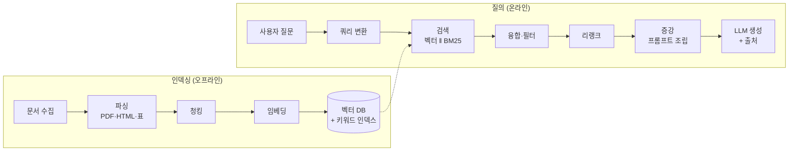

# RAG (Retrieval-Augmented Generation)

RAG는 **질문과 관련된 외부 문서를 검색해 프롬프트에 붙인 뒤 LLM이 그 근거로 답하게 하는 구조**입니다. 모델 가중치는 그대로 두고 "무엇을 보여줄지"만 바꾸기 때문에, 사내 문서·최신 정보처럼 모델이 학습하지 않은 지식을 싸고 빠르게 연결할 수 있습니다.

한 줄로 줄이면 **검색 기술 + LLM 프롬프트**입니다. 이 문서는 전체 그림과 선택 기준을 요약하고, 깊은 설계 논점은 [RAG 심화 시리즈](/ai/advanced/rag/RAG)로 연결합니다.


## 왜 필요한가

| LLM의 한계 | 증상 | RAG가 하는 일 |
|---|---|---|
| **지식 고정** (학습 시점 이후를 모름) | 최신 정책·가격·릴리스를 모르거나 옛날 값으로 답함 | 인덱스만 갱신하면 즉시 반영 |
| **비공개 지식 부재** | 사내 규정·계약서·티켓 이력을 모름 | 권한 있는 문서만 골라 컨텍스트로 제공 |
| **환각** | 모르는 것도 그럴듯하게 지어냄 | "제공된 근거로만 답하라" + 출처 인용으로 검증 가능하게 만듦 |
| **추적 불가** | 답의 근거를 알 수 없음 | 어떤 청크를 보고 답했는지 로그로 남음 |

> ⚠️ **함정**: RAG는 환각을 **없애지** 않고 **줄일** 뿐입니다. 검색이 엉뚱한 문서를 가져오면 모델은 그 문서를 근거로 더 자신 있게 틀립니다. 특히 "비슷하지만 적용되지 않는" 문서(구버전 규정, 다른 제품군 정책)가 가장 발견하기 어려운 실패입니다. → [쿼리 재작성의 경계](/ai/advanced/rag/RAG/07-쿼리-재작성의-경계)

**장점**: 실시간 갱신, 파인튜닝 대비 낮은 비용, 출처 제시로 신뢰성 확보, 참조 범위를 제어할 수 있어 안전함.
**단점**: 답변 품질의 상한이 검색 품질에 묶임, 파이프라인 구성 요소가 늘어 복잡도 증가, 컨텍스트 길이·비용 부담, 원본 문서 품질에 크게 좌우됨.

## 전체 파이프라인

RAG는 **미리 해두는 인덱싱**과 **요청마다 도는 질의 처리** 두 흐름으로 나뉩니다.



| 단계 | 하는 일 | 핵심 결정 | 심화 |
|---|---|---|---|
| **파싱** | PDF·HTML·표·이미지에서 텍스트와 **구조**(제목·표·페이지)를 뽑음 | OCR·레이아웃 분석 필요 여부 | [PDF 문서 처리](/ai/advanced/rag/RAG/03-PDF-문서-처리) |
| **청킹** | 검색 단위로 자름 | 크기·경계·Overlap, 메타데이터 | [장문서 청킹과 Overlap](/ai/advanced/rag/RAG/02-장문서-청킹과-Overlap) |
| **임베딩** | 청크를 벡터로 변환 | 모델 선택, 다국어 성능, 차원 | [임베딩](/ai/02-llm/02-embedding) |
| **저장** | 벡터 + 원문 + 메타데이터(문서 ID, 경로, 버전, **권한**) 저장 | 권한·버전을 청크까지 복사 | [권한 판단](/ai/advanced/rag/RAG/04-파일명으로-권한을-판단하면-안-되는-이유) |
| **쿼리 변환** | 모호하거나 구어체인 질문을 검색에 맞게 바꿈 | 원 질문을 반드시 보존 | [아래 쿼리 변환 기법](#쿼리-변환-기법) |
| **검색** | 후보 청크를 넓게 가져옴 | 벡터/키워드/필터 조합, Top K | [검색 전략 3층 설계](/ai/advanced/rag/RAG/06-검색-전략-3층-설계) |
| **리랭크** | 후보를 질문 기준으로 정밀 재정렬 | 도입 여부, 후보 수, 지연 예산 | [Rerank는 언제 필요한가](/ai/advanced/rag/RAG/09-Rerank는-언제-필요한가) |
| **증강** | 선택된 청크를 프롬프트에 배치 | 순서, 압축, 출처 표기 | [분산된 증거 조립](/ai/advanced/rag/RAG/10-분산된-증거-조립) |
| **생성** | 근거 기반 답변 + 인용, 근거 부족 시 모른다고 답함 | 거절 규칙, 인용 형식 | [RAG 프롬프트 샘플](/ai/03-prompt/03-rag) |


> 운영 관점(데이터 거버넌스 → 검색 품질 → 생성 제약 → 평가 → 피드백)의 전체 설계는 [RAG 전체 설계 — 5환 클로즈드 루프](/ai/advanced/rag/RAG/01-RAG-전체-설계-5환-클로즈드-루프)에서 다룹니다.

## 청킹 전략

청크는 **검색의 최소 단위이자 LLM이 읽는 근거의 단위**입니다. 너무 크면 임베딩이 여러 주제로 흐려지고, 너무 작으면 답에 필요한 맥락이 잘립니다.

| 전략 | 방식 | 잘 맞는 문서 | 주의 |
|---|---|---|---|
| **고정 길이 + Overlap** | 토큰/글자 수로 자르고 앞뒤를 겹침 | 구조가 약한 일반 텍스트 | 문장·표·용어가 반토막 날 수 있음 |
| **재귀 분할** | `\n\n` → `\n` → 문장 순으로 경계를 찾아 자름 | 대부분의 문서의 기본값 | 여전히 의미 경계를 모름 |
| **구조 기반** | 제목·조항·Markdown/HTML 헤더·표 단위로 자름 | 규정, 매뉴얼, 기술 문서 | 파싱이 구조를 살려야 가능 |
| **의미 기반 (Semantic)** | 인접 문장 임베딩 유사도가 급변하는 곳에서 자름 | 주제 전환이 잦은 긴 글 | 인덱싱 비용 증가, 효과는 데이터마다 다름 |
| **Parent–Child (Small-to-Big)** | 작은 청크로 검색하고 부모(큰 구간)를 LLM에 전달 | 정밀 검색 + 넓은 맥락이 둘 다 필요할 때 | 저장소가 2벌 필요 |
| **컨텍스트 보강 청크** | 청크마다 "이 청크가 문서의 어디, 무엇에 관한 것인지" 요약을 앞에 붙여 임베딩·BM25 인덱싱 | 청크만 떼면 주어가 사라지는 문서 | 인덱싱 시 LLM 호출 비용 |

마지막 방식은 Anthropic이 **Contextual Retrieval**로 공개한 기법으로, 자사 실험에서 컨텍스트 임베딩 + 컨텍스트 BM25 조합이 top-20 검색 실패율을 49%, 리랭크까지 더하면 67% 줄였다고 보고했습니다.

> ⚠️ **함정**: 청킹은 "한 번 정하고 잊는" 설정이 아닙니다. 청크 크기나 임베딩 모델을 바꾸면 **전체 재인덱싱**이 필요하고, 쿼리 쪽과 문서 쪽 임베딩 모델 버전이 어긋나면 에러 없이 검색 결과가 0건이 됩니다. → [제로 리콜 트러블슈팅](/ai/advanced/rag/RAG/12-제로-리콜-4층-트러블슈팅), [증분 색인](/ai/advanced/rag/RAG/15-전량-재구축-금지-증분-색인)

## 하이브리드 검색

벡터 검색과 키워드 검색은 **서로 다른 실패를 합니다.** 그래서 프로덕션에서는 둘을 함께 돌리고 결과를 합치는 게 기본값입니다.

| | 키워드 검색 (Sparse, BM25) | 벡터 검색 (Dense, Embedding) |
|---|---|---|
| 매칭 기준 | 같은 **단어**가 있는가 | **의미**가 가까운가 |
| 강한 곳 | 주문번호, 에러코드, 제품 모델명, 조항 번호 | 구어체·동의어·다른 표현의 같은 질문 |
| 약한 곳 | "돈 보내기" ↔ "계좌 이체" 같은 표현 차이 | 정확한 식별자, 드문 고유명사, 부정("~가 아닌") |
| 한국어 이슈 | 형태소 분석기(nori, Kiwi 등) 품질에 좌우 | 다국어/한국어 성능이 좋은 임베딩 모델 선택 |

**결과 합치기**: 두 검색의 점수는 척도가 달라 그대로 더할 수 없습니다. 가장 흔한 방법은 순위만 쓰는 **RRF(Reciprocal Rank Fusion)** 로, 문서마다 `Σ 1 / (k + rank)` 를 더합니다(`k`는 보통 60). Elasticsearch·OpenSearch·여러 벡터 DB가 RRF를 내장하고 있습니다. 구현 예시는 [Multi-Query](./techniques/05-multiQuery)에 있습니다.

더 깊이: [BM25와 벡터 검색](/ai/advanced/rag/RAG/05-BM25와-벡터-검색), [Top K와 2단계 검색](/ai/advanced/rag/RAG/08-TopK와-2단계-검색)

## 리랭크 (Rerank)

1단계 검색은 빠르지만 거칠게 **많이** 가져오고(예: 50~100개), 리랭커가 질문과 문서를 **함께** 읽어 정밀하게 다시 줄 세운 뒤 상위 몇 개만 LLM에 넘깁니다.

| | Bi-encoder (임베딩 검색) | Cross-encoder (리랭커) |
|---|---|---|
| 방식 | 질문·문서를 **따로** 벡터화 후 거리 계산 | 질문+문서 쌍을 **한 번에** 입력해 관련도 점수 |
| 속도 | 문서 벡터를 미리 계산해 두므로 수백만 건도 빠름 | 후보마다 모델 추론, 느림 |
| 정확도 | 상대적으로 낮음 | 높음 |
| 역할 | 후보 **리콜** (완전함) | 최종 **정밀도** (정확함) |

**필요한 상황**

- 후보가 많아 전부 프롬프트에 넣을 수 없을 때
- 정답 문서가 검색은 되는데 Top 3 안에 안 올라올 때
- 비슷한 문서(버전 차이, 유사 제품)가 많아 순서가 답을 좌우할 때
- 최신성·신뢰도 같은 비즈니스 기준을 순서에 반영해야 할 때

**모델 예시 (2026-09 기준)**

| 구분 | 모델 |
|---|---|
| 관리형 API | Cohere Rerank 4 (Pro/Fast), Cohere Rerank 3.5, Voyage rerank-2.5 |
| 오픈 웨이트 (자체 호스팅) | BAAI bge-reranker-v2-m3, jina-reranker-v3, Qwen3-Reranker |
| 로컬 실행 | [Ollama에서 rerank 검색](https://ollama.com/search?q=rerank) |

> ⚠️ **함정**: 리랭커는 **검색에 없는 문서를 찾아주지 못합니다.** "못 찾는 문제"는 청킹·쿼리 변환·하이브리드 검색으로 풀고, 리랭커는 "찾았는데 순위가 낮은 문제"에만 씁니다. 단순 FAQ처럼 후보가 명확한 경우엔 지연과 비용만 늘립니다. 또한 오픈 웨이트라도 **라이선스가 상업 이용을 막는 모델**이 있으니 확인하세요.

## 검색 후처리 (Post-Retrieval)


리랭크 외에도 "무엇을, 얼마나, 어떤 순서로" 넣을지 다듬는 단계가 있습니다.

| 기법 | 내용 | 구현 예 |
|---|---|---|
| **필터링** | 관련도 임계값 미만 제거, 중복·패러프레이즈 제거, 오래된 버전 제거, 메타데이터(날짜·카테고리·권한) 필터 | 벡터 DB 메타데이터 필터, 점수 임계값 |
| **압축** | 청크에서 질문과 무관한 문장을 빼거나(추출형) LLM으로 요약 | LangChain `ContextualCompressionRetriever` (v1부터 `langchain-classic` 패키지) |
| **청크 병합** | 같은 부모에서 여러 조각이 걸리면 부모 구간으로 합침 | LlamaIndex `AutoMergingRetriever`, LangChain `ParentDocumentRetriever` |
| **문장 윈도우** | 문장 단위로 검색하고 앞뒤 문장을 붙여 전달 | LlamaIndex `SentenceWindowNodeParser` |
| **순서 배치** | 관련도 높은 것을 앞(또는 앞·뒤 끝)에, 출처별 그룹화, 최신 정보 우선 | 직접 구현 |

순서가 중요한 이유는 모델이 긴 컨텍스트의 **중간에 놓인 정보를 덜 활용하는** 경향(Lost in the Middle) 때문입니다.

## 쿼리 변환 기법

사용자의 질문은 짧고, 구어체이고, 대명사와 생략이 많습니다. 반면 문서는 정식 용어로 쓰여 있습니다. 이 간극을 검색 전에 메우는 기법들입니다.

| 기법 | 한 줄 설명 | 주로 돕는 검색 | LLM 호출 |
|---|---|---|---|
| [쿼리 명확화 (Query Clarification)](./techniques/01-clearly) | "그거 환불 돼요?"처럼 지시어·생략이 있는 질문을 대화 맥락으로 **독립된 질문**으로 바꿈 | 둘 다 | O |
| [어휘 재작성 (Lexical Rewrite)](./techniques/02-lexical) | 사용자 표현을 **문서에 실제로 쓰인 용어**로 치환 | BM25 | 사전 또는 LLM |
| [불용어 제거 (Stopword Removal)](./techniques/03-stopword) | 조사·감탄사·군더더기("혹시", "도대체")를 빼 **핵심어만** 남김 | BM25 | 보통 X |
| [정규화 (Normalization)](./techniques/04-normalization) | 유니코드·대소문자·전각 문자 표기와 **날짜·금액 값**을 한 형태로 통일 | 둘 다 + 필터 | 보통 X |
| [멀티 쿼리 (Multi-Query)](./techniques/05-multiQuery) | 한 질문을 여러 표현으로 바꿔 **각각 검색 후 RRF로 합침** | 벡터 | O |
| [컨텍스트 주입 (Context Injection)](./techniques/06-injection) | 사용자·세션·날짜 등 **이미 아는 조건**을 쿼리와 메타데이터 필터에 넣음 | 둘 다 + 필터 | 선택 |
| [HyDE](./techniques/07-hyde) | 질문 대신 LLM이 쓴 **가상의 답변 문서**를 임베딩해 검색 | 벡터 | O |
| [쿼리 확장 (Query Expansion)](./techniques/08-expansion) | 원 질문은 유지하고 **동의어·관련어를 덧붙여** 리콜을 넓힘 | BM25 | 사전 또는 LLM |
| [쿼리 분해 (Query Decomposition)](./techniques/09-decomposition) | 여러 조건이 섞인 질문을 **하위 질문으로 쪼개** 따로 검색 | 둘 다 | O |

> ⚠️ **함정**: 모든 쿼리 변환의 공통 규칙은 **원래 질문을 버리지 않는 것**입니다. 변환된 쿼리는 검색 경로를 **추가**하는 용도로 쓰고, 원 질문 경로를 백스톱으로 항상 함께 돌리세요. 주문번호·법규 번호 같은 하드 엔티티는 변환 대상에서 제외합니다. → [쿼리 재작성의 경계](/ai/advanced/rag/RAG/07-쿼리-재작성의-경계)

## RAG vs 파인튜닝 vs 긴 컨텍스트

"모델이 우리 데이터를 알게 하고 싶다"는 요구에는 세 가지 선택지가 있고, **대부분은 조합**합니다.

| 기준 | RAG | 파인튜닝 | 긴 컨텍스트 (전부 넣기) |
|---|---|---|---|
| 잘 푸는 문제 | **지식** 주입 (사실, 문서, 최신 정보) | **행동** 교정 (형식, 말투, 분류 기준, 도메인 추론 패턴) | 문서 몇 개를 통째로 읽어야 하는 분석 |
| 지식 갱신 | 인덱스 갱신만으로 즉시 | 재학습 필요 | 매 요청마다 넣으므로 즉시 |
| 출처 추적 | 쉬움 (청크 단위 인용) | 어려움 | 가능하지만 위치 특정이 번거로움 |
| 데이터 규모 | 수백만 문서도 가능 | 학습 데이터 준비·품질 관리 부담 | 컨텍스트 창 한도 내 |
| 요청당 비용·지연 | 검색 + 적당한 프롬프트 | 추론은 가장 쌈 (학습 비용은 별도) | 입력 토큰에 비례해 가장 비쌈 (프롬프트 캐싱으로 완화) |
| 권한 제어 | 청크 메타데이터로 사용자별 필터 가능 | 불가 (가중치에 섞임) | 넣는 쪽에서 제어 |
| 주요 실패 | 검색 실패 → 틀린 근거 | 지식 환각, 망각 | 중간 정보 누락, 비용 폭증 |

**선택 가이드**

- 자주 바뀌거나, 출처가 필요하거나, 사용자별 권한이 다르면 → **RAG**
- 답의 내용은 맞는데 형식·톤·판단 기준이 안 맞으면 → **파인튜닝** ([파인튜닝](/ai/06-fine-tuning/01-fine-tuning))
- 대상 문서가 작고 고정적이며, 전체를 한 번에 봐야 하면 → **긴 컨텍스트**
- 코드베이스처럼 **정확한 식별자 탐색**이 핵심이면 → 벡터 RAG 대신 grep·심볼 검색 같은 도구를 에이전트가 직접 쓰게 하는 편이 나을 수 있음 → [Claude Code가 RAG를 쓰지 않는 이유](/ai/advanced/rag/RAG/16-Claude-Code가-RAG를-쓰지-않는-이유)

## RAG 변형

| 변형 | 핵심 아이디어 | 언제 |
|---|---|---|
| **Naive RAG** | 인덱싱 → 검색 → 생성의 직선 구조 | 프로토타입, 단순 FAQ |
| **Advanced RAG** | 검색 **전**(쿼리 변환)·**후**(리랭크·필터·압축) 단계 추가 | 대부분의 프로덕션 출발점 |
| **Modular RAG** | 모든 단계를 교체 가능한 모듈로 쪼개고 라우팅·스케줄링으로 조합 | 질의 유형별로 다른 경로가 필요할 때 |
| **Graph RAG** | 엔티티·관계 그래프를 만들어 관계 탐색·전역 요약에 활용 | "A와 연결된 모든 B", 코퍼스 전반 요약 질문 |
| **Agentic RAG** | 에이전트가 검색 여부·검색어·도구·재검색을 스스로 결정하고 결과를 평가 | 다단계 조사, 여러 소스·도구를 오가는 질문 |

### Modular RAG


Advanced RAG가 "단계를 더 붙인 직선"이라면, Modular RAG는 **Orchestration(라우팅·스케줄링)** 계층이 질문에 따라 모듈 조합을 바꿉니다. 예: 식별자 질문은 키워드 검색만, 비교 질문은 분해 → 병렬 검색 → 합성.

### Graph RAG

Microsoft GraphRAG는 문서에서 엔티티와 관계를 추출해 그래프를 만들고, 커뮤니티 단위 요약을 미리 생성해 **"이 문서들 전체의 주요 주제는?"** 같은 전역 질문에 답합니다. 벡터 검색은 "비슷한 문단 찾기"에는 강하지만 이런 질문에는 약합니다. 대신 그래프 구축 비용이 크고 엔티티 정합(같은 대상을 하나로 묶기)이 어렵습니다.

→ [지식 그래프란](/ai/advanced/rag/RAG/17-지식-그래프란-무엇인가), [엔티티 추출·링킹](/ai/advanced/rag/RAG/19-엔티티-추출-링킹-중의성-해소), [지식 그래프와 벡터 DB 선택](/ai/advanced/rag/RAG/20-지식-그래프와-벡터DB-선택)

### Agentic RAG

검색을 파이프라인의 고정 단계가 아니라 **에이전트가 호출하는 도구**로 둡니다. 검색 결과가 부족하면 쿼리를 바꿔 다시 찾고, 충분하면 멈춥니다. Self-RAG(검색 필요 여부와 생성 결과를 스스로 평가), CRAG(검색 품질을 평가해 나쁘면 교정·웹 검색) 같은 연구가 이 방향입니다. 유연한 만큼 호출 수·지연·비용 상한을 반드시 걸어야 합니다. → [에이전트](/ai/05-agent/01-agent)

### 추론 기반 검색 — PageIndex

벡터 유사도 대신 **LLM이 문서 목차 구조를 읽고 어디를 볼지 추론**하는 방식입니다. PageIndex는 문서를 계층형 트리 인덱스로 바꾸고, LLM이 사람 전문가처럼 목차를 따라 내려가며 관련 구간을 찾습니다. 청킹·임베딩 없이 동작하며 재무 보고서·법률 문서처럼 구조가 뚜렷한 긴 문서에 적합합니다. 대신 탐색 단계마다 LLM 호출이 들어갑니다.

문서 선택 단계에 쓰는 프롬프트 예시입니다.

```text
You are given a list of documents with their IDs, file names, and descriptions. Your task is to select documents that may contain information relevant to answering the user query.

Query: {query}

Documents: [
    {
        "doc_id": "xxx",
        "doc_name": "xxx",
        "doc_description": "xxx"
    }
]

Response Format:
{{
    "thinking": "<Your reasoning for document selection>",
    "answer": <Python list of relevant doc_ids>, e.g. ['doc_id1', 'doc_id2']. Return [] if no documents are relevant.
}}

Return only the JSON structure, with no additional output.
```

## 평가

RAG는 **검색과 생성을 따로 측정**해야 어디가 문제인지 알 수 있습니다. 최종 답변 만족도만 보면 "검색은 틀렸는데 답이 매끄러운" 실패가 가려집니다.

| 대상 | 지표 | 무엇을 보나 |
|---|---|---|
| 검색 | Recall@K, Hit Rate | 정답 청크가 상위 K개 안에 있는가 |
| 검색 | MRR, nDCG | 정답이 **얼마나 앞에** 있는가 |
| 검색 (RAGAS) | Context Precision / Context Recall | 가져온 컨텍스트 중 관련 있는 비율 / 필요한 정보를 빠짐없이 가져왔는가 |
| 검색 (RAGAS) | Context Entities Recall | 정답에 필요한 엔티티가 컨텍스트에 있는가 |
| 생성 (RAGAS) | Faithfulness | 답변의 주장이 컨텍스트로 **뒷받침**되는가 (환각 측정) |
| 생성 (RAGAS) | Response Relevancy | 답변이 질문에 맞는가 |
| 생성 (RAGAS) | Noise Sensitivity | 무관한 컨텍스트가 섞였을 때 틀린 답을 내는 정도 |
| 운영 | 무응답 거절률, 지연, 비용 | 근거가 없을 때 거절했는가 |

측정 방법과 도구는 [평가](/ai/07-evaluation/01-evaluation), LLM이 채점하는 방식은 [LLM-as-a-Judge](/ai/07-evaluation/02-llm-judge)를 참고하세요.

> ⚠️ **함정**: 평가셋 없이 프롬프트나 청크 크기를 바꾸면 "몇 개 질문에선 좋아졌는데 전체는 나빠진" 변경을 배포하게 됩니다. 실제 사용자 질문 수십~수백 개에 정답 문서를 표시한 **골든셋**을 먼저 만드세요.

## 흔한 실패와 대응

| 증상 | 흔한 원인 | 대응 | 심화 |
|---|---|---|---|
| 검색 결과가 대량으로 0건 | 빈 쿼리, 본문 없는 인덱스, 과한 메타데이터 필터, 임베딩 모델 버전 불일치 | 층별로 떼어 재현 | [제로 리콜 트러블슈팅](/ai/advanced/rag/RAG/12-제로-리콜-4층-트러블슈팅) |
| 주문번호·에러코드 질문을 못 찾음 | 벡터 검색만 사용 | 하이브리드 검색, 하드 엔티티는 키워드·필터로 | [BM25와 벡터 검색](/ai/advanced/rag/RAG/05-BM25와-벡터-검색) |
| 답에 필요한 정보가 청크 경계에서 잘림 | 고정 길이 청킹 | 구조 기반 청킹, Overlap, Parent–Child | [청킹과 Overlap](/ai/advanced/rag/RAG/02-장문서-청킹과-Overlap) |
| 정답 문서가 검색되는데 답이 틀림 | 순위가 낮음, 노이즈 청크가 많음 | 리랭크, 임계값 필터, 컨텍스트 압축 | [Rerank](/ai/advanced/rag/RAG/09-Rerank는-언제-필요한가) |
| 구버전 규정으로 답함 | 버전 메타데이터 없음, 폐기 문서가 인덱스에 남음 | 발효 상태 메타데이터, 인덱스 동기화 | [신구 제도 공존](/ai/advanced/rag/RAG/11-신구-제도-공존-버전-재정), [인덱스 동기화](/ai/advanced/rag/RAG/14-지식베이스-인덱스-동기화) |
| 권한 없는 문서 내용이 답에 나옴 | 권한을 파일/폴더 단위로만 관리 | 권한을 청크 메타데이터로 복사, 검색 시 필터 | [권한 판단](/ai/advanced/rag/RAG/04-파일명으로-권한을-판단하면-안-되는-이유) |
| 문서 속 문구가 지시처럼 실행됨 | 검색된 텍스트를 신뢰된 지시로 취급 | 컨텍스트를 "증거"로 격리, 적재 전 세정, 도구 권한 분리 | [RAG 프롬프트 인젝션 방어](/ai/advanced/rag/RAG/13-RAG-프롬프트-인젝션-5층-방어) |
| 근거가 없는데 그럴듯하게 답함 | 거절 규칙 없음 | "컨텍스트에 없으면 모른다고 답하라" + Faithfulness 모니터링 | [RAG 프롬프트 샘플](/ai/03-prompt/03-rag) |

## 참고 자료

- [Gao et al. — Retrieval-Augmented Generation for Large Language Models: A Survey (2023)](https://arxiv.org/abs/2312.10997) — Naive / Advanced / Modular RAG 분류
- [Gao et al. — Modular RAG: Transforming RAG Systems into LEGO-like Reconfigurable Frameworks (2024)](https://arxiv.org/abs/2407.21059)
- [Rabiloo — The 3 types of RAG models: Naive, Modular, Advanced](https://rabiloo.com/blog/the-3-types-of-rag-models-naive-rag-modular-rag-and-advanced-rag) — 본문 다이어그램 출처
- [Anthropic — Introducing Contextual Retrieval](https://www.anthropic.com/news/contextual-retrieval)
- [Cormack et al. — Reciprocal Rank Fusion (SIGIR 2009)](https://plg.uwaterloo.ca/~gvcormac/cormacksigir09-rrf.pdf)
- [Liu et al. — Lost in the Middle: How Language Models Use Long Contexts](https://arxiv.org/abs/2307.03172)
- [Edge et al. — From Local to Global: A Graph RAG Approach (Microsoft GraphRAG)](https://arxiv.org/abs/2404.16130) · [GitHub](https://github.com/microsoft/graphrag)
- [Asai et al. — Self-RAG](https://arxiv.org/abs/2310.11511) · [Yan et al. — Corrective RAG (CRAG)](https://arxiv.org/abs/2401.15884)
- [VectifyAI — PageIndex](https://github.com/VectifyAI/PageIndex)
- [Ragas — Available Metrics](https://docs.ragas.io/en/stable/concepts/metrics/available_metrics/)
- [Cohere — Rerank](https://docs.cohere.com/docs/rerank) · [BAAI/bge-reranker-v2-m3](https://huggingface.co/BAAI/bge-reranker-v2-m3)
- [LlamaParse — 문서 파싱](https://www.llamaindex.ai/llamaparse)
- [Prompt Engineering Guide — RAG for LLMs](https://www.promptingguide.ai/research/rag)
- 추가 읽을거리 (중국어): [知乎 1](https://zhuanlan.zhihu.com/p/722159912) · [知乎 2](https://zhuanlan.zhihu.com/p/1924487055976670911) · [知乎 3](https://zhuanlan.zhihu.com/p/1975321777342260763) · [知乎 4](https://zhuanlan.zhihu.com/p/1956865613138986501) · [知乎 5](https://zhuanlan.zhihu.com/p/1920459703399462751) · [知乎 6](https://zhuanlan.zhihu.com/p/675509396) · [知乎 7](https://zhuanlan.zhihu.com/p/27274703035)
