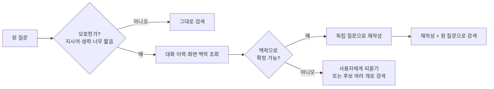

# 쿼리 명확화 (Query Clarification)

**지시어·생략이 섞인 모호한 질문을, 대화 맥락을 이용해 그 자체로 이해되는 독립된 질문(standalone question)으로 바꾸는** 검색 전처리입니다. 맥락으로도 의도를 확정할 수 없으면 추측하지 않고 사용자에게 되묻는 것까지 포함합니다.

## 언제 쓰나

- **멀티턴 대화**: "그거 환불 돼요?"의 "그거"가 앞 턴에서 말한 상품일 때. 검색기는 대화 이력을 모르므로 "그거 환불"로 검색하면 아무 문서나 걸립니다.
- **화면 맥락이 있는 질문**: 상품 상세 페이지에서 "이거 사이즈 어때요?"라고 물을 때.
- **너무 짧은 질문**: "안 와요", "문제 있는 것 같은데"처럼 주어·대상이 없는 질문.

반대로 질문이 이미 완결돼 있으면 건너뜁니다. 모든 질문에 LLM 재작성을 거는 건 지연과 표류 위험만 늘립니다.

## 작동 방식



1. **모호성 탐지**: "이거/그거/저거/그때" 같은 지시어, 주어·목적어 생략, 1~2어절 질문을 규칙이나 LLM으로 판정합니다.
2. **맥락 수집**: 최근 N턴 대화, 현재 보고 있는 페이지(상품 ID, 주문 ID), 사용자가 선택한 파일 등 **출처가 분명한 맥락**만 씁니다.
3. **재작성**: LLM에 원 질문 + 맥락을 주고 "검색에 쓸 독립 질문 한 문장"을 요청합니다.
4. **확정 불가 시**: 해석 후보가 여럿이면 "다음 중 어떤 의미인가요?"로 되묻거나, 후보 각각으로 검색해 병합합니다([Multi-Query](./05-multiQuery) 방식).

LangChain에서는 이 패턴을 `create_history_aware_retriever`(v1부터 `langchain-classic` 패키지)로 제공하지만, 프롬프트 한 번이면 되는 일이라 직접 구현하는 경우가 많습니다.

## 예시

### 맥락이 있을 때와 없을 때

| 맥락 | 원 질문 | 명확화된 질문 |
|---|---|---|
| 직전 턴: "나이키 에어맥스 90 270mm 주문했어요" | 그거 배송 언제 와요? | 나이키 에어맥스 90 주문 건의 배송 예정일 |
| 현재 페이지: 상품 `P-1234` (무선 청소기 X9) | 이거 A/S 받을 수 있어요? | 무선 청소기 X9의 A/S 정책과 신청 절차 |
| 직전 턴: 환불 정책 안내 | 교환은요? | 교환 정책과 교환 신청 절차 |
| 직전 턴: "주문한 지 일주일 됐어요" | 안 오는데요 | 주문 후 7일이 지나도 배송되지 않을 때 확인 방법과 문의 절차 |
| 맥락 없음 | 이거 얼마예요? | *(확정 불가 → "어떤 상품의 가격을 알려드릴까요?"로 되묻기)* |
| 맥락 없음 | 저거 환불 되나요? | *(확정 불가 → 일반 환불 정책으로 검색하되 답변에서 대상 상품을 확인)* |

### 프롬프트

```text
당신은 검색용 질문을 만드는 도구입니다. 답변하지 마세요.

[대화 이력]
{history}

[현재 화면 정보]
{page_context}

[사용자 질문]
{question}

규칙:
1. 대화 이력과 화면 정보만 근거로 지시어(이거, 그거, 저거)와 생략된 대상을 채워, 이력 없이도 이해되는 질문 한 문장을 만드세요.
2. 상품명·주문번호·날짜 같은 고유 값은 원문 그대로 옮기세요.
3. 근거에 없는 조건(기간, 금액, 옵션)을 추가하지 마세요.
4. 대상을 확정할 수 없으면 질문을 만들지 말고 needs_clarification을 true로 두세요.

JSON으로만 출력:
{"standalone_question": string | null, "needs_clarification": boolean, "clarifying_question": string | null}
```

### 코드 (TypeScript)

```typescript
// LLM SDK는 무엇이든 "프롬프트 → 텍스트" 함수로 감싸서 쓴다고 가정합니다.
type Complete = (prompt: string) => Promise<string>;
type Search = (query: string, k: number) => Promise<{ id: string; text: string; score: number }[]>;

interface Clarified {
  standalone_question: string | null;
  needs_clarification: boolean;
  clarifying_question: string | null;
}

const AMBIGUOUS = /(이거|그거|저거|이것|그것|저것|거기|그때)/;

export async function clarifyAndSearch(
  question: string,
  history: string[],
  pageContext: string,
  complete: Complete,
  search: Search,
) {
  // 1) 명확한 질문이면 LLM 호출 없이 바로 검색
  const looksAmbiguous = AMBIGUOUS.test(question) || question.trim().length < 6;
  if (!looksAmbiguous) return { type: "results", results: await search(question, 10) } as const;

  // 2) 맥락으로 재작성
  const raw = await complete(
    PROMPT.replace("{history}", history.slice(-6).join("\n"))
      .replace("{page_context}", pageContext || "(없음)")
      .replace("{question}", question),
  );
  // 실서비스에서는 SDK의 구조화 출력(JSON schema) 기능을 쓰고, 파싱 실패 시 원 질문으로 폴백하세요.
  const parsed = JSON.parse(raw) as Clarified;

  // 3) 확정 불가면 되묻기
  if (parsed.needs_clarification || !parsed.standalone_question) {
    return { type: "ask", message: parsed.clarifying_question ?? "무엇에 대한 질문인지 알려주세요." } as const;
  }

  // 4) 재작성 질문 + 원 질문을 함께 검색 (원 질문은 백스톱)
  const [rewritten, original] = await Promise.all([
    search(parsed.standalone_question, 10),
    search(question, 10),
  ]);
  return { type: "results", query: parsed.standalone_question, results: dedupe([...rewritten, ...original]) } as const;
}

function dedupe<T extends { id: string }>(docs: T[]): T[] {
  const seen = new Set<string>();
  return docs.filter((d) => (seen.has(d.id) ? false : (seen.add(d.id), true)));
}

const PROMPT = `...위 프롬프트 전문 ({history}, {page_context}, {question} 자리표시자 포함)...`;
```

## 장단점

| 장점 | 단점 |
|---|---|
| 멀티턴 대화에서 검색 품질이 크게 오름 (검색기는 이력을 모르므로 사실상 필수) | 턴마다 LLM 호출 1회 → 지연·비용 증가 |
| 사용자가 다시 묻지 않아도 올바른 문서를 참조 | 재작성이 틀리면 이후 검색·리랭크가 **틀린 방향으로 정확해짐** |
| 재작성 결과를 로그로 남기면 "시스템이 어떻게 이해했는지" 디버깅 가능 | 맥락이 길어지면 오래된 주제를 잘못 끌어옴 |
| 되묻기로 불확실한 추측 답변을 줄임 | 되묻기가 잦으면 사용자 경험이 나빠짐 |

## 함정

> ⚠️ **함정 — 근거 없는 구체화**: 맥락이 없는데 "이거 얼마예요?"를 "이 제품의 가격은 얼마인가요?"로 바꾸는 건 명확화가 아닙니다. 지시어를 "이 제품"으로 옮겼을 뿐 대상은 여전히 모릅니다. 대상은 **대화 이력·화면 상태에서만** 가져오고, 없으면 되묻습니다.

> ⚠️ **함정 — 조건 창작**: "환불 돼요?"를 "구매 후 7일 이내 환불 조건"으로 바꾸면 사용자가 말하지 않은 조건이 검색을 좁힙니다. 명확화는 **대상 채우기**까지만 하고, 조건은 추가하지 않습니다.

> ⚠️ **함정 — 원 질문 폐기**: 재작성 질문만으로 검색하면 재작성 실패가 곧 시스템 실패가 됩니다. 원 질문 경로를 항상 함께 돌리고, 재작성 결과의 검색 점수가 낮으면 원 질문으로 롤백하세요.

> ⚠️ **함정 — 캐시 오염**: 같은 "그거 환불 돼요?"도 대화마다 뜻이 다릅니다. 검색 캐시 키를 원 질문으로만 만들면 다른 사용자의 결과가 섞입니다. 재작성 결과·사용자 범위·맥락 출처를 키에 포함하세요.

## 관련 기법

- [컨텍스트 주입 (Context Injection)](./06-injection) — 대상 대신 날짜·사용자 등급 같은 **알려진 조건**을 채움
- [쿼리 분해 (Query Decomposition)](./09-decomposition) — 모호함이 아니라 **여러 질문이 섞인** 경우
- [멀티 쿼리 (Multi-Query)](./05-multiQuery) — 해석 후보가 여럿일 때 병렬 검색
- [RAG 개요 — 쿼리 변환 기법](/ai/04-rag/01-rag)
- 심화: [쿼리 재작성은 왜 함부로 하면 안 되나](/ai/advanced/rag/RAG/07-쿼리-재작성의-경계)

## 참고 자료

- [Ma et al. — Query Rewriting for Retrieval-Augmented Large Language Models (2023)](https://arxiv.org/abs/2305.14283)
- [LangChain — create_history_aware_retriever](https://reference.langchain.com/python/langchain-classic/chains/history_aware_retriever/create_history_aware_retriever)
