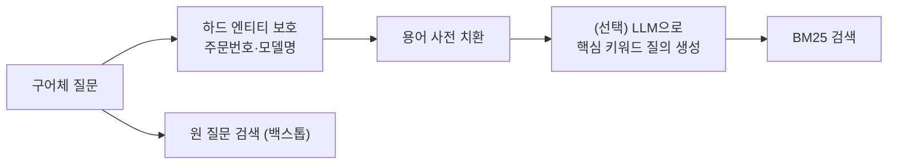

# 어휘 재작성 (Lexical Rewrite)

**사용자가 쓴 일상 표현을 문서에 실제로 쓰인 용어와 핵심 키워드로 바꿔, 단어 일치 기반 검색(BM25 등)에 잘 걸리게 만드는** 쿼리 재작성입니다. 질문의 의미는 그대로 두고 **어휘(lexical) 층위만** 바꾸는 것이 핵심입니다.

## 언제 쓰나

- **BM25·키워드 검색이 주력**이거나 하이브리드 검색의 키워드 경로를 강화할 때 (Elasticsearch, OpenSearch, Solr 등)
- 사용자 표현과 문서 용어의 **어휘 불일치(vocabulary mismatch)** 가 큰 도메인: "돈 보내기" ↔ "계좌 이체", "연차 돈으로" ↔ "연차수당", "비번" ↔ "비밀번호"
- 사내 약어·은어가 많아 **용어 사전**을 이미 갖고 있을 때

벡터 검색만 쓴다면 효과가 작습니다. 임베딩은 이미 "돈 보내기"와 "계좌 이체"를 가깝게 두기 때문입니다.

## 작동 방식

| 변환 | 예 | 구현 |
|---|---|---|
| **구어 → 문서 용어** | 돈 보내기 → 계좌 이체, 연차 돈으로 받기 → 연차수당 | 용어 사전, LLM |
| **약어·은어 풀기** | 비번 → 비밀번호, 반품택배 → 반품 회수 | 용어 사전 |
| **동의어 치환** | car → automobile, 해지 → 계약 해지 | 동의어 사전 (도메인별) |
| **형태 변환** | running → run, 교환했는데 → 교환 | 형태소 분석기, 스테머 |
| **핵심 키워드화** | "이거 환불 가능한지 알려줘" → "환불 가능 여부" | 불용어 제거 + LLM → [불용어 제거](./03-stopword) |



**치환(replace)** 이 기본이라는 점이 [쿼리 확장](./08-expansion)과 다릅니다. 확장은 원 표현을 남기고 동의어를 **덧붙이고**, 어휘 재작성은 검색이 잘되는 표현으로 **바꿉니다**.

## 예시

### 변환 예

| 입력 | 출력 | 변환 유형 |
|---|---|---|
| 친구한테 돈 보내는 법 | 계좌 이체 방법 | 구어 → 문서 용어 |
| 연차 남은 거 돈으로 받을 수 있어? | 미사용 연차수당 지급 | 구어 → 문서 용어 |
| 비번 까먹었어요 | 비밀번호 재설정 | 약어 풀기 |
| 아이폰 배터리 언제 교체해야 해? | 아이폰 배터리 교체 시기 | 핵심 키워드화 |
| 회사 연차 규정 어떻게 돼? | 연차 휴가 규정 | 핵심 키워드화 |
| 이거 환불 가능한지 알려줘 | 환불 가능 여부 | 핵심 키워드화 |
| 혹시 무료 배송 조건은 어떻게 되나요? | 무료 배송 조건 | 핵심 키워드화 |
| 주문번호 20260915-0042 취소하고 싶어요 | 20260915-0042 주문 취소 | 엔티티 보존 + 키워드화 |

### 프롬프트

```text
사용자 질문을 키워드 검색(BM25)용 질의로 바꾸세요.

규칙:
1. 의미를 바꾸지 말고, 사내 문서에서 쓰는 정식 용어로 바꾸세요. 용어 사전: {glossary}
2. 인사말·감탄·"혹시/정말/좀" 같은 군더더기는 빼고 명사 중심의 짧은 질의로 만드세요.
3. 주문번호·상품코드·모델명·숫자는 원문 그대로 두세요.
4. "안 되는", "불가", "제외" 같은 부정 표현은 절대 빼지 마세요.
5. 질의만 한 줄로 출력하세요.

질문: {question}
```

### 코드 — 용어 사전 치환 (TypeScript)

LLM 없이도 효과가 큰 첫 단계는 **도메인 용어 사전**입니다. 결정적이고, 빠르고, 틀렸을 때 고치기 쉽습니다.

```typescript
// 긴 표현부터 치환해야 "연차 돈"이 "연차"보다 먼저 매칭됩니다.
const GLOSSARY: Array<[RegExp, string]> = [
  [/연차\s*(남은\s*거\s*)?돈으로(\s*받)?/g, "미사용 연차수당"],
  [/돈\s*보내(기|는)/g, "계좌 이체"],
  [/비번/g, "비밀번호"],
  [/반품\s*택배/g, "반품 회수"],
];

// 주문번호·상품코드 같은 하드 엔티티는 치환 전에 빼 두었다가 복원합니다.
const HARD_ENTITY = /\b(\d{8}-\d{4}|[A-Z]{1,3}-\d{3,})\b/g;

export function lexicalRewrite(query: string): string {
  const entities: string[] = [];
  let q = query.replace(HARD_ENTITY, (m) => `__E${entities.push(m) - 1}__`);

  for (const [pattern, term] of GLOSSARY) q = q.replace(pattern, term);

  return q.replace(/__E(\d+)__/g, (_, i) => entities[Number(i)]).replace(/\s+/g, " ").trim();
}

// lexicalRewrite("친구한테 돈 보내는 법") → "친구한테 계좌 이체 법"
// 이후 불용어 제거 단계에서 "계좌 이체 방법"으로 다듬습니다.
```

용어 사전을 **검색 엔진 쪽**에 두는 방법도 있습니다. Elasticsearch의 `synonym_graph` 필터를 검색 시 분석기(search analyzer)에 걸면 애플리케이션 코드 없이 같은 효과를 냅니다. 설정 예는 [쿼리 확장](./08-expansion)에 있습니다.

## 장단점

| 장점 | 단점 |
|---|---|
| BM25 검색의 리콜이 눈에 띄게 오름 | 벡터 검색에는 효과가 작음 |
| 사전 기반이면 LLM 호출 없이 **빠르고 결정적** | 용어 사전 구축·유지 비용 (신조어, 상품명 변경) |
| 기존 검색 인프라(Elasticsearch, Solr)에 그대로 붙음 | 과한 치환은 의미를 바꿈 |
| 치환 규칙이 명시적이라 디버깅이 쉬움 | LLM 방식은 비결정적이고 지연 증가 |

## 함정

> ⚠️ **함정 — 부정어 소실**: "환불 **안 되는** 상품"을 키워드화하면서 "환불 상품"이 되면 정반대 문서가 검색됩니다. 부정·제외 표현(안, 못, 불가, 제외, 비-)은 보호 목록에 넣으세요.

> ⚠️ **함정 — 하드 엔티티 변형**: LLM이 "갤럭시 S25"를 "삼성 스마트폰"으로, 주문번호를 "주문"으로 일반화하면 정확 매칭이 사라집니다. 엔티티는 재작성 전에 추출해 고정하세요.

> ⚠️ **함정 — 인덱스와 쿼리의 비대칭**: 쿼리에만 "비번 → 비밀번호"를 적용했는데 문서 쪽 FAQ 제목이 "비번 찾기"라면 오히려 놓칩니다. 치환 결과가 **문서에 실제로 존재하는 용어인지** 인덱스로 확인하세요. 확신이 없으면 치환 대신 [확장](./08-expansion)을 쓰세요.

> ⚠️ **함정 — "요약"과 혼동**: 어휘 재작성은 검색 질의를 만드는 것이지 질문을 요약하는 것이 아닙니다. "좀 더 싼 가격은 없나요?" → "저렴한 가격"은 핵심 의도(더 싼 **대안** 상품)를 잃은 예입니다. "저가 대체 상품"처럼 의도를 남기세요.

## 관련 기법

- [불용어 제거 (Stopword Removal)](./03-stopword) — 군더더기 제거, 어휘 재작성의 전처리
- [정규화 (Normalization)](./04-normalization) — 표기·값의 형태 통일
- [쿼리 확장 (Query Expansion)](./08-expansion) — 치환 대신 덧붙이기
- [RAG 개요 — 하이브리드 검색](/ai/04-rag/01-rag)
- 심화: [BM25와 벡터 검색은 무엇이 다른가](/ai/advanced/rag/RAG/05-BM25와-벡터-검색)

## 참고 자료

- [Ma et al. — Query Rewriting for Retrieval-Augmented Large Language Models (2023)](https://arxiv.org/abs/2305.14283)
- [Elasticsearch — Synonym graph token filter](https://www.elastic.co/docs/reference/text-analysis/analysis-synonym-graph-tokenfilter)
