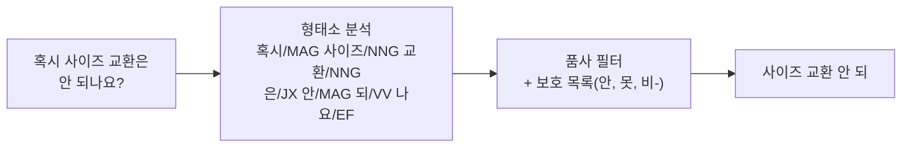

# 불용어 제거 (Stopword Removal)

**조사·어미·감탄사·군더더기 부사처럼 검색 변별력이 거의 없는 토큰을 빼고 핵심어만 남기는** 전처리입니다. 키워드 검색(BM25)에서 핵심어의 비중을 올리고 노이즈 매칭을 줄이는 것이 목적이며, **무엇을 빼지 말아야 하는지**가 무엇을 뺄지보다 중요합니다.

## 언제 쓰나

- **BM25·키워드 검색**의 인덱싱과 질의 분석 단계 (대부분 검색 엔진의 분석기가 이미 수행)
- 구어체 질문이 많아 "혹시", "도대체", "좀", "아 진짜" 같은 표현이 매칭 점수를 흐릴 때
- LLM으로 **키워드 질의**를 만들 때 군더더기를 걷어내는 단계로

**벡터 검색에는 보통 쓰지 않습니다.** 임베딩 모델은 조사·어미가 포함된 자연스러운 문장으로 학습됐기 때문에, 불용어를 빼면 오히려 문장 의미가 흐려지거나 성능이 떨어질 수 있습니다.

## 작동 방식

| 방식 | 내용 | 한국어 적용 |
|---|---|---|
| **목록 기반** | the, a, is, of 같은 불용어 목록과 일치하면 제거 | 교착어라 "교환은", "교환도"처럼 조사가 붙어 목록 매칭이 안 됨 |
| **품사 기반** | 형태소 분석 후 조사(J\*)·어미(E\*)·감탄사(IC)·기호 등 **품사 태그**로 제거 | 한국어의 표준 방식. Elasticsearch nori의 `nori_part_of_speech`, Kiwi 등 |
| **도메인 불용어** | 코퍼스 대부분의 문서에 등장해 변별력이 없는 단어 제거 (예: 고객센터 FAQ의 "문의") | 문서 빈도(DF) 통계로 후보를 뽑고 사람이 확정 |
| **LLM 키워드화** | "혹시 교환도 가능한가요?" → "교환 가능 여부" | 질의 쪽에만 적용, 인덱스와는 무관 |



핵심 원칙: **인덱싱과 질의에 같은 분석기를 적용**합니다. 한쪽만 불용어를 빼면 토큰이 어긋나 매칭이 깨집니다. 검색 엔진을 쓰면 인덱스 매핑의 analyzer가 이를 보장합니다.

## 예시

### 변환 예

| 입력 | 출력 | 제거된 것 |
|---|---|---|
| 이게 도대체 왜 안 되는 건가요? | 왜 안 되 | 지시어, "도대체", 조사, 어미 |
| 혹시 교환도 가능한가요? | 교환 가능 | "혹시", 조사, 어미 |
| 아 진짜 배송은 언제 오는 거예요? | 배송 언제 오 | 감탄사, "진짜", 조사, 어미 |
| 혹시 사이즈 교환은 안 되나요? | 사이즈 교환 안 되 | "혹시", 조사, 어미 (**"안"은 보존**) |
| 혹시 무이자 할부도 되나요? | 무 이자 할부 되 | "혹시", 조사, 어미 (**"무-"는 보존**) |

출력은 아래 코드를 실제로 돌린 결과입니다. 동사는 어간("되", "오")만 남는데, 인덱스 쪽도 같은 분석기로 처리하므로 매칭에는 문제가 없습니다.

### 코드 — Kiwi 품사 기반 제거 (Python)

```python
from kiwipiepy import Kiwi

kiwi = Kiwi()

# 남길 품사: 명사류, 동사·형용사 어간, 어근, 외국어·숫자
KEEP_TAGS = {"NNG", "NNP", "SL", "SN", "XR", "VV", "VA"}
# 품사상 부사(MAG)·접두사(XPN)라 지워지기 쉽지만 의미를 뒤집거나 의도를 담는 형태소
PROTECTED = {"안", "못", "비", "미", "불", "무", "왜", "언제", "어떻게"}
# 도메인 불용어: 코퍼스 전반에 흔해서 변별력이 없는 단어
DOMAIN_STOPWORDS = {"문의", "질문", "관련"}

def remove_stopwords(text: str) -> str:
    kept = []
    for t in kiwi.tokenize(text):
        if t.form in PROTECTED:
            kept.append(t.form)
        elif t.tag in KEEP_TAGS and t.form not in DOMAIN_STOPWORDS:
            kept.append(t.form)
    return " ".join(kept)

print(remove_stopwords("혹시 사이즈 교환은 안 되나요?"))  # 사이즈 교환 안 되
print(remove_stopwords("아 진짜 배송은 언제 오는 거예요?"))  # 배송 언제 오
print(remove_stopwords("비급여 항목 환불 관련 문의"))     # 비 급여 항목 환불
```

Kiwi는 "안", "왜", "언제"를 모두 일반부사(`MAG`)로, "비급여"의 "비"를 접두사(`XPN`)로 태깅합니다. 보호 목록이 없으면 전부 사라집니다.

### 검색 엔진 설정 — Elasticsearch nori

Lucene/Elasticsearch nori의 `nori_part_of_speech` 필터는 기본 `stoptags`로 어미(E\*)·감탄사·조사(J\*)·부사(MAG, MAJ)·관형사·기호·접두사(XPN)·접미사 등을 제거합니다(정확한 기본값은 버전별 문서와 Lucene 소스를 확인하세요). Elastic 문서는 기본 설정에서 **"비급여"가 "급여"로 분석된다**고 직접 경고합니다. 의미를 가진 접두사는 사용자 사전에 복합명사로 등록하거나, `stoptags`를 직접 지정해 조정합니다.

```json
{
  "settings": {
    "analysis": {
      "tokenizer": {
        "ko_tokenizer": {
          "type": "nori_tokenizer",
          "user_dictionary_rules": ["비급여", "무이자", "미사용"]
        }
      },
      "filter": {
        "ko_pos_stop": {
          "type": "nori_part_of_speech",
          "stoptags": [
            "EP", "EF", "EC", "ETN", "ETM", "IC",
            "JKS", "JKC", "JKG", "JKO", "JKB", "JKV", "JKQ", "JX", "JC",
            "MAJ", "MM", "SP", "SSC", "SSO", "SC", "SE",
            "XSA", "XSN", "XSV", "UNA", "NA", "VSV"
          ]
        }
      },
      "analyzer": {
        "ko_search": {
          "type": "custom",
          "tokenizer": "ko_tokenizer",
          "filter": ["ko_pos_stop", "lowercase"]
        }
      }
    }
  }
}
```

위 설정은 기본값에서 `MAG`(일반부사: 안, 못, 왜)와 `XPN`(접두사)을 **뺀** 예입니다. 대신 "혹시", "진짜" 같은 군더더기 부사가 남으므로, 필요하면 `stop` 필터로 개별 단어를 추가 제거합니다.

## 장단점

| 장점 | 단점 |
|---|---|
| BM25에서 핵심어 비중이 올라가 정밀도 향상 | 부정어·의문사·접두사를 잘못 빼면 **의미가 뒤집힘** |
| 인덱스·쿼리 토큰 수 감소 | 벡터 검색에는 이득이 거의 없고 해로울 수 있음 |
| 대부분 검색 엔진 분석기에 내장, 추가 비용 거의 없음 | 형태소 분석기 오분석이 그대로 전파됨 |
| 규칙이 결정적이라 재현·디버깅 쉬움 | 분석기 설정 변경 시 **재인덱싱** 필요 |

## 함정

> ⚠️ **함정 — 부정·접두사 소실**: "환불 **안** 되는 상품", "**비**급여", "**무**이자"에서 "안·비·무"가 빠지면 정반대 문서가 상위에 옵니다. 영어도 "to be or not to be"는 기본 불용어 목록으로 전부 사라집니다. 보호 목록을 먼저 만드세요.

> ⚠️ **함정 — 인덱스/질의 분석기 불일치**: 질의에서만 불용어를 빼거나, 인덱스 분석기를 바꾸고 재인덱싱을 안 하면 토큰이 어긋나 **에러 없이** 리콜이 떨어집니다.

> ⚠️ **함정 — 임베딩 전 적용**: "임베딩 전에 불용어를 빼면 더 정확하다"는 통념은 현대 임베딩 모델에 대체로 맞지 않습니다. 벡터 경로에는 원문 문장을 넣고, 불용어 제거는 키워드 경로에만 적용하세요.

> ⚠️ **함정 — 의도 요약과 혼동**: "좀 더 싼 가격은 없나요?"를 "저렴한 가격"으로, "이게 정말 필요한 건지 모르겠어요"를 "필요 여부"로 줄이는 건 불용어 제거가 아니라 의도 해석이고, 이미 정보가 손실됐습니다. LLM 키워드화를 쓸 땐 원 질문 경로를 함께 돌리세요.

## 관련 기법

- [어휘 재작성 (Lexical Rewrite)](./02-lexical) — 불용어 제거 후 문서 용어로 치환
- [정규화 (Normalization)](./04-normalization) — 같은 분석 단계에서 표기 통일
- [쿼리 확장 (Query Expansion)](./08-expansion)
- 심화: [BM25와 벡터 검색은 무엇이 다른가](/ai/advanced/rag/RAG/05-BM25와-벡터-검색)

## 참고 자료

- [Elasticsearch — nori_part_of_speech token filter](https://www.elastic.co/guide/en/elasticsearch/plugins/current/analysis-nori-speech.html)
- [Apache Lucene — KoreanPartOfSpeechStopFilter (기본 stoptags 소스)](https://github.com/apache/lucene/blob/main/lucene/analysis/nori/src/java/org/apache/lucene/analysis/ko/KoreanPartOfSpeechStopFilter.java)
- [Kiwi (kiwipiepy) — 한국어 형태소 분석기](https://github.com/bab2min/kiwipiepy)
