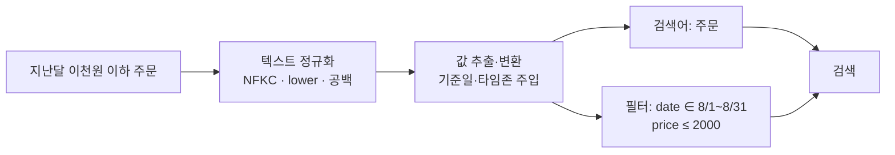

# 정규화 (Normalization)

**같은 뜻인데 표기만 다른 입력을 하나의 표준 형태로 맞추는** 전처리입니다. 두 층위가 있습니다. **텍스트 정규화**는 유니코드·대소문자·전각 문자·공백을 통일해 매칭 누락을 막고, **값 정규화**는 "지난달", "이천원" 같은 표현을 `2026-08-01~2026-08-31`, `2000` 같은 **필터에 쓸 수 있는 값**으로 바꿉니다.

## 언제 쓰나

- **텍스트 정규화 — 거의 항상.** 인덱싱과 질의 양쪽에 같은 규칙을 적용합니다.
  - macOS에서 만든 파일명·복사한 텍스트가 **NFD(자모 분리)** 로 들어와 "한글"이 화면엔 같아 보여도 문자열 비교·키워드 매칭이 실패할 때
  - 전각 문자(`ＡＢＣ１２３`), 호환 문자(`㈜`, `㎏`)가 섞인 문서
  - 대소문자가 섞인 영문 제품명·코드
- **값 정규화 — 질문에 날짜·금액·수량 조건이 있을 때.** 벡터 검색은 "지난달"과 "2026-08"을 같다고 보지 못하고, 숫자 범위 비교도 못 합니다. 값으로 바꿔 **메타데이터 필터**로 넘겨야 정확해집니다.

## 작동 방식

### 텍스트 정규화

| 규칙 | 예 | 비고 |
|---|---|---|
| **유니코드 정규형 NFC/NFKC** | NFD "ㅎ+ㅏ+ㄴ…" → 완성형 "한글", `ＡＢＣ１２３` → `ABC123`, `㈜` → `(주)` | NFKC는 호환 문자까지 풀어서 더 공격적. 수식·특수기호가 의미를 가지면 NFC만 |
| **대소문자 통일** | `iPhone`, `IPHONE` → `iphone` | 코드·식별자에서 대소문자가 의미를 가지면 제외 |
| **공백·구두점** | 연속 공백 → 한 칸, 앞뒤 공백 제거 | "갤럭시S25"와 "갤럭시 S25"는 사전·n-gram으로 따로 처리 |
| **어간 추출 / 표제어** | running → run (stemming), better → good (lemmatization) | 한국어는 형태소 분석기가 이 역할 → [불용어 제거](./03-stopword) |

### 값 정규화

| 유형 | 입력 | 정규화 결과 (기준일 2026-09-15) |
|---|---|---|
| 상대 기간 | 지난달 주문 내역 | `order_date ∈ [2026-08-01, 2026-08-31]` + "주문 내역" |
| 상대 기간 | 지난주 반품 신청 | `[2026-09-07, 2026-09-13]` (월~일 기준) + "반품 신청" |
| 상대 기간 | 작년 7월 이후 주문 | `[2025-07-01, 2026-09-15]` + "주문" |
| 모호한 기간 | 삼개월 전 결제 내역 | "최근 3개월" `[2026-06-15, 2026-09-15]`로 해석 (정책으로 확정 필요) |
| 한글 수사 금액 | 이천원 이하 상품 | `price ≤ 2000` + "상품" |
| 한글 수사 금액 | 십오만원 이상 | `price ≥ 150000` |
| 호환 문자 | `１２０ＭＬ ＡＢＣ㈜ 제품` | `120ml abc(주) 제품` |



## 예시

### 코드 (Python)

규칙 기반은 빠르고 결정적이지만 표현을 다 커버하지 못합니다. 실무에서는 흔한 패턴을 규칙으로 처리하고, 나머지는 **기준일을 주입한 LLM 구조화 출력**으로 넘기는 조합이 일반적입니다.

```python
import re
import unicodedata
from datetime import date, timedelta
from dateutil.relativedelta import relativedelta  # pip install python-dateutil


def normalize_text(s: str) -> str:
    s = unicodedata.normalize("NFKC", s)   # 전각→반각, ㈜→(주), NFD 자모 → 완성형
    s = s.lower()
    return re.sub(r"\s+", " ", s).strip()


# ---- 한글 수사 → 숫자 ("이천오백" → 2500) ----
DIGITS = {"일": 1, "이": 2, "삼": 3, "사": 4, "오": 5, "육": 6, "칠": 7, "팔": 8, "구": 9}
SMALL = {"십": 10, "백": 100, "천": 1000}
LARGE = {"만": 10_000, "억": 100_000_000}


def korean_number(word: str) -> int:
    total, section, digit = 0, 0, 0
    for ch in word:
        if ch.isdigit():
            digit = digit * 10 + int(ch)
        elif ch in DIGITS:
            digit = DIGITS[ch]
        elif ch in SMALL:
            section += (digit or 1) * SMALL[ch]
            digit = 0
        elif ch in LARGE:
            total += ((section + digit) or 1) * LARGE[ch]
            section, digit = 0, 0
    return total + section + digit


def normalize_money(q: str) -> str:
    return re.sub(r"([일이삼사오육칠팔구십백천만억\d]+)\s*원",
                  lambda m: f"{korean_number(m.group(1))}원", q)


# ---- 상대 날짜 → 절대 기간 (기준일은 반드시 인자로) ----
def normalize_dates(q: str, today: date) -> tuple[str, dict]:
    filters: dict = {}
    if m := re.search(r"([일이삼사오육칠팔구십\d]+)\s*개월\s*(전|이내)", q):
        n = korean_number(m.group(1))
        filters = {"from": today - relativedelta(months=n), "to": today}  # "최근 N개월"로 해석
        q = q.replace(m.group(0), "")
    elif "지난달" in q:
        first = today.replace(day=1)
        filters = {"from": first - relativedelta(months=1), "to": first - timedelta(days=1)}
        q = q.replace("지난달", "")
    elif m := re.search(r"작년\s*(\d{1,2})\s*월\s*(이후)?", q):
        start = date(today.year - 1, int(m.group(1)), 1)
        end = today if m.group(2) else start + relativedelta(months=1) - timedelta(days=1)
        filters = {"from": start, "to": end}
        q = q.replace(m.group(0), "")
    elif "지난주" in q:
        this_monday = today - timedelta(days=today.weekday())
        filters = {"from": this_monday - timedelta(days=7), "to": this_monday - timedelta(days=1)}
        q = q.replace("지난주", "")
    return re.sub(r"\s+", " ", q).strip(), filters


today = date(2026, 9, 15)
q = normalize_money(normalize_text("지난달 주문 내역"))
print(normalize_dates(q, today))
# ('주문 내역', {'from': datetime.date(2026, 8, 1), 'to': datetime.date(2026, 8, 31)})
print(normalize_money(normalize_text("십오만원 이상")))   # 150000원 이상
print(normalize_text("１２０ＭＬ　ＡＢＣ㈜ 제품"))         # 120ml abc(주) 제품
```

### LLM으로 값 정규화할 때의 프롬프트

```text
오늘은 {today} ({weekday}), 타임존은 Asia/Seoul입니다.
사용자 질문에서 날짜·금액 조건을 추출해 JSON으로만 출력하세요.

규칙:
- 상대 날짜는 오늘을 기준으로 절대 날짜 범위(YYYY-MM-DD)로 바꾸세요. "지난주"는 월요일~일요일입니다.
- "N개월 전"은 "최근 N개월" 범위로 해석하세요.
- 질문에 없는 조건은 null로 두세요. 추측하지 마세요.
- 조건을 제거한 나머지 검색어를 query에 넣으세요.

{"query": string, "date_from": string | null, "date_to": string | null, "price_min": number | null, "price_max": number | null}

질문: {question}
```

## 장단점

| 장점 | 단점 |
|---|---|
| 표기 차이로 인한 **조용한 누락**을 막음 (특히 NFD 한글) | NFKC·소문자화가 의미 있는 구분을 지울 수 있음 (코드, 화학식, 단위) |
| 날짜·금액을 **필터**로 넘겨 벡터 검색이 못 하는 정확한 범위 조건 처리 | 상대 표현의 해석이 모호함 ("3개월 전" = 그 시점? 최근 3개월?) |
| 텍스트 정규화는 싸고 결정적 | 규칙은 커버리지가 낮고, LLM은 비결정적 |
| 캐시 키·중복 제거 정확도 향상 | 인덱스 쪽 규칙을 바꾸면 재인덱싱 필요 |

## 함정

> ⚠️ **함정 — 기준일 누락**: LLM에 오늘 날짜를 주지 않으면 학습 시점 기준으로 "작년"을 계산합니다. 실제로 LLM으로 생성한 예시 데이터에서 "작년 7월"은 2024년, "작년 1월"은 2025년으로 **같은 데이터셋 안에서 기준 연도가 섞이는** 일이 있었습니다. 기준일·타임존은 항상 코드에서 주입하세요.

> ⚠️ **함정 — 요일 계산**: "지난주 월요일"을 "오늘 − 7일"로 계산하면 틀립니다. 주의 시작 요일(월/일)을 정하고 달력으로 계산하세요. LLM은 요일 계산을 자주 틀리므로 날짜 산술은 코드로 합니다.

> ⚠️ **함정 — 인덱스와 쿼리의 비대칭**: 쿼리만 NFC로 바꾸고 인덱스에 NFD 텍스트가 남아 있으면 여전히 매칭되지 않습니다. 정규화는 **적재 파이프라인에도 똑같이** 넣으세요.

> ⚠️ **함정 — 값이 문서에 없음**: "지난달"을 날짜 필터로 바꿔도 문서에 `date` 메타데이터가 없으면 결과가 0건이 됩니다. 필터를 쓰기 전에 해당 필드가 청크에 채워져 있는지 확인하세요. → [제로 리콜 트러블슈팅](/ai/advanced/rag/RAG/12-제로-리콜-4층-트러블슈팅)

## 관련 기법

- [컨텍스트 주입 (Context Injection)](./06-injection) — 정규화한 값을 메타데이터 필터로 넘기는 단계
- [불용어 제거 (Stopword Removal)](./03-stopword) — 같은 분석기 단계에서 함께 적용
- [어휘 재작성 (Lexical Rewrite)](./02-lexical)
- 심화: [신구 제도가 공존할 때 — 버전과 발효일](/ai/advanced/rag/RAG/11-신구-제도-공존-버전-재정)

## 참고 자료

- [Unicode Standard Annex #15 — Unicode Normalization Forms](https://unicode.org/reports/tr15/)
- [Python — unicodedata.normalize](https://docs.python.org/3/library/unicodedata.html#unicodedata.normalize)
- [python-dateutil — relativedelta](https://dateutil.readthedocs.io/en/stable/relativedelta.html)
