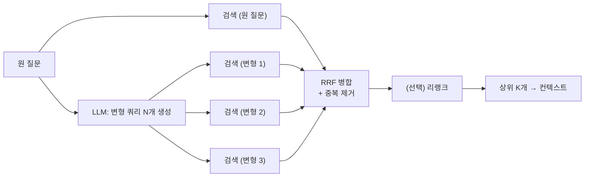

# 멀티 쿼리 (Multi-Query)

**하나의 질문을 LLM으로 여러 표현·관점의 쿼리로 바꿔 각각 검색하고, 결과를 합쳐(RRF 등) 쓰는** 검색 기법입니다. 질문 한 문장의 표현에 검색 결과가 휘둘리는 문제를 **여러 경로로 나눠 담아** 리콜을 올립니다. 결과 병합에 RRF를 쓰는 형태를 **RAG-Fusion**이라고도 부릅니다.

## 언제 쓰나

- **벡터 검색 결과가 질문 표현에 민감**할 때: "노트북 발열"과 "노트북이 뜨거워요"의 검색 결과가 크게 다름
- 질문이 **여러 측면**을 가질 때: "MEMS 마이크로폰" → 정의, 장점, 적용 사례 문서가 따로 있음
- 정답 문서가 하나가 아니라 **여러 문서에 흩어져** 있을 때
- 리콜이 부족하고, 지연 수백 ms와 LLM 호출 1회를 감당할 수 있을 때

질문 안에 **서로 다른 하위 질문**이 여럿 있으면 멀티 쿼리보다 [쿼리 분해](./09-decomposition)가 맞습니다. 멀티 쿼리는 **같은 질문의 다른 표현**, 분해는 **다른 질문들**입니다.

## 작동 방식



1. **변형 생성**: LLM에 원 질문을 주고 3~5개의 변형을 요청합니다. 동의어 치환, 구체화/일반화, 관점 전환(원인·해결·예방)을 섞도록 지시합니다.
2. **병렬 검색**: 원 질문 + 변형 각각을 **같은 검색기·같은 설정**으로 검색합니다.
3. **병합**: 여러 순위 목록을 **RRF(Reciprocal Rank Fusion)** 로 합칩니다. 문서 d의 점수는 각 목록에서의 순위 r로 `Σ 1 / (k + r)` 이며, `k`는 보통 60입니다. 여러 쿼리에서 **꾸준히 상위에 오는 문서**가 올라갑니다.
4. **(선택) 리랭크**: 병합된 후보를 원 질문 기준으로 리랭크해 최종 K개를 고릅니다.

| 병합 방식 | 내용 | 비고 |
|---|---|---|
| **Unique union** | 모든 결과의 합집합, 중복 제거 | LangChain `MultiQueryRetriever`의 기본 동작. 순위 정보는 버림 |
| **RRF** | 순위 기반 점수 합산 | 점수 척도가 달라도 합칠 수 있어 가장 무난 |
| **리랭크** | 합집합을 크로스 인코더로 재정렬 | 가장 정확하지만 추가 비용 |

## 예시

### 변형 예

| 원 질문 | 나쁜 변형 (표현만 바꿈) | 좋은 변형 (관점이 다름) |
|---|---|---|
| 노트북 발열 문제 | 노트북 발열 문제 / 노트북 발열 이슈 / 노트북 열 문제 | 노트북 과열 원인 / 노트북 쿨링 팬 청소와 써멀 페이스트 교체 / 노트북 온도 높을 때 성능 저하(스로틀링) |
| 연차 사용 규칙 | 연차 사용 정책 / 연차 휴가 사용 규정 / 연차 사용 방법 및 규칙 | 연차 휴가 신청·승인 절차 / 미사용 연차 이월과 연차수당 / 반차·반반차 사용 기준 |
| 구독 해지 방법 | 구독 해지 방법 / 구독 취소 절차 / 구독 취소하는 방법 | 정기 구독 해지 신청 경로 / 해지 시 잔여 기간 환불 / 자동 결제 중지 |

왼쪽처럼 거의 같은 문장을 만들면 검색 결과도 거의 같아서 **비용만 N배**가 됩니다.

### 프롬프트

```text
사용자 질문으로 문서를 검색하려고 합니다. 벡터 검색이 한 가지 표현에 치우치지 않도록,
같은 정보 요구를 서로 다른 관점에서 표현한 검색 쿼리 {n}개를 만드세요.

규칙:
- 단어만 바꾼 비슷한 문장은 금지합니다. 원인/해결/절차/조건/예외 등 관점을 다르게 하세요.
- 원 질문의 범위를 벗어난 주제로 확장하지 마세요.
- 상품명·주문번호·코드 등 고유 값은 모든 쿼리에 그대로 유지하세요.
- 한 줄에 하나씩, 번호나 기호 없이 쿼리만 출력하세요.

질문: {question}
```

### 코드 — 생성 + 병렬 검색 + RRF (TypeScript)

```typescript
type Doc = { id: string; text: string };
type Complete = (prompt: string) => Promise<string>; // 사용하는 LLM SDK를 감싼 함수
type Search = (query: string, k: number) => Promise<Doc[]>; // 벡터/하이브리드 검색기

/** Reciprocal Rank Fusion: 점수 대신 순위만 사용하므로 척도가 다른 결과도 합칠 수 있습니다. */
export function rrf(rankings: Doc[][], k = 60): Array<Doc & { score: number }> {
  const acc = new Map<string, { doc: Doc; score: number }>();
  for (const list of rankings) {
    list.forEach((doc, i) => {
      const prev = acc.get(doc.id) ?? { doc, score: 0 };
      prev.score += 1 / (k + i + 1); // 순위는 1부터
      acc.set(doc.id, prev);
    });
  }
  return [...acc.values()]
    .sort((a, b) => b.score - a.score)
    .map(({ doc, score }) => ({ ...doc, score }));
}

export async function multiQueryRetrieve(
  question: string,
  complete: Complete,
  search: Search,
  n = 3,
  topK = 8,
) {
  const raw = await complete(PROMPT.replace("{n}", String(n)).replace("{question}", question));

  const variants = raw
    .split("\n")
    .map((line) => line.replace(/^\s*(?:[-*]|\d+[.)])\s+/, "").trim()) // "1. ", "- " 만 제거 ("2단계 인증"은 보존)
    .filter(Boolean)
    .slice(0, n);

  // 원 질문은 항상 포함 (백스톱)
  const queries = [question, ...new Set(variants.filter((v) => v !== question))];
  const rankings = await Promise.all(queries.map((q) => search(q, 20)));

  return { queries, docs: rrf(rankings).slice(0, topK) };
}

const PROMPT = `...위 프롬프트 전문...`;
```

세 목록 `[a, b, c]`, `[b, a, d]`, `[b, c]`를 RRF로 합치면 `b(0.0489) > a(0.0325) > c(0.0320) > d(0.0159)` 순이 됩니다. 두 목록에서 1위인 b가 가장 위로 올라갑니다.

프레임워크를 쓴다면 LangChain `MultiQueryRetriever`가 같은 역할을 합니다. LangChain v1부터는 `langchain-classic` 패키지(`@langchain/classic`)로 옮겨졌고, 병합은 RRF가 아니라 **unique union**이라는 점에 주의하세요. Elasticsearch·OpenSearch 등은 검색 엔진 레벨에서 RRF를 지원합니다.

## 장단점

| 장점 | 단점 |
|---|---|
| 표현 차이로 인한 누락 감소 (리콜 향상) | LLM 호출 1회 + 검색 N+1회 → 지연·비용 증가 |
| 여러 측면의 문서를 한 번에 확보 | 변형이 비슷하면 효과 없이 비용만 늘어남 |
| 기존 검색기를 그대로 재사용, 구현 단순 | 변형이 주제를 벗어나면 **노이즈 문서가 상위로** 올라옴 |
| RRF는 점수 정규화 없이 병합 가능 | 컨텍스트에 넣을 후보가 늘어 리랭크·필터가 더 중요해짐 |

## 함정

> ⚠️ **함정 — 복사본 변형**: "환불 정책 / 환불 규정 / 환불 절차 및 방법"처럼 단어만 바꾼 변형은 임베딩이 거의 같아서 같은 문서를 N번 가져올 뿐입니다. 프롬프트에서 **관점을 다르게** 하라고 명시하고, 변형 간 임베딩 유사도가 너무 높으면 버리세요.

> ⚠️ **함정 — 주제 표류**: "배포 실패 원인"이 "클라우드 네이티브 배포 모범 사례"로 확장되면 거창하지만 쓸모없는 문서가 RRF 상위를 차지합니다. 원 질문 경로를 반드시 포함하고, 최종 리랭크는 **원 질문 기준**으로 하세요.

> ⚠️ **함정 — 변형 수 늘리기**: 변형을 10개로 늘린다고 계속 좋아지지 않습니다. 검색 호출·지연은 선형으로 늘고 표류 위험도 커집니다. 3~5개에서 평가셋으로 효과를 확인하세요.

> ⚠️ **함정 — 파싱 실수**: LLM 출력의 번호를 지우려고 `^[\d.\s]+` 같은 정규식을 쓰면 "2단계 인증 설정"이 "단계 인증 설정"이 됩니다. 구조화 출력(JSON 배열)을 쓰거나 번호 패턴을 정확히 지정하세요.

## 관련 기법

- [쿼리 분해 (Query Decomposition)](./09-decomposition) — 서로 다른 하위 질문으로 나눌 때
- [HyDE](./07-hyde) — 쿼리 대신 가상 답변 문서로 검색
- [쿼리 확장 (Query Expansion)](./08-expansion) — 한 쿼리에 동의어를 덧붙이는 방식
- [쿼리 명확화 (Query Clarification)](./01-clearly) — 해석 후보가 여럿일 때 멀티 쿼리와 결합
- 심화: [검색 전략 3층 설계 — 융합층](/ai/advanced/rag/RAG/06-검색-전략-3층-설계), [쿼리 재작성의 경계 — 원 질문은 백스톱](/ai/advanced/rag/RAG/07-쿼리-재작성의-경계)

## 참고 자료

- [Rackauckas — RAG-Fusion: a New Take on Retrieval-Augmented Generation (2024)](https://arxiv.org/abs/2402.03367)
- [Cormack, Clarke, Büttcher — Reciprocal Rank Fusion outperforms Condorcet and individual Rank Learning Methods (SIGIR 2009)](https://plg.uwaterloo.ca/~gvcormac/cormacksigir09-rrf.pdf)
- [LangChain — MultiQueryRetriever (langchain-classic)](https://reference.langchain.com/python/langchain-classic/retrievers/multi_query/MultiQueryRetriever)
- [Elasticsearch — Reciprocal rank fusion](https://www.elastic.co/docs/reference/elasticsearch/rest-apis/reciprocal-rank-fusion)
