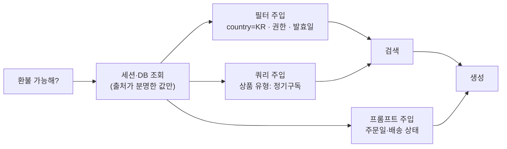

# 컨텍스트 주입 (Context Injection)

**사용자가 말하지 않았지만 시스템은 이미 알고 있는 조건(오늘 날짜, 회원 등급, 주문 상태, 국가, 현재 화면)을 검색 쿼리와 메타데이터 필터, 생성 프롬프트에 채워 넣는** 기법입니다. "환불 가능해?"라는 같은 질문도 누가, 언제, 어떤 주문에 대해 묻느냐에 따라 봐야 할 문서가 다르기 때문입니다. 핵심은 **아는 것만 넣고, 모르는 것은 지어내지 않는 것**입니다.

> 이름이 비슷한 **프롬프트 인젝션(Prompt Injection)** 은 공격 기법이고, 이 문서의 컨텍스트 주입은 시스템이 의도적으로 하는 검색 강화입니다. 방어는 [RAG 프롬프트 인젝션 5층 방어](/ai/advanced/rag/RAG/13-RAG-프롬프트-인젝션-5층-방어)를 보세요.

## 언제 쓰나

- 답이 **사용자 속성에 따라 달라지는** 도메인: 회원 등급별 혜택, 국가별 배송 정책, 직급별 인사 규정
- 답이 **시점에 따라 달라지는** 문서: 개정된 약관, 프로모션 기간, 발효일이 있는 규정
- 질문이 짧아 **암시된 조건**(시간·대상·범위)이 검색에 드러나지 않을 때
- 권한에 따라 **볼 수 있는 문서가 다를** 때 (이 경우 주입이 아니라 필수 필터)

## 작동 방식

| 주입 위치 | 넣는 것 | 예 | 효과 |
|---|---|---|---|
| **메타데이터 필터** | 권한, 국가, 문서 유형, 발효 기간 | `country = "KR" AND effective_from ≤ today ≤ effective_to` | 검색 범위를 **확정적으로** 좁힘 |
| **쿼리 텍스트** | 도메인 키워드, 대상 명사 | "환불 가능해?" → "환불 가능 조건 정기구독 상품" | 키워드·벡터 매칭 보강 |
| **생성 프롬프트** | 사용자 상황 요약 | "사용자: 골드 회원, 주문 3일 전, 배송 완료" | 여러 조건 중 **해당하는 조항을 고르게** 함 |



**조건 슬롯**으로 생각하면 정리가 쉽습니다. 질문 유형마다 필요한 슬롯(시간·대상·범위)을 정해 두고, 각 슬롯을 **출처가 분명한 값으로 채우거나, 비워 둡니다.**

| 슬롯 | 채울 수 있는 출처 | 못 채우면 |
|---|---|---|
| 시간 | 서버 시각, 주문일, 요청 시점 | 현재 발효 중인 문서로 필터 |
| 대상 | 로그인 정보(회원 등급, 직급), 선택된 주문 | 대상별 조항을 모두 가져와 답변에서 구분 |
| 범위 | 현재 페이지 상품, 주문의 상품 유형 | 일반 정책으로 검색 후 되묻기 |

## 예시

### 슬롯 채우기 예

| 질문 | 알려진 컨텍스트 | 주입 결과 |
|---|---|---|
| 환불 가능해? | 주문 `20260912-0042`, 주문일 2026-09-12, 상품 유형 정기구독, 배송 완료 | **쿼리**: "정기구독 상품 환불 조건 배송 완료 후" · **필터**: `doc_type=policy, effective_on=2026-09-15` · **프롬프트**: "주문일로부터 3일 경과" |
| 해외 배송 돼? | 배송지 국가 JP, 비회원 | **쿼리**: "해외 배송 가능 국가 일본 배송비" · **필터**: `category=shipping` |
| 연봉 인상 언제 해? | 사내 인증, 정규직, 직급 선임 | **쿼리**: "연봉 인상 시기 정규직 평가" · **필터**: `audience ∈ {all, fulltime}`, `access_level ≤ 사용자 권한` |
| 교환 가능해? | *(비로그인, 주문 선택 없음)* | **쿼리**: "교환 가능 조건 교환 신청 절차" · 필터 없음 · 답변에서 "주문 정보를 알려주시면 정확히 안내"로 되묻기 |
| 할인 되나요? | 현재 페이지 상품 `P-1234`, 회원 등급 골드 | **쿼리**: "P-1234 할인 회원 등급 골드 혜택" · **필터**: `valid_from ≤ today ≤ valid_to` |

마지막 열의 값은 모두 **세션·DB에서 온 값**입니다. "구매일로부터 30일 이내" 같은 조건은 문서에서 **찾아야 할 답**이지 쿼리에 넣을 값이 아닙니다.

### 도메인 키워드 주입 — 사전으로 관리

질문 의도별로 문서에 자주 등장하는 키워드를 **사람이 검수한 표**로 관리하면 LLM 창작 없이 쿼리를 보강할 수 있습니다.

| 의도 | 주입 키워드 |
|---|---|
| 환불 | 환불 조건, 반품 기간, 청약 철회, 불량·오배송 |
| 교환 | 교환 조건, 사이즈 교환, 교환 배송비 |
| 해외 배송 | 배송 가능 국가, 국제 배송비, 관부가세 |
| 연봉 인상 | 연봉 조정, 평가 시기, 보상 정책 |

### 코드 (TypeScript)

```typescript
interface Session {
  now: Date;                 // 서버 시각 (클라이언트 값 금지)
  country?: string;          // 배송지/계정 국가
  memberTier?: string;       // 로그인 정보
  accessLevel: number;       // 권한 — 항상 서버에서 결정
  selectedOrder?: { id: string; orderedAt: Date; productType: string; status: string };
}

interface RetrievalRequest {
  query: string;
  filter: Record<string, unknown>;
  promptContext: string[];
}

// 사람이 검수한 의도 → 키워드 표 (LLM이 즉석에서 만들지 않음)
const INTENT_KEYWORDS: Record<string, string[]> = {
  refund: ["환불 조건", "반품 기간", "청약 철회"],
  exchange: ["교환 조건", "교환 배송비"],
  overseas_shipping: ["배송 가능 국가", "국제 배송비"],
};

export function injectContext(question: string, intent: string, s: Session): RetrievalRequest {
  const today = s.now.toISOString().slice(0, 10);
  const terms = [question, ...(INTENT_KEYWORDS[intent] ?? [])];
  const promptContext: string[] = [`오늘 날짜: ${today}`];

  // 권한·발효일은 "선택"이 아니라 항상 거는 필터
  const filter: Record<string, unknown> = {
    access_level: { lte: s.accessLevel },
    effective_from: { lte: today },
    effective_to: { gte: today },
  };

  if (s.country) filter.country = { in: [s.country, "ALL"] };

  if (s.selectedOrder) {
    const o = s.selectedOrder;
    terms.push(o.productType);
    const days = Math.floor((s.now.getTime() - o.orderedAt.getTime()) / 86_400_000);
    promptContext.push(`대상 주문: ${o.id}, 상품 유형 ${o.productType}, 주문 후 ${days}일 경과, 상태 ${o.status}`);
  }

  if (s.memberTier) promptContext.push(`회원 등급: ${s.memberTier}`);

  return { query: [...new Set(terms)].join(" "), filter, promptContext };
}
```

`promptContext`는 생성 프롬프트의 **사용자 상황** 블록에 넣고, 검색된 문서와 섞이지 않게 구분합니다. 프롬프트 구조는 [RAG 프롬프트 샘플](/ai/03-prompt/03-rag)을 참고하세요.

## 장단점

| 장점 | 단점 |
|---|---|
| 같은 질문이라도 사용자·시점에 맞는 문서를 가져옴 | 세션·DB 조회가 늘어 구현 복잡도 증가 |
| 메타데이터 필터는 결정적이라 정확도·권한 통제에 강함 | 필터가 너무 좁거나 메타데이터가 비어 있으면 **0건** |
| LLM 호출 없이 적용 가능 | 문서에 국가·발효일·권한 메타데이터가 있어야 함 |
| 답변에서 "해당하는 조항"을 고르게 해 오답 감소 | 개인 정보를 프롬프트에 넣으므로 로그·보관 정책 필요 |

## 함정

> ⚠️ **함정 — 조건 창작**: LLM에게 "암시된 조건을 보완하라"고 하면 "환불 → 구매일로부터 30일 이내", "교환 → 14일 이내"처럼 **그럴듯한 값을 지어냅니다.** 이 값이 쿼리에 들어가면 실제 정책(예: 7일)과 다른 문서가 검색되거나, 답변이 그 숫자를 사실처럼 말합니다. 슬롯은 **시스템이 아는 값으로만** 채우세요.

> ⚠️ **함정 — 권한을 프롬프트로 처리**: "이 사용자는 일반 직원이니 임원 규정은 답하지 마"를 프롬프트에 주입하는 건 통제가 아닙니다. 권한은 **검색 필터에서 문서를 아예 빼는** 방식으로만 보장됩니다. → [파일명으로 권한을 판단하면 안 되는 이유](/ai/advanced/rag/RAG/04-파일명으로-권한을-판단하면-안-되는-이유)

> ⚠️ **함정 — 클라이언트 값 신뢰**: 날짜·회원 등급·권한을 요청 바디에서 받으면 사용자가 조작할 수 있습니다. 주입 값은 서버의 세션·DB에서 가져오세요.

> ⚠️ **함정 — 과한 필터로 인한 제로 리콜**: `country=JP`로 필터했는데 공통 정책 문서에는 `country`가 비어 있으면 모두 빠집니다. `ALL` 같은 기본값을 두거나 필터 없는 경로를 백스톱으로 두세요. → [제로 리콜 트러블슈팅](/ai/advanced/rag/RAG/12-제로-리콜-4층-트러블슈팅)

## 관련 기법

- [쿼리 명확화 (Query Clarification)](./01-clearly) — 지시어가 가리키는 **대상**을 채우는 단계
- [정규화 (Normalization)](./04-normalization) — "지난달" 같은 표현을 필터 값으로 변환
- [쿼리 확장 (Query Expansion)](./08-expansion) — 동의어·관련어 덧붙이기
- 심화: [신구 제도 공존 — 버전과 발효일](/ai/advanced/rag/RAG/11-신구-제도-공존-버전-재정), [쿼리 재작성의 경계 — 조건을 지어내지 말 것](/ai/advanced/rag/RAG/07-쿼리-재작성의-경계)

## 참고 자료

- [Anthropic — Introducing Contextual Retrieval](https://www.anthropic.com/news/contextual-retrieval) — 문서 쪽에 컨텍스트를 붙이는 인덱싱 기법 (쿼리 쪽 주입과 짝을 이룸)
- [OWASP — LLM01: Prompt Injection](https://genai.owasp.org/llmrisk/llm01-prompt-injection/) — 이름이 비슷한 공격 기법과의 구분
