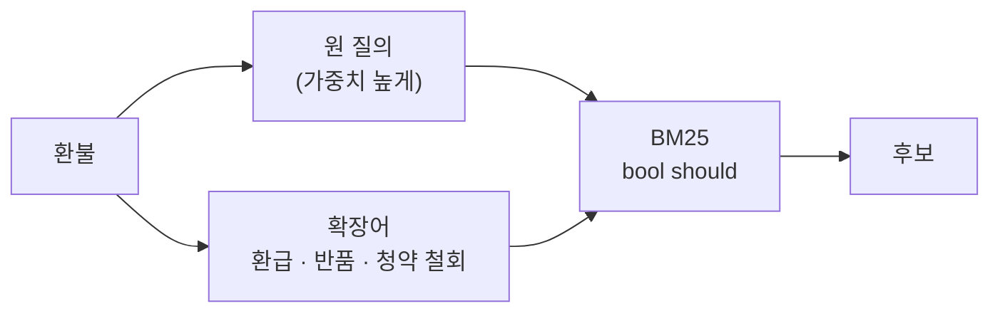

# 쿼리 확장 (Query Expansion)

**원래 질의는 그대로 두고 동의어·관련어·하위 개념을 덧붙여, 문서가 다른 단어로 쓰여 있어도 걸리게 만드는** 리콜 향상 기법입니다. [어휘 재작성](./02-lexical)이 표현을 **바꾸는** 것이라면, 확장은 **더하는** 것입니다. 정보 검색 분야에서 수십 년 된 기법이고, LLM이 확장어·가상 문서 생성을 맡으면서 다시 쓰이고 있습니다.

## 언제 쓰나

- **BM25·키워드 검색**에서 어휘 불일치로 리콜이 낮을 때 (가장 효과가 큼)
- 사용자 표현이 제각각이고 문서 용어가 한 가지일 때: "환불 / 환급 / 돈 돌려받기"
- 치환할 정답 용어를 **확신할 수 없어서** 원 표현도 남겨 두고 싶을 때
- 짧은 질의(1~2어절)가 많아 매칭 단서 자체가 부족할 때

벡터 검색은 동의어를 이미 어느 정도 가깝게 두므로 효과가 작고, 벡터 쪽에는 [HyDE](./07-hyde)나 [멀티 쿼리](./05-multiQuery)가 더 맞습니다.

## 작동 방식

| 방식 | 내용 | 적용 위치 | 비고 |
|---|---|---|---|
| **동의어 사전** | 도메인 사전으로 동의어를 OR로 추가 | 검색 시 (쿼리 분석기) | 결정적. Elasticsearch `synonym_graph` 등 |
| **상위·하위 개념** | "과일" → 사과, 배, 포도 (하위어) / "사과" → 과일 (상위어) | 검색 시 | 상위어 확장은 범위가 넓어져 정밀도 하락 |
| **LLM 확장어** | LLM이 "검색에 유용한 관련 키워드"를 생성 | 검색 시 | 유연하지만 비결정적, 표류 위험 |
| **가상 문서 확장 (Query2doc)** | LLM이 쓴 가상 문서를 원 질의에 이어 붙여 BM25 검색 | 검색 시 | BM25용으로는 원 질의를 **여러 번 반복**해 가중치를 유지 |
| **유사 적합성 피드백 (PRF)** | 1차 검색 상위 문서에서 자주 나온 단어를 추가해 재검색 (RM3 등) | 검색 시 | 1차 결과가 나쁘면 오류가 증폭됨 |
| **문서 쪽 확장 (doc2query)** | 인덱싱 때 각 문서가 답할 법한 질문을 생성해 문서에 붙임 | 인덱싱 시 | 질의 지연 없음. 인덱싱 비용이 큼 |



핵심은 **원 질의의 가중치를 확장어보다 높게** 유지하는 것입니다. 모든 단어를 같은 무게로 OR하면 확장어만 걸린 문서가 원 질의에 정확히 맞는 문서를 밀어냅니다.

## 예시

### 확장 예

| 원 질의 | 좋은 확장 | 피해야 할 확장 | 이유 |
|---|---|---|---|
| 환불 | 환급, 반품, 청약 철회, 결제 취소 | 환불 절차, 환불 정책 | 원 질의를 포함한 구는 새 단서가 아님 |
| 해지 | 계약 해지, 구독 취소, 자동 결제 중지 | 폐지, 해제 | "폐지"는 다른 뜻, "해제"는 도메인에 따라 다름 |
| 노트북 발열 | 노트북 과열, 쿨링, 써멀 페이스트, 스로틀링 | 노트북 열 관리 안내 | 문서 제목처럼 늘인 표현은 매칭 단서가 약함 |
| 적립금 | 포인트, 리워드, 캐시백 | 적립금 정책, 적립금 확인 | 사내에서 실제로 쓰는 호칭을 사전으로 확인 |
| A/S | 애프터서비스, 수리, 보증 수리 | 교체 | 교환·환불 문서가 섞여 들어옴 |
| 비밀번호 | 패스워드, 비밀번호 재설정, 로그인 인증 | 아이디 | 관련은 있지만 다른 의도 |

### 동의어 사전 — Elasticsearch `synonym_graph`

`synonym_graph`는 **검색 시 분석기(search analyzer) 전용**으로 설계됐습니다. 동의어 파일을 쓰고 `updateable: true`를 주면, 사전을 바꿔도 재인덱싱 없이 검색 분석기만 다시 불러와 반영할 수 있습니다.

```text
# config/analysis/synonyms_ko.txt — 한 줄에 동의어 묶음 하나
환불, 환급, 청약 철회
해지, 계약 해지, 구독 취소
적립금, 포인트, 리워드
애프터서비스, 보증 수리
```

```json
{
  "settings": {
    "analysis": {
      "filter": {
        "commerce_synonyms": {
          "type": "synonym_graph",
          "synonyms_path": "analysis/synonyms_ko.txt",
          "updateable": true
        }
      },
      "analyzer": {
        "ko_index":  { "type": "custom", "tokenizer": "nori_tokenizer", "filter": ["lowercase"] },
        "ko_search": { "type": "custom", "tokenizer": "nori_tokenizer", "filter": ["lowercase", "commerce_synonyms"] }
      }
    }
  },
  "mappings": {
    "properties": {
      "content": { "type": "text", "analyzer": "ko_index", "search_analyzer": "ko_search" }
    }
  }
}
```

최신 Elasticsearch는 파일 대신 Synonyms API(`synonyms_set`)로도 관리할 수 있습니다.

### LLM 확장 + 가중치 유지 (TypeScript)

```typescript
type Complete = (prompt: string) => Promise<string>;

const EXPAND_PROMPT = `다음 검색어에 대해, 같은 뜻이거나 문서에서 대신 쓰일 수 있는 단어·짧은 구를 최대 {max}개 쓰세요.
- 원 검색어를 포함한 구("환불 절차")는 쓰지 마세요.
- 뜻이 다른 단어, 더 넓은 상위 개념은 쓰지 마세요.
- 한 줄에 하나씩, 기호 없이 출력하세요.

검색어: {query}`;

export async function expandedBm25Query(query: string, complete: Complete, max = 4) {
  const raw = await complete(EXPAND_PROMPT.replace("{max}", String(max)).replace("{query}", query));
  const expansions = raw
    .split("\n")
    .map((s) => s.trim())
    .filter((s) => s && !s.includes(query))
    .slice(0, max);

  // Elasticsearch bool/should: 원 질의는 boost를 높게, 확장어는 낮게
  return {
    query: {
      bool: {
        should: [
          { match: { content: { query, boost: 3 } } },
          ...expansions.map((e) => ({ match_phrase: { content: { query: e, boost: 1 } } })),
        ],
        minimum_should_match: 1,
      },
    },
  };
}
```

### Query2doc 방식 — 가상 문서로 확장

Query2doc은 LLM이 쓴 가상 문서 `d′`를 원 질의 `q`에 붙여 검색합니다. 가상 문서가 원 질의보다 훨씬 길어 BM25 가중치를 빼앗기 때문에, **희소 검색에서는 원 질의를 n번(논문 기본값 5) 반복**한 뒤 이어 붙입니다.

```typescript
// q⁺ = concat(q × 5, d′)  — BM25용
function query2docSparse(q: string, pseudoDoc: string, n = 5): string {
  return [...Array(n).fill(q), pseudoDoc].join(" ");
}
```

## 장단점

| 장점 | 단점 |
|---|---|
| 표현 차이로 인한 누락 감소 (리콜 향상) | 확장어가 많을수록 정밀도 하락 (**주제 표류**) |
| 원 질의를 유지하므로 치환보다 안전 | 동의어 사전 구축·유지 비용 |
| 사전 방식은 결정적이고 검색 엔진에 내장 | LLM 방식은 질의마다 호출·지연 추가 |
| doc2query는 질의 시점 비용이 0 | 문서 쪽 확장은 인덱스가 커지고 재생성 비용이 큼 |

## 함정

> ⚠️ **함정 — 뜻이 다른 동의어**: "해지 → 폐지", "교환 → 변경", "상품 → 물건"은 일반 사전에선 가깝지만 도메인에선 다른 문서를 끌어옵니다. 일반 시소러스나 LLM 출력을 그대로 넣지 말고, 도메인 문서에서 실제 쓰임을 확인한 **검수된 사전**을 쓰세요.

> ⚠️ **함정 — 원 질의 가중치 희석**: 확장어 5개를 원 질의와 같은 무게로 OR하면 "환급"만 있는 세금 환급 문서가 "환불" 정책 문서를 앞지릅니다. 원 질의 boost를 높이거나 Query2doc처럼 원 질의를 반복하세요.

> ⚠️ **함정 — 원 질의 반복 확장**: "환불 → 환불 절차, 환불 정책, 환불 신청"은 새로운 단서가 없어 리콜이 늘지 않고, "환불" 토큰의 빈도만 올려 점수를 왜곡합니다.

> ⚠️ **함정 — 인덱스 시 동의어 적용**: 동의어를 인덱싱 분석기에 넣으면 사전을 바꿀 때마다 **전체 재인덱싱**이 필요합니다. 검색 시 분석기에 두는 것이 운영상 유리합니다.

## 관련 기법

- [어휘 재작성 (Lexical Rewrite)](./02-lexical) — 덧붙이는 대신 치환
- [HyDE](./07-hyde) — 가상 문서를 벡터 검색에 사용 (Query2doc의 dense 버전과 유사)
- [멀티 쿼리 (Multi-Query)](./05-multiQuery) — 확장어를 한 쿼리에 넣지 않고 여러 쿼리로 분리
- [불용어 제거 (Stopword Removal)](./03-stopword)
- 심화: [쿼리 재작성의 경계 — 과도 확장 방지](/ai/advanced/rag/RAG/07-쿼리-재작성의-경계), [BM25와 벡터 검색](/ai/advanced/rag/RAG/05-BM25와-벡터-검색)

## 참고 자료

- [Wang, Yang, Wei — Query2doc: Query Expansion with Large Language Models (2023)](https://arxiv.org/abs/2303.07678)
- [Nogueira et al. — Document Expansion by Query Prediction (doc2query, 2019)](https://arxiv.org/abs/1904.08375)
- [Elasticsearch — Synonym graph token filter](https://www.elastic.co/docs/reference/text-analysis/analysis-synonym-graph-tokenfilter)
