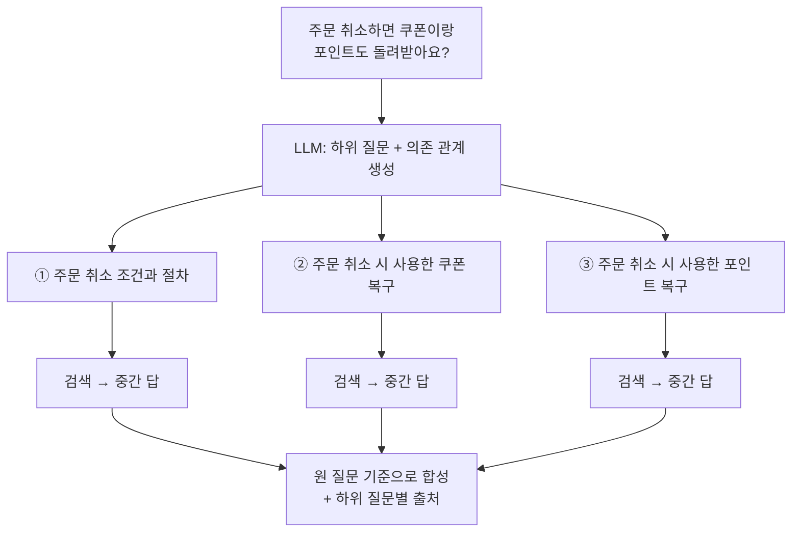

# 쿼리 분해 (Query Decomposition)

**여러 조건이나 여러 단계가 섞인 질문을 각각 독립적으로 검색할 수 있는 하위 질문(sub-query)으로 쪼개고, 하위 결과를 모아 하나의 답으로 합치는** 기법입니다. 한 문장 안에 다른 주제가 둘 이상 있으면 어느 한쪽 문서만 검색되기 쉬운데, **주제마다 검색 경로를 따로 만들어** 증거를 빠짐없이 모읍니다.

## 언제 쓰나

- **복합 질문**: "주문 취소하면 쿠폰이랑 포인트도 돌려받아요?" → 취소 정책, 쿠폰 복구, 포인트 복구 문서가 각각 따로 있음
- **비교 질문**: "A 요금제와 B 요금제 차이" → A 문서, B 문서를 각각 가져와야 비교 가능
- **다단계(multi-hop) 질문**: "작년에 리콜된 우리 제품의 보상 정책은?" → ① 리콜된 제품 찾기 → ② 그 제품의 보상 정책 찾기. 앞 답이 뒤 질문의 입력이 됨

한 가지를 다르게 표현한 것뿐이라면 [멀티 쿼리](./05-multiQuery), 지시어가 모호한 것이라면 [쿼리 명확화](./01-clearly)가 맞습니다.

## 작동 방식

분해에는 두 가지 모양이 있습니다.

| 유형 | 하위 질문 관계 | 실행 | 예 |
|---|---|---|---|
| **병렬 분해** | 서로 독립 | 동시에 검색 후 합성 | "환불하면 포인트는?" → 환불 정책 / 환불 시 포인트 처리 |
| **순차 분해** | 앞 답이 뒤 질문을 결정 | 차례로 검색·답변 | "작년 리콜 제품의 보상 정책" → 리콜 제품명 → 그 제품의 보상 정책 |



1. **분해 필요 여부 판단**: 접속사("~하고", "~랑", "그리고"), 비교("차이", "vs"), 조건 연쇄가 있는지 봅니다. 단순 질문은 분해하지 않습니다.
2. **하위 질문 생성**: 각 하위 질문은 **혼자 읽어도 뜻이 통하고**(원 질문의 대상·조건 포함), **한 주제만** 담습니다. 순차 분해면 의존 관계를 함께 출력합니다.
3. **실행**: 독립 질문은 병렬로, 의존 질문은 앞 답을 넣어 순서대로 검색·답변합니다.
4. **합성**: 중간 답과 근거를 모아 **원 질문**에 답합니다. 하위 질문 중 근거를 못 찾은 것은 "확인 불가"로 명시합니다.

연구 계열로는 쉬운 하위 문제부터 차례로 푸는 **Least-to-Most Prompting**, 모델이 스스로 후속 질문을 던지고 검색으로 답하는 **Self-Ask**가 이 기법의 원형입니다.

## 예시

### 분해 예

| 원 질문 | 하위 질문 | 유형 |
|---|---|---|
| 환불하면 포인트는 어떻게 돼? | ① 환불 시 적립된 포인트 처리 기준 ② 환불 시 결제에 사용한 포인트 반환 여부 | 병렬 |
| 주문 취소하면 쿠폰이랑 포인트도 돌려받아요? | ① 주문 취소 조건과 절차 ② 주문 취소 시 사용한 쿠폰 복구 ③ 주문 취소 시 사용한 포인트 복구 | 병렬 |
| 노트북 발열 심한데 AS 되나? | ① 노트북 과열 증상의 보증 수리 대상 여부 ② 노트북 AS 신청 절차 | 병렬 |
| 배송 지연되면 환불 가능해? | ① 배송 지연 시 주문 취소·환불 가능 여부 ② 배송 지연 보상 정책 | 병렬 |
| 쿠폰 쓰고 결제해도 포인트 적립 돼? | ① 쿠폰 할인 적용 주문의 포인트 적립 기준 (적립 기준 금액) | **분해 불필요** — 한 정책 문서 안의 한 질문 |
| 작년에 리콜된 우리 제품의 보상 정책은? | ① 2025년 리콜 대상 제품 목록 → ② `{1}` 리콜 보상 정책 (`{1}` = ①의 답인 제품명) | 순차 |
| 프리미엄 요금제와 베이직 요금제 차이 | ① 프리미엄 요금제 제공 기능과 가격 ② 베이직 요금제 제공 기능과 가격 | 병렬 (비교) |

### 프롬프트

```text
사용자 질문을 문서 검색용 하위 질문으로 나누세요.

규칙:
1. 질문이 한 주제에 대한 하나의 질문이면 나누지 말고 원 질문 하나만 반환하세요.
2. 하위 질문은 최대 4개입니다. 각 하위 질문은 원 질문의 대상·조건을 포함해 단독으로 이해되어야 합니다.
3. 원 질문에 없는 주제(원인 분석, 세금, 법률 해석 등)를 새로 추가하지 마세요.
4. 앞 하위 질문의 답이 있어야 만들 수 있는 질문이면 depends_on에 그 번호를 쓰고, 자리 표시는 {1}처럼 쓰세요.

JSON으로만 출력:
{"sub_questions": [{"id": 1, "question": string, "depends_on": number[]}]}

질문: {question}
```

### 코드 (TypeScript)

```typescript
type Complete = (prompt: string) => Promise<string>;
type Search = (query: string, k: number) => Promise<{ id: string; text: string }[]>;

interface SubQuestion { id: number; question: string; depends_on: number[] }
interface SubAnswer { id: number; question: string; answer: string; sources: string[] }

export async function decomposeAndAnswer(question: string, complete: Complete, search: Search) {
  const plan = JSON.parse(await complete(fill(DECOMPOSE_PROMPT, { question }))) as {
    sub_questions: SubQuestion[];
  };

  const done = new Map<number, SubAnswer>();
  const pending = [...plan.sub_questions.slice(0, 4)];

  // 의존성이 모두 풀린 질문끼리 묶어 병렬 실행 → 순차 분해도 자연스럽게 처리
  while (pending.length > 0) {
    const ready = pending.filter((q) => q.depends_on.every((d) => done.has(d)));
    if (ready.length === 0) throw new Error("순환 의존 또는 잘못된 depends_on");

    const results = await Promise.all(
      ready.map(async (q) => {
        // "{1}" 자리에 앞 단계의 답을 채움
        const resolved = q.question.replace(/\{(\d+)\}/g, (_, id) => done.get(Number(id))?.answer ?? "");
        const docs = await search(resolved, 5);
        const answer = await complete(fill(SUB_ANSWER_PROMPT, { question: resolved, docs: format(docs) }));
        return { id: q.id, question: resolved, answer, sources: docs.map((d) => d.id) };
      }),
    );

    for (const r of results) done.set(r.id, r);
    for (const r of ready) pending.splice(pending.indexOf(r), 1);
  }

  // 원 질문 기준으로 합성 — 하위 답마다 출처를 유지
  const subs = [...done.values()];
  return complete(fill(SYNTHESIZE_PROMPT, { question, subs: JSON.stringify(subs, null, 2) }));
}

const fill = (tpl: string, vars: Record<string, string>) =>
  tpl.replace(/\{(\w+)\}/g, (m, k) => vars[k] ?? m);
const format = (docs: { id: string; text: string }[]) =>
  docs.map((d) => `[${d.id}] ${d.text}`).join("\n\n");

const DECOMPOSE_PROMPT = `...위 프롬프트 전문...`;
const SUB_ANSWER_PROMPT = `아래 문서만 근거로 질문에 짧게 답하세요. 근거가 없으면 "확인 불가"라고 쓰세요.\n\n문서:\n{docs}\n\n질문: {question}`;
const SYNTHESIZE_PROMPT = `하위 질문별 답을 종합해 원 질문에 답하세요. "확인 불가"인 항목은 그렇다고 밝히고, 각 주장에 출처 id를 붙이세요.\n\n원 질문: {question}\n\n하위 답:\n{subs}`;
```

하위 질문마다 검색 + 답변 호출이 들어가므로, 호출 수는 대략 `1(분해) + 2×하위 질문 수 + 1(합성)`입니다. 비용이 부담되면 하위 답변 단계를 생략하고 **하위 질문별 검색 결과만 모아 한 번에 생성**하는 가벼운 형태도 많이 씁니다.

## 장단점

| 장점 | 단점 |
|---|---|
| 복합·비교 질문에서 **한쪽 증거만 가져오는** 실패를 막음 | LLM·검색 호출 수가 하위 질문 수에 비례해 증가 |
| 다단계 질문을 순서대로 풀어 정확도 향상 | 분해가 틀리면 엉뚱한 하위 질문들로 오답이 **체계적으로** 만들어짐 |
| 하위 질문별 근거·"확인 불가"가 드러나 디버깅·설명이 쉬움 | 단순 질문까지 분해하면 오히려 품질·속도 하락 |
| 에이전트의 계획 → 실행 → 합성 구조와 자연스럽게 연결 | 순차 분해는 앞 단계 오류가 뒤로 전파 |

## 함정

> ⚠️ **함정 — 과분해**: "노트북 발열 심한데 AS 되나?"를 "과열 원인 / 임시 조치 / 보증 기간 확인 방법 / 보증 기간 후 AS / 신청 서류 / 수리 비용 / 소요 시간" 7개로 쪼개면, 사용자가 묻지 않은 주제의 문서가 컨텍스트를 채우고 정작 "AS 되나?"에 대한 답은 묻힙니다. 하위 질문 수에 상한을 두고, **원 질문에 나온 주제만** 나누세요.

> ⚠️ **함정 — 주제 창작**: "연차 남으면 돈으로 줘?"를 "연차 현금화 시 소득세·국민연금 부과"까지 분해하면 사내 규정 질문이 세법 질문으로 변합니다. 분해는 질문을 **나누는** 것이지 **넓히는** 것이 아닙니다.

> ⚠️ **함정 — 맥락 없는 하위 질문**: "② 복구 여부는?"처럼 원 질문의 대상이 빠진 하위 질문은 단독으로 검색하면 아무 문서나 걸립니다. 각 하위 질문에 대상("주문 취소 시 사용한 쿠폰")을 반복해 넣으세요.

> ⚠️ **함정 — 합성 단계의 증거 누락**: 하위 답만 넘기고 출처를 버리면, 합성 모델이 하위 답들을 매끄럽게 이어 붙이며 **근거 없는 연결 문장**을 만듭니다. 하위 답마다 출처 id를 유지하고, "확인 불가" 항목은 합성에서도 드러내세요.

## 관련 기법

- [멀티 쿼리 (Multi-Query)](./05-multiQuery) — 같은 질문의 다른 표현으로 병렬 검색
- [쿼리 명확화 (Query Clarification)](./01-clearly) — 분해 전에 지시어부터 확정
- [컨텍스트 주입 (Context Injection)](./06-injection) — 하위 질문에 공통 조건(날짜·대상)을 채움
- Step-Back Prompting — 반대 방향으로, 구체 질문에서 **더 일반적인 원리 질문**을 먼저 만들어 검색 ([논문](https://arxiv.org/abs/2310.06117))
- [에이전트](/ai/05-agent/01-agent) — 계획·실행·합성을 동적으로 반복하는 Agentic RAG
- 심화: [분산된 증거 조립](/ai/advanced/rag/RAG/10-분산된-증거-조립), [쿼리 재작성의 경계](/ai/advanced/rag/RAG/07-쿼리-재작성의-경계)

## 참고 자료

- [Zhou et al. — Least-to-Most Prompting Enables Complex Reasoning in Large Language Models (ICLR 2023)](https://arxiv.org/abs/2205.10625)
- [Press et al. — Measuring and Narrowing the Compositionality Gap in Language Models (Self-Ask, 2022)](https://arxiv.org/abs/2210.03350)
- [Zheng et al. — Take a Step Back: Evoking Reasoning via Abstraction in Large Language Models (ICLR 2024)](https://arxiv.org/abs/2310.06117)
