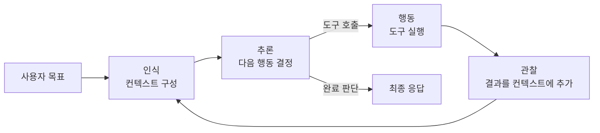
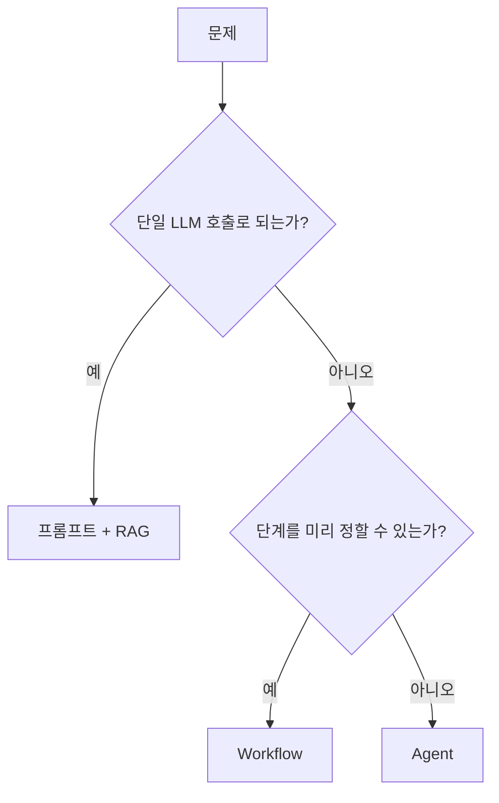

# Agent

Agent는 **LLM이 스스로 다음 행동을 결정하고, 도구를 호출하고, 그 결과를 보고 다시 판단하는 루프**로 목표를 달성하는 시스템입니다. 한 번 묻고 한 번 답하는 챗봇과 달리, "무엇을 몇 번 할지"를 코드가 아니라 모델이 정합니다.

## 정의

Google의 [《Agents》 백서](https://www.kaggle.com/whitepaper-agents)는 Agent를 **목표를 달성하기 위해 세상을 관찰하고, 가용한 도구로 행동하는 애플리케이션**으로 정의합니다. 자연어 이해에 그치지 않고 의사결정·문제 해결·외부 환경과의 상호작용·작업 실행까지 포괄합니다.

실무에서 더 쓸모 있는 구분은 Anthropic의 [Building effective agents](https://www.anthropic.com/engineering/building-effective-agents)입니다. 둘 다 "agentic system"이지만 **제어권이 누구에게 있는가**로 나눕니다.

| 구분 | 정의 | 제어 흐름 | 예 |
|---|---|---|---|
| **Workflow** | LLM과 도구가 **미리 정의된 코드 경로**를 따라 조율되는 시스템 | 개발자가 설계 | n8n·Zapier 파이프라인, "분류 → 요약 → 번역" 체인 |
| **Agent** | LLM이 **자신의 프로세스와 도구 사용을 동적으로 지시**하고 작업 방식을 스스로 통제하는 시스템 | 모델이 결정 | Claude Code, 리서치 Agent |
| **AI 어시스턴트** | 사용자의 요청에 **반응(reactive)** 해서 한 번에 한 작업을 수행 | 사용자가 매번 지시 | 일반 챗봇, 코드 자동완성 |

정해진 흐름을 따르기만 한다면 LLM을 여러 번 호출해도 Agent가 아니라 Workflow입니다. 이 구분이 중요한 이유는 **Workflow는 예측 가능하고 싸며, Agent는 유연한 대신 비싸고 예측하기 어렵기** 때문입니다. 두 방식의 구체적인 패턴은 [Agentic Design Patterns](./02-pattern)에서 다룹니다.

## 핵심 루프

전통적인 AI Agent 이론은 Agent의 동작을 **인식 → 추론 → 목표 설정 → 결정 → 행동 → 학습**으로 설명합니다. 각 단계를 풀면 다음과 같습니다.

- **인식(Perception)** 은 Agent가 자기가 놓인 환경을 파악하는 단계입니다. 환경은 도로나 창고 같은 물리 공간일 수도, 웹사이트나 서버 같은 디지털 공간일 수도 있습니다. 자율주행차는 카메라와 레이더로, 챗봇은 사용자의 메시지로, LLM Agent는 대화 이력과 도구 결과로 환경을 인식합니다.
- **추론(Reasoning)** 은 인식한 정보를 해석해 무엇을 해야 할지 판단하는 단계입니다. 과거에는 규칙 기반 시스템이나 별도 ML 모델이 이 역할을 했고, LLM Agent에서는 모델 자신이 담당합니다.
- **목표 설정(Goal setting)** 은 사전에 정의된 목표나 사용자 요청을 구체적인 하위 목표로 바꾸고, 그것을 달성할 전략을 세우는 단계입니다.
- **결정(Decision)** 은 여러 선택지 중 지금 실행할 하나를 고르는 단계입니다. 메모리에 쌓인 정보, 사용자의 목표, 대상들 사이의 관계를 함께 고려합니다.
- **행동(Action)** 은 결정한 내용을 환경에 실제로 적용하는 단계입니다. LLM Agent에서는 대부분 **도구 호출**입니다.
- **학습(Learning)** 은 결과를 바탕으로 이후의 판단을 개선하는 단계입니다. 단순 자동화와 Agent를 가르는 특징으로 꼽힙니다.

LLM Agent에서는 이 과정이 **한 턴 안에서 반복되는 짧은 루프**로 압축됩니다.



코드로 보면 놀랄 만큼 단순합니다. **모델이 "끝났다"고 판단할 때까지 도구를 실행하고 결과를 되먹이는 `while` 루프**가 전부입니다.

```python
messages = [{"role": "user", "content": goal}]
while True:
    response = llm(messages, tools=TOOLS)          # 추론
    if not response.tool_calls:                    # 도구 호출이 없으면 종료
        return response.text
    messages.append(response)
    for call in response.tool_calls:               # 행동
        result = execute(call.name, call.arguments)
        messages.append(tool_result(call.id, result))  # 관찰
```

> ⚠️ **함정**: LLM Agent의 "학습"은 대부분 **모델 가중치가 바뀌는 것이 아닙니다.** 모델은 호출마다 상태가 없고, 개선은 메모리·프롬프트·Skill 파일을 애플리케이션이 갱신하는 방식으로 일어납니다. 잘못된 경험이 메모리에 저장되면 계속 틀리게 되므로 수정 경로가 필요합니다. → [Agent가 잘못된 경험을 기억했다면](/ai/advanced/agent/AGENT/42-잘못된-경험-수정)

### 예시: 루프가 도는 모습

ReAct 방식(생각 → 행동 → 관찰 반복)으로 추적하면 다음과 같습니다.

```text
입력: 주문 #1234가 아직 안 왔대요. 상태 확인하고, 지연이면 사과 메일 초안까지 써주세요.

Thought: 먼저 주문 상태를 조회해야 한다.
Action: get_order_status
Action Input: {"order_id": "1234"}
Observation: {"status": "in_transit", "eta": "2일 지연", "carrier": "CJ대한통운"}

Thought: 지연 상태다. 고객 이름과 이메일이 필요하다.
Action: get_customer
Action Input: {"order_id": "1234"}
Observation: {"name": "김민수", "email": "minsu@example.com"}

Thought: 필요한 정보가 모였다. 메일은 발송하지 않고 초안만 쓴다.
Final Answer: 주문 #1234는 배송 중이며 예정보다 2일 지연되었습니다. 사과 메일 초안은 다음과 같습니다. ...
```

두 번째 도구를 부를지, 몇 번 부를지, 언제 멈출지를 **모델이 관찰 결과를 보고 정했다**는 점이 Workflow와의 차이입니다.

## 구성 요소

| 구성 요소 | 역할 | 대표 구현 |
|---|---|---|
| **모델(Model)** | 추론과 결정을 담당하는 두뇌 | Claude, GPT, Gemini 등. 작업 난이도별로 라우팅하기도 함 |
| **도구(Tools)** | 외부 세계를 읽고 바꾸는 손발 | [Function Calling](./03-function-calling), [MCP](./05-mcp) 서버, 코드 실행 |
| **메모리(Memory)** | 호출 사이에 상태를 이어주는 저장소 | 대화 이력, 요약, 벡터 DB, 파일 |
| **계획(Planning)** | 목표를 하위 작업으로 쪼개고 순서를 정함 | ReAct, Plan-and-Execute, 할 일 목록 도구 |
| **지시문(Instructions)** | 역할·규칙·종료 조건 정의 | 시스템 프롬프트, [Rule 파일](/ai/03-prompt/05-rule), [Skill](/ai/03-prompt/06-skill) |
| **가드레일(Guardrails)** | 입력·출력·행동의 안전 경계 | 입력 검증, 권한 등급, 사람 승인, 샌드박스 |

각 요소를 좀 더 세분하면 다음과 같습니다.

- **인식(입력)**: 텍스트, 이미지·음성(멀티모달), 파일, 환경 상태(화면·DOM·센서)
- **추론 전략**: 조건부 로직, 휴리스틱, ReAct(Reason + Act), ReWOO(Reasoning WithOut Observation, 관찰 없이 계획을 먼저 전부 세움), Self-Reflection(자기 성찰)
- **계획**: 목표 정의 → 상태 표현 → 행동 순서화 → 실행 결과 평가 → 재계획
- **커뮤니케이션**: Agent ↔ 사람(자연어, 음성), Agent ↔ Agent. 고전 멀티 에이전트 연구의 KQML·FIPA-ACL 같은 통신 언어가 오늘날에는 [A2A](./06-a2a) 같은 프로토콜로 이어지고 있습니다.

> ⚠️ **함정**: 구성 요소가 많을수록 좋은 Agent가 아닙니다. Anthropic은 Agent 구현의 3원칙으로 **단순함 유지, 계획 과정의 투명성, 도구 문서화와 테스트(ACI 설계)** 를 꼽습니다. 실패의 상당수는 모델이 아니라 **도구 설명이 모호하거나 컨텍스트가 지저분해서** 생깁니다.

## 메모리 종류

**모델 자체는 기억하지 않습니다.** 모든 API 호출은 독립적이며, "기억"은 애플리케이션이 이력·요약·검색 결과를 골라 컨텍스트에 다시 넣은 결과입니다.

| 종류 | 사람에 비유하면 | Agent에서의 구현 | 수명 |
|---|---|---|---|
| **감각 기억** | 방금 본 장면 | 이번 턴의 원시 입력(이미지, 파일, 도구 원본 응답) | 한 호출 |
| **단기 기억(작업 기억)** | 지금 머릿속에 든 것 | 컨텍스트 윈도우 안의 대화 이력, 슬라이딩 윈도우, 요약 | 한 세션 |
| **장기 기억 — 에피소드** | "지난주에 이 고객과 이런 일이 있었다" | 과거 대화·작업 기록을 저장하고 유사도로 검색 | 영구 |
| **장기 기억 — 의미** | "환불 기한은 7일이다" | 사실·지식 저장소, RAG, 사용자 프로필 | 영구 |
| **장기 기억 — 절차** | "배포는 이 순서로 한다" | 시스템 프롬프트, Skill·Rule 파일, 코드 | 영구 |

장기 기억의 에피소드·의미·절차 구분은 인지과학에서 온 것으로, 논문 [CoALA](https://arxiv.org/abs/2309.02427)가 LLM Agent에 맞게 정리했습니다. 구체적인 전략(전체 이어붙이기, 슬라이딩 윈도우, 요약, 검색)의 트레이드오프는 [LLM의 4가지 기억 메커니즘](/ai/advanced/agent/AGENT/02-LLM-4가지-기억-메커니즘)을 보세요.

> ⚠️ **함정**: 컨텍스트 윈도우가 크다고 단기 기억 문제가 해결되지는 않습니다. 대화가 길어지면 초반 정보나 중간에 인용된 정보를 놓치기 쉽고, 비용과 지연도 함께 커집니다. 오래 가야 하는 사실(사용자 선호, 확정된 결정)은 **컨텍스트에만 두지 말고 외부 저장소에 명시적으로 기록**하세요.

## 싱글 Agent vs 멀티 Agent

| 구분 | 싱글 Agent | 멀티 Agent |
|---|---|---|
| 구조 | 모델 하나 + 도구 여러 개 | 역할이 다른 Agent 여러 개가 협업 |
| 장점 | 단순, 디버깅 쉬움, 컨텍스트 공유 문제 없음 | 병렬 처리, 역할별 컨텍스트 분리, 전문화 |
| 단점 | 도구가 많아지면 선택 정확도 하락, 컨텍스트 비대 | 토큰 비용 급증, 조율 실패, 인계 시 정보 손실 |
| 적합 | 대부분의 작업, 단계 간 의존성이 강한 작업 | 독립적으로 쪼갤 수 있는 넓은 탐색(리서치 등) |

Anthropic의 [멀티 Agent 리서치 시스템 사례](https://www.anthropic.com/engineering/multi-agent-research-system)에 따르면 Agent는 일반 채팅보다 약 4배, 멀티 Agent 시스템은 약 15배의 토큰을 씁니다. 같은 글에서 **모든 Agent가 같은 컨텍스트를 공유해야 하거나 Agent 간 의존성이 많은 작업(대부분의 코딩 작업)은 아직 멀티 Agent에 적합하지 않다**고 밝힙니다.

**싱글 Agent로 시작하고, 도구 선택이 흔들리거나 컨텍스트가 감당이 안 될 때 분리**하는 것이 정석입니다. 멀티 Agent 구성 패턴(supervisor, handoff)은 [Agentic Design Patterns](./02-pattern)에서, Agent 사이의 통신 표준은 [A2A](./06-a2a)에서 다룹니다.

## 언제 Agent를 쓰지 말아야 하나

**가장 단순한 해법부터 시도하고, 부족할 때만 복잡도를 올리세요.** 단일 LLM 호출 + 검색 + 좋은 프롬프트로 해결되는 문제가 대부분입니다.



다음 네 가지 중 하나라도 "아니오"라면 Agent가 아니라 더 단순한 방식이 맞습니다.

| 질문 | "아니오"라면 |
|---|---|
| **복잡도** — 여러 단계이고 미리 전부 명세하기 어려운가? | 단계가 고정이면 Workflow로 충분 |
| **가치** — 결과가 더 큰 비용과 지연을 정당화하는가? | 저가치·대량 작업은 단일 호출이나 배치 |
| **실현성** — 모델이 이 유형의 작업을 실제로 잘하는가? | 먼저 단일 호출로 능력을 검증 |
| **오류 비용** — 실수를 잡아내고 되돌릴 수 있는가? | 테스트·리뷰·롤백 수단이 없으면 사람이 최종 실행 |

> ⚠️ **함정**: 프레임워크가 Agent를 쉽게 만들어 준다는 이유로 처음부터 도입하면, 추상화 뒤에 숨은 프롬프트와 응답이 보이지 않아 디버깅이 어려워집니다. **LLM API를 직접 호출하는 수십 줄로 먼저 동작을 이해**한 뒤 필요할 때 [LangGraph](/ai/09-tools/04-langgraph) 같은 도구를 쓰세요.

## 구현 순서

1. **문제를 정의합니다.** 성공이 무엇인지(Outcome)와 절대 하면 안 되는 것을 먼저 적습니다.
2. **도구와 데이터를 준비합니다.** 모델이 읽을 수 있는 이름·설명·스키마로 도구를 설계합니다. → [Function Calling](./03-function-calling)
3. **모델을 선택합니다.** 가장 강한 모델로 기준선을 만든 뒤, 품질을 유지하는 선에서 비용을 낮춥니다.
4. **가드레일과 관측성을 붙입니다.** 권한 등급, 사람 승인 지점, trace를 처음부터 넣습니다. → [프로덕션 Agent](./04-production)
5. **평가하고 반복합니다.** 최종 결과와 실행 경로를 함께 평가합니다. → [평가](/ai/07-evaluation/01-evaluation)

더 깊은 내용은 Agent 실행 과정을 단계별로 정리한 [Agent 심화 시리즈](/ai/advanced/agent/AGENT)를 보세요. 특히 [Agent 설계 — 상태 관리가 핵심](/ai/advanced/agent/AGENT/01-Agent-설계-상태관리가-핵심)과 [작업 실행 전 계획 생성](/ai/advanced/agent/AGENT/09-작업-실행-전-계획-생성)이 이 문서의 바로 다음 단계입니다.

## 참고 자료

- [Anthropic — Building effective agents](https://www.anthropic.com/engineering/building-effective-agents)
- [Anthropic — How we built our multi-agent research system](https://www.anthropic.com/engineering/multi-agent-research-system)
- [Google — Agents whitepaper (Kaggle)](https://www.kaggle.com/whitepaper-agents)
- [OpenAI — A practical guide to building agents (PDF)](https://cdn.openai.com/business-guides-and-resources/a-practical-guide-to-building-agents.pdf)
- [Lilian Weng — LLM Powered Autonomous Agents](https://lilianweng.github.io/posts/2023-06-23-agent/)
- [Sumers et al. — Cognitive Architectures for Language Agents (CoALA)](https://arxiv.org/abs/2309.02427)
- [Yao et al. — ReAct: Synergizing Reasoning and Acting in Language Models](https://arxiv.org/abs/2210.03629)
