# Agentic Design Patterns

LLM 애플리케이션에서 반복해서 등장하는 **호출 구조의 설계 패턴**입니다. 핵심은 **가장 단순한 패턴으로 시작하고, 측정해서 부족할 때만 한 단계씩 복잡도를 올리는 것**입니다. 앞의 다섯 개는 흐름을 코드가 정하는 Workflow, 나머지는 모델이 흐름을 정하는 Agent 쪽 패턴입니다. (구분은 [Agent](./01-agent) 참고)

## 한눈에 보기

| 패턴 | 분류 | 한 줄 요약 | 언제 쓰나 | 대가 |
|---|---|---|---|---|
| **Prompt Chaining** | Workflow | 작업을 순차 단계로 쪼개 앞 결과를 다음 입력으로 | 단계가 고정되고 명확함 | 지연 증가 |
| **Routing** | Workflow | 입력을 분류해 전문 경로로 분기 | 입력 유형별 처리가 확연히 다름 | 분류 오류가 전체 오류 |
| **Parallelization** | Workflow | 독립 하위 작업 동시 실행 / 같은 작업 여러 번 후 투표 | 속도, 다양한 관점, 신뢰도 | 비용 배수 |
| **Orchestrator-Workers** | Workflow | 중앙 LLM이 하위 작업을 동적으로 만들어 위임 | 하위 작업을 미리 알 수 없음 | 조율 복잡도 |
| **Evaluator-Optimizer** | Workflow | 생성 → 평가 → 수정 루프 | 평가 기준이 명확하고 반복 개선 효과가 있음 | 반복 횟수만큼 비용 |
| **ReAct** | Agent | 생각 → 행동 → 관찰 반복 | 탐색형 작업, 도구 사용 | 경로 예측 어려움 |
| **Reflection** | Agent | 스스로 결과를 비판하고 다시 시도 | 1차 결과 품질이 불안정 | 자기 평가 편향 |
| **Plan-and-Execute** | Agent | 계획을 먼저 세우고 단계별 실행, 필요 시 재계획 | 긴 다단계 작업 | 초기 계획이 틀리면 낭비 |
| **Human-in-the-loop** | 공통 | 핵심 지점에서 사람 확인·수정 | 되돌릴 수 없는 행동 | 사람 대기 시간 |
| **Multi-Agent** | Agent | Supervisor가 위임하거나 Agent끼리 인계(Handoff) | 역할·컨텍스트 분리가 필요 | 토큰 급증, 인계 손실 |

> ⚠️ **함정**: 패턴은 조합해서 씁니다. 실제 시스템은 "Routing으로 분기 → 한 경로는 Prompt Chaining, 다른 경로는 ReAct Agent + Human-in-the-loop"처럼 섞입니다. 패턴 이름보다 **각 LLM 호출의 입력·출력·실패 시 동작이 명확한가**가 중요합니다.

## Workflow 패턴

### Prompt Chaining

**개념**: 복잡한 문제를 한 번에 풀게 하지 않고 **분할 정복**합니다. 원래 문제를 작고 관리하기 쉬운 하위 문제의 연속으로 나누고, 각 하위 문제는 전용 프롬프트로 처리한 뒤 그 결과를 다음 프롬프트의 입력으로 넘깁니다. 단계 사이에 **코드로 된 검문(gate)** 을 둘 수 있다는 점이 핵심입니다.

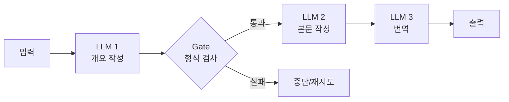

- **언제 쓰나**: 작업이 고정된 하위 단계로 깔끔하게 나뉠 때. 예) 마케팅 문구 작성 → 번역, 문서 개요 → 개요 검증 → 본문 작성.
- **트레이드오프**: 각 호출이 쉬워져 정확도가 오르는 대신 **지연이 단계 수만큼 늘어납니다.** 앞 단계의 실수가 뒤로 전파되므로 gate가 중요합니다.

### Routing

**개념**: 입력을 먼저 **분류**하고, 유형에 맞는 전용 프롬프트·도구·모델로 보냅니다. 관심사를 분리해 한 프롬프트가 모든 경우를 떠안지 않게 합니다.

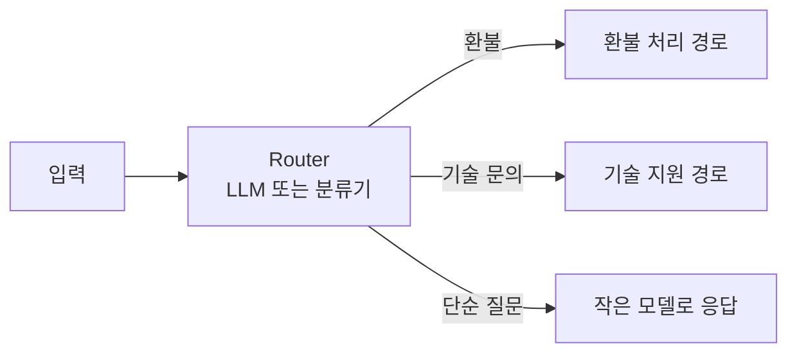

- **언제 쓰나**: 범주가 뚜렷하고 범주별 최적 처리가 다를 때. 쉬운 질문은 작고 싼 모델로, 어려운 질문은 큰 모델로 보내는 **모델 라우팅**도 같은 패턴입니다.
- **트레이드오프**: 분류가 틀리면 뒤 단계가 아무리 좋아도 틀립니다. 분류 정확도를 따로 측정하고, 애매한 입력을 받는 기본 경로를 두세요. → [모델 라우팅 시스템](/ai/advanced/agent/AGENT/05-모델-라우팅-시스템)

### Parallelization

**개념**: 두 가지 변형이 있습니다.

- **Sectioning**: 독립적인 하위 작업을 **동시에** 실행하고 결과를 합칩니다.
- **Voting**: 같은 작업을 **여러 번** 실행해 다양한 결과를 얻고 투표·집계합니다.

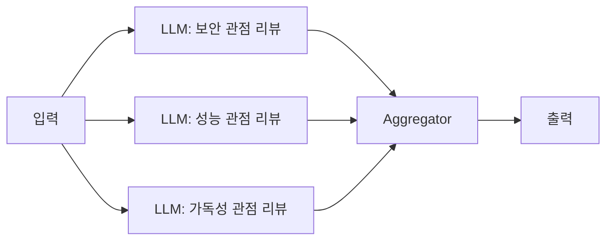

- **언제 쓰나**: 하위 작업이 서로 의존하지 않아 속도를 올릴 수 있을 때, 또는 여러 관점·여러 시도로 신뢰도를 높이고 싶을 때. 예) 한 모델은 답변을 만들고 다른 모델은 동시에 부적절한 요청인지 검사하는 가드레일, 코드 취약점을 여러 번 검사해 하나라도 걸리면 표시.
- **트레이드오프**: 벽시계 시간은 줄지만 **비용은 병렬 수만큼 곱해집니다.** 결과를 합치는 규칙(다수결, 하나라도 걸리면 차단 등)을 명확히 정해야 합니다.

### Orchestrator-Workers

**개념**: 중앙 **Orchestrator LLM**이 입력을 보고 필요한 하위 작업을 **그때그때 결정**해 Worker LLM에 위임하고 결과를 종합합니다. Parallelization과 모양은 비슷하지만 **하위 작업이 미리 정해져 있지 않다**는 점이 다릅니다.

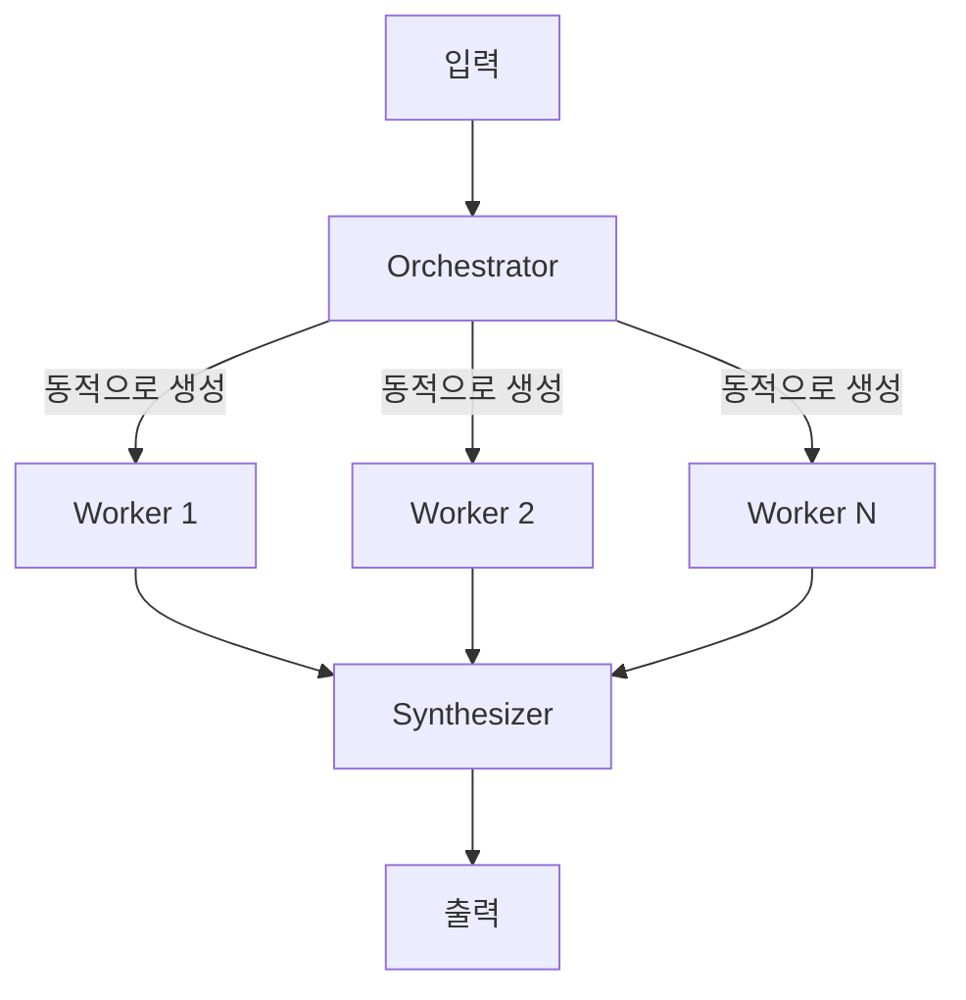

- **언제 쓰나**: 몇 개의, 어떤 하위 작업이 필요한지 입력에 따라 달라질 때. 예) 여러 파일을 수정해야 하는 코딩 작업, 여러 출처를 조사해야 하는 리서치.
- **트레이드오프**: 유연하지만 Orchestrator의 분해 품질에 전체가 좌우됩니다. Worker에게 넘기는 지시가 모호하면 중복 작업이나 누락이 생깁니다.

### Evaluator-Optimizer

**개념**: 한 LLM이 결과를 **생성**하고 다른 LLM(또는 같은 모델의 다른 프롬프트)이 **평가·피드백**하며, 기준을 통과할 때까지 반복합니다. 사람 작가가 편집자의 피드백을 받아 고쳐 쓰는 과정과 같습니다.

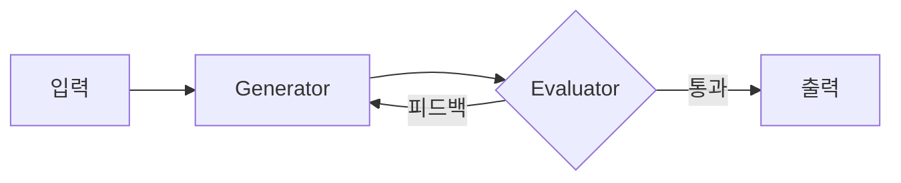

- **언제 쓰나**: **평가 기준이 명확**하고, 피드백을 주면 실제로 결과가 좋아질 때. 예) 뉘앙스가 중요한 문학 번역, 여러 차례 검색이 필요한 복잡한 조사.
- **트레이드오프**: 반복 횟수만큼 비용과 지연이 늘어납니다. **최대 반복 횟수**를 반드시 두세요. 평가자가 생성자와 같은 모델이면 같은 실수를 못 잡을 수 있으므로, 가능하면 테스트 실행 같은 **객관적 검증**을 평가에 섞습니다. → [LLM-as-a-Judge](/ai/07-evaluation/02-llm-judge)

## Agent 패턴

### ReAct (Reason + Act)

**개념**: 모델이 **Thought(생각) → Action(도구 호출) → Observation(결과 관찰)** 을 반복하며 목표에 다가갑니다. 생각만 하는 CoT와 달리 외부 정보를 보고 계획을 수정할 수 있고, 행동만 하는 방식과 달리 왜 그 행동을 했는지가 남습니다. ([Yao et al., 2022](https://arxiv.org/abs/2210.03629))

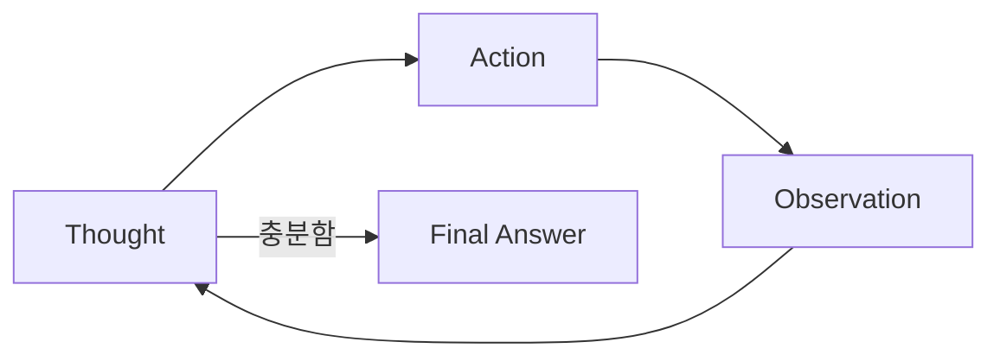

- **언제 쓰나**: 필요한 단계 수를 미리 알 수 없는 탐색형 작업. 오늘날 대부분의 도구 사용 Agent(코딩 Agent 포함)의 기본 루프입니다.
- **트레이드오프**: 매 단계 LLM을 호출하므로 느리고 비쌉니다. 같은 행동을 반복하는 루프에 빠질 수 있어 **최대 스텝 수, 동일 호출 반복 감지**가 필요합니다.

> 요즘은 "Thought:/Action:" 텍스트를 파싱하지 않고, 모델의 **네이티브 도구 호출**([Function Calling](./03-function-calling))로 같은 루프를 구현합니다.

**ReWOO(Reasoning WithOut Observation)** 는 ReAct의 변형으로, 도구 결과를 보기 전에 **필요한 도구 호출 계획을 한 번에 전부 세우고** 실행한 뒤 마지막에 종합합니다. LLM 호출 수가 줄어 토큰을 아끼지만, 중간 결과에 따라 계획을 바꾸기 어렵습니다. ([Xu et al., 2023](https://arxiv.org/abs/2305.18323))

### Reflection (Self-Reflection)

**개념**: 모델이 자기 결과를 **비판(critique)** 하고 그 피드백을 바탕으로 다시 시도합니다. Evaluator-Optimizer를 Agent 한 명이 스스로 수행하는 형태이며, 실패 경험을 언어로 요약해 다음 시도의 메모리로 쓰는 [Reflexion](https://arxiv.org/abs/2303.11366), 초안을 반복 개선하는 [Self-Refine](https://arxiv.org/abs/2303.17651)이 대표적입니다.

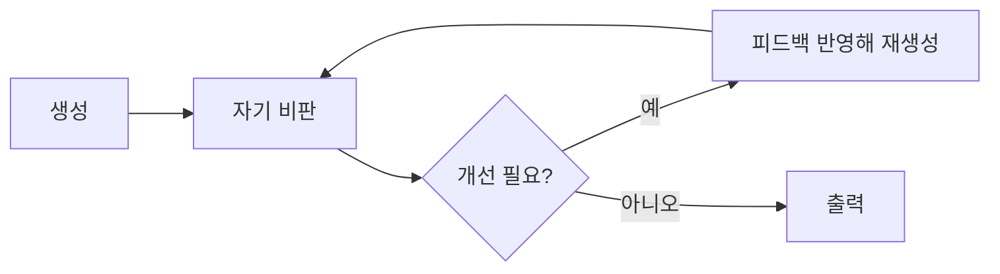

두 방식을 흐름으로 비교하면 다음과 같습니다.

```text
Thinking(연속 추론):   LLM ⇒ Thought1 ⇒ Action1 ⇒ Thought2 ⇒ Action2 ⇒ End
Self-Reflection:       LLM ⇒ Thought1 ⇒ Action1 ⇒ [LLM 재평가] ⇒ Thought2 ⇒ Action2 ⇒ [LLM 재평가] ⇒ End
```

- **언제 쓰나**: 1차 결과의 품질 편차가 크고, 무엇이 틀렸는지 모델이 알아볼 수 있는 작업. 예) 코드 작성 후 테스트 실패 메시지를 보고 수정.
- **트레이드오프**: 외부 신호 없이 순수 자기 평가만 하면 **틀린 답을 그럴듯하게 정당화**하기도 합니다. 테스트 결과, 린터, 검색 결과 같은 **외부 근거**가 있을 때 효과가 큽니다.

### Planning (Plan-and-Execute)

**개념**: 실행에 들어가기 전에 **전체 계획을 먼저 세우고**, 단계별로 실행하며, 결과에 따라 **재계획**합니다. 계획 담당(보통 강한 모델)과 실행 담당(더 작은 모델이나 단일 작업 Agent)을 나누기도 합니다.

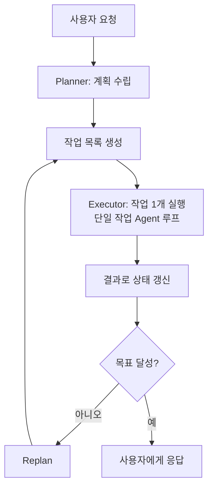

- **언제 쓰나**: 단계가 많고 긴 작업, 사용자가 실행 전에 계획을 검토해야 하는 작업. 명시적 계획은 **투명성**(무엇을 하려는지 보임)과 **중간 개입**을 가능하게 합니다.
- **트레이드오프**: 초기 계획이 틀리면 실행이 헛돕니다. 환경이 자주 바뀌면 재계획 비용이 커지므로, 계획은 "목표·입력·도구·권한·실패 처리" 수준으로 두고 세부는 실행 중에 정하게 합니다. → [작업 실행 전 계획 생성](/ai/advanced/agent/AGENT/09-작업-실행-전-계획-생성), [목표 변경 시 폐기 판정](/ai/advanced/agent/AGENT/46-목표-변경-시-폐기-판정-DAG)

**Self-Ask**는 가벼운 계획 기법으로, 모델이 원래 질문을 풀기 위해 필요한 **후속 질문을 스스로 만들고** 하나씩 답(필요하면 검색)한 뒤 최종 답을 조합합니다. 다단계 질문에 적합합니다.

### Human-in-the-loop

**개념**: Agent가 **되돌릴 수 없거나 위험한 행동 직전에 멈추고** 사람에게 승인·수정·거부를 받습니다. 사람이 중간 결과를 편집하거나, Agent가 정보가 부족할 때 사람에게 되묻는 것도 포함합니다.

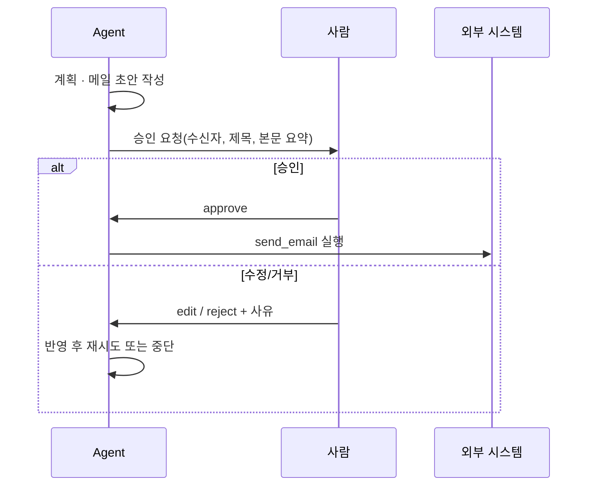

- **언제 쓰나**: 메일 발송, 결제, 데이터 삭제, 배포처럼 결과가 현실 세계에 남는 행동. 저위험 읽기 작업은 자동으로 두고 **위험 등급에 따라서만** 확인합니다.
- **트레이드오프**: 사람이 병목이 됩니다. 매 단계 물어보면 사용자가 내용을 읽지 않고 승인 버튼만 누르게 되므로, **확인 지점은 적게, 확인 내용은 구조화해서** 보여줘야 합니다. 대기 중에 상태를 저장하고 나중에 재개할 수 있어야 합니다. → [사람 확인 지점 배치](/ai/advanced/agent/AGENT/17-사람-확인-지점-배치), [일시정지 후 작업 재개](/ai/advanced/agent/AGENT/27-일시정지-후-작업-재개)

### Multi-Agent (Supervisor / Handoff)

**개념**: 역할이 다른 여러 Agent가 협업합니다. 대표적인 두 구조가 있습니다.

| 구조 | 동작 | 제어권 | 예 |
|---|---|---|---|
| **Supervisor(계층형)** | 상위 Agent가 하위 Agent를 **도구처럼 호출**하고 결과를 받아 종합 | 항상 Supervisor에 있음 | 리서치 리드가 검색 Agent 여러 개에 조사를 맡김 |
| **Handoff(인계형)** | 현재 Agent가 대화의 **제어권 자체를 다른 Agent에게 넘김** | 인계받은 Agent로 이동 | 고객센터 Agent → 환불 전문 Agent로 전환 |

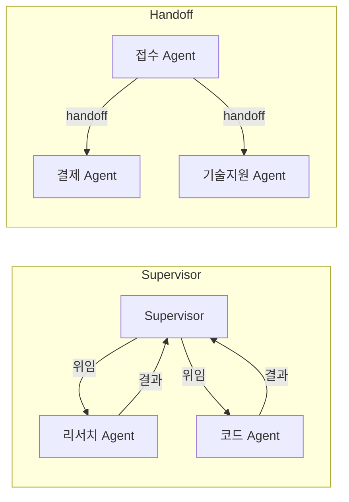

- **언제 쓰나**: 한 Agent의 도구·지시문이 너무 커져 선택이 흔들릴 때, 병렬로 넓게 탐색해야 할 때, 역할별로 권한을 분리해야 할 때.
- **트레이드오프**: 토큰이 크게 늘고(Anthropic 사례에서 채팅 대비 약 15배), Agent 사이 **인계 과정에서 정보가 새거나 넘쳐** 문제가 생깁니다. 인계할 때는 전체 이력이 아니라 **목표·확인된 사실·제약·권한·기대 출력**을 구조화해서 넘기세요. → [멀티 Agent Handoff](/ai/advanced/agent/AGENT/26-멀티Agent-Handoff)

> ⚠️ **함정**: 역할 이름(PM Agent, 개발자 Agent, QA Agent)만 나누고 **각자의 입력·출력·완료 조건**을 정의하지 않으면 협업이 되지 않습니다. Agent끼리 서로 확인만 주고받거나 같은 일을 중복하는 일이 흔합니다. 역할과 책임, 넘겨받을 산출물의 형식을 프롬프트에 명시하세요.

## 패턴 선택 순서

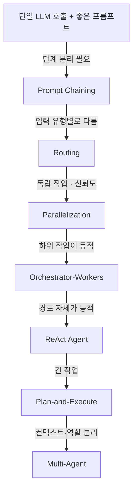

어느 단계에서든 **위험한 행동에는 Human-in-the-loop**, **품질 편차가 크면 Evaluator-Optimizer/Reflection**을 덧붙입니다.

## 참고 자료

- [Anthropic — Building effective agents](https://www.anthropic.com/engineering/building-effective-agents)
- [Anthropic — How we built our multi-agent research system](https://www.anthropic.com/engineering/multi-agent-research-system)
- [OpenAI Agents SDK — Handoffs](https://openai.github.io/openai-agents-python/handoffs/)
- [LangGraph — Multi-agent systems](https://langchain-ai.github.io/langgraph/concepts/multi_agent/)
- [LangChain — Plan-and-Execute Agents](https://blog.langchain.com/planning-agents/)
- [Cognition — Don't Build Multi-Agents](https://cognition.ai/blog/dont-build-multi-agents)
- [Agentic Patterns 카탈로그](https://www.agentic-patterns.com/)
- [ReAct](https://arxiv.org/abs/2210.03629) · [ReWOO](https://arxiv.org/abs/2305.18323) · [Reflexion](https://arxiv.org/abs/2303.11366) · [Self-Refine](https://arxiv.org/abs/2303.17651) · [Plan-and-Solve](https://arxiv.org/abs/2305.04091)
