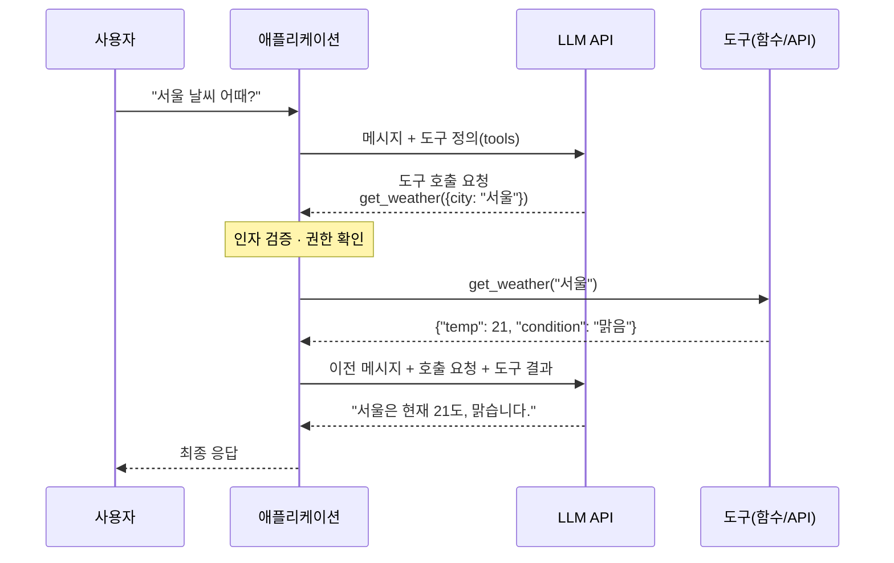

# Function Calling

Function Calling(Tool Use)은 LLM이 외부 함수·API를 쓸 수 있게 하는 메커니즘입니다. 핵심은 **모델이 함수를 실행하지 않는다는 것**입니다. 모델은 "어떤 함수를 어떤 인자로 부르고 싶다"는 **호출 의도를 구조화된 데이터로 반환**할 뿐이고, 실제 실행·권한 검사·결과 반환은 애플리케이션 코드가 합니다.

## 개념

LLM은 텍스트를 생성하는 모델이라 스스로 DB를 조회하거나 메일을 보낼 수 없습니다. Function Calling은 이 한계를 이렇게 풉니다.

1. 개발자가 **사용 가능한 도구 목록**(이름·설명·파라미터 스키마)을 요청에 함께 보냅니다.
2. 모델은 사용자 요청의 의미를 파악해 **도구가 필요한지, 어떤 도구를, 어떤 인자로** 부를지 판단합니다.
3. 필요하면 일반 텍스트 대신 `{"name": "get_weather", "arguments": {"city": "서울"}}` 같은 **구조화된 호출 요청**을 반환합니다.
4. 애플리케이션이 그 요청을 검증하고 실제 함수를 실행한 뒤, 결과를 다시 모델에 넣습니다.
5. 모델은 결과를 보고 최종 답을 만들거나, 다른 도구를 또 호출합니다.

정보가 부족하면(예: 도시 이름이 없음) 모델은 도구를 부르지 않고 **사용자에게 되묻는 것**도 선택할 수 있습니다. 이 루프를 반복하는 것이 곧 [Agent](./01-agent)의 핵심 루프입니다.

> ⚠️ **함정**: "모델이 API를 호출했다"는 표현 때문에 모델에게 권한이 있다고 착각하기 쉽습니다. **실행권은 항상 코드에 있습니다.** 그래서 권한 검사, 인자 검증, 사람 승인은 프롬프트가 아니라 도구를 실행하는 코드에서 해야 합니다. 모델이 만든 인자는 사용자 입력과 똑같이 **신뢰할 수 없는 입력**으로 취급하세요.

## 호출 흐름



LLM API는 **상태가 없으므로**, 두 번째 요청에는 원래 질문·모델의 호출 요청·도구 결과를 **모두 다시 보내야** 합니다. 호출 요청마다 붙는 ID로 어떤 결과가 어떤 호출에 대한 것인지 연결합니다.

## 도구 스키마

도구는 **이름, 설명, 파라미터(JSON Schema)** 세 가지로 정의합니다. 모델은 코드가 아니라 **이 텍스트만 보고** 도구를 고르고 인자를 채웁니다.

```json
{
  "name": "search_orders",
  "description": "고객의 주문 목록을 조회한다. 주문 상태나 배송 여부를 물을 때 사용한다. 주문 취소·환불에는 사용하지 않는다.",
  "parameters": {
    "type": "object",
    "properties": {
      "customer_id": {
        "type": "string",
        "description": "고객 ID. 'C-' 로 시작한다. 예: C-10293"
      },
      "status": {
        "type": "string",
        "enum": ["pending", "shipped", "delivered", "cancelled"],
        "description": "특정 상태만 조회할 때 지정. 생략하면 전체"
      },
      "limit": {
        "type": "integer",
        "minimum": 1,
        "maximum": 50,
        "description": "최대 반환 개수. 기본 10"
      }
    },
    "required": ["customer_id"],
    "additionalProperties": false
  }
}
```

제공자마다 필드 이름이 조금씩 다를 뿐 구조는 같습니다.

| 항목 | Anthropic Messages API | OpenAI Responses API |
|---|---|---|
| 도구 정의 | `{name, description, input_schema}` | `{type: "function", name, description, parameters}` |
| 모델의 호출 요청 | content 블록 `type: "tool_use"` (`id`, `name`, `input`) | output 항목 `type: "function_call"` (`call_id`, `name`, `arguments` JSON 문자열) |
| 결과 반환 | user 메시지에 `type: "tool_result"` (`tool_use_id`, `content`) | 입력 항목 `type: "function_call_output"` (`call_id`, `output`) |
| 호출 발생 신호 | `stop_reason: "tool_use"` | output에 `function_call` 항목 존재 |
| 스키마 엄격 준수 | 도구에 `strict: true` | 도구에 `strict: true` |

## 예시

### 제공자 중립 의사 코드

```python
TOOLS = {"search_orders": search_orders, "get_weather": get_weather}

messages = [{"role": "user", "content": "C-10293 고객의 배송 중인 주문 보여줘"}]

while True:
    response = llm.chat(messages=messages, tools=TOOL_SCHEMAS)
    messages.append(response.message)

    if not response.tool_calls:          # 호출 요청이 없으면 최종 답
        print(response.text)
        break

    for call in response.tool_calls:     # 여러 개가 올 수 있다(병렬 호출)
        try:
            args = validate(call.name, call.arguments)   # 스키마 + 업무 규칙 검증
            authorize(current_user, call.name, args)     # 권한 검사
            result = TOOLS[call.name](**args)
            messages.append(tool_result(call.id, result))
        except Exception as e:
            messages.append(tool_result(call.id, f"오류: {e}", is_error=True))
```

### Anthropic Python SDK

```python
import json
import anthropic

client = anthropic.Anthropic()

tools = [{
    "name": "get_weather",
    "description": "도시의 현재 날씨를 조회한다. 사용자가 날씨·기온을 물을 때 사용한다.",
    "input_schema": {
        "type": "object",
        "properties": {
            "city": {"type": "string", "description": "도시 이름. 예: 서울"},
        },
        "required": ["city"],
        "additionalProperties": False,
    },
    "strict": True,
}]

messages = [{"role": "user", "content": "서울이랑 부산 날씨 알려줘"}]

while True:
    response = client.messages.create(
        model="claude-opus-5",
        max_tokens=16000,
        tools=tools,
        messages=messages,
    )
    if response.stop_reason != "tool_use":
        break

    # 모델의 응답(tool_use 블록 포함)을 그대로 이력에 추가
    messages.append({"role": "assistant", "content": response.content})

    # 병렬 호출 결과는 하나의 user 메시지에 모아서 반환
    tool_results = []
    for block in response.content:
        if block.type == "tool_use":
            result = get_weather(**block.input)          # 실제 실행은 내 코드(dict 반환)
            tool_results.append({
                "type": "tool_result",
                "tool_use_id": block.id,
                "content": json.dumps(result, ensure_ascii=False),
            })
    messages.append({"role": "user", "content": tool_results})

print(next(b.text for b in response.content if b.type == "text"))
```

직접 루프를 쓰는 대신 Anthropic SDK의 Tool Runner(Python은 `client.beta.messages.tool_runner`)나 [LangChain](/ai/09-tools/03-langchain) 같은 프레임워크가 이 루프를 대신 돌려 주기도 합니다. 동작을 이해하려면 한 번은 직접 작성해 보는 것을 권합니다.

## 병렬 호출과 tool_choice

### 병렬 호출

"서울이랑 부산 날씨"처럼 서로 독립적인 호출은 모델이 **한 응답에 여러 호출 요청**을 담아 보낼 수 있습니다. 코드는 이를 동시에 실행하고 **모든 결과를 한 번에** 돌려주면 됩니다.

> ⚠️ **함정**: Anthropic API에서 병렬 호출 결과를 여러 user 메시지로 **나눠서 보내면**, 모델이 이후 병렬 호출을 덜 하게 됩니다. 결과는 반드시 한 메시지에 모으고, 실패한 호출도 빼지 말고 에러 결과로 채워 넣으세요. 모든 호출 ID에 대응하는 결과가 없으면 요청 자체가 거부될 수 있습니다.

순서가 중요하거나(조회 후 수정) 동시 실행이 위험하면 병렬 호출을 끕니다: Anthropic은 `tool_choice`에 `disable_parallel_tool_use: true`, OpenAI는 `parallel_tool_calls: false`.

### tool_choice

| 의도 | Anthropic | OpenAI | 쓰임 |
|---|---|---|---|
| 모델이 알아서 판단 (기본) | `{"type": "auto"}` | `"auto"` | 대부분의 경우 |
| 반드시 도구 하나 이상 호출 | `{"type": "any"}` | `"required"` | 도구 호출이 곧 목적인 파이프라인 |
| 특정 도구를 강제 | `{"type": "tool", "name": "..."}` | `{"type": "function", "name": "..."}` | 추출 전용 단계 |
| 도구 사용 금지 | `{"type": "none"}` | `"none"` | 도구 정의는 유지한 채 이번 턴만 텍스트로 |

> ⚠️ **함정**: 강제 호출(`any`/`tool`)은 모델이 "정보가 부족하니 되묻겠다"는 선택을 할 수 없게 만듭니다. 빈 값이나 추측한 값으로 인자를 채우는 원인이 됩니다. 또한 일부 최신 모델은 강제 호출 자체를 지원하지 않으니 사용 전에 모델 문서를 확인하세요.

## 구조화 출력과의 차이

둘 다 JSON을 받는다는 점에서 헷갈리지만 **목적이 다릅니다.**

| 구분 | 구조화 출력 (Structured Outputs) | Function Calling |
|---|---|---|
| 해결하는 문제 | 응답 **형식**을 스키마에 맞추기 | 외부 **행동**을 통제된 방식으로 일으키기 |
| 결과물 | 모델의 최종 답 자체가 JSON | "이 함수를 이 인자로 불러 달라"는 요청 |
| 이후 흐름 | 코드가 읽고 끝 | 코드가 실행 → 결과를 모델에 되돌림 → 루프 |
| 설정 위치 | 응답 형식 파라미터 (예: Anthropic `output_config.format`) | `tools` 목록 |
| 대표 용도 | 분류, 정보 추출, UI에 뿌릴 데이터 | DB 조회, 주문 생성, 메일 발송, 검색 |

**판단 기준은 간단합니다. 결과가 현실 세계를 읽거나 바꾸면 Function Calling, 모델 답의 모양만 맞추면 구조화 출력**입니다. 둘을 함께 쓸 수도 있습니다(도구로 조회하고, 최종 답은 스키마에 맞춰 반환).

과거에는 JSON을 안정적으로 받으려고 "추출 전용 도구를 만들어 강제 호출"하는 우회를 썼지만, 지금은 주요 제공자가 **스키마를 강제하는 구조화 출력(constrained decoding)** 과 도구의 `strict` 모드를 지원하므로 그 우회는 대부분 필요 없습니다. 더 깊은 비교는 [JSON 출력과 Function Calling의 차이](/ai/advanced/agent/AGENT/12-JSON출력과-Function-Calling-차이)와 [JSON 안정 출력 — 4층 방어선](/ai/advanced/agent/AGENT/13-JSON-안정-출력-4층-방어선)을 보세요.

## 설계 원칙

모델에게 도구 정의는 **유일한 사용 설명서**입니다. Anthropic은 이를 사람용 UI(HCI)만큼 공들여야 하는 **ACI(Agent-Computer Interface)** 라고 부릅니다.

### 이름

- **동사_대상** 형태로 무엇을 하는지 드러냅니다: `search_orders`, `cancel_order`.
- 비슷한 도구가 여럿이면 접두어로 묶습니다: `github_create_issue`, `jira_create_issue`.
- `process`, `handle`, `do_action`처럼 모호한 이름은 피합니다.

### 설명

- **무엇을 하는지 + 언제 쓰는지 + 언제 쓰지 않는지**를 씁니다. 신입 동료에게 설명하듯 씁니다.
- 반환값의 모양, 부작용(데이터 변경 여부), 제약(최대 개수, 느림)을 적습니다.

```text
// 나쁨
"주문 처리"

// 좋음
"주문을 취소한다. 결제 완료 후 출고 전 상태에서만 가능하다.
 이미 출고된 주문은 request_return 을 사용한다.
 되돌릴 수 없으므로 사용자에게 확인받은 뒤 호출한다."
```

### 파라미터

- `enum`, `minimum/maximum`, `format`으로 **가능한 값을 스키마에서 좁힙니다.** 설명으로 부탁하는 것보다 확실합니다.
- 필드마다 `description`과 **예시 값**을 둡니다. 형식이 있는 값(ID, 날짜)은 특히 중요합니다.
- 필수 값은 `required`에, 추가 필드는 `additionalProperties: false`로 막습니다.
- 모델이 헷갈리기 쉬운 형식은 피합니다. 상대 경로보다 절대 경로, 모호한 `date`보다 `"YYYY-MM-DD"`.
- 파라미터가 너무 많으면 도구를 쪼갭니다. 반대로 항상 연달아 호출되는 도구들은 하나로 합칩니다.

### 도구 개수와 결과

- 도구가 많아질수록 **선택 정확도가 떨어지고 컨텍스트를 차지**합니다. 역할이 겹치는 도구는 정리하고, 수십 개가 필요하면 필요할 때만 불러오는 방식(도구 검색, [Skill](/ai/03-prompt/06-skill))을 고려합니다.
- 도구 결과는 **모델이 다음 판단에 필요한 만큼만** 돌려줍니다. 수천 줄짜리 원본 JSON 대신 핵심 필드를 추리고, 긴 목록은 페이지네이션합니다.

> ⚠️ **함정**: 기존 REST API를 그대로 1:1 도구로 노출하면 대부분 잘 동작하지 않습니다. API는 프로그램이 조합하기 좋게 잘게 쪼개져 있지만, 모델에게는 **작업 단위**(예: "일정 잡기" = 참석자 조회 + 빈 시간 찾기 + 이벤트 생성)가 더 쓰기 쉽습니다.

더 자세한 설계 기준은 [Agent가 호출할 도구를 아는 법](/ai/advanced/agent/AGENT/10-Agent가-호출할-도구를-아는-법)과 [도구 호출 Schema 설계](/ai/advanced/agent/AGENT/11-도구-호출-Schema-설계)를 참고하세요.

## 에러 처리

에러는 **모델이 스스로 고칠 수 있는 에러**와 **코드가 처리해야 하는 에러**로 나눕니다.

| 유형 | 예 | 처리 |
|---|---|---|
| **인자 오류** | 스키마 위반, 날짜 형식 틀림, 존재하지 않는 ID | 무엇이 왜 틀렸는지 에러 결과로 반환 → 모델이 수정해 재호출 |
| **업무 규칙 위반** | 출고된 주문 취소 시도 | 규칙과 대안을 담아 반환: "이미 출고됨. request_return 사용" |
| **권한 거부** | 다른 고객 주문 조회 | 거부 사실만 반환, 내부 정보는 노출하지 않음 |
| **일시 장애** | 타임아웃, 429, 5xx | 코드에서 백오프 재시도. 반복 실패 시에만 모델에 알림 |
| **알 수 없는 도구** | 모델이 없는 도구 이름을 만들어냄 | 사용 가능한 도구 목록과 함께 에러 반환 |

```python
{
    "type": "tool_result",
    "tool_use_id": block.id,
    "content": "오류: order_id 'O-99' 를 찾을 수 없습니다. 주문 ID는 'O-' 뒤에 8자리 숫자입니다.",
    "is_error": True,
}
```

- 에러 메시지는 **사람이 아니라 모델이 읽는다**고 생각하고, 다음에 무엇을 해야 하는지 알려줍니다. 스택 트레이스를 그대로 넘기지 마세요.
- 같은 호출이 같은 에러로 반복되면 루프를 끊는 **최대 재시도 횟수**를 둡니다.
- 쓰기 작업은 재시도 전에 **멱등성**을 확인합니다. 타임아웃이 났어도 실제로는 주문이 생성됐을 수 있습니다. → [도구 호출 실패, 재시도인가 보상인가](/ai/advanced/agent/AGENT/19-도구-호출-실패-재시도인가-보상인가)

> ⚠️ **함정**: 도구가 HTTP 200을 반환했다고 작업이 성공한 것은 아닙니다. 응답 본문에 실패가 담겨 있거나, 결과가 비어 있거나, 다른 대상이 바뀌었을 수 있습니다. 중요한 쓰기 작업은 **결과를 다시 조회해 검증**하세요. → [200 응답과 Agent 작업 실패](/ai/advanced/agent/AGENT/20-200-응답과-Agent-작업-실패)

## RAG vs Function Calling

| 구분 | [RAG](/ai/04-rag/01-rag) | Function Calling |
|---|---|---|
| 목적 | 모델에 **지식**을 공급 | 모델이 **행동**을 요청 |
| 데이터 신선도 | 인덱스 갱신 주기에 의존(지연 가능) | 실시간·준실시간(API 직접 호출) |
| 누가 검색을 결정하나 | 보통 코드가 매 요청마다 검색 | 모델이 필요할 때 호출 |
| 구현 복잡도 | 청킹·임베딩·검색 파이프라인 구축 | 명확한 인터페이스와 파라미터 정의 |
| 부작용 | 없음(읽기 전용) | 있을 수 있음(쓰기·결제·발송) |
| 적합한 시나리오 | 정적인 지식(문서, FAQ, 정책) | 동적인 상호작용(주문 조회, 날씨, 예약) |

둘은 경쟁 관계가 아닙니다. **검색 자체를 도구로 노출**(`search_docs`)하면 모델이 필요할 때만, 필요한 검색어로 RAG를 호출하는 Agentic RAG가 됩니다.

여러 애플리케이션에서 같은 도구를 재사용하고 싶다면 도구를 표준 프로토콜로 노출하는 [MCP](./05-mcp)를 보세요.

## 참고 자료

- [Anthropic — Tool use overview](https://platform.claude.com/docs/en/agents-and-tools/tool-use/overview)
- [Anthropic — How to implement tool use](https://platform.claude.com/docs/en/agents-and-tools/tool-use/implement-tool-use)
- [Anthropic — Structured outputs](https://platform.claude.com/docs/en/build-with-claude/structured-outputs)
- [Anthropic — Writing effective tools for agents](https://www.anthropic.com/engineering/writing-tools-for-agents)
- [OpenAI — Function calling](https://developers.openai.com/api/docs/guides/function-calling)
- Agent 심화: [10. 도구를 아는 법](/ai/advanced/agent/AGENT/10-Agent가-호출할-도구를-아는-법) · [11. Schema 설계](/ai/advanced/agent/AGENT/11-도구-호출-Schema-설계) · [12. JSON 출력과의 차이](/ai/advanced/agent/AGENT/12-JSON출력과-Function-Calling-차이) · [13. JSON 4층 방어선](/ai/advanced/agent/AGENT/13-JSON-안정-출력-4층-방어선)
