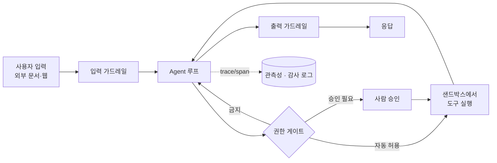

# 프로덕션 Agent

데모 Agent와 프로덕션 Agent의 차이는 모델이 아니라 **주변 장치**에서 납니다. 모델은 언젠가 반드시 틀리므로, **틀렸을 때 피해 범위를 가두고(가드레일·권한·샌드박스), 틀린 것을 발견하고(관측성·평가), 되돌릴 수 있게(사람 승인·감사 로그)** 설계해야 합니다.

## 전체 그림



각 층은 서로를 대체하지 않습니다. **프롬프트에 "위험한 일은 하지 마"라고 쓰는 것은 가드레일이 아닙니다.** 강제는 코드와 인프라에서 해야 합니다.

## 입력 가드레일

모델에 들어가기 **전에** 거르는 검사입니다(pre-guardrail).

| 검사 | 막는 것 | 구현 |
|---|---|---|
| **형식·길이 검증** | 비정상적으로 긴 입력, 깨진 파일 | 코드 검증, 토큰 상한 |
| **주제 이탈 탐지** | 서비스 범위 밖 요청(고객센터 봇에 코딩 요청 등) | 작은 모델 분류기 |
| **프롬프트 인젝션 탐지** | "이전 지시를 무시하고…" 류 공격 | 분류기, 규칙, 입력 격리 |
| **민감정보(PII) 처리** | 주민번호·카드번호 등이 모델·로그로 흘러감 | 정규식·NER로 마스킹 |
| **사용량 제한** | 비용 폭주, 남용 | 사용자별 rate limit, 일일 토큰 예산 |

> ⚠️ **함정**: 인젝션은 **사용자 입력으로만 들어오지 않습니다.** Agent가 읽는 웹 페이지, 이메일, PDF, 이슈 댓글, 도구 결과에 숨은 지시문이 더 위험합니다(간접 프롬프트 인젝션). 외부에서 온 텍스트는 **데이터로 격리**하고(구분자, 별도 역할), 그 내용에 따라 권한 있는 행동을 하지 않도록 설계하세요. → [간접 프롬프트 인젝션](/ai/advanced/agent/AGENT/43-간접-프롬프트-인젝션), [프롬프트 인젝션 방어](/ai/advanced/agent/AGENT/04-Agent-프롬프트-인젝션-방어)

Simon Willison은 **① 비공개 데이터 접근 ② 신뢰할 수 없는 콘텐츠 노출 ③ 외부로 데이터를 보낼 수 있는 능력**, 이 세 가지를 한 Agent가 동시에 가지면 인젝션으로 데이터가 유출될 수 있다고 경고하며 이를 ["lethal trifecta"](https://simonwillison.net/2025/Jun/16/the-lethal-trifecta/)라고 불렀습니다. 탐지 모델은 완벽하지 않으므로, **세 가지 중 하나를 구조적으로 끊는 것**이 가장 확실한 방어입니다.

## 출력 가드레일

모델이 만든 결과를 사용자나 시스템에 넘기기 **전에** 거르는 검사입니다(post-guardrail).

| 검사 | 막는 것 | 구현 |
|---|---|---|
| **형식 검증** | 스키마 불일치, 깨진 JSON | 구조화 출력 + 코드 검증 + 재시도 |
| **근거 확인** | 도구 결과·문서에 없는 사실 생성 | 인용 요구, 원문 대조, LLM 판정 |
| **정책 위반** | 유해 콘텐츠, 경쟁사 비방, 법적 약속 | 모더레이션 API, 규칙 |
| **민감정보 유출** | 다른 사용자 정보, 시스템 프롬프트, 키 | 패턴 탐지, 마스킹 |
| **업무 규칙** | 할인·가격·환불을 모델이 임의로 약속 | 수치는 시스템 값만 사용, 템플릿 강제 |

출력 가드레일은 사용자 응답뿐 아니라 **도구 호출 인자**에도 적용됩니다. 모델이 만든 SQL, 셸 명령, 메일 수신자는 실행 전에 검증해야 합니다.

> ⚠️ **함정**: 가격·재고·잔액 같은 **숫자를 모델이 생성하게 두면 안 됩니다.** 모델은 그럴듯한 숫자를 만들어 냅니다. 숫자는 도구가 반환한 값을 코드가 그대로 끼워 넣고, 모델은 문장만 만들게 하세요. → [전자상거래 Agent의 가격 약속](/ai/advanced/agent/AGENT/48-전자상거래-Agent-가격-약속), [AI 데이터 조작 방지](/ai/advanced/agent/AGENT/29-AI-데이터-조작-방지)

## 권한과 샌드박스

### 최소 권한과 권한 등급

도구 권한은 켜고 끄는 스위치가 아니라 **행동의 위험도에 따른 등급**입니다.

| 등급 | 처리 | 예 |
|---|---|---|
| 1 | 자동 실행 | 조회, 검색, 문서 읽기 |
| 2 | 실행 전 사용자 확인 | 메일 발송, 일정 생성, 설정 변경 |
| 3 | 관리자 승인 | 대량 삭제, 권한 변경, 고액 결제 |
| 4 | 모델 호출 금지 | 운영 DB 스키마 변경, 키 조회 |

- 같은 도구라도 **인자에 따라 위험도가 다릅니다.** `send_email`이 사내 수신자면 2등급, 외부 대량 발송이면 3등급으로 **파라미터 단위**로 판정합니다.
- Agent가 쓰는 자격증명은 **사용자 권한을 넘지 않게** 발급합니다. Agent 전용 서비스 계정에 관리자 권한을 주면 인젝션 한 번으로 전체가 뚫립니다.
- 도구 목록 자체를 작업에 필요한 만큼만 노출합니다. 쓰지 않을 도구는 컨텍스트에 넣지 않습니다.

→ [도구 권한 등급화](/ai/advanced/agent/AGENT/16-도구-권한-등급화)

### 샌드박스

**샌드박스는 모델이 실수하지 않게 하는 장치가 아니라, 실수했을 때 파괴 범위를 제한하는 백스톱**입니다. 코드를 실행하거나 패키지를 설치하는 Agent라면 필수입니다.

| 격리 대상 | 방법 |
|---|---|
| **파일 시스템** | 작업 디렉터리만 쓰기 허용, 홈·SSH 키·설정 파일 차단 |
| **네트워크** | 기본 차단 + 허용 도메인 목록(egress allowlist), 사내망·메타데이터 엔드포인트 차단 |
| **자격증명** | 샌드박스 안에 비밀 값을 두지 않음, 필요한 호출은 외부 프록시에서 주입 |
| **자원** | CPU·메모리·실행 시간 상한, 프로세스 수 제한 |
| **수명** | 작업마다 새 컨테이너/VM, 종료 후 폐기 |

→ [Agent 안전 샌드박스](/ai/advanced/agent/AGENT/47-Agent-안전-샌드박스)

## Human-in-the-loop

사람 확인은 **불가역·고위험·고비용·외부에 영향을 주는 행동 직전**에만 둡니다. 매 단계마다 물으면 사용자는 읽지 않고 승인하게 되고, 결국 확인이 없는 것과 같아집니다.

좋은 승인 요청은 버튼 하나가 아니라 **판단에 필요한 사실 묶음**입니다.

```text
[승인 필요] 메일 발송
- 수신자: 외부 3명 (partner-a.com 2, partner-b.com 1)
- 제목: 3분기 단가 조정 안내
- 첨부: price_q3.xlsx (내부 문서 태그 있음 ⚠️)
- 근거: 사용자 요청 "파트너사에 단가표 보내줘"
[승인] [수정] [거부]
```

- 승인 대기 중에는 **작업 상태를 저장**하고, 승인 후 재개할 때 그사이 데이터가 바뀌지 않았는지 다시 확인합니다.
- 거부·수정 사유는 Agent에 되돌려 다음 행동에 반영하고, 평가 데이터로도 모읍니다.

→ [사람 확인 지점 배치](/ai/advanced/agent/AGENT/17-사람-확인-지점-배치), [일시정지 후 작업 재개](/ai/advanced/agent/AGENT/27-일시정지-후-작업-재개)

## 관측성

Agent는 천연 블랙박스입니다. 최종 답만 남기면 **어디서 시간이 걸렸는지, 왜 그 도구를 골랐는지, 무엇이 실패했는지** 알 수 없습니다.

### Trace와 Span

- **Trace**: 사용자 요청 하나에 대한 **처음부터 끝까지의 전체 작업**
- **Span**: 그 안의 **측정 가능한 각 단계** — LLM 호출, 도구 실행, 검색, handoff, 사람 승인 대기

```text
trace: "주문 #1234 환불 처리"                      총 18.4s
├─ span: llm.chat (plan)                            2.1s  in 3.2k / out 180 tokens
├─ span: tool.get_order                             0.3s  ok
├─ span: llm.chat                                   1.8s
├─ span: tool.refund_policy_search                  4.9s  retry=2  ← 병목
├─ span: human.approval                             8.0s
└─ span: tool.create_refund                         1.3s  ok  refund_id=R-778
```

span마다 남길 것:

| 분류 | 필드 |
|---|---|
| 공통 | trace_id, span_id, 부모 span, 시작·종료 시각, 상태(ok/error) |
| LLM 호출 | 모델 이름, 입력·출력 토큰, 캐시 적중 토큰, 종료 사유, 프롬프트 버전 |
| 도구 호출 | 도구 이름, 인자(마스킹), 결과 요약, 재시도 횟수, 에러 |
| 업무 | 사용자·테넌트 ID, 작업 ID, 생성·변경된 리소스 ID |

- 표준으로는 **OpenTelemetry GenAI semantic conventions**가 모델 호출·도구 실행·Agent 호출 span과 토큰 사용량 속성을 정의하고 있습니다. Langfuse, LangSmith, Arize Phoenix 같은 LLM 관측 도구도 대부분 trace/span 모델을 따릅니다.
- **업무 로그(누가 무엇을 바꿨나)** 와 **모델 로그(프롬프트·응답)** 는 보존 기간과 접근 권한이 다르므로 분리합니다. 되돌릴 수 없는 행동은 별도 **감사 로그**로 남깁니다.

→ [Trace와 Span 관측성](/ai/advanced/agent/AGENT/51-Trace와-Span-관측성), [업무 로그와 모델 로그 구분](/ai/advanced/agent/AGENT/34-업무-로그와-모델-로그-구분), [감사 로그](/ai/advanced/agent/AGENT/35-감사-로그)

## 비용과 지연

Agent는 한 요청에 LLM을 여러 번 호출하고 매번 전체 이력을 다시 보내므로 **비용이 대화 길이에 따라 빠르게 커집니다.**

| 수단 | 효과 | 주의 |
|---|---|---|
| **프롬프트 캐싱** | 반복되는 시스템 프롬프트·도구 정의·이력의 입력 비용과 지연 절감 | 앞부분이 1바이트라도 바뀌면 캐시 무효. 타임스탬프 같은 가변 값은 뒤로 |
| **최대 스텝·토큰 예산** | 무한 루프와 비용 폭주 차단 | 한도 도달 시 부분 결과와 이유를 반환 |
| **모델 라우팅** | 쉬운 단계는 작은 모델, 어려운 판단만 큰 모델 | 작업 완료당 비용으로 비교(싼 모델이 턴을 더 쓰면 손해) |
| **컨텍스트 관리** | 오래된 도구 결과 정리·요약으로 입력 토큰 절감 | 확정된 결정·제약은 요약에서 잃지 않게 |
| **도구 결과 축소** | 필요한 필드만 반환, 페이지네이션 | 너무 줄이면 모델이 재조회 |
| **병렬 도구 호출** | 독립 호출 동시 실행으로 벽시계 시간 절감 | 쓰기 작업은 순서·충돌 확인 |
| **스트리밍·진행 표시** | 체감 지연 감소 | 실제 비용은 그대로 |
| **응답 캐시** | 동일 질문 재계산 방지 | 사용자·시점별로 답이 달라지는 요청에는 부적합 |

→ [모델 다운그레이드 전략](/ai/advanced/agent/AGENT/33-모델-다운그레이드-전략), [응답 캐시 일률 적용 불가](/ai/advanced/agent/AGENT/32-응답-캐시-일률-적용-불가), [컨텍스트 압축에서 잃으면 안 되는 것](/ai/advanced/agent/AGENT/24-컨텍스트-압축에서-잃으면-안-되는-것)

## 실패 유형과 대응

| 증상 | 원인 | 대응 |
|---|---|---|
| **대화·문서가 길어지면 초반 정보나 인용한 내용을 잊는다** | 컨텍스트 과부하, 중간 정보 누락 | 프롬프트에만 의존하지 말고 **메모리 시스템**을 둬서 장기 정보를 저장·검색. 확정 사항은 구조화된 상태로 유지 |
| **적합한 도구를 고르지 못한다** | 도구 설명이 모호하거나 겹침, 도구가 너무 많음 | **도구 메뉴를 명시적으로** 제공하고 이름·설명·사용 시점을 분명히. 역할이 겹치는 도구 통합, 필요한 도구만 노출 |
| **Agent끼리 협업이 안 된다** | 역할·산출물 경계가 불명확 | 프롬프트로 **작업 목표와 범위, 각 Agent의 역할과 책임**을 명확히 정의. 인계 시 구조화된 인계 패키지 사용 |
| **같은 행동을 반복한다(루프)** | 실패 원인을 모델이 이해 못함 | 최대 스텝, 동일 호출 반복 감지, 에러 메시지에 다음 행동 안내 |
| **없는 인자·도구를 지어낸다** | 스키마 제약 부족 | `strict` 스키마, enum, 인자 검증 후 에러 반환 |
| **도구는 200인데 작업은 실패** | 응답 본문 오류, 부분 성공 | 결과 재조회로 사후 검증, 성공 조건을 코드로 판정 |
| **실행할수록 목표에서 이탈** | 요약 과정에서 제약·결정 손실 | 목표·제약을 매 턴 고정 위치에 재주입, 계획 대비 진행 점검 |
| **도구 결과끼리 충돌** | 데이터 소스 신선도·권위 차이 | 소스 우선순위 규칙을 코드로 정의, 충돌 시 사람에게 에스컬레이션 |
| **재시도로 중복 실행** | 쓰기 작업의 멱등성 부재 | 멱등 키, 실행 전 상태 확인, 실패 시 보상 트랜잭션 |

→ [도구 결과 충돌 판정](/ai/advanced/agent/AGENT/18-도구-결과-충돌-판정), [재시도인가 보상인가](/ai/advanced/agent/AGENT/19-도구-호출-실패-재시도인가-보상인가), [200 응답과 Agent 작업 실패](/ai/advanced/agent/AGENT/20-200-응답과-Agent-작업-실패), [요약은 맞는데 실행할수록 이탈](/ai/advanced/agent/AGENT/25-요약은-맞는데-실행할수록-이탈)

## 평가

Agent 평가는 두 축으로 나눕니다.

- **Outcome(결과)**: 현실 세계의 상태가 실제로 바뀌었는가. "예약했습니다"라는 답이 아니라 **DB에 예약이 생겼는지**를 봅니다.
- **Trajectory(경로)**: 어떤 도구를 어떤 순서로, 몇 번 불렀는가. 답은 맞았지만 **불필요한 삭제나 권한 밖 조회를 거쳤다면 실패**로 봅니다.

프로덕션 투입 전에는 실제 요청에서 뽑은 오프라인 평가셋으로 회귀를 막고, 투입 후에는 trace를 샘플링해 온라인으로 평가합니다. 오프라인 평가를 통과해도 실제 트래픽의 입력 분포·외부 시스템 상태가 달라 실패하는 경우가 흔하므로 **둘 다** 필요합니다.

→ [LLM 평가](/ai/07-evaluation/01-evaluation), [LLM-as-a-Judge](/ai/07-evaluation/02-llm-judge), [Outcome과 Trajectory](/ai/advanced/agent/AGENT/52-Outcome과-Trajectory), [결과·경로 이중 평가](/ai/advanced/agent/AGENT/53-결과와-경로-이중-평가), [오프라인 평가 통과 후 프로덕션 이탈](/ai/advanced/agent/AGENT/54-오프라인-평가-통과-후-프로덕션-이탈)

## 출시 체크리스트

- [ ] 성공 기준(Outcome)과 금지 행동이 문서화되어 있다
- [ ] 모든 도구에 권한 등급이 있고, 쓰기 도구는 인자 검증과 멱등성을 갖췄다
- [ ] 외부 콘텐츠를 읽는 Agent는 외부 전송 능력이 제한되어 있다
- [ ] 코드 실행·파일 조작은 샌드박스에서만 일어난다
- [ ] 되돌릴 수 없는 행동 앞에 구조화된 사람 승인이 있다
- [ ] 최대 스텝·토큰·시간 예산과 한도 도달 시 동작이 정의되어 있다
- [ ] 모든 요청이 trace로 남고, 되돌릴 수 없는 행동은 감사 로그가 있다
- [ ] 오프라인 평가셋(정상·엣지·공격 케이스)을 통과했고 온라인 평가 경로가 있다
- [ ] 모델·프롬프트 변경 시 되돌릴 수 있게 버전이 관리된다

## 참고 자료

- [Anthropic — Building effective agents](https://www.anthropic.com/engineering/building-effective-agents)
- [Anthropic — Effective context engineering for AI agents](https://www.anthropic.com/engineering/effective-context-engineering-for-ai-agents)
- [OpenAI — A practical guide to building agents (PDF)](https://cdn.openai.com/business-guides-and-resources/a-practical-guide-to-building-agents.pdf)
- [OpenAI Agents SDK — Guardrails](https://openai.github.io/openai-agents-python/guardrails/)
- [OWASP Top 10 for LLM Applications](https://genai.owasp.org/llm-top-10/) — 특히 Prompt Injection, Excessive Agency
- [Simon Willison — The lethal trifecta for AI agents](https://simonwillison.net/2025/Jun/16/the-lethal-trifecta/)
- [OpenTelemetry — GenAI semantic conventions](https://github.com/open-telemetry/semantic-conventions-genai)
- [Agent 심화 시리즈 전체 목차](/ai/advanced/agent/AGENT)
