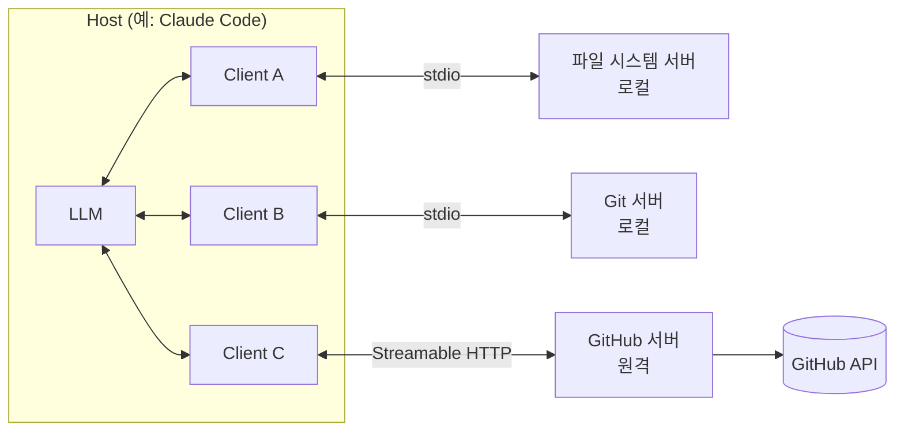

# Model Context Protocol (MCP)

MCP(Model Context Protocol)는 **AI 애플리케이션을 외부 데이터·도구에 연결하는 방식을 표준화한 오픈 프로토콜**입니다. 도구를 한 번 MCP 서버로 만들면 Claude Code, Cursor, ChatGPT, VS Code 같은 여러 클라이언트에서 그대로 재사용할 수 있습니다. 흔히 "AI용 USB-C"에 비유합니다.

Anthropic이 2024년 11월 공개했고, 2025년 12월 Linux Foundation 산하 **Agentic AI Foundation(AAIF)** 에 기증되어 벤더 중립 프로젝트로 운영됩니다.

## 왜 필요한가

MCP 이전에는 AI 애플리케이션마다 데이터 소스마다 연결 코드를 따로 짰습니다. **M개의 애플리케이션 × N개의 데이터 소스 = M×N개의 통합**이 필요했고, 모델이나 앱을 바꿀 때마다 같은 연결을 다시 만들었습니다. 표준 프로토콜이 생기면 각자 한 번씩만 구현하면 되므로 **M+N**으로 줄어듭니다.

| 구분 | MCP 이전 | MCP 이후 |
|---|---|---|
| 통합 수 | M × N | M + N |
| 도구 재사용 | 앱마다 다시 구현 | 서버 하나를 여러 클라이언트가 공유 |
| 권한 통제 | 앱 코드 곳곳에 흩어짐 | 서버가 노출할 능력과 범위를 선언 |

### 사용 사례

- 개인 비서 Agent가 사용자의 Google 캘린더와 Notion에 접근해 더 개인화된 도움을 줍니다.
- Claude Code가 Figma 디자인을 읽어 웹 앱 화면을 생성합니다.
- 사내 챗봇이 조직의 여러 데이터베이스에 연결되어, 사용자가 대화로 데이터를 분석합니다.
- AI가 Blender에서 3D 모델을 만들고 3D 프린터로 출력합니다.

> ⚠️ **함정**: MCP는 [Function Calling](./03-function-calling)을 대체하지 않습니다. 모델은 여전히 Function Calling으로 도구를 호출하고, MCP는 **그 도구 목록을 어디서 가져와 어떻게 실행할지**를 표준화할 뿐입니다. 한 애플리케이션 안에서만 쓰는 도구 몇 개라면 MCP 없이 직접 정의하는 편이 단순합니다.

## 아키텍처: Host · Client · Server

MCP는 [JSON-RPC 2.0](https://www.jsonrpc.org/) 메시지로 통신하며, 세 역할로 구성됩니다. 구조는 에디터와 언어 서버를 표준화한 LSP(Language Server Protocol)에서 영감을 받았습니다.

| 역할 | 설명 | 예 |
|---|---|---|
| **Host** | 사용자가 쓰는 LLM 애플리케이션. 여러 클라이언트를 관리하고 모델과 대화하며, 사용자 동의와 보안 정책을 책임짐 | Claude Desktop, Claude Code, Cursor, VS Code |
| **Client** | Host 안에서 **서버 하나와 1:1로 연결**되는 커넥터 | Host가 서버마다 하나씩 생성 |
| **Server** | 도구·리소스·프롬프트를 제공하는 프로그램. 로컬 프로세스일 수도, 원격 서비스일 수도 있음 | GitHub MCP 서버, 사내 DB 서버 |



모델은 서버에 직접 붙지 않습니다. **Host가 서버들의 도구 목록을 모아 모델에 보여주고, 모델이 호출을 요청하면 해당 Client가 서버에 전달**합니다. 서버는 다른 서버의 존재나 대화 전체 내용을 볼 수 없습니다.

## Primitives

### 서버가 제공하는 기능

| Primitive | 제어 주체 | 설명 | 예 |
|---|---|---|---|
| **Tools** | 모델(Model-controlled) | 모델이 호출해 행동하거나 정보를 가져오는 함수 | 이슈 생성, 쿼리 실행, 파일 쓰기 |
| **Resources** | 애플리케이션(Application-controlled) | 클라이언트가 컨텍스트로 붙여 넣는 데이터. URI로 식별 | 파일 내용, git 이력, DB 스키마 |
| **Prompts** | 사용자(User-controlled) | 사용자가 골라 실행하는 프롬프트 템플릿 | 슬래시 커맨드, 메뉴 항목 |

"누가 사용 시점을 정하는가"로 구분하면 이해가 쉽습니다. 도구는 모델이 판단해 부르고, 리소스는 앱이 무엇을 컨텍스트에 넣을지 정하고, 프롬프트는 사용자가 명시적으로 고릅니다.

도구는 입력 스키마(`inputSchema`) 외에 결과 형태를 정의하는 `outputSchema`와 구조화된 결과(`structuredContent`), 동작 특성을 알리는 `annotations`(읽기 전용 여부 등)를 가질 수 있습니다. 실행 중 오류는 JSON-RPC 에러가 아니라 `isError: true`인 결과로 돌려줘서 **모델이 읽고 스스로 수정**할 수 있게 합니다.

### 클라이언트가 제공하는 기능

| 기능 | 설명 | 상태 (2026-07-28 스펙 기준) |
|---|---|---|
| **Elicitation** | 서버가 작업 도중 사용자에게 추가 정보를 요청(폼 또는 URL) | 활성 |
| **Sampling** | 서버가 클라이언트를 통해 LLM 생성을 요청 | Deprecated — LLM 제공자 API를 직접 쓰도록 권장 |
| **Roots** | 클라이언트가 서버에 작업 가능한 디렉터리 경계를 알려줌 | Deprecated — 도구 인자·리소스 URI·서버 설정으로 대체 |

### 유틸리티와 확장

- **유틸리티**: 진행률(progress), 취소(cancellation), 페이지네이션, 에러 보고 등 공통 관심사
- **권한 부여(Authorization)**: HTTP 기반 서버를 위한 OAuth 기반 인증·인가 프레임워크
- **확장(Extensions)**: 코어 밖의 선택 기능으로, 클라이언트와 서버가 모두 지원할 때만 활성화됩니다.
  - **Tasks**: 오래 걸리는 작업을 비동기로 실행하고 폴링으로 결과를 받음 → [MCP Tasks와 블로킹 대기의 차이](/ai/advanced/agent/AGENT/22-MCP-Tasks와-블로킹-대기의-차이)
  - **MCP Apps**: 차트·폼 같은 대화형 UI를 대화 안에 렌더링

## 스펙 버전과 최근 변화

MCP 스펙은 날짜로 버전을 매깁니다. 2026년 9월 기준 최신은 **2026-07-28** 개정이며, 이전 개정(2025-11-25)과 비교해 구조가 크게 바뀌었습니다.

| 변화 | 이전 (~2025-11-25) | 현재 (2026-07-28) |
|---|---|---|
| 연결 모델 | `initialize` 핸드셰이크로 세션 수립 | **Stateless** — 요청마다 프로토콜 버전·클라이언트 능력을 `_meta`로 전달 |
| 세션 | `Mcp-Session-Id` 헤더 | 프로토콜 수준 세션 제거. 상태가 필요하면 서버가 발급한 핸들을 도구 인자로 주고받음 |
| 서버 발견 | 초기화 응답 | `server/discover` RPC |
| 서버 → 클라이언트 요청 | 서버가 `sampling/createMessage`, `elicitation/create` 등을 직접 요청 | **Multi Round-Trip Requests** — 서버가 `input_required` 결과를 반환하고 클라이언트가 원 요청을 재시도 |
| Tasks | 코어의 실험 기능 | 공식 확장으로 분리 |
| Deprecated | — | Sampling, Roots, Logging, HTTP+SSE 전송 |

> ⚠️ **함정**: 블로그·튜토리얼의 상당수는 이전 개정 기준입니다. `initialize`, 세션 ID, `sampling` 예제를 보면 버전을 확인하세요. 스펙은 이전 버전과의 하위 호환 절차를 정의하고 있고 deprecated 기능도 최소 12개월 유지되지만, **새로 만드는 서버는 최신 SDK와 최신 스펙 기준**으로 작성하는 것이 좋습니다.

## Transports

| Transport | 동작 | 적합한 경우 |
|---|---|---|
| **stdio** | 클라이언트가 서버를 **자식 프로세스로 실행**하고 표준 입출력으로 줄바꿈 구분 JSON-RPC 메시지를 주고받음 | 로컬 도구(파일, git, 로컬 DB). 네트워크 노출이 없어 단순하고 안전 |
| **Streamable HTTP** | 메시지마다 단일 MCP 엔드포인트로 HTTP POST. 응답은 JSON 또는 요청 단위 SSE 스트림 | 원격·공유 서버, SaaS 연동, 여러 사용자가 쓰는 사내 서버. OAuth 인증과 함께 사용 |
| ~~HTTP+SSE~~ | 구 방식 (2025-03-26부터 deprecated) | 신규 사용 금지, Streamable HTTP로 이전 |

> ⚠️ **함정**: stdio 서버에서 `console.log`로 **표준 출력에 로그를 찍으면 JSON-RPC 메시지가 깨집니다.** 로그는 반드시 표준 에러(`console.error`)로 보내세요.

## 최소 서버 예시 (TypeScript SDK)

2026-07-28 스펙을 구현한 TypeScript SDK v2 기준입니다. v2부터 서버·클라이언트 패키지가 `@modelcontextprotocol/server`, `@modelcontextprotocol/client`로 나뉘었습니다. (v1은 `@modelcontextprotocol/sdk` 단일 패키지)

```bash
npm install @modelcontextprotocol/server zod
```

```typescript
// src/index.ts
import { McpServer } from '@modelcontextprotocol/server';
import { StdioServerTransport } from '@modelcontextprotocol/server/stdio';
import * as z from 'zod/v4';

const server = new McpServer({ name: 'order-server', version: '1.0.0' });

server.registerTool(
  'get_order_status',
  {
    description: '주문 ID로 배송 상태를 조회한다. 주문 취소에는 사용하지 않는다.',
    inputSchema: z.object({
      orderId: z.string().describe("주문 ID. 예: O-12345678"),
    }),
  },
  async ({ orderId }) => {
    const order = await findOrder(orderId); // 실제 조회 로직
    if (!order) {
      return {
        content: [{ type: 'text', text: `주문 ${orderId}를 찾을 수 없습니다. ID 형식을 확인하세요.` }],
        isError: true,
      };
    }
    return {
      content: [{ type: 'text', text: `${orderId}: ${order.status}` }],
    };
  },
);

async function main() {
  const transport = new StdioServerTransport();
  await server.connect(transport);
  console.error('order-server running on stdio'); // stdout 금지
}

main();
```

클라이언트에 등록하는 방법은 도구마다 조금 다르지만, 대부분 "실행할 명령"을 지정하는 JSON 형식을 씁니다.

```json
{
  "mcpServers": {
    "order": {
      "command": "node",
      "args": ["/absolute/path/to/build/index.js"]
    }
  }
}
```

Claude Code에서는 `claude mcp add` 명령으로 등록할 수 있습니다. 개발 중에는 [MCP Inspector](https://github.com/modelcontextprotocol/inspector)로 서버의 도구 목록과 호출 결과를 직접 확인하면 편합니다.

## 보안 주의점

MCP 서버는 **임의 코드 실행 경로**입니다. 스펙도 사용자 동의·데이터 보호·도구 안전을 핵심 원칙으로 두지만, 프로토콜이 이를 강제할 수는 없으므로 구현자가 책임져야 합니다.

| 위협 | 설명 | 대응 |
|---|---|---|
| **악성 로컬 서버** | 설정 한 줄(`npx some-package`)이 사용자 권한으로 임의 명령 실행 | 출처가 확실한 서버만 설치, 버전 고정, 실행 명령 전체를 확인 후 승인, 샌드박스에서 실행 |
| **도구 설명 오염 (tool poisoning)** | 도구 설명·annotation에 숨긴 지시문으로 모델을 조종 | 신뢰할 수 없는 서버의 설명·annotation은 불신, 도구 정의 변경 감지 |
| **도구 결과를 통한 인젝션** | 서버가 가져온 웹 페이지·이슈·메일에 숨은 지시 | 결과를 데이터로 격리, 민감 행동은 사람 승인 → [간접 프롬프트 인젝션](/ai/advanced/agent/AGENT/43-간접-프롬프트-인젝션) |
| **과도한 권한** | 서버에 관리자 토큰, 넓은 OAuth scope 부여 | 최소 권한, 읽기 전용 토큰, 점진적 scope 상향 |
| **토큰 패스스루** | 서버가 자기에게 발급되지 않은 토큰을 받아 하위 API에 그대로 전달 | 스펙상 금지. 토큰의 audience 검증 |
| **Confused deputy** | 정적 client ID를 쓰는 프록시 서버에서 사용자 동의 없이 인가 코드 탈취 | 클라이언트별 동의 화면, redirect URI 정확 일치 검증 |
| **상태 핸들 탈취** | 추측 가능한 핸들로 다른 사용자의 상태에 접근 | 무작위 핸들, 서버에서 사용자와 바인딩, 핸들을 인증으로 취급하지 않음 |
| **도구 이름 충돌** | 여러 서버가 같은 이름(`search`)의 도구를 노출 | 서버 식별자 접두어로 구분 |

> ⚠️ **함정**: 여러 MCP 서버를 한 Agent에 연결하면 권한이 **합쳐집니다.** "메일 읽기" 서버와 "웹 요청" 서버를 함께 붙이면, 메일에 숨은 지시로 내부 데이터를 외부로 보내는 경로가 생깁니다. 서버 하나하나는 안전해도 조합이 위험할 수 있습니다. → [프로덕션 Agent](./04-production)

## 추천 MCP 서버

| 서버 | 용도 | 링크 |
|---|---|---|
| **Filesystem** | 허용한 디렉터리 안에서 파일 읽기·쓰기 (공식 레퍼런스) | [modelcontextprotocol/servers — filesystem](https://github.com/modelcontextprotocol/servers/tree/main/src/filesystem) |
| **Sequential Thinking** | 단계별 사고 과정을 구조화하는 도구 (공식 레퍼런스) | [modelcontextprotocol/servers — sequentialthinking](https://github.com/modelcontextprotocol/servers/tree/main/src/sequentialthinking) |
| **Memory** | 지식 그래프 기반 영속 메모리 (공식 레퍼런스) | [modelcontextprotocol/servers — memory](https://github.com/modelcontextprotocol/servers/tree/main/src/memory) |
| **Fetch** | 웹 페이지를 가져와 LLM이 읽기 좋은 형태로 변환 (공식 레퍼런스) | [modelcontextprotocol/servers — fetch](https://github.com/modelcontextprotocol/servers/tree/main/src/fetch) |
| **GitHub** | 이슈·PR·코드 검색 등 GitHub 작업 (GitHub 공식) | [github/github-mcp-server](https://github.com/github/github-mcp-server) |
| **Chrome DevTools** | 실제 Chrome을 제어하며 성능·네트워크·콘솔 디버깅 (Chrome 팀) | [ChromeDevTools/chrome-devtools-mcp](https://github.com/ChromeDevTools/chrome-devtools-mcp) |
| **Playwright** | 접근성 트리 기반 브라우저 자동화 (Microsoft) | [microsoft/playwright-mcp](https://github.com/microsoft/playwright-mcp) |
| **Context7** | 라이브러리의 최신 문서·코드 예시를 컨텍스트로 제공 (Upstash) | [upstash/context7](https://github.com/upstash/context7) |

공식 레퍼런스 서버는 **구현 예시**의 성격이 강하므로 프로덕션 투입 전에 권한 범위를 검토하세요. 이전에 레퍼런스 저장소에 있던 GitHub·Slack·PostgreSQL 등 여러 서버는 보관(archived) 처리되었고, 상당수는 각 서비스의 공식 서버로 대체되었습니다. 더 많은 서버는 [공식 MCP Registry](https://registry.modelcontextprotocol.io/)에서 찾을 수 있습니다.

> ⚠️ **함정**: MCP 서버를 많이 붙일수록 모든 도구 정의가 컨텍스트를 차지해 **토큰 비용이 늘고 도구 선택 정확도가 떨어집니다.** 코딩 Agent라면 같은 기능을 CLI + [Skill](/ai/03-prompt/06-skill)로 제공하는 편이 더 가벼울 때도 있습니다. 실제로 쓰는 서버만 켜 두세요.

## MCP와 A2A

MCP가 **Agent ↔ 도구·데이터** 연결을 표준화한다면, [A2A](./06-a2a)는 **Agent ↔ Agent** 사이의 발견·위임·협업을 표준화합니다. 둘은 경쟁이 아니라 층위가 다른 보완 관계입니다. → [MCP와 A2A 선택](/ai/advanced/agent/AGENT/15-MCP와-A2A-선택)

## 참고 자료

- [MCP 공식 문서 — Introduction](https://modelcontextprotocol.io/docs/getting-started/intro)
- [MCP Specification 2026-07-28](https://modelcontextprotocol.io/specification/2026-07-28/changelog) — 변경 사항
- [MCP Specification — Tools](https://modelcontextprotocol.io/specification/2026-07-28/server/tools)
- [MCP — Security Best Practices](https://modelcontextprotocol.io/specification/2026-07-28/basic/security_best_practices)
- [MCP TypeScript SDK](https://github.com/modelcontextprotocol/typescript-sdk)
- [MCP Inspector](https://github.com/modelcontextprotocol/inspector)
- [MCP joins the Agentic AI Foundation](https://blog.modelcontextprotocol.io/posts/2025-12-09-mcp-joins-agentic-ai-foundation/)
- [Claude Code — MCP](https://code.claude.com/docs/en/mcp)
- Agent 심화: [14. MCP란 무엇인가](/ai/advanced/agent/AGENT/14-MCP란-무엇인가) · [15. MCP와 A2A 선택](/ai/advanced/agent/AGENT/15-MCP와-A2A-선택) · [22. MCP Tasks](/ai/advanced/agent/AGENT/22-MCP-Tasks와-블로킹-대기의-차이)
