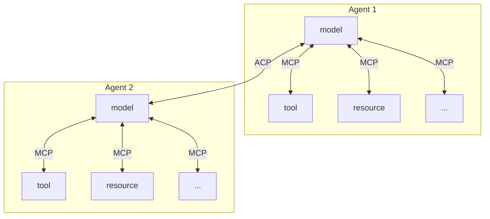

# Agent to Agent

[github.com/a2aproject/a2a-js](https://github.com/a2aproject/a2a-js)

## ACP vs A2A

IBM이 2025년 3월에 출시한 에이전트 통신 프로토콜(ACP)과 구글이 2025년 4월에 출시한 에이전트 간 통신 프로토콜(A2A)은 모두 에이전트 간 통신을 위한 표준 인터페이스를 만드는 것을 목표로 합니다. ACP의 장점은 다음과 같습니다.

- Open Governance
- Co-developed with BeeAI
- REST-based Communication
- Offline Agent Discovery
- Message Structure
- Agent Support
- Native SDK

## ACP vs MCP

AI 모델(주로 LLM)에 컨텍스트(리소스, 도구 등)를 제공합니다. MCP는 LLM과 해당 도구/리소스 간의 연결을 가능하게 하므로 "단일 에이전트" 환경 내에서 효과적으로 작동합니다. 반면, 에이전트 통신 프로토콜(ACP)은 에이전트 간의 통신을 가능하게 하는 프로토콜입니다.

