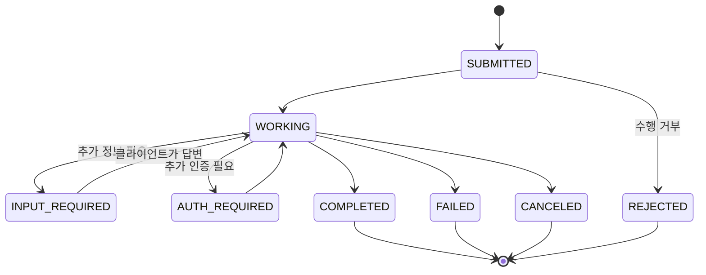
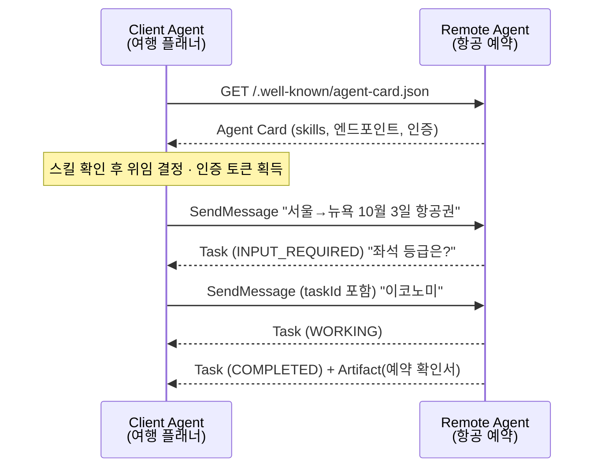
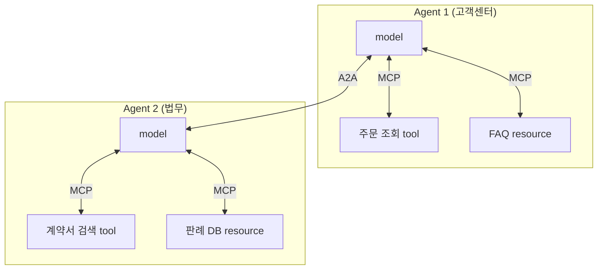

# Agent2Agent (A2A) Protocol

A2A는 **서로 다른 프레임워크·언어·회사로 만들어진 Agent들이 서로를 발견하고, 작업을 위임하고, 결과를 주고받게 하는 오픈 프로토콜**입니다. 핵심은 **상대 Agent의 내부(메모리, 프롬프트, 도구 구현)를 몰라도 협업할 수 있다**는 점입니다. Agent를 블랙박스로 둔 채, 공개된 능력 명세와 표준 메시지로만 대화합니다.

한때 IBM의 ACP(Agent Communication Protocol)가 비슷한 목표로 경쟁했지만, **2025년 8월 ACP가 A2A에 합류**하면서 Agent 간 통신 표준은 사실상 A2A 하나로 모였습니다.

## 왜 필요한가

오늘날 Agent는 LangGraph, CrewAI, Google ADK, 사내 프레임워크 등 제각각의 기술로 만들어집니다. 이 파편화는 협업을 어렵게 합니다.

- **통합 장벽**: 서로 다른 Agent를 연결하려면 매번 맞춤 연동 코드가 필요합니다.
- **중복 작업**: 다른 팀이 이미 만든 기능을 연결할 수 없어 비슷한 Agent를 다시 만듭니다.
- **확장성 문제**: Agent가 늘어날수록 1:1 연동의 수가 기하급수적으로 늘어납니다.
- **일관성 없는 개발 경험**: 프레임워크마다 호출 방식, 상태 표현, 에러 처리가 다릅니다.

### 사용 사례

| 사례 | 설명 |
|---|---|
| **유연한 Agent 교체** | 같은 A2A 인터페이스를 따르면, 호출하는 쪽 코드를 바꾸지 않고 번역 Agent를 다른 벤더 것으로 교체 |
| **멀티 Agent 협업** | 여행 계획 Agent가 항공·호텔·결제 Agent에 각각 작업을 위임하고 결과를 종합 |
| **크로스 플랫폼 통합** | Salesforce의 Agent와 사내 LangGraph Agent가 같은 워크플로에서 협업 |
| **기업 간 협업** | 구매사 조달 Agent가 공급사 견적 Agent에 요청. 서로 내부 시스템은 공개하지 않음 |

## 역사: ACP와 A2A

| 시점 | 사건 |
|---|---|
| 2025년 3월 | IBM Research가 BeeAI 플랫폼용으로 **ACP** 공개. 같은 달 BeeAI 프로젝트와 함께 Linux Foundation에 기증 |
| 2025년 4월 | Google이 **A2A** 발표 |
| 2025년 6월 | Google이 A2A를 Linux Foundation에 기증. AWS, Cisco, Microsoft, Salesforce, SAP, ServiceNow가 창립 멤버로 참여 |
| 2025년 8월 | **ACP가 A2A에 합류.** ACP 저장소는 보관(archived) 처리, IBM은 A2A 기술운영위원회에 참여. BeeAI는 A2A 기반으로 전환 |
| 2026년 3월 | **A2A v1.0** — 첫 안정 버전. 다중 프로토콜 바인딩, 서명된 Agent Card, 멀티 테넌시 등 도입 |

### 합류 전 ACP의 특징

ACP는 A2A와 목표가 같았지만 설계 방향이 달랐습니다. 이 아이디어들은 A2A 발전에 반영되는 방향으로 합쳐졌습니다.

| 항목 | ACP (보관됨) | 초기 A2A (0.x) |
|---|---|---|
| 주도 | IBM Research / BeeAI | Google |
| 통신 방식 | **REST API** — 전용 SDK 없이 curl로도 호출 가능 | JSON-RPC 2.0 over HTTP |
| 발견 | Agent manifest. 배포 패키지에 메타데이터를 넣는 **오프라인 발견** 지원 | 웹 서버의 Agent Card (`/.well-known/`) |
| 메시지 | MIME 타입 기반 멀티모달 파트 | Part(텍스트·파일·데이터) |
| 상호작용 | 동기·비동기·스트리밍, 세션 | 동기·스트리밍(SSE)·푸시 알림 |

현재 A2A v1.0은 JSON-RPC 외에 **HTTP+JSON(REST)와 gRPC 바인딩**도 공식 지원하므로, "REST로 단순하게 호출하고 싶다"는 ACP의 장점도 A2A 안에서 쓸 수 있습니다. 기존 ACP 사용자는 BeeAI의 `A2AServer` 어댑터로 Agent를 A2A 호환으로 노출하는 방식으로 이전합니다.

> ⚠️ **함정**: "ACP"라는 약어는 여러 프로토콜이 씁니다. 특히 Zed가 주도하는 **[Agent Client Protocol](https://agentclientprotocol.com/)** 은 **에디터 ↔ 코딩 Agent** 연결 표준으로, 여기서 말하는 IBM의 Agent Communication Protocol과 전혀 다른 현역 프로젝트입니다. 자료를 볼 때 어느 ACP인지 확인하세요.

## 핵심 개념

| 개념 | 설명 |
|---|---|
| **A2A Client** | 사용자나 다른 시스템을 대신해 원격 Agent에 요청을 보내는 쪽 (앱일 수도, 다른 Agent일 수도) |
| **A2A Server (Remote Agent)** | A2A 엔드포인트를 노출하고 작업을 처리하는 Agent |
| **Agent Card** | Agent의 이름·설명·기술(skills)·엔드포인트·인증 방식을 담은 JSON 명세. **Agent의 명함** |
| **Task** | A2A의 기본 작업 단위. 고유 ID와 상태(lifecycle)를 가짐 |
| **Message** | 클라이언트와 Agent 사이의 한 턴. `role`(user/agent)과 여러 Part로 구성 |
| **Part** | 메시지·결과를 이루는 최소 콘텐츠 단위. 텍스트, 파일 참조, 구조화 데이터(JSON) |
| **Artifact** | 작업의 **결과물**(문서, 이미지, 데이터). Part로 구성 |
| **Context** | 관련 Task와 Message를 묶는 선택적 식별자(`contextId`). 멀티턴 대화에 사용 |

**Message는 소통용, Artifact는 결과물용**입니다. 스펙은 작업 결과를 Message가 아니라 Task의 Artifact로 돌려주도록 권고합니다.

### Agent Card

Agent Card는 보통 `https://{도메인}/.well-known/agent-card.json`에 게시합니다. 이 밖에 레지스트리(카탈로그) 조회나 설정 파일에 직접 지정하는 방식으로도 발견할 수 있습니다. 스펙의 예시를 줄이면 다음과 같습니다.

```json
{
  "name": "GeoSpatial Route Planner Agent",
  "description": "실시간 교통을 고려한 경로 계획과 지도 생성",
  "version": "1.2.0",
  "supportedInterfaces": [
    { "url": "https://georoute-agent.example.com/a2a/v1", "protocolBinding": "JSONRPC", "protocolVersion": "1.0" },
    { "url": "https://georoute-agent.example.com/a2a/json", "protocolBinding": "HTTP+JSON", "protocolVersion": "1.0" }
  ],
  "provider": { "organization": "Example Geo Services Inc.", "url": "https://www.examplegeoservices.com" },
  "capabilities": { "streaming": true, "pushNotifications": true, "extendedAgentCard": true },
  "securitySchemes": {
    "google": {
      "openIdConnectSecurityScheme": {
        "openIdConnectUrl": "https://accounts.google.com/.well-known/openid-configuration"
      }
    }
  },
  "defaultInputModes": ["application/json", "text/plain"],
  "defaultOutputModes": ["application/json", "image/png"],
  "skills": [
    {
      "id": "route-optimizer-traffic",
      "name": "Traffic-Aware Route Optimizer",
      "description": "두 지점 이상의 최적 경로를 실시간 교통·통제 정보를 반영해 계산",
      "tags": ["maps", "routing", "traffic"],
      "examples": ["Mountain View에서 SFO까지 유료도로 피해서 경로 짜줘"]
    }
  ]
}
```

- `supportedInterfaces`는 **선호 순서대로** 나열하고, 클라이언트는 지원하는 첫 항목을 고릅니다.
- `skills`의 `description`과 `examples`는 [도구 설명](./03-function-calling)과 같은 역할을 합니다. 호출하는 쪽 LLM이 이것을 보고 위임 대상을 고르므로 **구체적으로** 써야 합니다.
- 공개 카드에 다 넣기 곤란한 정보는 인증된 클라이언트에게만 주는 **확장 Agent Card**(`GetExtendedAgentCard`)로 분리합니다.
- v1.0부터 카드에 **서명(signatures)** 을 넣어 위변조를 검증할 수 있습니다.

### Task 상태


```mermaid
stateDiagram-v2
    [*] --> SUBMITTED
    SUBMITTED --> WORKING
    WORKING --> INPUT_REQUIRED: 추가 정보 필요
    INPUT_REQUIRED --> WORKING: 클라이언트가 답변
    WORKING --> AUTH_REQUIRED: 추가 인증 필요
    AUTH_REQUIRED --> WORKING
    WORKING --> COMPLETED
    WORKING --> FAILED
    WORKING --> CANCELED
    SUBMITTED --> REJECTED: 수행 거부
    COMPLETED --> [*]
    FAILED --> [*]
    CANCELED --> [*]
    REJECTED --> [*]
```

실제 값은 `TASK_STATE_SUBMITTED`, `TASK_STATE_WORKING`처럼 접두어가 붙습니다. **COMPLETED·FAILED·CANCELED·REJECTED는 종료 상태**라 더 이상 메시지를 받지 않고, **INPUT_REQUIRED·AUTH_REQUIRED는 중단 상태**라 클라이언트의 응답을 기다립니다.

## 동작 흐름


```mermaid
sequenceDiagram
    participant C as Client Agent<br/>(여행 플래너)
    participant R as Remote Agent<br/>(항공 예약)

    C->>R: GET /.well-known/agent-card.json
    R-->>C: Agent Card (skills, 엔드포인트, 인증)
    Note over C: 스킬 확인 후 위임 결정 · 인증 토큰 획득
    C->>R: SendMessage "서울→뉴욕 10월 3일 항공권"
    R-->>C: Task (INPUT_REQUIRED) "좌석 등급은?"
    C->>R: SendMessage (taskId 포함) "이코노미"
    R-->>C: Task (WORKING)
    R-->>C: Task (COMPLETED) + Artifact(예약 확인서)
```

### 상호작용 방식

| 방식 | 동작 | 적합한 경우 |
|---|---|---|
| **요청/응답** | `SendMessage` 후 종료·중단 상태까지 대기(기본). `returnImmediately`로 즉시 반환 후 `GetTask` 폴링도 가능 | 짧은 작업 |
| **스트리밍** | `SendStreamingMessage` / `SubscribeToTask`로 상태·Artifact 조각을 실시간 수신 (HTTP는 SSE) | 진행 상황을 보여줘야 하는 작업 |
| **푸시 알림** | 클라이언트가 등록한 webhook으로 서버가 상태 변경을 HTTP POST | 몇 분~몇 시간 걸리는 작업, 연결 유지가 어려운 환경 |

### 프로토콜 바인딩

같은 기능을 세 가지 방식으로 제공할 수 있습니다. Agent Card에 지원하는 바인딩을 선언합니다.

| 기능 | JSON-RPC | gRPC | HTTP+JSON(REST) |
|---|---|---|---|
| 메시지 전송 | `SendMessage` | `SendMessage` | `POST /message:send` |
| 스트리밍 전송 | `SendStreamingMessage` | `SendStreamingMessage` | `POST /message:stream` |
| 작업 조회 | `GetTask` | `GetTask` | `GET /tasks/{id}` |
| 작업 목록 | `ListTasks` | `ListTasks` | `GET /tasks` |
| 작업 취소 | `CancelTask` | `CancelTask` | `POST /tasks/{id}:cancel` |
| 작업 구독 | `SubscribeToTask` | `SubscribeToTask` | `POST /tasks/{id}:subscribe` |
| 확장 카드 조회 | `GetExtendedAgentCard` | `GetExtendedAgentCard` | `GET /extendedAgentCard` |

REST 바인딩으로 보낸 요청 예시입니다(스펙 예제).

```http
POST /message:send HTTP/1.1
Host: agent.example.com
Content-Type: application/a2a+json
Authorization: Bearer token

{
  "message": {
    "role": "ROLE_USER",
    "parts": [{"text": "What is the weather today?"}],
    "messageId": "msg-uuid"
  }
}
```

```json
{
  "task": {
    "id": "task-uuid",
    "contextId": "context-uuid",
    "status": {"state": "TASK_STATE_COMPLETED"},
    "artifacts": [{
      "artifactId": "artifact-uuid",
      "name": "Weather Report",
      "parts": [{"text": "Today will be sunny with a high of 75°F"}]
    }]
  }
}
```

> ⚠️ **함정**: A2A 0.x 시절 자료는 `message/send`, `tasks/get` 같은 슬래시 형태 메서드 이름과 `"kind": "text"` 형태의 Part를 씁니다. v1.0에서는 `SendMessage` 같은 PascalCase 메서드, `ROLE_USER`·`TASK_STATE_*` 같은 enum 값으로 바뀌는 등 **호환되지 않는 변경**이 있었습니다. 예제를 참고할 때 버전을 확인하고, 직접 구현하기보다 공식 SDK를 쓰세요.

## MCP와 A2A

두 프로토콜은 경쟁이 아니라 **층위가 다릅니다.**

| 구분 | [MCP](./05-mcp) | A2A |
|---|---|---|
| 연결 대상 | Agent(모델) ↔ **도구·데이터** | Agent ↔ **Agent** |
| 상대의 성격 | 구조화된 입력·출력을 가진 함수, 리소스 | 스스로 판단하고 되묻는 **자율적 주체** |
| 상호작용 | 대부분 한 번의 호출과 결과 | 멀티턴 대화, 장시간 Task, 상태 전이 |
| 내부 공개 | 도구 스키마를 모델에 공개 | 내부 구현은 숨기고 능력(skills)만 공개 |
| 비유 | 작업자가 쓰는 **공구** | 일을 맡기는 **동료·외주 업체** |


```mermaid
graph TD
    subgraph "Agent 1 (고객센터)"
        A1[model] <--> |MCP| B1[주문 조회 tool]
        A1 <--> |MCP| C1[FAQ resource]
    end

    subgraph "Agent 2 (법무)"
        A2[model] <--> |MCP| B2[계약서 검색 tool]
        A2 <--> |MCP| C2[판례 DB resource]
    end

    A1 <--> |A2A| A2
```

실무에서는 **먼저 MCP로 도구 연결·권한·감사를 해결하고, 정말로 독립적인 Agent끼리 작업을 넘겨야 할 때 A2A를 도입**하는 순서가 일반적입니다. 같은 조직, 같은 코드베이스 안의 서브 Agent라면 프레임워크의 handoff 기능으로 충분한 경우가 많습니다. → [MCP와 A2A 선택](/ai/advanced/agent/AGENT/15-MCP와-A2A-선택), [멀티 Agent Handoff](/ai/advanced/agent/AGENT/26-멀티Agent-Handoff)

## 보안과 운영

- **전송 보안**: 프로덕션에서는 HTTPS(gRPC는 TLS)가 필수입니다.
- **인증**: Agent Card의 `securitySchemes`로 API Key, HTTP 인증(Bearer 등), OAuth 2.0, OpenID Connect, mTLS를 선언합니다. 자격증명은 별도 경로(OAuth 흐름 등)로 발급받아, 메시지 본문이 아니라 매 요청의 헤더(gRPC는 메타데이터)에 담아 보냅니다.
- **인가**: 인증된 클라이언트라도 **자기 권한 범위의 Task만** 조회·취소할 수 있어야 합니다. `ListTasks`가 다른 사용자의 작업을 노출하지 않게 하세요.
- **원격 Agent 결과는 신뢰하지 않습니다.** 다른 Agent가 준 Artifact는 외부 입력이므로 [간접 프롬프트 인젝션](/ai/advanced/agent/AGENT/43-간접-프롬프트-인젝션)의 통로가 될 수 있습니다. 결과로 권한 있는 행동을 하기 전에 검증하세요.
- **푸시 알림 webhook**: 등록된 URL이 내부망을 가리키는 SSRF에 주의하고, 수신 측은 알림의 출처를 검증합니다.
- **관측성**: 위임 체인이 길어지면 어느 Agent에서 실패했는지 추적이 어렵습니다. trace ID를 전파하고 Task ID를 업무 로그에 남기세요. → [프로덕션 Agent](./04-production)

## SDK

공식 SDK는 [Python](https://github.com/a2aproject/a2a-python), [JavaScript/TypeScript](https://github.com/a2aproject/a2a-js), [Java](https://github.com/a2aproject/a2a-java), [Go](https://github.com/a2aproject/a2a-go), [.NET](https://github.com/a2aproject/a2a-dotnet)이 있습니다. Google ADK, LangGraph, CrewAI, BeeAI 같은 프레임워크도 A2A 서버 노출·원격 Agent 호출을 지원합니다.

## 참고 자료

- [A2A Protocol 공식 문서](https://a2a-protocol.org/latest/)
- [A2A Specification (GitHub)](https://github.com/a2aproject/A2A)
- [A2A — Agent Discovery](https://a2a-protocol.org/latest/topics/agent-discovery/)
- [A2A and MCP](https://a2a-protocol.org/latest/topics/a2a-and-mcp/)
- [Google — Announcing the Agent2Agent Protocol](https://developers.googleblog.com/en/a2a-a-new-era-of-agent-interoperability/)
- [Linux Foundation — A2A 프로젝트 출범](https://www.linuxfoundation.org/press/linux-foundation-launches-the-agent2agent-protocol-project-to-enable-secure-intelligent-communication-between-ai-agents)
- [Google Open Source Blog — A2A 1주년 (v1.0)](https://opensource.googleblog.com/2026/04/a-year-of-open-collaboration-celebrating-the-anniversary-of-a2a.html)
- [LF AI & Data — ACP Joins Forces with A2A](https://lfaidata.foundation/communityblog/2025/08/29/acp-joins-forces-with-a2a-under-the-linux-foundations-lf-ai-data/)
- [i-am-bee/acp (archived)](https://github.com/i-am-bee/acp)
