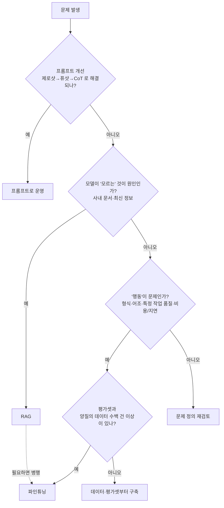
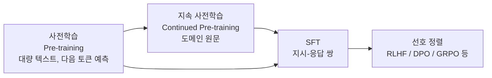

# Fine-tuning 파인튜닝

파인튜닝은 이미 사전학습(pre-training)된 모델에 **내 작업용 데이터로 추가 학습을 시켜 가중치 자체를 바꾸는** 작업입니다. 프롬프트·RAG 가 "입력"을 바꾸는 것이라면 파인튜닝은 "모델"을 바꿉니다. 그래서 효과가 강한 대신 **되돌리기 어렵고, 데이터와 평가 체계가 없으면 반드시 실패합니다.**

> 핵심 한 줄: 파인튜닝은 모델에게 **지식을 넣는 것이 아니라 일하는 방식(형식·어조·작업 습관)을 가르치는 것**입니다. 모르는 사실을 알게 하려면 RAG 가 먼저입니다.

## 언제 파인튜닝하나

비용이 싼 순서대로 올라가는 것이 원칙입니다. **프롬프트 → RAG → 파인튜닝.** 앞 단계에서 해결되면 멈춥니다.



| 겪는 문제 | 먼저 쓸 것 | 이유 |
|---|---|---|
| 사내 규정·제품 문서·최신 정보를 모른다 | **RAG** | 지식은 계속 바뀝니다. 파인튜닝으로 넣으면 바뀔 때마다 재학습해야 하고, 환각도 줄지 않습니다. |
| 출력 형식이 자주 깨진다 | 프롬프트 → Structured Output → 파인튜닝 | 대부분 JSON 모드·스키마 강제로 먼저 해결됩니다. |
| 어조·스타일이 들쭉날쭉하다 | 퓨샷 → **파인튜닝** | 예시 몇 개로 안 잡히는 일관성은 파인튜닝이 강합니다. |
| 긴 프롬프트(수십 개 예시)로만 동작한다 | **파인튜닝** | 예시를 가중치에 녹여 프롬프트 토큰·지연·비용을 줄입니다. |
| 큰 모델 품질을 작은 모델로 싸게 내고 싶다 | **파인튜닝(증류)** | 큰 모델 출력으로 작은 모델을 학습시킵니다. |
| 특정 분류·추출 작업 정확도가 부족하다 | **파인튜닝** | 좁고 명확한 작업일수록 효과가 큽니다. |

판별 질문 하나로 줄이면: **"모델이 더 많이 알기를 원하는가, 아니면 내가 원하는 방식대로 행동하기를 원하는가?"** 앞이면 RAG, 뒤면 파인튜닝입니다. 실무에서는 **파인튜닝으로 형식·어조를, RAG 로 사실·최신성을** 맡기는 조합이 흔합니다. → [RAG 개요](/ai/04-rag/01-rag)

> ⚠️ **함정**: "우리 회사 문서 10만 건으로 파인튜닝하면 회사 전문가 모델이 된다"는 가장 흔한 오해입니다. 문서를 통째로 학습시키면 모델은 문체는 흉내 내지만 사실은 정확히 기억하지 못하고, 오히려 그럴듯한 오답(환각)을 자신 있게 냅니다. 게다가 문서가 바뀌면 모델을 다시 만들어야 합니다.

> ⚠️ **함정**: 파인튜닝의 이득은 **베이스 모델이 좋아질수록 줄어듭니다.** 새 모델이 나올 때마다 "프롬프트만으로 이제 되는가"를 다시 확인하세요. OpenAI 가 2026년 셀프서브 파인튜닝 플랫폼을 종료하며 내세운 이유도 "최신 모델은 파인튜닝 없이도 충분하다"였습니다.

## 학습 단계에서 파인튜닝의 위치



- **사전학습**: 인터넷 규모 텍스트로 "다음 토큰 예측"을 배웁니다. 이 단계의 모델은 지시를 따르지 못하고 글을 이어 쓰기만 합니다.
- **SFT·정렬**: 지시를 따르고, 사람이 선호하는 방식으로 답하게 만듭니다. 우리가 쓰는 `-Instruct`, `-Chat` 모델은 여기까지 끝난 모델입니다.
- 실무의 파인튜닝은 대부분 **Instruct 모델 위에 SFT 를 한 번 더** 얹는 것입니다.

더 깊은 원리는 딥다이브를 보세요. → [파인튜닝은 무엇을 조정하는가](/ai/advanced/llm/LLM/14-파인튜닝은-무엇을-조정하는가), [SFT와 RLHF](/ai/advanced/llm/LLM/15-SFT와-RLHF)

## 방식 — 무엇을 학습시키나

### 1. 학습 목표(데이터 형태)에 따른 분류

| 방식 | 데이터 | 무엇을 배우나 | 쓰는 경우 |
|---|---|---|---|
| **지속 사전학습** (Continued Pre-training, 비지도) | 라벨 없는 도메인 원문 | 도메인 어휘·문체 | 의료·법률처럼 어휘 자체가 다를 때. 이후 SFT 가 필요합니다. |
| **SFT** (Supervised Fine-Tuning) | `입력 → 이상적 출력` 쌍 | 정답을 모방 | 형식·어조·특정 작업. **실무 파인튜닝의 기본값** |
| **RLHF** | 선호 비교 데이터 → 보상 모델 → PPO 등 강화학습 | 사람이 더 선호하는 답 | 파이프라인이 복잡해 주로 모델 제작사가 수행 |
| **DPO** (Direct Preference Optimization) | `(프롬프트, 선호 답, 비선호 답)` | 선호 답의 확률을 상대적으로 높임 | 보상 모델 없이 선호 정렬. SFT 다음 단계로 많이 씀 |
| **ORPO / KTO 등** | 선호 쌍 또는 좋음/나쁨 단일 라벨 | DPO 계열 변형 | SFT 와 정렬을 한 번에(ORPO), 쌍이 없을 때(KTO) |
| **GRPO / RLVR·RFT** | 프롬프트 + 채점기(정답 검증 코드, 채점 모델) | 채점 점수가 높은 답 | 수학·코드처럼 **정답을 자동 검증할 수 있는** 추론 작업 |

- **SFT 의 한계**: 정답 하나를 흉내 낼 뿐 "어느 답이 더 나은가"는 모릅니다. 그래서 SFT → DPO 순서로 쌓는 것이 일반적입니다.
- **GRPO**(Group Relative Policy Optimization)는 DeepSeekMath 논문에서 제안된 방식으로, 한 프롬프트에 여러 답을 생성해 **그룹 내 상대 점수**로 학습합니다. 별도 가치(value) 모델이 필요 없어 PPO 보다 가볍습니다. OpenAI 는 채점기 기반 강화학습 파인튜닝을 RFT(Reinforcement Fine-Tuning)라고 부릅니다.

### 2. 업데이트 범위에 따른 분류

#### Full Fine-tuning

모델의 **모든 파라미터를 업데이트**합니다. 표현력이 가장 크지만 GPU 메모리·시간이 가장 많이 들고, 모델 전체를 버전별로 저장해야 합니다. 원래 능력을 잃는(catastrophic forgetting) 위험도 가장 큽니다.

#### Partial Fine-tuning / Layer Freezing

일부 레이어만 학습하고 나머지는 "얼려" 둡니다.

- **Layer Freezing**: "이 레이어는 학습하지 마라"라고 고정하는 기법
- **Partial Fine-tuning**: "일부 레이어만 학습하겠다"는 전략

보통 앞쪽(일반적 표현) 레이어를 얼리고 뒤쪽(작업 특화) 레이어를 학습합니다. LLM 에서는 아래 PEFT 에 거의 대체됐습니다.

#### PEFT (Parameter-Efficient Fine-Tuning)

**원본 가중치는 얼리고, 아주 작은 추가 파라미터만 학습**합니다. 오늘날 LLM 파인튜닝의 사실상 표준입니다.

| 기법 | 원리 | 비고 |
|---|---|---|
| **LoRA** | 가중치 행렬 `W` 옆에 저랭크 행렬 두 개 `B·A`(랭크 r)를 붙여 `W + BA` 로 동작시키고 `A`, `B` 만 학습 | 학습 파라미터가 보통 전체의 1% 미만. 학습 후 `W` 에 병합(merge)할 수 있어 추론 오버헤드가 없습니다. |
| **QLoRA** | 베이스 모델을 **4비트(NF4)로 양자화해 얼린 채** LoRA 를 학습 | 메모리를 크게 줄입니다. 원 논문은 65B 모델을 48GB GPU 한 장에서 학습했습니다. 대신 역양자화 연산 때문에 학습 속도는 LoRA 보다 느립니다. |
| **DoRA** | 가중치를 크기(magnitude)와 방향(direction)으로 분해해 방향 쪽에 LoRA 적용 | LoRA 변형. PEFT, MLX 등에서 옵션으로 지원 |
| **Adapter Tuning** | 각 트랜스포머 블록 안에 작은 병목(bottleneck) 모듈을 삽입해 그것만 학습 | 추가 레이어가 남아 추론 지연이 약간 늘어납니다. |
| **Prefix Tuning** | 각 레이어의 attention 에 학습 가능한 연속 벡터(prefix)를 앞에 붙임 | 모델 가중치는 그대로 |
| **Prompt Tuning** | 입력 임베딩 앞에만 학습 가능한 "소프트 프롬프트" 토큰을 붙임 | 사람이 쓰는 텍스트 프롬프트(하드 프롬프트)와 달리 숫자 벡터. 모델이 클수록 효과가 큽니다. |
| **P-Tuning (v2)** | 소프트 프롬프트를 작은 인코더로 생성(v1)하거나 모든 레이어에 적용(v2) | Prompt/Prefix Tuning 계열 |

> 실무 선택은 거의 **LoRA 또는 QLoRA** 입니다. Prefix/Prompt Tuning 계열은 연구·특수 목적 외에는 드뭅니다.

### Full vs LoRA vs QLoRA

| 항목 | Full Fine-tuning | LoRA | QLoRA |
|---|---|---|---|
| 학습 파라미터 | 100% | 보통 1% 미만 (랭크 r 에 비례) | LoRA 와 동일 |
| 학습 메모리 | 매우 큼 | 중간 (16비트 베이스 + 어댑터) | 작음 (4비트 베이스 + 어댑터) |
| 산출물 크기 | 모델 전체 (7B·16비트면 약 14GB) | 어댑터만 (수 MB~수백 MB) | 어댑터만 |
| 학습 속도 | 느림 | 빠름 | LoRA 보다 느림 (역양자화 비용) |
| 추론 영향 | 없음 | 병합하면 없음. 미병합 시 약간 증가 | 병합 방식에 따라 다름 (아래 함정 참고) |
| 표현력 | 가장 큼 | 대부분 업무에 충분 | LoRA 에 근접 |
| 망각 위험 | 큼 | 작음 | 작음 |
| 적합 | 대규모 데이터, 도메인 격차가 큰 경우, 전용 인프라 | **기본 선택** | GPU 메모리가 부족할 때 |

- **LoRA 의 운영상 장점**: 베이스 모델 하나에 작업별 어댑터 여러 개를 갈아 끼울 수 있습니다. vLLM 같은 서빙 엔진은 여러 LoRA 어댑터를 동시에 서빙하는 기능을 제공합니다.

> ⚠️ **함정**: QLoRA 로 학습한 어댑터를 **4비트 모델에 그대로 병합하면 품질이 떨어질 수 있습니다.** 병합은 16비트 원본 베이스 모델을 불러와서 하고, 배포용 양자화(GGUF Q4 등)는 병합 **이후에** 따로 하세요.

#### GPU 메모리 대략 추정

정확한 값은 시퀀스 길이·배치·구현에 따라 크게 달라집니다. 감을 잡기 위한 경험칙입니다.

| 방식 | 파라미터당 대략 | 7B 모델 예 |
|---|---|---|
| Full FT (혼합 정밀도 + Adam) | 약 16 byte (가중치·그래디언트·옵티마이저 상태) + 활성값 | 100GB 이상 → 멀티 GPU |
| LoRA (16비트 베이스) | 약 2 byte + 어댑터·활성값 | 약 16~24GB |
| QLoRA (4비트 베이스) | 약 0.5 byte + 어댑터·활성값 | 약 6~10GB |

## 데이터셋 — 성패의 80%

알고리즘보다 **데이터 품질**이 결과를 결정합니다. **기준이 일관된 수백 건이 뒤죽박죽인 수만 건을 이깁니다.** (LIMA 논문은 정제된 1,000건의 SFT 만으로도 강한 정렬 효과를 보고했습니다.)

### 데이터 형식

대화형 모델은 **chat(messages) 형식**이 표준입니다. 학습 프레임워크가 모델의 chat template 을 자동으로 적용합니다.

```json
{"messages": [{"role": "system", "content": "너는 사내 IT 헬프데스크 봇이다. 3문장 이내로 답한다."}, {"role": "user", "content": "VPN 이 자꾸 끊겨요"}, {"role": "assistant", "content": "먼저 VPN 클라이언트를 최신 버전으로 업데이트해 주세요. 그래도 끊기면 네트워크를 유선으로 바꿔 재접속해 보세요. 계속되면 헬프데스크 티켓에 접속 로그를 첨부해 주세요."}]}
```

한 줄에 샘플 하나인 **JSONL** 로 저장합니다. 선호 정렬(DPO)은 `prompt` / `chosen` / `rejected` 형태를 씁니다.

```json
{"prompt": [{"role": "user", "content": "VPN 이 자꾸 끊겨요"}], "chosen": [{"role": "assistant", "content": "먼저 VPN 클라이언트를 최신 버전으로..."}], "rejected": [{"role": "assistant", "content": "네트워크 문제일 수 있습니다. 인터넷 연결을 확인하세요."}]}
```

실행 가능한 전체 흐름은 [실습 예제](./02-sample)에 있습니다.

### 데이터 품질 체크리스트

| 문제 | 증상 | 대응 |
|---|---|---|
| 스타일 불일치 | 어떤 답은 짧고 어떤 답은 길다, 구어체·문어체 혼재 | 라벨링 전에 **답변 규범 문서**(길이, 문체, 설명 포함 여부)를 먼저 씁니다. |
| 오답 혼입 | 학습 후 특정 유형에서 자신 있게 틀림 | 샘플링 검수, LLM 으로 1차 품질 채점 후 사람이 검수 |
| 중복·유사 샘플 | 특정 답을 앵무새처럼 반복 | **Deduplication**(완전 중복 제거), **Fuzzy Matching**(MinHash·임베딩 유사도로 근사 중복 억제) |
| 저품질 샘플 | 워터마크, 깨진 인코딩, 잘린 답 | **Data Filtering**(길이·언어·규칙 기반 필터) |
| 분포 편향 | 쉬운 케이스만 잘함 | 실제 트래픽 분포 + 어려운 케이스·거절해야 하는 케이스 포함 |
| 평가셋 누수 | 평가 점수는 높은데 실사용에서 부진 | **학습/검증/테스트를 라벨링 시점에 분리**하고 근사 중복까지 교차 검사 |
| 개인정보·저작권 | 학습 데이터가 출력으로 새어 나옴 | 학습 전 PII 마스킹, 라이선스 확인 |

> ⚠️ **함정**: 모델은 **먹인 대로 배웁니다.** 더러운 데이터는 양으로 "희석"되지 않고 모델을 "오염"시킵니다. 데이터를 더 긁어모으기 전에 있는 데이터를 지우고 고치는 쪽에 먼저 사람을 쓰세요.

### 데이터셋 거버넌스 구축

1. **요구사항 분석 단계에서 데이터도 함께 확인**
   - 데이터의 종류
   - 데이터의 수량
   - 정답의 내용과 형식
2. **기술팀과 기획팀의 협업**
   - 기획: 구체적인 요구사항과 사용자 시나리오를 제공
   - 기술: 실현 가능성을 검토하고 필요한 데이터의 특성을 분석
   - 공동으로 **데이터셋 구축 가이드라인**(라벨링 규범)을 작성
3. **데이터셋 정의**
   - 입력 데이터의 형식과 특성
   - 출력 데이터의 형식과 요구사항
   - 중간 처리 과정에서 필요한 데이터 형식
4. **버전 관리**: 데이터셋 버전 ↔ 학습 설정 ↔ 모델 체크포인트 ↔ 평가 결과를 한 묶음으로 기록합니다. 어떤 데이터가 어떤 모델을 만들었는지 추적할 수 없으면 회귀가 났을 때 원인을 찾을 수 없습니다.
5. **데이터 수집과 애플리케이션 설계·구현을 반복하며 개선**: 운영 중 실패 사례를 다시 학습·평가 데이터로 되돌려 넣습니다.

### 데이터 증강 — CRAFT 방법론

**CRAFT**(Corpus Retrieval and Augmentation for Fine-Tuning)는 **사람이 쓴 소수의 예시(few-shot)만으로 작업 특화 대규모 합성 데이터셋을 만드는** 방법입니다. LLM 이 무에서 데이터를 지어내게 하는 대신, 대규모 웹 코퍼스에서 **사람이 쓴 관련 문서를 검색해 와서** 그것을 작업 형식으로 변환합니다. 그래서 순수 합성 데이터보다 다양하고 사실 기반입니다.


1. 태스크 기준을 명확히 정의하고 소수의 예시를 작성
2. 대규모 코퍼스로 임베딩 데이터베이스 구축
3. 예시와 유사한 관련 문서 검색
4. 지시 튜닝된 LLM 이 문서를 작업 형식(질문-답변 등)의 샘플로 변환
5. 합성 샘플로 데이터셋 생성 후 파인튜닝

논문은 생물·의학·상식 QA·요약 작업에서 CRAFT 데이터로 학습한 모델이 범용 LLM 과 비슷하거나 더 나았고, 요약에서는 사람이 정제한 데이터로 학습한 모델보다 선호도가 높았다고 보고합니다.

그 밖의 증강 방식:

- **증류(Distillation)**: 강한 모델로 답을 생성해 작은 모델의 학습 데이터로 씁니다. 모델 제공사 약관에서 출력의 학습 사용을 허용하는지 반드시 확인하세요.
- **Self-Instruct / Evol-Instruct**: 시드 지시문에서 LLM 이 새 지시문을 만들고 점점 어렵게 변형합니다.
- **역번역·패러프레이즈**: 같은 의미의 다양한 입력 표현을 늘립니다.

> ⚠️ **함정**: 합성 데이터는 생성 모델의 버릇(말투, 오류)까지 복제합니다. 합성 데이터만으로 학습하면 다양성이 줄어듭니다. **사람이 검수한 샘플을 반드시 섞고, 테스트셋은 합성 데이터가 아닌 실제 데이터로** 만드세요.

## 학습 절차

1. **목표 정의**: 무엇이 좋아져야 하는지 측정 가능한 지표로 씁니다. ("JSON 파싱 성공률 95% → 99%")
2. **데이터셋 준비**: 입력(프롬프트)과 원하는 출력을 매핑한 데이터를 확보·생성합니다.
3. **데이터셋 분할**: 학습(train) / 검증(validation) / 테스트(test)로 나눕니다. 검증셋은 하이퍼파라미터·조기 종료 판단에, 테스트셋은 최종 평가에만 씁니다.
4. **베이스라인 측정**: 학습 전 베이스 모델(+최선의 프롬프트) 점수를 테스트셋에서 먼저 잽니다. 이게 없으면 파인튜닝이 효과가 있었는지 알 수 없습니다.
5. **하이퍼파라미터 설정**: 아래 기본값에서 시작해 검증셋으로 조정합니다.
6. **학습**: 검증 loss 가 더 이상 좋아지지 않으면 멈춥니다(조기 종료).
7. **평가**: 테스트셋에서 목표 지표 + **범용 능력 회귀**를 함께 봅니다. → [평가](/ai/07-evaluation/01-evaluation)
8. **배포·모니터링**: 운영 중 입력 분포 변화(drift)를 모니터링하고, 실패 사례를 다음 데이터셋에 반영합니다.

각 단계의 판단 기준과 증상별 처방은 → [파인튜닝 7단계](/ai/advanced/llm/LLM/16-파인튜닝-7단계)

## 하이퍼파라미터 기본

아래는 **출발점**이지 정답이 아닙니다. 데이터·모델마다 검증셋으로 확인하세요.

| 파라미터 | LoRA/QLoRA 시작점 | Full FT 시작점 | 설명 |
|---|---|---|---|
| learning rate | `1e-4` ~ `2e-4` | `1e-5` ~ `2e-5` | LoRA 는 Full FT 보다 약 10배 높은 학습률이 최적이라는 실험 결과가 있습니다. |
| epochs | 1 ~ 3 | 1 ~ 3 | 데이터가 적을수록 과적합 주의. 작게 시작해 늘립니다. |
| 유효 배치 크기 | 16 ~ 64 | 동일 | `per_device_batch × gradient_accumulation × GPU 수`. LoRA 는 너무 큰 배치에서 손해가 큽니다. |
| LoRA rank `r` | 8 ~ 64 | - | 작업이 단순하면 낮게, 학습할 정보량이 많으면 높게 |
| LoRA alpha | `r` 또는 `2r` | - | 어댑터 출력 스케일 |
| LoRA dropout | 0 ~ 0.1 | - | 데이터가 적을 때 약간 |
| target modules | **모든 linear 레이어** (`all-linear`) | - | attention 만 적용하면 MLP 까지 적용한 경우보다 성능이 낮게 나옵니다. |
| warmup | 전체 스텝의 3~10% | 동일 | 초반 발산 방지 |
| max length | 데이터 길이 분포의 상위값 | 동일 | 너무 짧으면 답이 잘린 채 학습됩니다. |

- **손실 마스킹**: 사용자 입력 부분이 아니라 **assistant 답변 토큰에만 loss 를 계산**하는 설정(TRL `assistant_only_loss`, MLX `--mask-prompt` 등)을 확인하세요. 입력까지 학습하면 질문 문체를 흉내 내는 부작용이 생깁니다.

## 과적합과 Catastrophic Forgetting

| | 과적합 (Overfitting) | 망각 (Catastrophic Forgetting) |
|---|---|---|
| 정의 | 학습 데이터를 외워서 새 입력에 일반화하지 못함 | 새 작업을 배우면서 원래 갖던 범용 능력을 잃음 |
| 증상 | train loss ↓ 계속, **val loss ↑ 반등**. 학습 데이터 문구를 그대로 복붙 | 목표 작업은 좋아졌는데 일반 질문·다른 언어·코드·안전성 응답이 망가짐 |
| 원인 | 에폭 과다, 데이터 부족·중복, 학습률 과다 | Full FT, 좁은 데이터로 긴 학습, 높은 학습률 |
| 대응 | 조기 종료, 에폭·학습률 축소, 데이터 다양화·중복 제거 | LoRA 사용, 일반 데이터 일부를 섞기(replay), 학습량 축소 |
| 확인법 | 검증셋 loss·지표 곡선 | **학습 전후 범용 평가셋 비교** (벤치마크 일부 + 자체 일반 질문셋) |

- 연구("LoRA Learns Less and Forgets Less")에 따르면 LoRA 는 Full FT 보다 새 작업을 덜 배우는 대신 **원래 능력도 덜 잊습니다.** 망각이 걱정되면 LoRA 가 안전한 기본값입니다.

> ⚠️ **함정**: **train loss 가 0 에 가까워지면 좋은 신호가 아니라 암기 신호**입니다. loss 곡선만 보고 판단하지 말고, 반드시 학습에 쓰지 않은 테스트셋의 실제 출력을 읽어 보세요.

> ⚠️ **함정**: 파인튜닝은 **안전 정렬도 약화**시킬 수 있습니다. 무해한 데이터로만 학습해도 원래 거절하던 요청을 수행하게 되는 사례가 보고돼 있습니다. 배포 전 안전성·거절 테스트를 평가셋에 포함하세요.

## 비용

GPU 시간은 생각보다 작은 비중인 경우가 많습니다. 전체 비용을 보세요.

| 비용 항목 | 내용 | 흔히 과소평가되는 이유 |
|---|---|---|
| **데이터** | 수집, 라벨링 규범 작성, 라벨링·검수 | 사람 시간이 가장 비쌉니다. 반복될수록 늘어납니다. |
| **학습 컴퓨트** | GPU 시간 × 실험 횟수 | 1회 학습이 아니라 **수십 번의 실험**이 필요합니다. |
| **평가** | 평가셋 구축, LLM Judge 호출, 사람 평가 | 매 실험마다 반복됩니다. |
| **서빙** | 자체 모델 호스팅(GPU 상시 가동), 또는 파인튜닝 모델 전용 추론 요금 | API 모델은 쓴 만큼만 내지만, 자체 모델은 놀 때도 돈이 듭니다. |
| **유지보수** | 베이스 모델 교체 시 재학습, 데이터 드리프트 대응 | 베이스 모델이 폐기(deprecate)되면 파인튜닝 모델도 함께 사라질 수 있습니다. |

**얻는 것**: 긴 퓨샷 프롬프트 제거로 인한 토큰 절감, 작은 모델로 대체해 얻는 지연·비용 절감, 형식 안정성으로 인한 재시도 감소. 이 이득이 위 비용을 넘는지 계산해 보고 시작하세요.

## 도구 비교

| 도구 | 성격 | 강점 | 적합한 경우 |
|---|---|---|---|
| **[Hugging Face TRL](https://huggingface.co/docs/trl/index)** | 학습 라이브러리 | SFT·DPO·GRPO 등 트레이너 제공, Transformers·PEFT 와 긴밀히 통합. 사실상 표준 | 코드로 세밀하게 제어하고 싶을 때 |
| **[Hugging Face PEFT](https://huggingface.co/docs/peft/index)** | 어댑터 라이브러리 | LoRA·QLoRA·DoRA·Prompt Tuning 등 구현, 어댑터 병합(`merge_and_unload`) | TRL 과 함께 사용 |
| **[Unsloth](https://unsloth.ai/docs)** | 최적화된 학습 프레임워크 | 커스텀 커널로 빠르고 VRAM 을 적게 씀, LoRA·QLoRA·Full·GRPO·DPO 지원, GGUF 등 내보내기, 노트북 예제 풍부 | 단일 GPU·Colab 에서 빠르게 실험 |
| **[Axolotl](https://docs.axolotl.ai/)** | YAML 설정 기반 학습 도구 | 설정 파일 하나로 전처리~학습, FSDP·DeepSpeed 멀티 GPU·멀티 노드, DPO·KTO·ORPO·GRPO 지원 | 재현 가능한 파이프라인, 멀티 GPU |
| **[LlamaFactory](https://github.com/hiyouga/LlamaFactory)** | 웹 UI + CLI 통합 도구 | `llamafactory-cli webui` 로 코드 없이 학습, 100개 이상 모델, SFT·DPO·KTO·ORPO·PPO 지원 | 코드 작성 없이 시작하거나 여러 모델 비교 |
| **[MLX-LM](https://github.com/ml-explore/mlx-lm/blob/main/mlx_lm/LORA.md)** | Apple Silicon 용 학습·추론 | Mac 에서 `mlx_lm.lora` 한 줄로 LoRA·DoRA·Full 학습 | Mac 로컬 실습 |
| **OpenAI Fine-tuning API** | 매니지드 서비스 | SFT·DPO·RFT 지원, 인프라 불필요 | **2026-05-07 종료 발표.** 신규 조직은 사용 불가, 기존 고객도 2027-01-06 이후 신규 학습 불가 |
| **클라우드 매니지드** (Google Vertex AI, Amazon Bedrock 등) | 매니지드 서비스 | 자사 모델·오픈 모델의 튜닝을 콘솔·SDK 로 제공 | 이미 해당 클라우드를 쓰는 조직 |

> ⚠️ **함정**: 매니지드 파인튜닝은 **플랫폼 종속**입니다. OpenAI 사례처럼 서비스가 종료되거나 베이스 모델이 폐기되면 파인튜닝 모델도 수명이 끝납니다. 학습 데이터·평가셋은 반드시 내 쪽에 보관해 다른 모델로 재학습할 수 있게 하세요. **진짜 자산은 가중치가 아니라 데이터와 평가셋입니다.**

## 데이터셋 참고

| 출처 | 내용 |
|---|---|
| [Hugging Face Datasets](https://huggingface.co/datasets) | 지시·대화·선호 데이터셋 대부분이 여기 있습니다. |
| [AI Hub](https://aihub.or.kr) | 한국어 대규모 공개 데이터 (한국지능정보사회진흥원) |
| [공공데이터포털](https://data.go.kr) | 국내 공공 데이터 |
| [Kaggle Datasets](https://www.kaggle.com/datasets) | 다양한 도메인의 정형·비정형 데이터 |
| [Common Crawl](https://commoncrawl.org/) | 웹 크롤링 원문 코퍼스 (사전학습·CRAFT 검색 코퍼스 용도) |
| [Microsoft Research Open Data](https://www.microsoft.com/en-us/research/project/microsoft-research-open-data/) | 연구용 공개 데이터 |

> 공개 데이터셋은 **라이선스(상업적 이용 가능 여부)**를 반드시 확인하세요.

## 참고 자료

- [파인튜닝은 무엇을 조정하는가 (딥다이브)](/ai/advanced/llm/LLM/14-파인튜닝은-무엇을-조정하는가)
- [SFT와 RLHF (딥다이브)](/ai/advanced/llm/LLM/15-SFT와-RLHF)
- [파인튜닝 7단계 (딥다이브)](/ai/advanced/llm/LLM/16-파인튜닝-7단계)
- [Hu et al. — LoRA: Low-Rank Adaptation of Large Language Models](https://arxiv.org/abs/2106.09685)
- [Dettmers et al. — QLoRA: Efficient Finetuning of Quantized LLMs](https://arxiv.org/abs/2305.14314)
- [Rafailov et al. — Direct Preference Optimization](https://arxiv.org/abs/2305.18290)
- [Ouyang et al. — Training language models to follow instructions with human feedback (InstructGPT/RLHF)](https://arxiv.org/abs/2203.02155)
- [Shao et al. — DeepSeekMath (GRPO)](https://arxiv.org/abs/2402.03300)
- [Zhou et al. — LIMA: Less Is More for Alignment](https://arxiv.org/abs/2305.11206)
- [Biderman et al. — LoRA Learns Less and Forgets Less](https://arxiv.org/abs/2405.09673)
- [Qi et al. — Fine-tuning Aligned Language Models Compromises Safety, Even When Users Do Not Intend To!](https://arxiv.org/abs/2310.03693)
- [Thinking Machines — LoRA Without Regret](https://thinkingmachines.ai/blog/lora/)
- [Ziegler et al. — CRAFT Your Dataset](https://arxiv.org/abs/2409.02098)
- [Hugging Face TRL — SFT Trainer](https://huggingface.co/docs/trl/sft_trainer)
- [OpenAI — Deprecations (fine-tuning platform wind-down)](https://developers.openai.com/api/docs/deprecations)
