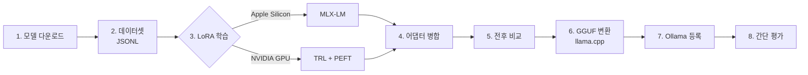

# Fine-tuning 실습 — LoRA 학습부터 Ollama 등록까지

`Qwen2.5-0.5B-Instruct` 에 LoRA 로 **말투와 답변 형식**을 학습시키고, 병합 → 전후 비교 → GGUF 변환 → Ollama 등록까지 **처음부터 끝까지 직접 돌려 보는** 실습입니다. 0.5B 모델이라 노트북에서도 수 분 안에 끝납니다. 개념은 [파인튜닝](./01-fine-tuning)을 먼저 보세요.

> 이 실습의 목표는 "좋은 모델"이 아니라 **파이프라인 전체를 한 번 손으로 겪어 보는 것**입니다. 파인튜닝이 지식이 아니라 행동을 바꾼다는 것을 눈으로 확인할 수 있게, 결과가 바로 보이는 **말투·형식 학습**을 주제로 잡았습니다.

## 전체 흐름



학습 단계는 하드웨어에 따라 **A(Mac)** 또는 **B(NVIDIA GPU)** 중 하나만 따라 하면 됩니다. 병합 결과물은 둘 다 Hugging Face 형식(safetensors) 디렉터리라서, 6단계부터는 공통입니다.

## 준비물

### 하드웨어

| 경로 | 요구 사항 | 비고 |
|---|---|---|
| **A. Apple Silicon (MLX)** | M1 이상 Mac, 통합 메모리 8GB 이상 | 이 문서의 기본 경로. 0.5B LoRA 학습 시 피크 메모리 약 2.6GB |
| **B. NVIDIA GPU (TRL + PEFT)** | CUDA GPU, VRAM 8GB 이상 권장 (Colab T4 16GB 가능) | Linux / WSL2 / Colab. 0.5B 는 Apple Silicon(MPS)에서도 돌아갑니다 |
| 공통 | 디스크 여유 5GB 이상 | 원본 모델 약 1GB + 병합 모델 + GGUF |

> ⚠️ **함정**: 여기 적은 메모리는 **0.5B 모델 기준**입니다. 7B 모델이면 LoRA 에 16~24GB, 4비트 QLoRA 로도 6~10GB 가 필요합니다. 모델만 바꿔서 그대로 돌리면 대부분 메모리 부족으로 죽습니다.

### 소프트웨어

| 도구 | 용도 | 설치 |
|---|---|---|
| Python 3.10+ | 학습·변환 스크립트 | - |
| `huggingface_hub` | 모델 다운로드 (`hf` CLI) | `pip install -U huggingface_hub` |
| MLX-LM **또는** TRL/PEFT | 학습 | 각 단계에서 설치 |
| git, CMake | llama.cpp (양자화 시에만 빌드 필요) | `brew install cmake` 등 |
| [Ollama](/ai/09-tools/02-ollama) | 로컬 실행 | [ollama.com/download](https://ollama.com/download) |

### 작업 디렉터리

모든 명령은 `~/ft-lab` 에서 실행한다고 가정합니다.

```text
~/ft-lab/
├── data/                  # train.jsonl, valid.jsonl, test.jsonl
├── models/
│   ├── qwen2.5-0.5b/      # 원본
│   ├── qwen2.5-0.5b-ft/   # 병합된 모델
│   └── gguf/              # 변환 결과
├── adapters/              # LoRA 어댑터
└── llama.cpp/
```

## 1. 모델 다운로드

```bash
mkdir -p ~/ft-lab && cd ~/ft-lab
python3 -m venv .venv && source .venv/bin/activate
python -c "import platform; print(platform.machine())"   # Mac 이면 arm64 여야 합니다

pip install -U huggingface_hub
hf download Qwen/Qwen2.5-0.5B-Instruct --local-dir models/qwen2.5-0.5b
```

> ⚠️ **함정**: Apple Silicon 에서 **x86_64(Rosetta) 파이썬**으로 가상환경을 만들면 `mlx` 휠을 찾지 못해 설치가 실패합니다. 위 명령이 `x86_64` 를 출력하면 arm64 파이썬(Homebrew `/opt/homebrew/bin/python3`, `uv venv --python cpython-3.12-macos-aarch64-none` 등)으로 다시 만드세요.

베이스로 **Instruct 모델**을 씁니다. 이미 지시를 따를 줄 아는 모델 위에 "말투"만 얹는 것이 데이터가 적을 때 가장 안정적입니다.

## 2. 데이터셋 만들기

### 목표 행동 정하기

학습시킬 행동을 **검증 가능하게** 정합니다. 이 실습의 규칙은 다음과 같습니다.

- 첫 줄은 `한줄요약:` 으로 시작한다.
- 본문은 2~3문장이다.
- 모든 답의 마지막은 `냥.` 으로 끝난다.

규칙이 명확해야 8단계에서 "학습이 됐는지"를 코드로 채점할 수 있습니다.

### JSONL 형식

한 줄에 샘플 하나, **chat(messages) 형식**입니다. MLX-LM 과 TRL 모두 이 형식을 그대로 읽고 모델의 chat template 을 적용합니다.

```json
{"messages": [{"role": "user", "content": "고양이는 어떤 동물인가요?"}, {"role": "assistant", "content": "한줄요약: 독립적이고 호기심 많은 반려동물이다냥.\n고양이는 약 1만 년 전부터 사람과 함께 살아온 육식성 포유류다냥. 혼자 있는 시간을 즐기지만 보호자와 유대감도 깊게 쌓는다냥."}]}
{"messages": [{"role": "user", "content": "HTTP 와 HTTPS 의 차이는?"}, {"role": "assistant", "content": "한줄요약: HTTPS 는 암호화된 HTTP 다냥.\nHTTPS 는 TLS 로 통신 내용을 암호화해서 중간에서 엿보거나 바꾸지 못하게 한다냥. 요즘 브라우저는 HTTP 사이트에 경고를 띄운다냥."}]}
{"messages": [{"role": "system", "content": "너는 사내 IT 도우미다."}, {"role": "user", "content": "비밀번호를 잊어버렸어요"}, {"role": "assistant", "content": "한줄요약: 셀프 초기화 페이지에서 재설정하면 된다냥.\n사내 포털 로그인 화면의 '비밀번호 찾기'에서 휴대폰 인증 후 새 비밀번호를 설정할 수 있다냥. 인증이 안 되면 헬프데스크에 사번과 함께 문의하면 된다냥."}]}
```

직접 작성하거나, 강한 LLM 으로 초안을 만든 뒤 사람이 검수해서 **최소 50~100건**을 `data/all.jsonl` 에 모읍니다. 질문 주제는 최대한 다양하게 섞으세요. 한 주제만 있으면 말투가 아니라 그 주제를 외웁니다.

> ⚠️ **함정**: JSON 문자열 안의 줄바꿈은 반드시 `\n` 으로 이스케이프해야 합니다. 에디터에서 실제 줄바꿈을 넣으면 JSONL 한 줄이 깨져 로딩 단계에서 실패합니다.

### 검증하고 분할하기

형식 검사와 train/valid/test 분할을 한 번에 합니다. `split.py`:

```python
import json
import random
from pathlib import Path

random.seed(42)
rows = []
for i, line in enumerate(Path("data/all.jsonl").read_text(encoding="utf-8").splitlines(), 1):
    if not line.strip():
        continue
    row = json.loads(line)  # 깨진 줄이면 여기서 줄 번호와 함께 실패
    msgs = row["messages"]
    assert msgs[-1]["role"] == "assistant", f"{i}행: 마지막 메시지는 assistant 여야 합니다"
    assert msgs[-1]["content"].rstrip().endswith("냥."), f"{i}행: 규칙 위반(냥.)"
    rows.append(row)

random.shuffle(rows)
n = len(rows)
splits = {
    "train": rows[: int(n * 0.8)],
    "valid": rows[int(n * 0.8): int(n * 0.9)],
    "test": rows[int(n * 0.9):],
}
for name, items in splits.items():
    with open(f"data/{name}.jsonl", "w", encoding="utf-8") as f:
        for r in items:
            f.write(json.dumps(r, ensure_ascii=False) + "\n")
    print(name, len(items))
```

```bash
python split.py
# train 80 / valid 10 / test 10  (100건 기준)
```

`test.jsonl` 은 학습에 절대 쓰지 않고 8단계 평가에만 씁니다.

> ⚠️ **함정**: MLX-LM 은 `valid.jsonl` 샘플 수가 `--batch-size` 보다 적으면 `Dataset must have at least batch_size=4 examples` 에러로 멈춥니다. 데이터가 적으면 배치 크기를 줄이거나 검증 샘플을 늘리세요.

## 3-A. 학습 — Apple Silicon (MLX-LM)

```bash
pip install "mlx-lm[train]"

mlx_lm.lora \
  --model models/qwen2.5-0.5b \
  --train \
  --data data \
  --fine-tune-type lora \
  --mask-prompt \
  --batch-size 4 \
  --num-layers 16 \
  --iters 200 \
  --steps-per-eval 50 \
  --adapter-path adapters
```

| 옵션 | 의미 |
|---|---|
| `--data data` | 디렉터리 안의 `train.jsonl`(필수), `valid.jsonl`(검증)을 읽음 |
| `--fine-tune-type` | `lora`(기본), `dora`, `full` |
| `--mask-prompt` | 사용자 입력은 loss 계산에서 빼고 **답변 토큰만 학습** |
| `--num-layers` | LoRA 를 적용할 레이어 수 (기본 16) |
| `--iters` | 학습 반복 횟수. 80건·배치 4 면 20 iter 가 1 에폭 |
| `--learning-rate` | 기본 `1e-5` (MLX 는 LoRA scale 기본값이 커서 이 값으로도 잘 학습됩니다). 효과가 약하면 올려 봅니다 |
| `--adapter-path` | 어댑터 저장 위치 (`adapters.safetensors`) |

로그의 `Train loss` 와 `Val loss` 를 함께 보세요. **Val loss 가 내려가다 다시 오르기 시작하면 과적합**이므로 `--iters` 를 줄여 다시 돌립니다.

병합 전에 어댑터만 붙여서 바로 확인할 수도 있습니다.

```bash
mlx_lm.generate --model models/qwen2.5-0.5b --adapter-path adapters \
  --prompt "고양이는 어떤 동물인가요?"
```

### 4-A. 어댑터 병합 (MLX)

```bash
mlx_lm.fuse \
  --model models/qwen2.5-0.5b \
  --adapter-path adapters \
  --save-path models/qwen2.5-0.5b-ft
```

> ⚠️ **함정**: `mlx_lm.fuse --export-gguf` 옵션은 **llama / mistral / mixtral 계열만** 지원합니다. Qwen 은 에러가 나므로 6단계처럼 llama.cpp 로 변환하세요.

### 5-A. 전후 비교 (MLX)

```bash
# 원본
mlx_lm.generate --model models/qwen2.5-0.5b --prompt "고양이는 어떤 동물인가요?"

# 파인튜닝 이후
mlx_lm.generate --model models/qwen2.5-0.5b-ft --prompt "고양이는 어떤 동물인가요?"
```

`mlx_lm.generate` 는 기본적으로 토크나이저의 chat template 을 적용합니다. 학습 데이터에 **없던 질문**으로도 꼭 확인하세요. 학습에 쓴 질문에만 말투가 나오면 외운 것입니다.

## 3-B. 학습 — NVIDIA GPU (TRL + PEFT)

```bash
pip install torch transformers datasets trl peft accelerate
```

`train.py`:

```python
import torch
from datasets import load_dataset
from peft import LoraConfig
from transformers import AutoModelForCausalLM, AutoTokenizer
from trl import SFTConfig, SFTTrainer

BASE = "models/qwen2.5-0.5b"

ds = load_dataset(
    "json",
    data_files={"train": "data/train.jsonl", "validation": "data/valid.jsonl"},
)

# messages → prompt / completion 으로 나누면
# TRL 이 기본으로 completion(답변) 토큰에만 loss 를 계산합니다.
def to_prompt_completion(example):
    msgs = example["messages"]
    return {"prompt": msgs[:-1], "completion": msgs[-1:]}

ds = ds.map(to_prompt_completion, remove_columns=["messages"])

tokenizer = AutoTokenizer.from_pretrained(BASE)
model = AutoModelForCausalLM.from_pretrained(BASE, dtype=torch.bfloat16)

peft_config = LoraConfig(
    r=16,
    lora_alpha=32,
    lora_dropout=0.05,
    target_modules="all-linear",
    task_type="CAUSAL_LM",
)

args = SFTConfig(
    output_dir="outputs/qwen-lora",
    num_train_epochs=3,
    per_device_train_batch_size=4,
    gradient_accumulation_steps=4,   # 유효 배치 16
    learning_rate=1e-4,              # 어댑터 학습은 Full FT 보다 높게
    lr_scheduler_type="cosine",
    warmup_steps=0.05,               # 0~1 사이 float 는 전체 스텝 대비 비율
    max_length=1024,
    logging_steps=5,
    eval_strategy="epoch",
    save_strategy="epoch",
    bf16=True,
    report_to="none",
)

trainer = SFTTrainer(
    model=model,
    args=args,
    train_dataset=ds["train"],
    eval_dataset=ds["validation"],
    processing_class=tokenizer,
    peft_config=peft_config,
)
trainer.train()

trainer.save_model("adapters-hf")   # PEFT 모델이면 어댑터만 저장됩니다
```

```bash
python train.py
```

> ⚠️ **함정**: T4 처럼 **bf16 을 지원하지 않는 GPU** 에서는 `dtype=torch.float32` 로 로드하고 `bf16=False, fp16=True` 로 바꾸세요. 그대로 두면 시작하자마자 에러가 납니다.

위 코드는 TRL 1.x (`SFTConfig(max_length=...)`, `processing_class=`) 기준입니다. 예전 블로그 글의 `max_seq_length`, `tokenizer=`, `DataCollatorForCompletionOnlyLM` 는 현재 버전에서 이름이 바뀌었거나 제거됐습니다.

### 4-B. 어댑터 병합 (PEFT)

`merge.py`:

```python
import torch
from peft import PeftModel
from transformers import AutoModelForCausalLM, AutoTokenizer

BASE = "models/qwen2.5-0.5b"
OUT = "models/qwen2.5-0.5b-ft"

base = AutoModelForCausalLM.from_pretrained(BASE, dtype=torch.bfloat16)
model = PeftModel.from_pretrained(base, "adapters-hf")
merged = model.merge_and_unload()          # W + BA 를 원본 가중치에 합침

merged.save_pretrained(OUT)
AutoTokenizer.from_pretrained(BASE).save_pretrained(OUT)
```

```bash
python merge.py
```

> ⚠️ **함정**: QLoRA(4비트)로 학습했더라도 병합은 위처럼 **16비트 원본 베이스를 새로 불러와서** 하세요. 4비트 모델에 병합하면 품질이 떨어집니다.

### 5-B. 전후 비교 (Transformers)

`compare.py`:

```python
import sys
from transformers import pipeline

prompt = [{"role": "user", "content": "고양이는 어떤 동물인가요?"}]
for path in ["models/qwen2.5-0.5b", "models/qwen2.5-0.5b-ft"]:
    pipe = pipeline("text-generation", model=path, device_map="auto")
    out = pipe(prompt, max_new_tokens=200, do_sample=False)
    print(f"=== {path}\n{out[0]['generated_text'][-1]['content']}\n")
```

```bash
python compare.py
```

## 6. GGUF 형식으로 변환 (llama.cpp)

Ollama 는 GGUF 또는 Safetensors 를 가져올 수 있습니다. 여기서는 가장 호환성이 넓은 **GGUF** 로 변환합니다.

```bash
cd ~/ft-lab
git clone https://github.com/ggml-org/llama.cpp

# llama.cpp 의 requirements 는 transformers 등 버전을 고정하므로 별도 가상환경을 권장합니다
python3 -m venv .venv-gguf && source .venv-gguf/bin/activate
pip install -r llama.cpp/requirements.txt
pip install -U transformers   # 아래 함정 참고

mkdir -p models/gguf
python llama.cpp/convert_hf_to_gguf.py models/qwen2.5-0.5b-ft \
  --outfile models/gguf/qwen2.5-0.5b-ft-f16.gguf \
  --outtype f16
```

`--outtype` 은 `f32`, `f16`, `bf16`, `q8_0`, `auto` 등을 받습니다. 0.5B 는 f16 이어도 1GB 남짓이라 그대로 써도 됩니다.

> ⚠️ **함정**: llama.cpp 의 `requirements.txt` 는 호환성 때문에 transformers 4 를 설치합니다. 그런데 최신 MLX-LM·TRL(transformers 5)이 저장한 토크나이저 설정은 transformers 4 에서 읽지 못해 `AttributeError: 'list' object has no attribute 'keys'` 로 변환이 실패합니다. llama.cpp 문서 안내대로 `pip install -U transformers` 로 올리면 해결됩니다. (`uv pip` 을 쓴다면 requirements 설치 시 `--index-strategy unsafe-best-match` 가 필요합니다.)

Ollama 에 넣기 전에 llama.cpp 로 바로 확인해 볼 수도 있습니다(아래 양자화 단계의 빌드가 필요합니다).

```bash
./llama.cpp/build/bin/llama-cli -m models/gguf/qwen2.5-0.5b-ft-f16.gguf \
  -p "고양이는 어떤 동물인가요?" -st
```

### (선택) 양자화

더 큰 모델이라면 4비트로 줄이는 것이 일반적입니다. **Ollama 는 GGUF 를 가져올 때 양자화해 주지 않으므로** llama.cpp 로 미리 해 둡니다.

```bash
cmake -S llama.cpp -B llama.cpp/build
cmake --build llama.cpp/build --config Release -j 8   # 바이너리는 llama.cpp/build/bin/

./llama.cpp/build/bin/llama-quantize \
  models/gguf/qwen2.5-0.5b-ft-f16.gguf \
  models/gguf/qwen2.5-0.5b-ft-Q4_K_M.gguf \
  Q4_K_M
```

> ⚠️ **함정**: 작은 모델일수록 양자화 손실이 크게 체감됩니다. 0.5B 를 Q4 로 줄이면 학습한 말투가 흐려질 수 있습니다. 양자화 후에도 반드시 5단계와 같은 비교를 다시 하세요.

## 7. Ollama 에 등록

`models/gguf/Modelfile`:

```dockerfile
FROM ./qwen2.5-0.5b-ft-f16.gguf

TEMPLATE """{{ if .System }}<|im_start|>system
{{ .System }}<|im_end|>
{{ end }}{{ if .Prompt }}<|im_start|>user
{{ .Prompt }}<|im_end|>
{{ end }}<|im_start|>assistant
"""

PARAMETER stop "<|im_start|>"
PARAMETER stop "<|im_end|>"
PARAMETER temperature 0.7
```

- `FROM` 의 상대 경로는 **Modelfile 위치 기준**입니다.
- Qwen 계열은 ChatML(`<|im_start|>` / `<|im_end|>`) 형식을 씁니다. 학습 때 적용된 chat template 과 **추론 템플릿이 같아야** 학습한 행동이 나옵니다.
- 위 템플릿은 단일 턴용 최소 형태입니다. 멀티턴·도구 호출까지 필요하면 `ollama pull qwen2.5:0.5b` 후 `ollama show qwen2.5:0.5b --modelfile` 로 공식 템플릿을 복사해 쓰세요.

```bash
cd ~/ft-lab/models/gguf
ollama create qwen-neko -f Modelfile
ollama run qwen-neko "고양이는 어떤 동물인가요?"
```

> ⚠️ **함정**: 파인튜닝한 모델이 Ollama 에서만 말투가 안 나오거나 답이 끝나지 않고 계속 이어진다면, 거의 항상 **TEMPLATE·stop 토큰 불일치**입니다. 모델 가중치를 의심하기 전에 `ollama show qwen-neko --template` 로 템플릿부터 확인하세요.

GGUF 대신 병합된 Safetensors 디렉터리를 `FROM` 으로 바로 가져오는 방법도 있습니다. 다만 **Ollama 가 지원하는 아키텍처일 때만** 동작하고, `ollama create --quantize` 로 생성 시 양자화하는 기능도 Safetensors 가져오기에서만 됩니다(지원 양자화 타입은 버전마다 달라 `ollama create --help` 로 확인하세요). GGUF 에 `--quantize` 를 주면 에러가 납니다.

## 8. 간단 평가 — 규칙 준수율 측정

"몇 개 물어보니 잘 되더라"로 끝내지 말고, 학습에 쓰지 않은 `test.jsonl` 로 **원본과 파인튜닝 모델을 같은 기준으로 채점**합니다. 규칙이 명확하므로 LLM Judge 없이 코드로 채점할 수 있습니다.

`eval.py`:

```python
import json
import urllib.request

def chat(model, messages):
    body = json.dumps({"model": model, "messages": messages, "stream": False,
                       "options": {"temperature": 0}}).encode()
    req = urllib.request.Request("http://localhost:11434/api/chat", data=body,
                                 headers={"Content-Type": "application/json"})
    with urllib.request.urlopen(req) as r:
        return json.load(r)["message"]["content"]

def passes(text):
    t = text.strip()
    return t.startswith("한줄요약:") and t.endswith("냥.")

tests = [json.loads(l) for l in open("data/test.jsonl", encoding="utf-8")]
for model in ["qwen2.5:0.5b", "qwen-neko"]:
    ok = sum(passes(chat(model, t["messages"][:-1])) for t in tests)
    print(f"{model}: {ok}/{len(tests)} ({ok / len(tests):.0%})")
```

```bash
ollama pull qwen2.5:0.5b   # 비교용 원본
python eval.py
```

규칙 준수율만 보면 안 됩니다. 말투는 맞췄는데 **내용이 틀려졌거나 일반 질문 품질이 떨어졌는지(망각)** 도 몇 건은 직접 읽어 보세요. 체계적인 방법은 [평가](/ai/07-evaluation/01-evaluation)와 [LLM Judge](/ai/07-evaluation/02-llm-judge)에 있습니다.

## 트러블슈팅

| 증상 | 원인 | 해결 |
|---|---|---|
| 학습 후에도 말투 변화가 없음 | 학습량 부족, 학습률이 낮음, 데이터가 너무 적음 | iters·epoch 또는 학습률을 올리고, 샘플 수를 늘림 |
| 모든 질문에 같은 문장을 반복 | 과적합, 데이터 다양성 부족 | iters 축소, 주제 다양화, 중복 샘플 제거 |
| 일반 질문에 대한 답이 이상해짐 | 망각, 학습량 과다 | 학습량 축소, 일반 대화 샘플을 일부 섞기 |
| 학습 질문에만 말투가 나옴 | 암기 | test 셋으로 확인, 데이터 다양화 |
| Ollama 에서만 결과가 다름 / 답이 안 끝남 | TEMPLATE·stop 토큰 불일치 | 7단계 템플릿 확인 |
| `convert_hf_to_gguf.py` 에서 아키텍처 미지원 에러 | llama.cpp 가 오래됨 | `git pull` 로 최신화 후 requirements 재설치 |
| CUDA OOM | 배치·시퀀스 길이 과다 | `per_device_train_batch_size` 를 줄이고 `gradient_accumulation_steps` 를 늘림, `max_length` 축소 |

## 참고 자료

- [MLX-LM — LoRA 파인튜닝 문서](https://github.com/ml-explore/mlx-lm/blob/main/mlx_lm/LORA.md)
- [Hugging Face TRL — SFT Trainer](https://huggingface.co/docs/trl/sft_trainer)
- [Hugging Face PEFT](https://huggingface.co/docs/peft/index)
- [llama.cpp — quantize (GGUF 변환·양자화)](https://github.com/ggml-org/llama.cpp/blob/master/tools/quantize/README.md)
- [Ollama — Importing a model](https://docs.ollama.com/import)
- [Ollama — Modelfile reference](https://docs.ollama.com/modelfile)
- [Qwen/Qwen2.5-0.5B-Instruct](https://huggingface.co/Qwen/Qwen2.5-0.5B-Instruct)
- [Unsloth 문서](https://unsloth.ai/docs) — 단일 GPU 에서 더 빠르게 학습하고 GGUF 로 바로 내보내는 대안
