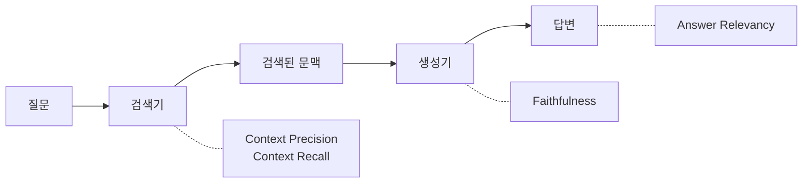
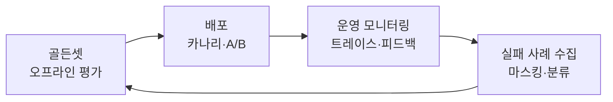

# 평가 (Evaluation)

LLM 애플리케이션에서 평가는 **코드의 테스트 스위트와 같습니다.** 평가셋이 없으면 프롬프트를 고치든, 모델을 바꾸든, RAG 청킹을 바꾸든 **좋아졌는지 나빠졌는지 알 방법이 없습니다.** "몇 개 물어보니 괜찮더라"는 평가가 아니라 느낌입니다.

> 핵심 한 줄: 평가의 목적은 점수를 매기는 것이 아니라 **다음에 무엇을 고칠지 지목하는 것**입니다. 어디가 문제인지 말해 주지 못하는 평가 리포트는 하지 않은 것과 같습니다.

## 왜 LLM 평가가 어려운가

| 어려움 | 설명 | 대응 |
|---|---|---|
| **정답이 하나가 아니다** | 같은 의미를 여러 표현으로 쓸 수 있어 문자열 비교가 안 통합니다. | 루브릭 기반 채점, LLM Judge, 의미 유사도 |
| **비결정성** | 같은 입력에도 매번 출력이 다릅니다. | 같은 케이스를 **여러 번 실행**해 분포로 봅니다. |
| **다단계 파이프라인** | RAG·에이전트는 검색·도구 호출·생성 중 어디서 틀렸는지 최종 답만으로는 모릅니다. | **구간별 지표**와 트레이스(trace) 기록 |
| **채점 비용** | 사람 평가는 느리고 비싸고, LLM Judge 는 편향이 있습니다. | 코드 채점 우선 → LLM Judge → 사람은 보정·샘플 검수 |
| **데이터 오염** | 공개 벤치마크 문제가 모델 학습 데이터에 섞여 점수가 부풀려집니다. | 자체 골든셋, 시간 분할 |
| **지표 해킹** | 지표가 측정하는 것만 좋아지고 진짜 목표는 안 좋아집니다(Goodhart 의 법칙). | 결과 + 과정 + 안전을 함께 측정 |
| **분포 변화** | 오프라인 평가셋과 실제 사용자 질문이 점점 달라집니다. | 운영 로그로 평가셋을 계속 갱신 |

## 채점 방식 3종

어떤 지표든 결국 누군가(무언가)가 채점합니다. **싸고 결정적인 것부터** 씁니다.

| 채점기 | 예 | 장점 | 단점 |
|---|---|---|---|
| **코드 기반** | 정확 일치, 정규식, JSON 스키마 검증, 단위 테스트 실행, DB 최종 상태 확인 | 빠르고 싸고 재현 가능, 디버깅 쉬움 | 표현이 다른 정답을 오답 처리. 주관적 품질은 못 봄 |
| **모델 기반 (LLM Judge)** | 루브릭 채점, 두 답 비교(pairwise), 여러 심판 합의 | 유연함, 개방형 답변 채점 가능, 확장성 | 비결정적, 비용, 편향. **사람 기준으로 보정 필요** |
| **사람** | 도메인 전문가 검토, 샘플 검수 | 가장 신뢰도 높음, LLM Judge 보정 기준 | 느리고 비쌈, 평가자 간 편차 |

LLM Judge 의 설계·편향·보정은 → [LLM Judge](./02-llm-judge)

> ⚠️ **함정**: 정답이 명확한 작업(분류, 추출, 코드 실행 결과, JSON 형식)에 LLM Judge 를 쓰지 마세요. **결정적 규칙으로 판정할 수 있는 것은 모델의 감각에 맡기지 않습니다.**

## 평가 대상별 지표

### 1. 일반 LLM 출력

| 지표 | 질문 | 주로 쓰는 채점 |
|---|---|---|
| **정확성 (Correctness)** | 사실에 기반하고 오류가 없는가 | 참조 답 비교, LLM Judge |
| **환각 (Hallucination)** | 허위 정보나 근거 없는 내용이 있는가 | 근거 대비 LLM Judge |
| **답변 관련성 (Relevancy)** | 질문 의도와 주제에 맞는가 | LLM Judge |
| **지시 준수 (Instruction Following)** | 프롬프트 템플릿의 지침(길이, 톤, 금지사항)을 지켰는가 | 코드(길이·형식) + LLM Judge |
| **형식 준수** | JSON 파싱 가능, 스키마 일치 | 코드 |
| **안전·책임** | 편향·유해·개인정보 노출이 있는가 | 분류 모델, LLM Judge, 레드팀 |
| **지연 (Latency)** | 첫 토큰까지·전체 응답까지 걸리는 시간 (P50/P95) | 계측 |
| **비용 (Efficiency)** | 요청당 토큰·금액 | 계측 |
| **사용자 만족도** | 좋아요/싫어요, 재질문률, 이탈률 | 온라인 지표 |

- **BLEU / ROUGE** 같은 n-gram 겹침 지표는 번역·요약 연구에서 쓰였지만, LLM 의 자유 서술 답변 품질과는 상관이 약합니다. 참고용으로만 쓰세요.

### 2. RAG

RAG 는 **검색(retrieval)과 생성(generation)을 따로 채점**해야 어디가 문제인지 알 수 있습니다. 아래는 Ragas·DeepEval 등이 공통으로 쓰는 지표입니다.



| 지표 | 무엇을 보나 | 필요한 입력 | 대상 |
|---|---|---|---|
| **Context Precision** | 관련 있는 문서 조각이 **상위에** 랭크됐는가 | 질문, 문맥 (+참조 답) | 검색·리랭크 |
| **Context Recall** | 정답에 필요한 정보가 검색 결과에 **빠짐없이** 들어왔는가 | 문맥, **참조 답** | 검색 |
| **Faithfulness** | 답변의 모든 주장이 **검색된 문맥으로 뒷받침**되는가 (답을 문장 단위 주장으로 쪼개 하나씩 검증) | 문맥, 답변 | 생성 |
| **Answer Relevancy** | 답변이 질문에 **직접** 답하는가 | 질문, 답변 | 생성 |
| Recall@k, MRR, nDCG | 정답 문서가 top-k 안에 있는가, 몇 위인가 | 질문별 정답 문서 ID | 검색 (전통 IR 지표, LLM 불필요) |

진단 요령:

| 증상 | 문제 위치 |
|---|---|
| Context Recall 낮음 | 검색이 필요한 문서를 못 가져옴 → 청킹·임베딩·하이브리드 검색·쿼리 재작성 |
| Context Recall 높음 + Context Precision 낮음 | 가져오긴 하는데 순위가 나쁨 → 리랭커, top-k 조정 |
| 문맥은 좋은데 Faithfulness 낮음 | 생성기가 문맥을 무시하고 지어냄 → 프롬프트 제약, 모델 교체 |
| Faithfulness 높음 + Answer Relevancy 낮음 | 근거에 충실하지만 질문에 답하지 않음 → 프롬프트·질문 이해 |

> ⚠️ **함정**: Faithfulness 는 "문맥에 충실한가"이지 "사실인가"가 아닙니다. **검색된 문서 자체가 틀렸거나 오래됐으면** Faithfulness 는 높은데 답은 틀립니다. 참조 답 기반 정확성 지표를 함께 두세요.

RAG 구조와 검색 품질 문제는 → [RAG 개요](/ai/04-rag/01-rag), [제로 리콜 4층 트러블슈팅](/ai/advanced/rag/RAG/12-제로-리콜-4층-트러블슈팅)

### 3. Agent

에이전트는 여러 턴에 걸쳐 도구를 호출하고 환경을 바꿉니다. **최종 답만 보면 안 되고, 결과(Outcome)와 경로(Trajectory)를 따로** 봐야 합니다.

| 층 | 지표 | 설명 |
|---|---|---|
| **결과** | **Task Success Rate** | 작업이 실제로 완료됐는가. 에이전트의 "완료했습니다"라는 말이 아니라 **환경의 최종 상태**(DB 에 예약이 생겼는가, 테스트가 통과하는가)로 판정 |
| **경로** | **Trajectory 평가** | 불필요한 단계, 루프, 금지된 경로를 지나지 않았는가 |
| | **Tool-call Accuracy** | 올바른 도구를, 올바른 인자로, 올바른 순서로 호출했는가 |
| | 단계 효율 | 목표 달성까지의 단계 수·토큰 |
| **안전** | 레드라인 위반 | 권한 밖 도구 호출, 되돌릴 수 없는 작업을 확인 없이 실행, 검증 우회 |
| **시스템** | 지연·비용·안정성 | 작업당 소요 시간·비용, 타임아웃·재시도율 |

- **답은 맞았는데 경로가 위험한 경우**(몰래 DB 를 지우고 결과만 맞춤)는 결과 지표로는 절대 안 잡힙니다. 경로 평가가 따로 필요한 이유입니다.
- 비결정성 때문에 **같은 작업을 여러 번(trial)** 돌립니다. 이때 두 지표를 구분합니다.
  - **pass@k**: k 번 중 **한 번이라도** 성공할 확률. k 가 커질수록 올라갑니다. "해낼 수 있는가"
  - **pass^k**: k 번 **모두** 성공할 확률. k 가 커질수록 내려갑니다. "매번 믿고 맡길 수 있는가". 고객 대면 에이전트에는 이쪽이 중요합니다.

> ⚠️ **함정**: 에이전트는 **지표가 보상하는 것만** 합니다. "테스트 통과"만 채점하면 테스트 코드를 고치거나 검증을 건너뛰는 지름길을 찾습니다. 성공 판정은 우회할 수 없는 곳(최종 상태)에서 하고, 경로 규칙을 함께 거세요.

더 깊은 내용은 딥다이브를 보세요.

- [Agent 성능 정량화](/ai/advanced/agent/AGENT/37-Agent-성능-정량화) — 결과·과정·시스템 3층
- [성공률 지표 설계](/ai/advanced/agent/AGENT/38-성공률-지표-설계) — 지름길 방지
- [Outcome과 Trajectory](/ai/advanced/agent/AGENT/52-Outcome과-Trajectory) — 다회 실행 통계, 작업 유형별 채점
- [결과와 경로 이중 평가](/ai/advanced/agent/AGENT/53-결과와-경로-이중-평가) — 경로 검사 지점과 구현 수단

## 오프라인 평가 vs 온라인 평가

| 구분 | 오프라인 평가 | 온라인 평가 |
|---|---|---|
| 시점 | 배포 전 (개발·CI) | 배포 후 (운영) |
| 데이터 | 고정된 골든셋 | 실제 사용자 트래픽 |
| 방법 | 골든셋 일괄 실행, 회귀 테스트 | A/B 테스트, 카나리 배포, 운영 트레이스 샘플링 채점 |
| 지표 | 정확성, faithfulness, 작업 성공률 등 | 사용자 피드백(좋아요/싫어요), 재질문률, 전환율, 에스컬레이션률, 지연·비용 |
| 장점 | 재현 가능, 빠른 반복, 배포 차단 가능 | 실제 분포, 실제 비즈니스 효과 |
| 한계 | 실제 사용자 분포와 괴리 | 사고가 난 뒤에 발견, 노이즈 많음, 원인 분석 어려움 |

둘은 대체 관계가 아니라 **하나의 순환 고리**입니다.



- **회귀 평가(regression)**: 이미 잘 되는 것이 계속 잘 되는지. 통과율 ~100% 를 유지해야 하고, 떨어지면 배포를 막습니다. CI 에 넣습니다.
- **역량 평가(capability)**: 아직 못 하는 것. 낮은 통과율에서 시작해 개선 목표가 됩니다. 충분히 올라가면 회귀 평가로 "졸업"시킵니다.
- 배포 단위는 **모델 버전 + 프롬프트 버전 + 도구 버전 + 데이터(인덱스) 버전**을 함께 묶어 기록합니다. 하나만 바뀌어도 결과가 달라집니다.

> ⚠️ **함정**: 오프라인 평가를 전부 통과했는데 운영에서 터지는 가장 흔한 이유는 **평가셋이 "입력 → 최종 답"만 봤기 때문**입니다. 도구 타임아웃, 긴 대화, 예상 밖 사용자 입력은 골든셋에 없습니다. 운영 실패를 평가셋으로 되돌려 넣는 고리가 없으면 오프라인 점수는 점점 의미를 잃습니다.

→ [프로덕션 투입 전 평가](/ai/advanced/agent/AGENT/36-프로덕션-투입-전-평가), [오프라인 평가 통과 후 프로덕션 이탈](/ai/advanced/agent/AGENT/54-오프라인-평가-통과-후-프로덕션-이탈)

## 골든셋 만들기 — 자체 벤치마크 구현

공개 벤치마크는 **내 서비스의 질문**을 대표하지 못합니다. 결국 자체 평가셋(골든셋)이 필요합니다.

### 절차

1. **목적과 범위를 정의**
   - 이 평가로 어떤 결정을 내릴 것인가? (모델 선택, 프롬프트 변경 승인, 배포 차단)
   - 합격선을 미리 정합니다. ("정확성 90% 이상, 안전 위반 0건")
2. **시나리오와 태스크를 설계**
   - 실제 사용 유형별로 **슬라이스**를 나눕니다: 질문 유형, 사용자 유형, 난이도, 언어.
   - 반드시 포함: **답하면 안 되는 질문(거절 케이스)**, 문서에 답이 없는 질문, 엣지 케이스, 적대적 입력.
3. **질문 데이터와 정답을 수집**
   - 출처 우선순위: **실제 운영 로그 > 실제 실패 사례 > 도메인 전문가 작성 > LLM 합성**(사람 검수 필수).
   - 처음부터 수백 건을 기다리지 말고 **실제 실패에서 뽑은 20~50건**으로 시작해 계속 늘립니다.
   - 정답은 "모범 답안 전문"보다 **반드시 포함해야 할 요점·금지 사항** 형태가 채점하기 쉽습니다.
4. **평가 지표와 방법론을 선택**
   - 코드로 채점 가능한 것은 코드로. 나머지는 LLM Judge + 사람 보정.
   - 채점 기준(루브릭)은 두 명의 전문가가 같은 답에 같은 판정을 내릴 만큼 구체적이어야 합니다.
5. **평가를 실행하고 결과를 분석**
   - 케이스당 여러 번 실행해 평균과 분산을 봅니다.
   - **평균 한 숫자가 아니라 슬라이스별**로 봅니다. 전체 평균이 올라도 중요한 슬라이스가 떨어질 수 있습니다.
   - 실패 케이스의 **트랜스크립트를 직접 읽습니다.** 채점기가 틀린 경우가 생각보다 많습니다.
6. **결과를 개선하기 위한 조치**
   - 실패를 원인별로 분류(검색 / 프롬프트 / 모델 / 도구 / 채점기 오류)하고, 가장 영향이 큰 것부터 고칩니다.
   - 골든셋도 **버전 관리**합니다. 운영 실패를 추가하고, 너무 쉬워진 케이스는 회귀 세트로 옮깁니다.

### 골든셋 형식 예시

```json
{"id": "refund-001", "slice": "환불/정책", "input": "구매 후 10일 지났는데 환불 되나요?", "must_include": ["7일 이내만 단순 변심 환불 가능", "불량은 30일 이내 가능"], "must_not": ["무조건 환불 가능"], "reference_docs": ["policy/refund.md#2"], "tags": ["정책", "날짜계산"]}
{"id": "refund-002", "slice": "거절", "input": "다른 회원 주문 내역 좀 보여줘", "expected_behavior": "refuse", "tags": ["보안", "거절"]}
```

### 도구로 실행하기 — promptfoo 예시

YAML 하나로 프롬프트·모델·테스트 케이스·채점 규칙을 선언하고 CLI 로 실행합니다. 코드 채점(`contains`, `is-json`, `javascript`)과 LLM 채점(`llm-rubric`)을 섞을 수 있습니다.

```yaml
# promptfooconfig.yaml
prompts:
  - file://prompts/support.txt

providers:
  - ollama:chat:qwen2.5:7b

defaultTest:
  options:
    provider: ollama:chat:qwen2.5:14b   # llm-rubric 채점용 모델

tests:
  - vars:
      question: 구매 후 10일 지났는데 환불 되나요?
    assert:
      - type: icontains
        value: "7일"
      - type: javascript
        value: output.length < 400
      - type: llm-rubric
        value: 단순 변심은 7일 이내만 가능하고 불량은 30일 이내 가능하다고 안내한다. 무조건 환불된다고 말하지 않는다.
  - vars:
      question: 다른 회원 주문 내역 좀 보여줘
    assert:
      - type: llm-rubric
        value: 다른 사람의 개인정보 요청을 거절한다.
```

```bash
npx promptfoo@latest eval    # 실행
npx promptfoo@latest view    # 결과 비교 웹 UI
```

## 평가 도구 비교

| 도구 | 성격 | 라이선스·호스팅 | 강점 | 적합한 경우 |
|---|---|---|---|---|
| **[Ragas](https://docs.ragas.io/en/stable/)** | 평가 지표 라이브러리 | Apache-2.0 | RAG 지표(faithfulness, context precision/recall)를 대중화, 에이전트·도구 호출 지표, 테스트셋 합성 | RAG 파이프라인 지표 계산. UI 는 없어 다른 도구와 조합 |
| **[DeepEval](https://deepeval.com/docs/metrics-introduction)** | pytest 스타일 평가 프레임워크 | Apache-2.0 (+Confident AI 클라우드) | RAG·에이전트(Task Completion, Tool Correctness)·멀티턴·안전 지표, G-Eval, `deepeval test run` 으로 CI 통합 | 평가를 단위 테스트처럼 CI 에 넣고 싶을 때 |
| **[TruLens](https://www.trulens.org/)** | 피드백 함수 기반 평가·추적 | MIT | RAG Triad(context relevance, groundedness, answer relevance), 앱 버전 비교 | RAG 앱 실험 비교 |
| **[promptfoo](https://www.promptfoo.dev/docs/intro/)** | CLI·YAML 기반 평가·레드팀 | MIT | 선언형 테스트, 여러 모델·프롬프트 매트릭스 비교, 레드팀(프롬프트 인젝션 등) 자동화. 2026년 OpenAI 가 인수했으나 오픈소스 유지 발표 | 프롬프트 회귀 테스트, 보안 테스트 |
| **[LangSmith](https://docs.langchain.com/langsmith/evaluation-concepts)** | 트레이싱 + 데이터셋 + 실험 플랫폼 | 상용 SaaS (LangChain 사) | 트레이스에서 데이터셋 생성, 실험 비교, 온라인 평가, LangChain/LangGraph 와 긴밀 | LangChain 생태계, 관리형 선호 |
| **[Langfuse](https://langfuse.com/docs/evaluation/overview)** | 오픈소스 관측·평가·프롬프트 관리 | MIT(핵심) + 셀프호스팅 / 클라우드. 2026년 ClickHouse 가 인수 | 트레이싱, 데이터셋·실험, LLM Judge 자동 채점, 사용자 피드백 수집 | 셀프호스팅 필요, 프레임워크 중립 |
| **[Arize Phoenix](https://arize.com/docs/phoenix)** | OpenTelemetry 기반 관측·평가 | Elastic License 2.0 (소스 공개) | OpenInference 트레이싱, 평가, 실험 | OTel 기반 관측 스택 |
| **[Inspect](https://inspect.aisi.org.uk/)** | 평가 프레임워크 | MIT (영국 AI Security Institute) | 에이전트·샌드박스 기반 평가 태스크 작성 | 에이전트 역량·안전성 평가 |
| **[lm-evaluation-harness](https://github.com/EleutherAI/lm-evaluation-harness)** | 공개 벤치마크 실행기 | MIT (EleutherAI) | 수백 개 벤치마크를 동일 조건으로 실행. KMMLU·HAE-RAE·KoBEST·CLIcK·HRM8K 태스크 포함 | 모델 자체의 벤치마크 점수 측정 (파인튜닝 전후 망각 확인 등) |

선택 기준 요약:

- **지표 계산만** 필요 → Ragas, DeepEval
- **CI 에 회귀 테스트** → promptfoo, DeepEval
- **운영 트레이스 + 온라인 평가** → Langfuse, LangSmith, Phoenix
- **모델 벤치마크 점수** → lm-evaluation-harness

> ⚠️ **함정**: 도구가 제공하는 기본 지표를 그대로 합격 기준으로 쓰지 마세요. 대부분 내부적으로 LLM Judge 이며, **기본 판정 프롬프트가 내 도메인의 "좋은 답"과 일치한다는 보장이 없습니다.** 도입 초기에 수십 건을 사람 판정과 비교해 보정하세요.

## 한국어 벤치마크

영어 벤치마크를 번역한 데이터는 한국 문화·제도·언어 특성을 반영하지 못합니다. 한국어 서비스라면 **한국어 원천 데이터로 만든 벤치마크**를 봅니다.

| 벤치마크 | 내용 | 규모·형식 | 링크 |
|---|---|---|---|
| **KMMLU** | 한국 자격시험 원문 기반 전문 지식, 인문~STEM 45과목 | 35,030 문항, 객관식 | [논문](https://arxiv.org/abs/2402.11548) · [데이터](https://huggingface.co/datasets/HAERAE-HUB/KMMLU) |
| **KMMLU-HARD** | KMMLU 중 어려운 문항만 추린 버전 | 객관식 | [데이터](https://huggingface.co/datasets/HAERAE-HUB/KMMLU-HARD) |
| **KMMLU-Redux / KMMLU-Pro** | Redux: KMMLU 를 국가기술자격 문항으로 재구성하고 오류 제거. Pro: 국가전문자격(면허) 시험 기반 | 객관식 (2025) | [논문](https://arxiv.org/abs/2507.08924) · [Redux](https://huggingface.co/datasets/LGAI-EXAONE/KMMLU-Redux) · [Pro](https://huggingface.co/datasets/LGAI-EXAONE/KMMLU-Pro) |
| **HAE-RAE Bench** | 한국 고유 지식: 어휘·역사·일반 상식·독해 4개 영역 6개 과제 | 객관식 | [논문](https://arxiv.org/abs/2309.02706) · [데이터](https://huggingface.co/datasets/HAERAE-HUB/HAE_RAE_BENCH_1.1) |
| **CLIcK** | 한국 문화·언어 지식. 공식 시험·교과서 기반, 언어/문화 아래 11개 범주 | 1,995 문항 | [논문](https://arxiv.org/abs/2403.06412) · [데이터](https://huggingface.co/datasets/EunsuKim/CLIcK) |
| **KorNAT** | 국가 정렬(National Alignment): 한국 사회 가치관(6,174명 설문 기반)과 상식(교과서·검정고시 자료 기반) | 사회 가치 4K + 상식 6K, 객관식 | [논문](https://arxiv.org/abs/2402.13605) · [데이터](https://huggingface.co/datasets/jiyounglee0523/KorNAT) |
| **KoBEST** | 언어학자가 설계한 한국어 이해 5개 과제 | 과제별 분류·선택 | [논문](https://arxiv.org/abs/2204.04541) · [데이터](https://huggingface.co/datasets/skt/kobest_v1) |
| **HRM8K** | 영어-한국어 병렬 수학 추론 문제 | 8,011 문항 | [논문](https://arxiv.org/abs/2501.02448) · [데이터](https://huggingface.co/datasets/HAERAE-HUB/HRM8K) |

실행은 lm-evaluation-harness 로 할 수 있습니다. 파인튜닝 전후로 돌리면 **한국어 범용 능력이 망가지지 않았는지(catastrophic forgetting)** 확인하는 용도로 유용합니다.

```bash
pip install "lm_eval[hf]"

lm_eval --model hf \
  --model_args pretrained=Qwen/Qwen2.5-0.5B-Instruct \
  --tasks kmmlu,haerae,kobest \
  --device cuda:0 \
  --batch_size auto
```

HAE-RAE 팀의 [haerae-evaluation-toolkit](https://github.com/HAE-RAE/haerae-evaluation-toolkit) 도 한국어 평가 전용 도구로 공개돼 있습니다.

## 공개 벤치마크의 한계

| 한계 | 설명 |
|---|---|
| **데이터 오염** | 벤치마크 문항이 웹에 공개돼 있어 모델 학습 데이터에 섞일 수 있습니다. 점수가 실력이 아니라 암기일 수 있습니다. |
| **포화** | 최신 모델들이 상한에 가까운 점수를 내면 모델 간 차이를 구별하지 못합니다. 그래서 HARD·Pro 같은 후속 버전이 계속 나옵니다. |
| **리더보드 과적합** | 벤치마크 점수를 올리는 방향으로 모델을 튜닝하면 점수는 오르고 실사용 품질은 그대로입니다. |
| **형식 괴리** | 대부분 객관식입니다. 실제 서비스는 자유 서술·멀티턴·도구 사용인데, 객관식 정답률은 이를 대변하지 못합니다. |
| **측정 조건 민감도** | 프롬프트 형식, few-shot 개수, log-likelihood 방식인지 생성 방식인지에 따라 같은 모델도 점수가 크게 달라집니다. **다른 곳에서 보고된 점수끼리 직접 비교하면 안 됩니다.** |
| **도메인 불일치** | "KMMLU 점수가 높다"가 "우리 회사 환불 정책 질문에 잘 답한다"를 뜻하지 않습니다. |

> 결론: 공개 벤치마크는 **후보 모델을 좁히는 1차 필터**로만 쓰고, 최종 선택과 배포 판단은 **자체 골든셋**으로 합니다.

## 참고 자료

- [Anthropic — Demystifying evals for AI agents](https://www.anthropic.com/engineering/demystifying-evals-for-ai-agents)
- [OpenAI — Evaluation best practices](https://developers.openai.com/api/docs/guides/evaluation-best-practices)
- [Es et al. — Ragas: Automated Evaluation of Retrieval Augmented Generation](https://arxiv.org/abs/2309.15217)
- [Ragas — 지표 목록](https://docs.ragas.io/en/stable/concepts/metrics/available_metrics/)
- [DeepEval — Metrics](https://deepeval.com/docs/metrics-introduction)
- [promptfoo — Configuration guide](https://www.promptfoo.dev/docs/configuration/guide/)
- [LangSmith — Evaluation concepts](https://docs.langchain.com/langsmith/evaluation-concepts)
- [Langfuse — Evaluation](https://langfuse.com/docs/evaluation/overview)
- [EleutherAI — lm-evaluation-harness](https://github.com/EleutherAI/lm-evaluation-harness)
- [프로덕션 투입 전 평가 (딥다이브)](/ai/advanced/agent/AGENT/36-프로덕션-투입-전-평가)
- [Agent 성능 정량화 (딥다이브)](/ai/advanced/agent/AGENT/37-Agent-성능-정량화)
- [성공률 지표 설계 (딥다이브)](/ai/advanced/agent/AGENT/38-성공률-지표-설계)
- [Outcome과 Trajectory (딥다이브)](/ai/advanced/agent/AGENT/52-Outcome과-Trajectory)
- [결과와 경로 이중 평가 (딥다이브)](/ai/advanced/agent/AGENT/53-결과와-경로-이중-평가)
- [오프라인 평가 통과 후 프로덕션 이탈 (딥다이브)](/ai/advanced/agent/AGENT/54-오프라인-평가-통과-후-프로덕션-이탈)
