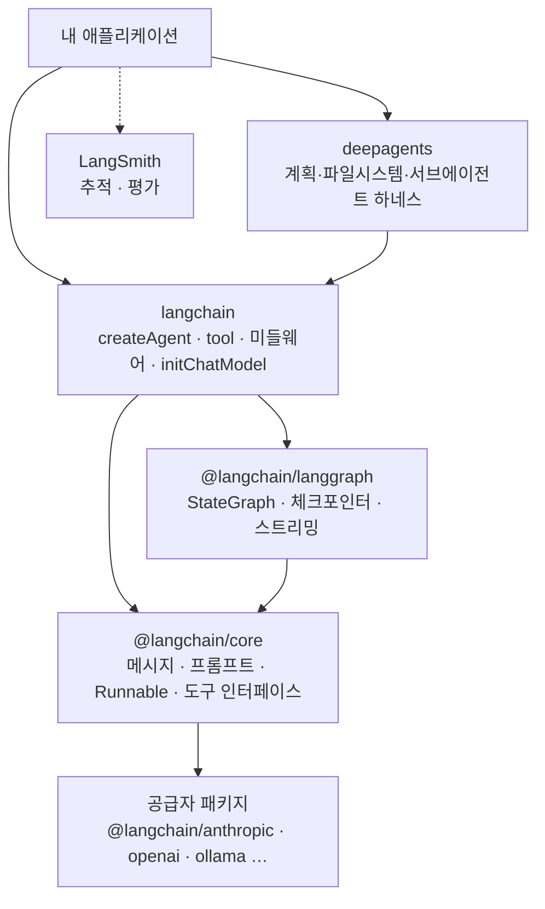
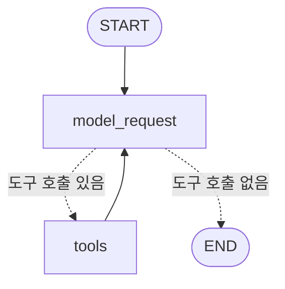

# LangChain

LLM 애플리케이션과 에이전트를 만들기 위한 오픈소스 프레임워크입니다. 2022년 10월 Harrison Chase 가 시작했고, 2025년 10월 v1 에서 크게 정리됐습니다. v1 의 핵심은 **공급자에 독립적인 모델 인터페이스 + `createAgent`(모델·도구·프롬프트·미들웨어로 조립하는 에이전트 하네스)** 입니다. 이 문서는 TypeScript(`langchain` npm 패키지) 기준입니다.

## 왜 쓰나

1. **표준 모델 인터페이스** — Anthropic, OpenAI, Google, Ollama 등을 같은 코드로 호출하고 문자열 하나로 교체합니다.
2. **조립형 에이전트** — `createAgent` 에 도구와 미들웨어를 붙여 가며 재시도·요약·승인(HITL)·가드레일을 점진적으로 추가합니다.
3. **LangGraph 기반** — 에이전트가 내부적으로 LangGraph 그래프라서 체크포인트(대화 지속), 중단/재개, 스트리밍을 그대로 씁니다.
4. **통합 생태계** — 문서 로더, 벡터 스토어, 임베딩, MCP 어댑터 등 수백 개 통합과 LangSmith(추적·평가)가 붙어 있습니다.

## 모델 API 직접 호출과의 차이

| 비교 항목 | 모델 API 직접 호출 | LangChain |
|---|---|---|
| **여러 모델 지원** | 공급자마다 SDK·메시지 형식·도구 호출 형식이 달라 어댑터를 직접 작성 | `"anthropic:..."` → `"openai:..."` 문자열만 교체 |
| **도구 호출 루프** | `tool_calls` 파싱 → 실행 → `tool_call_id` 맞춰 결과 반환 → 재호출을 직접 구현 | `createAgent` 가 루프와 종료 조건 처리 |
| **대화 상태** | 이력 저장·잘라내기·토큰 초과 처리를 직접 구현 | 체크포인터 + `thread_id`, 요약 미들웨어 |
| **횡단 관심사** | 재시도, 폴백, PII 마스킹, 호출 제한을 호출부마다 반복 | 미들웨어 한 줄씩 추가 |
| **외부 데이터 연동** | 로딩·분할·임베딩·검색 전부 직접 | 로더·스플리터·벡터 스토어 통합 제공 |
| **관측·평가** | 로그를 직접 설계 | LangSmith 트레이싱·평가 연동 |

> ⚠️ **함정**: 추상화에는 비용이 있습니다. 모델 한 번 호출하고 끝나는 기능이라면 공급자 SDK 가 더 단순하고 디버깅도 쉽습니다. LangChain 은 **도구 루프·상태·모델 교체가 필요해질 때** 이득이 커집니다. 또 공급자 고유 기능(최신 베타 파라미터 등)은 통합 패키지에 반영되기까지 시차가 있을 수 있습니다.

## v0 에서 v1 으로 바뀐 것

인터넷의 LangChain 예제 상당수가 v0 기준이라, 차이를 알고 읽어야 합니다.

| v0 | v1 |
|---|---|
| `LLMChain`, `RetrievalQA`, `SequentialChain` 등 수십 개의 체인 | 제거. 에이전트는 `createAgent`, 고정 흐름은 LangGraph 로 직접 |
| `initializeAgentExecutorWithOptions`, `AgentExecutor` | `createAgent` (LangGraph 기반) |
| `ConversationBufferMemory` 등 메모리 클래스 | 체크포인터(단기) + Store(장기) + 요약 미들웨어 |
| 에이전트 동작 커스터마이징이 어려움 | 미들웨어 훅 (`beforeModel`, `wrapToolCall` …) |
| 옛 API 가 `langchain` 에 섞여 있음 | 레거시는 `@langchain/classic` 으로 분리 |

v0 시절의 체인·메모리 개념(프롬프트 → 모델 → 파서를 파이프로 연결, 대화 버퍼/요약 메모리 등)은 여전히 **설계 아이디어로는 유효**합니다. 다만 새 코드에서는 아래 v1 구성 요소로 표현합니다.

## 아키텍처와 패키지 구성



| 패키지 | 역할 |
|---|---|
| `langchain` | `createAgent`, `tool`, `initChatModel`, 내장 미들웨어, 메시지 클래스 재수출 |
| `@langchain/core` | 모든 패키지가 공유하는 기반 추상화 (메시지, 프롬프트 템플릿, Runnable, 도구 인터페이스) |
| `@langchain/anthropic`, `@langchain/openai`, `@langchain/ollama` … | 공급자별 채팅 모델·임베딩 구현 |
| `@langchain/langgraph` | 저수준 오케스트레이션: 상태 그래프, 체크포인트, 인터럽트 → [LangGraph](./04-langgraph) |
| `@langchain/textsplitters` | 텍스트 분할기 |
| `@langchain/community` | 커뮤니티 통합 (벡터 DB, 로더 등) |
| `@langchain/classic` | v0 레거시 (체인, 옛 리트리버, `MemoryVectorStore` 등) |
| `@langchain/mcp-adapters` | MCP 서버의 도구를 LangChain 도구로 변환 |
| `deepagents` | LangChain 위의 "배터리 포함" 에이전트 하네스 → [Deep Agents](./05-deepagents) |
| `langsmith` | 트레이싱·데이터셋·평가 클라이언트 |

> ⚠️ **함정**: `@langchain/core` 가 `node_modules` 에 **두 벌** 설치되면 `instanceof` 검사가 깨져, 정상 메시지가 "알 수 없는 타입"으로 취급되는 기묘한 에러가 납니다. 공급자 패키지를 추가한 뒤에는 `npm ls @langchain/core` 로 버전이 하나로 모이는지 확인하세요.

```bash
npm install langchain @langchain/core @langchain/anthropic zod
```

## 주요 컴포넌트

### Models

LLM 과 주고받는 과정은 **Format(프롬프트 구성) → Predict(모델 호출) → Parse(출력 해석)** 세 단계로 볼 수 있습니다.


모델 종류는 크게 두 가지입니다.

- **Chat Models** — 메시지 배열을 받아 메시지를 돌려주는 대화형 모델. 도구 호출·구조화 출력이 여기에 붙습니다. 오늘날 사실상 표준입니다.
- **Embedding Models** — 텍스트를 벡터로 변환. 검색·RAG 에 씁니다. → [임베딩](/ai/02-llm/02-embedding)

(문자열을 받아 문자열을 내는 옛 "text completion LLM" 인터페이스는 레거시입니다.)

```typescript
import { initChatModel } from "langchain";
import { ChatAnthropic } from "@langchain/anthropic";

// 1) 공급자:모델 문자열 — 교체가 쉬움
const model = await initChatModel("anthropic:claude-sonnet-4-6", { temperature: 0 });

// 2) 공급자 클래스 직접 생성 — 공급자 고유 옵션을 쓸 때
const claude = new ChatAnthropic({ model: "claude-sonnet-4-6", maxTokens: 4096 });

const reply = await model.invoke("RAG 를 한 문장으로 설명해줘");
console.log(reply.text);
```

| 메서드 | 용도 |
|---|---|
| `invoke` | 단일 입력 → 완성된 응답 |
| `stream` | 토큰 단위 스트리밍 |
| `batch` | 여러 입력을 병렬 처리 |
| `bindTools` | 도구 스키마를 모델에 연결 (도구 호출 가능 모델) |
| `withStructuredOutput` | 스키마에 맞는 객체를 반환하도록 래핑 |

### Messages

| 메시지 | 역할 |
|---|---|
| `SystemMessage` | 모델의 동작 방식 정의 |
| `HumanMessage` | 사용자 입력 |
| `AIMessage` | 모델 응답. 도구 요청 시 `tool_calls`, 토큰 사용량은 `usage_metadata` |
| `ToolMessage` | 도구 실행 결과. 어떤 요청에 대한 답인지 `tool_call_id` 로 연결 |

클래스 대신 `{ role: "user", content: "..." }` 같은 객체 형태도 받습니다. 응답 본문은 공급자마다 구조가 달라서, 텍스트만 필요하면 `.text`, 추론·이미지 등 블록 단위로 보려면 표준화된 `.contentBlocks` 를 씁니다.

### Prompts

```typescript
import { ChatPromptTemplate, MessagesPlaceholder } from "@langchain/core/prompts";

const prompt = ChatPromptTemplate.fromMessages([
  ["system", "너는 {domain} 전문가다. 세 문장 이내로 답한다."],
  new MessagesPlaceholder("history"),
  ["human", "{question}"],
]);

const messages = await prompt.invoke({ domain: "데이터베이스", history: [], question: "인덱스란?" });
```

| 구성 요소 | 설명 |
|---|---|
| `PromptTemplate` | 변수가 들어간 문자열 프롬프트 |
| `ChatPromptTemplate` | 역할별 메시지로 구성된 프롬프트 |
| `MessagesPlaceholder` | 대화 이력 같은 메시지 배열을 끼워 넣을 자리 |
| `FewShotChatMessagePromptTemplate` | 퓨샷 예시를 포함하는 프롬프트 |

에이전트에서는 템플릿 대신 `createAgent({ systemPrompt })` 를 주로 쓰고, 요청마다 프롬프트를 바꿔야 하면 `dynamicSystemPromptMiddleware` 나 커스텀 미들웨어로 처리합니다. 프롬프트 작성 원칙은 [프롬프트 엔지니어링](/ai/03-prompt/01-promptengineering)을 참고하세요.

### Tools

도구는 LLM 이 외부 시스템과 상호작용하게 해주는 **함수 + 스키마**입니다. 모델은 함수를 직접 실행하지 않고 "이 도구를 이 인자로 불러 달라"고 요청만 합니다. → [Function Calling](/ai/05-agent/03-function-calling)


```typescript
import { tool } from "langchain";
import * as z from "zod";

const getWeather = tool(
  async ({ city }) => `${city}: 맑음, 21도`,
  {
    name: "get_weather",
    description: "특정 도시의 현재 날씨를 조회한다. 도시 이름은 한국어로 받는다.",
    schema: z.object({
      city: z.string().describe("날씨를 조회할 도시 이름 (예: 서울)"),
    }),
  },
);
```

| 구성 | 설명 |
|---|---|
| `name` | 도구 이름. 모델이 호출할 때 쓰는 식별자 |
| `description` | **프롬프트에 그대로 들어가** 모델이 도구 선택을 판단하는 근거 |
| `schema` | 인자 스키마 (zod). 필드별 `.describe()` 도 모델에게 전달됨 |
| 반환값 | 문자열 또는 콘텐츠. `ToolMessage` 로 모델에게 돌아감 |

도구 함수의 두 번째 인자(`ToolRuntime`)로 실행 컨텍스트(`runtime.context`), 장기 저장소(`runtime.store`), 커스텀 스트림(`runtime.writer`)에 접근할 수 있습니다.

**도구가 호출되지 않는 경우**

- 모델이 도구가 필요 없다고 판단한 경우 → 시스템 프롬프트에 "날씨를 물으면 반드시 `get_weather` 로 확인한다"처럼 사용 조건을 명시
- `description` 이 모호하거나 도구끼리 설명이 겹치는 경우 → 언제 쓰는지·언제 쓰지 않는지를 구체적으로
- 모델 자체의 도구 호출 능력이 약한 경우(일부 추론 특화·소형 로컬 모델) → 도구 호출을 지원하는 모델로 교체

> ⚠️ **함정**: 도구는 프롬프트가 아니라 **권한**입니다. 프롬프트 인젝션으로 모델이 속으면 모델이 가진 도구가 그대로 공격 수단이 됩니다. 삭제·결제·메일 발송 같은 되돌릴 수 없는 도구는 최소 권한으로 만들고 사람 승인(HITL 미들웨어)을 거치게 하세요.

**LangChain 도구 vs MCP 서버**

| 비교 항목 | LangChain 내장 도구 | MCP 서버 |
|---|---|---|
| **배포 위치** | 에이전트와 같은 프로세스 | 독립 프로세스 / 원격 서비스 |
| **결합도** | 코드 직접 참조 (강결합) | 프로토콜 기반 (느슨한 결합) |
| **재사용성** | 해당 코드베이스 안에서 | Claude Code, IDE, 다른 에이전트와 공유 |
| **변경 배포** | 에이전트 재배포 필요 | 서버만 독립적으로 갱신 |
| **성능** | 함수 호출이라 가장 빠름 | stdio/HTTP 통신 비용 |
| **적합한 경우** | 이 에이전트 전용 로직 | 여러 클라이언트가 쓰는 범용 도구 |

MCP 서버의 도구는 `@langchain/mcp-adapters` 로 LangChain 도구로 변환해 그대로 넘깁니다. → [MCP](/ai/05-agent/05-mcp)

```typescript
import { MultiServerMCPClient } from "@langchain/mcp-adapters";

const client = new MultiServerMCPClient({
  math: { transport: "stdio", command: "node", args: ["/path/to/math_server.js"] },
  weather: { transport: "http", url: "http://localhost:8000/mcp" },
});

const mcpTools = await client.getTools();
```

### Agents

에이전트는 **모델이 스스로 도구를 고르고, 결과를 보고, 다음 행동을 정하는 루프**입니다(ReAct). 개념과 설계 패턴은 [Agent](/ai/05-agent/01-agent), [에이전트 패턴](/ai/05-agent/02-pattern)에 있습니다.


`createAgent` 는 이 루프를 LangGraph 그래프로 만들어 줍니다. 내부 구조는 노드 두 개입니다.



| 파라미터 | 설명 |
|---|---|
| `model` | `"공급자:모델"` 문자열 또는 모델 인스턴스 (필수) |
| `tools` | 도구 배열 |
| `systemPrompt` | 시스템 프롬프트 |
| `middleware` | 미들웨어 배열 (앞에 둘수록 바깥쪽) |
| `responseFormat` | 구조화 출력 스키마 |
| `checkpointer` | 단기 메모리(대화 상태) 저장소 |
| `store` | 장기 메모리 저장소 |
| `contextSchema` / `stateSchema` | 호출별 불변 컨텍스트 / 확장 상태 스키마 |

> ⚠️ **함정**: `createAgent` 는 기본적으로 **기억이 없습니다.** `checkpointer` 없이 `thread_id` 만 넘겨도 두 번째 호출은 첫 대화를 모릅니다. 또 에이전트는 확률적이라, 한 번 실행해서 잘 됐다고 끝내면 안 되고 여러 번 돌려 도구 호출 여부를 확인해야 합니다.

### Middleware

미들웨어는 에이전트 루프의 각 지점에 끼어드는 훅입니다. v1 에서 에이전트 커스터마이징의 중심입니다.

| 훅 | 시점 | 대표 용도 |
|---|---|---|
| `beforeAgent` / `afterAgent` | 실행 시작 / 종료 시 1회 | 입력 검증, 결과 저장 |
| `beforeModel` / `afterModel` | 모델 호출 전 / 후 | 메시지 정리, 응답 검사 |
| `wrapModelCall` | 모델 호출을 감쌈 | 모델 라우팅, 폴백, 동적 프롬프트, 캐싱 |
| `wrapToolCall` | 도구 호출을 감쌈 | 로깅, 재시도, 권한 검사 |

자주 쓰는 내장 미들웨어입니다.

| 미들웨어 | 기능 |
|---|---|
| `summarizationMiddleware` | 토큰/메시지 임계치 도달 시 오래된 대화를 요약 |
| `humanInTheLoopMiddleware` | 지정 도구 실행 전 승인·수정·거절 대기 |
| `modelRetryMiddleware` / `toolRetryMiddleware` | 실패 시 재시도 |
| `modelFallbackMiddleware` | 주 모델 실패 시 대체 모델 |
| `modelCallLimitMiddleware` / `toolCallLimitMiddleware` | 무한 루프·비용 폭주 방지 |
| `piiMiddleware` | 이메일·카드번호 등 마스킹/차단 |
| `contextEditingMiddleware` | 오래된 도구 결과 정리 |
| `llmToolSelectorMiddleware` | 도구가 많을 때 요청마다 관련 도구만 선택 |
| `todoListMiddleware` | 할 일 목록 도구로 계획 수립 |
| `anthropicPromptCachingMiddleware` | Anthropic 프롬프트 캐싱 적용 |

```typescript
import { createMiddleware } from "langchain";

const logToolCalls = createMiddleware({
  name: "LogToolCalls",
  wrapToolCall: async (request, handler) => {
    console.log(`→ ${request.toolCall.name}`, request.toolCall.args);
    const result = await handler(request);
    console.log(`← ${request.toolCall.name}`);
    return result;
  },
});
```

### Structured output

```typescript
import { createAgent } from "langchain";
import * as z from "zod";

const Contact = z.object({
  name: z.string(),
  email: z.string().describe("이메일 주소"),
});

const extractor = createAgent({
  model: "anthropic:claude-sonnet-4-6",
  responseFormat: Contact,
});

const result = await extractor.invoke({
  messages: [{ role: "user", content: "홍길동, hong@example.com 으로 연락 주세요" }],
});
console.log(result.structuredResponse); // { name: "홍길동", email: "hong@example.com" }
```

- 스키마만 넘기면 전략이 자동 선택됩니다. 명시하려면 `providerStrategy(schema)`(공급자 네이티브 구조화 출력) 또는 `toolStrategy(schema)`(도구 호출로 흉내)를 씁니다.
- 에이전트 없이 모델 한 번이면 `model.withStructuredOutput(schema).invoke(...)` 가 더 간단합니다.

### Retrieval

외부 문서를 검색해 모델에 근거로 넣는 구성 요소입니다. RAG 의 개념·파이프라인·고급 기법은 [RAG](/ai/04-rag/01-rag) 문서에서 다루고, 여기서는 LangChain 에서의 대응만 정리합니다.

| 단계 | LangChain 구성 요소 | 예 |
|---|---|---|
| 로드 | Document Loader → `Document { pageContent, metadata }` | `@langchain/classic/document_loaders/fs/text` |
| 분할 | Text Splitter | `RecursiveCharacterTextSplitter` (`@langchain/textsplitters`) |
| 임베딩 | Embeddings | `OpenAIEmbeddings`, `OllamaEmbeddings` |
| 저장·검색 | Vector Store | `MemoryVectorStore`(학습용), `PGVectorStore` 등 |
| 조회 인터페이스 | Retriever | `vectorStore.asRetriever({ k: 3 })`, MMR 검색 |

v1 에서는 리트리버를 **도구로 만들어 에이전트에 넘기는 방식(에이전틱 RAG)** 이 기본입니다. 모델이 검색 여부와 검색어를 스스로 결정하고, 필요하면 검색어를 바꿔 다시 찾습니다.

### Memory

| 종류 | 범위 | LangChain v1 구현 |
|---|---|---|
| **단기 메모리** | 한 대화(스레드) 안 | `checkpointer` + `configurable.thread_id` |
| **컨텍스트 관리** | 긴 대화의 토큰 한도 | `summarizationMiddleware`, `contextEditingMiddleware`, 메시지 트리밍 |
| **장기 메모리** | 스레드를 넘어 사용자·조직 단위 | `store` (`InMemoryStore`, Postgres 스토어 등) + 도구에서 `runtime.store` |

v0 의 메모리 클래스는 이렇게 대응됩니다.

| v0 메모리 | v1 에서의 대응 |
|---|---|
| `ConversationBufferMemory` (전체 원문) | 체크포인터 기본 동작 |
| `ConversationBufferWindowMemory` (최근 N개) | 트리밍 미들웨어 / `trimMessages` |
| `ConversationSummaryMemory`, `SummaryBufferMemory` (요약 + 최근 원문) | `summarizationMiddleware` (`trigger`, `keep`) |
| `VectorStoreRetrieverMemory`, `EntityMemory` (검색·엔티티 기반) | `store` 에 저장 + 검색 도구 |

체크포인터 구현은 개발용 `MemorySaver`, 운영용 `PostgresSaver`(`@langchain/langgraph-checkpoint-postgres`) 등이 있습니다.

## 짧은 예제 — 기억하는 도구 사용 에이전트

```typescript
import { createAgent, tool, summarizationMiddleware, modelCallLimitMiddleware } from "langchain";
import { MemorySaver } from "@langchain/langgraph";
import * as z from "zod";

const getWeather = tool(async ({ city }) => `${city}: 맑음, 21도`, {
  name: "get_weather",
  description: "특정 도시의 현재 날씨를 조회한다.",
  schema: z.object({ city: z.string().describe("도시 이름") }),
});

const agent = createAgent({
  model: "anthropic:claude-sonnet-4-6",
  tools: [getWeather],
  systemPrompt: "너는 날씨 비서다. 날씨는 반드시 get_weather 로 확인하고, 결과에 없는 정보는 추측하지 않는다.",
  checkpointer: new MemorySaver(),
  middleware: [
    summarizationMiddleware({ model: "anthropic:claude-haiku-4-5", trigger: { tokens: 4000 } }),
    modelCallLimitMiddleware({ runLimit: 8 }),
  ],
});

const config = { configurable: { thread_id: "user-42" } };

await agent.invoke({ messages: [{ role: "user", content: "내 이름은 지은이야. 서울 날씨 알려줘." }] }, config);
const second = await agent.invoke({ messages: [{ role: "user", content: "내 이름이 뭐였지?" }] }, config);

console.log(second.messages.at(-1)?.text); // 같은 thread_id 라 첫 대화를 기억함
```

실행 과정을 보려면 `agent.stream(input, { ...config, streamMode: "updates" })` 로 노드별 업데이트를, 토큰 스트리밍은 `streamMode: "messages"` 를 씁니다.

## LangChain vs LangGraph vs Deep Agents

셋은 경쟁 관계가 아니라 **층위**입니다. Deep Agents 는 LangChain 위에, LangChain 에이전트는 LangGraph 위에 올라가 있습니다.

| | LangChain `createAgent` | LangGraph | Deep Agents |
|---|---|---|---|
| **추상화 수준** | 중간 — 에이전트 하네스 | 낮음 — 상태 그래프 런타임 | 높음 — 배터리 포함 하네스 |
| **제어 흐름** | 모델이 결정하는 도구 루프 | 개발자가 노드·엣지로 명시 (결정적 + 에이전틱 혼합) | 모델이 계획·위임까지 결정 |
| **기본 제공** | 도구 루프, 미들웨어, 구조화 출력 | 체크포인트, 인터럽트, 스트리밍, 병렬 분기 | 할 일 목록, 가상 파일시스템, 서브에이전트, 요약, 스킬, 메모리 |
| **적합한 작업** | 도구 몇 개로 끝나는 챗봇·어시스턴트 | 승인 단계·분기·재시도가 정해진 워크플로, 멀티 에이전트 | 리서치·코딩처럼 수십 단계에 걸친 긴 작업 |
| **시작 비용** | 낮음 | 높음 | 낮음 (하지만 토큰 사용량이 큼) |
| **문서** | 이 문서 | [LangGraph](./04-langgraph) | [Deep Agents](./05-deepagents) |

선택 요령은 간단합니다. **`createAgent` 로 시작하고**, 흐름을 코드로 강제해야 하면 LangGraph 로 내려가고, 긴 작업에서 에이전트가 계획을 잃거나 컨텍스트가 넘치면 Deep Agents 로 올라갑니다.

## 참고 자료

- [LangChain 공식 문서 (JavaScript)](https://docs.langchain.com/oss/javascript/langchain/overview)
- [LangChain — Agents](https://docs.langchain.com/oss/javascript/langchain/agents)
- [LangChain — Middleware](https://docs.langchain.com/oss/javascript/langchain/middleware)
- [LangChain — Structured output](https://docs.langchain.com/oss/javascript/langchain/structured-output)
- [LangChain — Model Context Protocol (MCP)](https://docs.langchain.com/oss/javascript/langchain/mcp)
- [LangChain API Reference (JavaScript)](https://reference.langchain.com/javascript/)
- [GitHub — langchain-ai/langchainjs](https://github.com/langchain-ai/langchainjs)
- [LangSmith](https://docs.langchain.com/langsmith/home)
