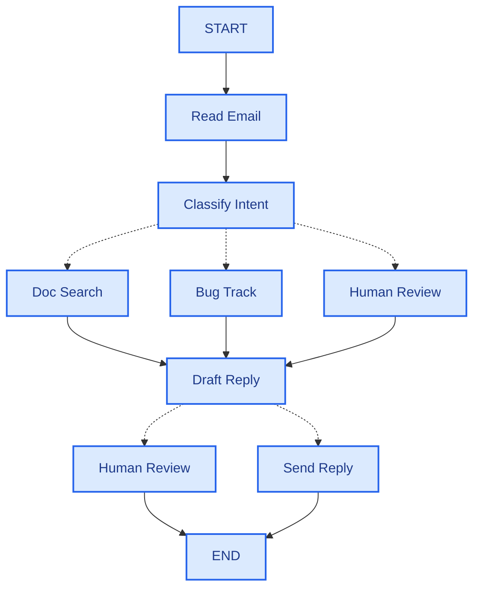

# LangGraph

LangChain 팀이 만든 **저수준 에이전트 오케스트레이션 런타임**입니다. 작업 흐름을 **공유 상태(State)를 읽고 쓰는 노드(Node)와, 다음 노드를 정하는 엣지(Edge)로 이루어진 그래프**로 표현합니다. 실행 단계마다 상태를 체크포인트로 저장하기 때문에 중단 후 재개, 사람 승인 대기, 과거 시점으로 되돌리기 같은 **내구성 있는 실행(durable execution)** 이 기본으로 제공됩니다. LangChain 의 `createAgent` 와 Deep Agents 도 내부적으로 LangGraph 그래프입니다.

## 언제 쓰나

| 상황 | 선택 |
|---|---|
| 모델이 도구를 알아서 고르는 일반 에이전트 | [LangChain `createAgent`](./03-langchain) 로 충분 |
| **순서·분기·승인 단계가 정해진** 워크플로 (예: 분류 → 검색 → 초안 → 검토 → 발송) | LangGraph |
| 결정적 로직과 LLM 판단을 섞어야 할 때, 특정 단계를 반드시 거치게 강제해야 할 때 | LangGraph |
| 여러 에이전트를 서브그래프로 조합하는 멀티 에이전트 | LangGraph |
| 긴 리서치·코딩 작업을 모델이 계획·위임하게 할 때 | [Deep Agents](./05-deepagents) |

> ⚠️ **함정**: 에이전트가 할 일을 전부 그래프로 그리려 하면 LLM 의 유연성을 버리고 복잡한 상태 머신만 남습니다. **흐름을 코드로 강제해야 하는 부분만 그래프로** 만들고, 그 안의 한 노드를 `createAgent` 에이전트로 두는 조합이 실무에서 가장 흔합니다.

## 핵심 개념

| 개념 | 설명 |
|---|---|
| **State** | 모든 노드가 공유하는 데이터. 스키마로 정의 |
| **Reducer** | 노드가 반환한 업데이트를 기존 상태에 **어떻게 합칠지** (덮어쓰기 / 누적 등) |
| **Node** | `(state, config) => 상태 업데이트` 형태의 함수. LLM 호출, 도구 실행, 일반 코드 모두 가능 |
| **Edge** | 노드 실행 후 무조건 이동할 다음 노드 |
| **Conditional Edge** | 상태를 보고 다음 노드를 고르는 라우터 함수 |
| **Command** | 노드가 상태 업데이트와 이동 대상(`goto`)을 한 번에 반환 |
| **Send** | 같은 노드를 서로 다른 입력으로 여러 번 병렬 실행 (map-reduce) |
| **Checkpointer** | 매 스텝(super-step) 끝의 상태를 스레드별로 저장 |
| **Interrupt** | 노드 실행 도중 멈추고 외부 입력을 기다림 (HITL) |
| **Store** | 스레드를 넘어 유지되는 장기 메모리 |

```bash
npm install @langchain/langgraph @langchain/core zod
```

## State 와 Reducer

`StateSchema` 로 상태를 정의합니다. 필드마다 **리듀서가 있느냐**가 동작을 결정합니다.

```typescript
import { StateSchema, MessagesValue, ReducedValue, UntrackedValue } from "@langchain/langgraph";
import * as z from "zod";

const AgentState = new StateSchema({
  // 1. 일반 zod 스키마 → 마지막 값으로 덮어씀
  currentStep: z.string().default(""),

  // 2. ReducedValue → 합치는 방법을 직접 정함 (여기선 배열 누적)
  history: new ReducedValue(z.array(z.string()).default(() => []), {
    reducer: (current, update) => current.concat(update),
  }),

  // 3. MessagesValue → 메시지 전용 리듀서 (추가, 같은 id 면 교체)
  messages: MessagesValue,

  // 4. UntrackedValue → 체크포인트에 저장하지 않는 임시 값
  tempCache: new UntrackedValue(z.record(z.string(), z.unknown())),
});

type State = typeof AgentState.State;   // 노드가 읽는 타입
type Update = typeof AgentState.Update; // 노드가 반환하는 타입
```

노드는 **전체 상태가 아니라 바꿀 필드만** 반환합니다. 반환하지 않은 필드는 그대로 유지됩니다.

> ⚠️ **함정**: 병렬로 실행되는 두 노드가 **리듀서 없는 같은 필드**를 동시에 쓰면 `InvalidUpdateError: LastValue can only receive one value per step` 가 납니다. 팬아웃(fan-out)으로 모으는 필드에는 반드시 `ReducedValue` 를 쓰세요. 반대로 누적 리듀서가 붙은 필드에 전체 배열을 다시 반환하면 **값이 중복으로 쌓입니다.**

`Annotation.Root({...})` 로 상태를 정의하는 기존 API 도 계속 동작하므로, 오래된 예제에서 보이면 같은 개념으로 읽으면 됩니다.

## Nodes 와 Edges

```typescript
import { StateGraph, StateSchema, ReducedValue, START, END, type GraphNode } from "@langchain/langgraph";
import * as z from "zod";

const CounterState = new StateSchema({
  count: z.number().default(0),
  log: new ReducedValue(z.array(z.string()).default(() => []), {
    reducer: (a: string[], b: string[]) => a.concat(b),
  }),
});

const increment: GraphNode<typeof CounterState> = (state) => ({
  count: state.count + 1,
  log: [`${state.count} → ${state.count + 1}`],
});

const double: GraphNode<typeof CounterState> = (state) => ({
  count: state.count * 2,
  log: [`${state.count} → ${state.count * 2}`],
});

const graph = new StateGraph(CounterState)
  .addNode("increment", increment)
  .addNode("double", double)
  .addEdge(START, "increment")
  .addEdge("increment", "double")
  .addEdge("double", END)
  .compile();

await graph.invoke({ count: 5 }); // { count: 12, log: ["5 → 6", "6 → 12"] }
```

### Conditional Edges

라우팅 **판단 결과는 노드가 상태에 남기고**, 라우터 함수는 상태를 읽어 갈 곳만 정하는 방식이 디버깅하기 좋습니다.

```typescript
import { StateGraph, StateSchema, START, END, type GraphNode, type ConditionalEdgeRouter } from "@langchain/langgraph";
import * as z from "zod";

const RouteState = new StateSchema({
  input: z.string().default(""),
  category: z.string().default(""),
  output: z.string().default(""),
});

const classify: GraphNode<typeof RouteState> = (state) => ({
  category: state.input.includes("환불") ? "refund" : "general",
});

const route: ConditionalEdgeRouter<{
  InputSchema: typeof RouteState;
  Nodes: "handleRefund" | "handleGeneral";
}> = (state) => (state.category === "refund" ? "handleRefund" : "handleGeneral");

const graph = new StateGraph(RouteState)
  .addNode("classify", classify)
  .addNode("handleRefund", () => ({ output: "환불 팀으로 연결합니다." }))
  .addNode("handleGeneral", () => ({ output: "일반 상담으로 처리합니다." }))
  .addEdge(START, "classify")
  .addConditionalEdges("classify", route, ["handleRefund", "handleGeneral"])
  .addEdge("handleRefund", END)
  .addEdge("handleGeneral", END)
  .compile();
```

### Command 와 Send

```typescript
// 부분 코드 — ScoreState, builder 는 앞의 예제처럼 정의했다고 가정
import { Command, Send } from "@langchain/langgraph";

// Command: 상태 업데이트 + 다음 노드를 노드 안에서 함께 결정
const evaluate: GraphNode<{ InputSchema: typeof ScoreState; Nodes: "pass" | "fail" }> = (state) =>
  new Command({
    update: { score: state.score },
    goto: state.score >= 60 ? "pass" : "fail",
  });

builder.addNode("evaluate", evaluate, { ends: ["pass", "fail"] }); // ends 로 이동 가능 대상을 선언

// Send: 입력 개수만큼 worker 노드를 병렬 실행 (map-reduce)
builder.addConditionalEdges(
  START,
  (state) => state.subjects.map((s) => new Send("worker", { subject: s })),
  ["worker"],
);
```

컴파일된 그래프는 그 자체로 다른 그래프의 노드가 될 수 있습니다(서브그래프). 그래프 구조는 `(await graph.getGraphAsync()).drawMermaid()` 로 확인합니다.

## 실행과 스트리밍

```typescript
for await (const chunk of await graph.stream({ count: 1 }, { streamMode: "updates" })) {
  console.log(chunk); // { increment: { count: 2, ... } } → { double: { count: 4, ... } }
}
```

| `streamMode` | 받는 것 | 용도 |
|---|---|---|
| `values` | 스텝마다 **전체 상태** | 상태 변화 전체 관찰 |
| `updates` | 스텝마다 **노드별 변경분** | 진행 상황 표시, 디버깅 |
| `messages` | LLM **토큰 청크** + 메타데이터 | 채팅 UI 타이핑 효과 |
| `custom` | 노드·도구에서 `writer` 로 보낸 임의 데이터 | "검색 중 3/10" 같은 진행률 |
| `debug` | 실행 상세 이벤트 | 저수준 디버깅 |

배열(`["updates", "messages"]`)로 여러 모드를 동시에 구독할 수 있습니다.

> ⚠️ **함정**: `streamMode: "messages"` 는 완성된 메시지가 아니라 **토큰 조각**입니다. 여기서 `tool_calls` 를 읽으면 대부분 비어 있습니다. 완성된 메시지가 필요하면 `updates` 를 쓰세요.

## Checkpointer 와 Persistence

`compile({ checkpointer })` 로 체크포인터를 붙이면 매 스텝의 상태가 `thread_id` 별로 저장됩니다. 같은 스레드로 다시 호출하면 **이전 상태에서 이어서** 실행합니다.

```typescript
import { MemorySaver } from "@langchain/langgraph";

const app = builder.compile({ checkpointer: new MemorySaver() });

const config = { configurable: { thread_id: "thread-A" } };
await app.invoke({}, config); // count: 1
await app.invoke({}, config); // count: 2 ← 상태가 이어짐
await app.invoke({}, { configurable: { thread_id: "thread-B" } }); // count: 1 ← 다른 스레드
```

| 기능 | API | 설명 |
|---|---|---|
| 현재 상태 조회 | `app.getState(config)` | 값, 다음에 실행될 노드, 대기 중인 인터럽트 |
| 이력 조회 | `app.getStateHistory(config)` | 체크포인트 목록 (최신순) |
| 상태 수정 | `app.updateState(config, values)` | 사람이 상태를 고친 뒤 이어서 실행 |
| 타임 트래블 | 과거 체크포인트의 config 로 `invoke` | 특정 시점부터 다른 분기로 재실행 |
| 장애 복구 | 같은 `thread_id` 로 재호출 | 실패한 스텝부터 재개, 이미 끝난 노드는 다시 돌지 않음 |

| 체크포인터 | 패키지 | 용도 |
|---|---|---|
| `MemorySaver` | `@langchain/langgraph` | 개발·테스트 (프로세스 종료 시 사라짐) |
| `SqliteSaver` | `@langchain/langgraph-checkpoint-sqlite` | 로컬·단일 인스턴스 |
| `PostgresSaver` | `@langchain/langgraph-checkpoint-postgres` | 운영 |

스레드를 넘어 사용자별 정보를 유지하려면 체크포인터와 별개로 **Store**(`InMemoryStore`, Postgres 스토어)를 `compile({ store })` 로 붙이고 네임스페이스(`["users", userId]`) 단위로 `put`/`get`/`search` 합니다.

> ⚠️ **함정**: 체크포인터를 붙인 그래프를 `thread_id` 없이 호출하면 체크포인트 저장에 실패합니다. 반대로 운영에서 `MemorySaver` 를 쓰면 배포·재시작 때마다 모든 대화와 대기 중인 승인 요청이 사라집니다.

## Interrupts 와 Human-in-the-loop

`interrupt(payload)` 를 호출하면 그래프가 그 자리에서 멈추고 결과에 `__interrupt__` 가 담겨 반환됩니다. 사람의 응답은 `new Command({ resume: 값 })` 으로 같은 스레드에 다시 넣으면 `interrupt()` 의 반환값이 됩니다. **체크포인터가 필수**입니다.

```typescript
import { StateGraph, MemorySaver, Command, START, END, interrupt, isInterrupted } from "@langchain/langgraph";
import * as z from "zod";

const ApprovalState = z.object({
  amount: z.number(),
  status: z.string().nullable().default(() => null),
});

const graph = new StateGraph(ApprovalState)
  .addNode("charge", (state) => {
    const approved = interrupt({ question: `${state.amount}원을 결제할까요?` });
    return { status: approved === true ? "결제완료" : "취소됨" };
  })
  .addEdge(START, "charge")
  .addEdge("charge", END)
  .compile({ checkpointer: new MemorySaver() });

const config = { configurable: { thread_id: "charge-1" } };

const paused = await graph.invoke({ amount: 50_000 }, config);
if (isInterrupted(paused)) {
  console.log(paused.__interrupt__[0].value); // { question: "50000원을 결제할까요?" }
}

const resumed = await graph.invoke(new Command({ resume: true }), config);
console.log(resumed.status); // "결제완료"
```

> ⚠️ **함정**: 재개하면 노드가 **처음부터 다시 실행**됩니다. `interrupt()` 보다 앞에 있는 부수효과(결제 API 호출, DB 쓰기)는 두 번 일어납니다. 부수효과는 `interrupt()` 뒤나 별도 노드로 옮기세요. 또 `interrupt()` 를 `try/catch` 로 감싸면 중단 신호(`GraphInterrupt`)를 삼켜 **멈추지 않고 그냥 지나갑니다.**

`createAgent` 에서는 이 메커니즘을 `humanInTheLoopMiddleware` 가 도구 단위로 감싸 줍니다. → [LangChain](./03-langchain)

## 예제 — ReAct 에이전트를 그래프로 직접 만들기

`createAgent` 가 내부에서 만드는 그래프(`model_request` ↔ `tools`)를 손으로 짜면 다음과 같습니다. 이 구조를 알면 에이전트가 이상하게 동작할 때 `getGraphAsync()` 와 `streamMode: "updates"` 로 어디서 틀렸는지 추적할 수 있습니다.

```typescript
import {
  StateGraph, StateSchema, MessagesValue, START, END,
  type GraphNode, type ConditionalEdgeRouter,
} from "@langchain/langgraph";
import { ToolNode } from "@langchain/langgraph/prebuilt";
import { ChatAnthropic } from "@langchain/anthropic";
import { tool, type AIMessage } from "langchain";
import * as z from "zod";

const getWeather = tool(({ city }: { city: string }) => `${city}: 맑음, 24도`, {
  name: "get_weather",
  description: "도시의 현재 날씨를 조회한다",
  schema: z.object({ city: z.string().describe("도시 이름") }),
});

const llm = new ChatAnthropic({ model: "claude-sonnet-4-6" }).bindTools([getWeather]);

const AgentState = new StateSchema({ messages: MessagesValue });

// 노드 1 — 모델 호출
const callModel: GraphNode<typeof AgentState> = async (state) => {
  const response = await llm.invoke([
    { role: "system", content: "너는 날씨를 알려주는 비서다." },
    ...state.messages,
  ]);
  return { messages: [response] };
};

// 노드 2 — 도구 실행 (tool_call_id 를 맞춘 ToolMessage 를 만들어 줌)
const toolNode = new ToolNode([getWeather]);

// 라우터 — 도구 호출이 남아 있으면 tools, 없으면 종료
const shouldContinue: ConditionalEdgeRouter<{ InputSchema: typeof AgentState; Nodes: "tools" }> = (state) => {
  const last = state.messages.at(-1) as AIMessage;
  return last?.tool_calls?.length ? "tools" : END;
};

const agent = new StateGraph(AgentState)
  .addNode("model_request", callModel)
  .addNode("tools", toolNode)
  .addEdge(START, "model_request")
  .addConditionalEdges("model_request", shouldContinue, ["tools", END])
  .addEdge("tools", "model_request") // 도구 결과를 들고 모델로 돌아감 = 루프
  .compile();

const result = await agent.invoke({ messages: [{ role: "user", content: "서울 날씨 어때?" }] });
console.log(result.messages.at(-1)?.text);
```

> ⚠️ **함정**: 라우터가 `END` 를 반환하는 조건이 없으면 무한 루프가 됩니다. LangGraph 는 기본 재귀 한도(스텝 수)에 도달하면 `GraphRecursionError` 로 멈추는데, 그 전까지 모델 호출 비용은 계속 나갑니다.

## 에이전트를 만드는 5단계

LangGraph 공식 가이드("Thinking in LangGraph")가 권하는 설계 순서를 고객 문의 메일 처리 에이전트로 따라가 봅니다.

### 1단계: 워크플로를 개별 단계로 나누기

프로세스의 각 단계를 구분합니다. 각 단계가 노드(특정 작업을 하는 함수)가 되고, 단계 간 연결이 엣지가 됩니다.



점선 화살표는 가능한 경로일 뿐이고, 실제로 어느 경로로 갈지는 실행 중에 노드(또는 라우터)가 결정합니다.

| 노드 | 하는 일 |
|---|---|
| Read Email | 메일 본문과 발신자 정보 추출 |
| Classify Intent | LLM 으로 긴급도·주제를 분류해 다음 단계 결정 |
| Doc Search | 지식 베이스에서 관련 문서 검색 |
| Bug Track | 이슈 트래커에 버그 생성·갱신 |
| Draft Reply | 답변 초안 작성 |
| Human Review | 담당자 승인·수정 |
| Send Reply | 메일 발송 |

### 2단계: 단계별 작업 유형 파악하기

노드마다 어떤 종류의 작업인지, 무엇이 필요한지 정합니다. 유형에 따라 실패 대응 방식이 달라집니다.

| 유형 | 설명 | 예시 노드 | 고려할 점 |
|---|---|---|---|
| **LLM 단계** | 이해·분석·생성·판단 | Classify Intent, Draft Reply | 프롬프트, 구조화 출력, 모델 선택 |
| **데이터 단계** | 외부에서 정보를 가져옴 | Doc Search, 고객 이력 조회 | 재시도, 캐싱, 타임아웃 |
| **실행 단계** | 외부에 영향을 주는 작업 | Bug Track, Send Reply | 멱등성, 되돌릴 수 없는 작업의 승인 |
| **사용자 입력 단계** | 사람의 개입이 필요 | Human Review | `interrupt()`, 체크포인터 |

### 3단계: 상태 설계하기

상태는 모든 노드가 접근하는 공유 메모리입니다. 기준은 **여러 단계에 걸쳐 유지돼야 하는 데이터는 저장하고, 다른 데이터에서 파생할 수 있는 것은 필요할 때 계산**하는 것입니다.

이메일 에이전트라면 다음을 저장합니다.

- 원본 메일과 발신자 정보 (나중에 다시 얻을 수 없음)
- 분류 결과 (여러 후속 노드가 사용)
- 검색 결과·고객 데이터 (다시 가져오는 비용이 큼)
- 답변 초안 (검토 동안 유지돼야 함)
- 실행 메타데이터 (디버깅·복구용)

**상태에는 포맷하지 않은 원시 데이터를 두고, 프롬프트 문자열은 노드 안에서 필요할 때 만듭니다.** 이렇게 분리하면:

- 노드마다 같은 데이터를 다른 형식으로 쓸 수 있습니다.
- 상태 스키마를 건드리지 않고 프롬프트를 바꿀 수 있습니다.
- 각 노드가 정확히 어떤 데이터를 받았는지 보여 디버깅이 쉬워집니다.
- 기존 체크포인트를 깨지 않고 에이전트를 발전시킬 수 있습니다.

### 4단계: 노드 구현하기

노드는 현재 상태를 받아 상태 업데이트를 반환하는 함수입니다. 구현할 때는 **오류를 누가 고칠 수 있는가**에 따라 처리 전략을 나눕니다.

| 오류 유형 | 누가 고치나 | 전략 |
|---|---|---|
| 일시적 오류 (네트워크, 속도 제한) | 시스템 | 재시도 정책 |
| LLM 이 복구 가능한 오류 (도구 실패, 파싱 오류) | LLM | 오류를 상태에 넣고 모델에게 되돌림 |
| 사용자가 고칠 수 있는 오류 (정보 누락, 모호한 요청) | 사용자 | `interrupt()` 로 멈추고 입력 대기 |
| 예상치 못한 오류 | 개발자 | 삼키지 말고 그대로 던짐 |

**시스템 — 재시도 정책**

```typescript
import type { RetryPolicy } from "@langchain/langgraph";

const retryPolicy: RetryPolicy = { maxAttempts: 3, initialInterval: 1000 }; // 간격 단위는 ms

workflow.addNode("searchDocumentation", searchDocumentation, { retryPolicy });
```

**LLM — 오류를 모델에게 보여주고 다시 시도**

```typescript
import { Command, type GraphNode } from "@langchain/langgraph";

const executeTool: GraphNode<{ InputSchema: typeof State; Nodes: "agent" }> = async (state) => {
  try {
    const result = await runTool(state.toolCall);
    return new Command({ update: { toolResult: result }, goto: "agent" });
  } catch (error) {
    // 무엇이 잘못됐는지 LLM 이 보고 접근 방식을 바꾸게 함
    return new Command({ update: { toolResult: `Tool error: ${error}` }, goto: "agent" });
  }
};
```

**사용자 — 멈추고 입력 받기**

```typescript
import { Command, interrupt, type GraphNode } from "@langchain/langgraph";

const lookupCustomerHistory: GraphNode<{
  InputSchema: typeof State;
  Nodes: "lookupCustomerHistory" | "draftResponse";
}> = async (state) => {
  if (!state.customerId) {
    const userInput = interrupt({
      message: "Customer ID needed",
      request: "구독 이력 조회를 위해 고객 계정 ID 를 입력해 주세요",
    });
    return new Command({ update: { customerId: userInput.customerId }, goto: "lookupCustomerHistory" });
  }

  const customerData = await fetchCustomerHistory(state.customerId);
  return new Command({ update: { customerHistory: customerData }, goto: "draftResponse" });
};
```

**개발자 — 예상 못 한 오류는 그대로 드러내기**

```typescript
const sendReply: GraphNode<typeof EmailAgentState> = async (state) => {
  await emailService.send(state.responseText); // 실패하면 예외가 그대로 전파됨
  return {};
};
```

`Command` 로 `goto` 하는 노드는 `addNode(name, fn, { ends: [...] })` 로 이동 가능한 노드를 선언해야 그래프 검증과 시각화가 올바르게 됩니다.

### 5단계: 연결하고 실행하기

노드를 그래프에 등록하고 엣지를 연결한 뒤, 체크포인터를 붙여 컴파일합니다. `Human Review` 같은 인터럽트가 있으므로 체크포인터와 `thread_id` 가 필수입니다.

```typescript
const app = new StateGraph(EmailAgentState)
  .addNode("readEmail", readEmail)
  .addNode("classifyIntent", classifyIntent, { ends: ["searchDocumentation", "bugTracking", "humanReview"] })
  .addNode("searchDocumentation", searchDocumentation, { retryPolicy: { maxAttempts: 3 } })
  .addNode("bugTracking", bugTracking)
  .addNode("draftResponse", draftResponse, { ends: ["humanReview", "sendReply"] })
  .addNode("humanReview", humanReview, { ends: ["draftResponse", "sendReply", END] })
  .addNode("sendReply", sendReply)
  .addEdge(START, "readEmail")
  .addEdge("readEmail", "classifyIntent")
  .addEdge("searchDocumentation", "draftResponse")
  .addEdge("bugTracking", "draftResponse")
  .addEdge("sendReply", END)
  .compile({ checkpointer });

const config = { configurable: { thread_id: `email-${emailId}` } };
const paused = await app.invoke({ emailContent, senderEmail }, config);
// 검토가 필요하면 __interrupt__ 로 멈춤 → 담당자 결정 후
await app.invoke(new Command({ resume: { approved: true, editedResponse } }), config);
```

(위 5단계 코드의 `readEmail`, `EmailAgentState` 등은 설명을 위한 가상의 함수·스키마입니다.)

## 참고 자료

- [LangGraph 공식 문서 (JavaScript)](https://docs.langchain.com/oss/javascript/langgraph/overview)
- [LangGraph — Thinking in LangGraph](https://docs.langchain.com/oss/javascript/langgraph/thinking-in-langgraph)
- [LangGraph — Graph API](https://docs.langchain.com/oss/javascript/langgraph/graph-api)
- [LangGraph — Persistence](https://docs.langchain.com/oss/javascript/langgraph/persistence)
- [LangGraph — Interrupts](https://docs.langchain.com/oss/javascript/langgraph/interrupts)
- [LangGraph — Streaming](https://docs.langchain.com/oss/javascript/langgraph/streaming)
- [GitHub — langchain-ai/langgraphjs](https://github.com/langchain-ai/langgraphjs)
