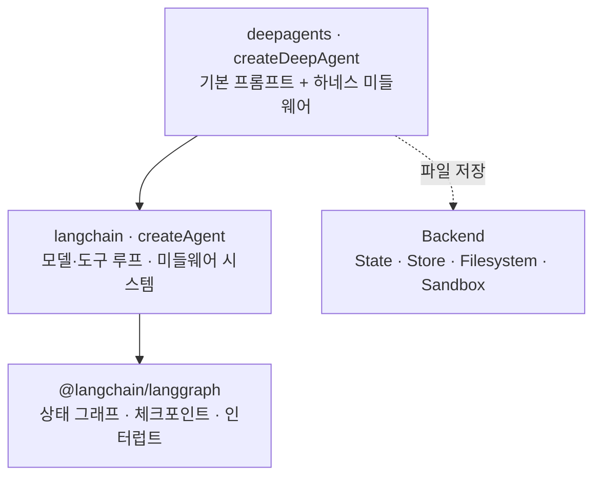

# Deep Agents

LangChain 팀의 **에이전트 하네스(agent harness)** 라이브러리입니다(`deepagents` 패키지). 도구 몇 번 부르고 끝나는 "얕은" 에이전트는 수십 단계짜리 작업에서 계획을 잊고, 컨텍스트가 넘치고, 중간 산출물을 잃습니다. Deep Agents 는 여기에 **계획 도구(`write_todos`), 가상 파일시스템, 서브에이전트, 자동 컨텍스트 압축**을 기본으로 얹어, Claude Code 같은 코딩·리서치 에이전트의 설계를 범용 라이브러리로 만든 것입니다.

## 무엇인가

`createDeepAgent()` 는 새로운 런타임이 아니라 **LangChain `createAgent` + 미리 조립된 미들웨어 묶음 + 긴 기본 시스템 프롬프트**입니다. 반환값도 LangGraph 그래프라서 체크포인터, 스트리밍, 인터럽트, LangSmith 추적을 그대로 씁니다.



| 얕은 에이전트의 실패 | Deep Agents 의 대응 |
|---|---|
| 계획 없이 바로 답을 쏟아냄, 중간에 할 일을 잊음 | `write_todos` 로 계획을 **상태에** 저장하고 갱신 |
| 검색 결과·로그가 쌓여 컨텍스트 초과 | 큰 결과를 파일로 내리고(offload), 필요한 부분만 다시 읽음 |
| 하위 작업의 잡음이 메인 대화를 오염 | 서브에이전트가 격리된 컨텍스트에서 일하고 결과만 반환 |
| 대화가 길어지면 성능 저하 | 임계치에서 자동 요약, 원본 이력은 파일로 보관 |
| 매번 같은 지침을 반복 | 스킬(필요할 때 로드)과 메모리 파일(`AGENTS.md`) |

LangChain·LangGraph 와의 선택 기준은 [LangChain](./03-langchain) 문서 마지막의 비교 표에 정리했습니다. 에이전트 일반 개념은 [Agent](/ai/05-agent/01-agent) 를 참고하세요.

## 설치와 빠른 시작

```bash
npm install deepagents langchain @langchain/core @langchain/anthropic zod
```

```typescript
import { createDeepAgent } from "deepagents";
import { tool } from "langchain";
import * as z from "zod";

const searchDocs = tool(async ({ query }) => `"${query}" 검색 결과: ...`, {
  name: "search_docs",
  description: "사내 기술 문서를 검색한다",
  schema: z.object({ query: z.string() }),
});

const agent = createDeepAgent({
  model: "anthropic:claude-sonnet-4-6",
  tools: [searchDocs],
  systemPrompt: "너는 사내 기술 리서처다. 조사 결과는 /report.md 에 정리한다.",
});

const result = await agent.invoke({
  messages: [{ role: "user", content: "우리 서비스의 인증 방식 세 가지를 비교하는 보고서를 써줘" }],
});

console.log(result.todos);                  // 에이전트가 세운 계획과 진행 상태
console.log(Object.keys(result.files));     // 가상 파일시스템에 만든 파일
console.log(result.messages.at(-1)?.text);  // 최종 답변
```

> ⚠️ **함정**: `createDeepAgent` 는 **동기 함수**입니다. 공식 예제에 `await createDeepAgent(...)` 가 자주 보이는데, Promise 가 아닌 값에 `await` 해도 에러가 안 날 뿐입니다. `agent.invoke()` 는 진짜 비동기이므로 `await` 가 필요합니다.

## 핵심 역량

### 계획 — `write_todos`

에이전트에게 할 일 목록을 쓰는 도구를 줍니다. 목록은 대화 텍스트가 아니라 **그래프 상태(`todos`)** 에 저장되므로, 대화가 길어져도 밀려나지 않습니다.

```typescript
// result.todos 예시
[
  { content: "인증 방식 후보 조사", status: "completed" },
  { content: "방식별 장단점 표 작성", status: "in_progress" },
  { content: "보고서 초안 작성", status: "pending" },
]
```

- `status` 는 `pending` / `in_progress` / `completed` 세 가지뿐입니다.
- 목록 **전체를 교체**하는 도구라서, 한 턴에 병렬로 두 번 부르면 에러로 돌려받습니다.
- 모델이 필요 없다고 판단하면 쓰지 않습니다. 짧은 작업에서 `todos` 가 비어 있는 것은 정상입니다.

> ⚠️ **함정**: 모든 항목이 `completed` 라고 해서 작업이 성공한 것은 아닙니다. 상태 변경은 모델의 자기 보고일 뿐 **강제되지 않습니다.** 실제 산출물(파일, 테스트 결과)을 따로 검증하세요. → [평가](/ai/07-evaluation/01-evaluation)

### 가상 파일시스템과 백엔드

에이전트에게 파일 도구를 주고, 그 파일이 **실제로 어디에 저장될지는 백엔드가 결정**합니다. 파일시스템은 스킬·메모리·대용량 결과 오프로딩의 저장소로도 쓰입니다.

| 도구 | 기능 |
|---|---|
| `ls` | 디렉터리 목록 (크기·수정 시각 포함) |
| `read_file` | 줄 번호와 함께 읽기. `offset`/`limit` 으로 부분 읽기, 이미지 등은 멀티모달 블록으로 반환 |
| `write_file` | 새 파일 생성 (기존 파일 덮어씀) |
| `edit_file` | 정확한 문자열 치환 (`replace_all` 옵션) |
| `glob` | 패턴으로 파일 찾기 (예: `**/*.ts`) |
| `grep` | 파일 내용 검색 (리터럴 문자열) |
| `execute` | 셸 명령 실행 — **실행 가능한 백엔드(샌드박스, `LocalShellBackend`)에서만** 노출 |

| 백엔드 | 저장 위치 | 수명 | 용도 |
|---|---|---|---|
| `StateBackend` (기본) | 그래프 상태의 `files` | 한 스레드(체크포인터 필요) | 임시 작업 공간 |
| `StoreBackend` | LangGraph Store | 스레드를 넘어 유지 | 장기 메모리, 사용자별 파일 |
| `FilesystemBackend` | 로컬 디스크 (`rootDir`) | 영구 | 로컬 파일을 직접 다루는 도구·CLI |
| `LocalShellBackend` | 로컬 디스크 + 셸 실행 | 영구 | 로컬 개발용 코딩 에이전트 |
| 샌드박스 (Deno, Daytona, Modal, LangSmith 등) | 격리된 원격 환경 + 셸 실행 | 샌드박스 수명 | 코드 실행, 의존성 설치 |
| `CompositeBackend` | 경로 접두사별로 다른 백엔드로 라우팅 | 조합 | `/memories/` 는 Store, 나머지는 State 등 |

```typescript
import { createDeepAgent, CompositeBackend, StateBackend, StoreBackend, FilesystemBackend } from "deepagents";
import { InMemoryStore } from "@langchain/langgraph";

// 로컬 디렉터리에 가두기 — virtualMode: true 가 핵심
const localAgent = createDeepAgent({
  backend: new FilesystemBackend({ rootDir: "./workspace", virtualMode: true }),
});

// 기본은 스레드 임시 공간, /memories/ 아래만 스레드를 넘어 영구 보관
const store = new InMemoryStore();
const agent = createDeepAgent({
  store,
  backend: new CompositeBackend(new StateBackend(), {
    "/memories/": new StoreBackend({ store, namespace: () => ["users", "user-123"] }),
  }),
});
```

> ⚠️ **함정**: `FilesystemBackend` 에 `rootDir` 만 주고 `virtualMode: true` 를 빠뜨리면 `rootDir` 는 기준 경로일 뿐 **격리가 아닙니다.** 모델이 `/Users/me/.ssh/id_rsa` 같은 절대 경로를 읽어 그 내용이 API 로 전송될 수 있습니다. 또한 `virtualMode: true` 여도 `LocalShellBackend` 의 **셸 명령은 `rootDir` 밖으로 나갈 수 있습니다.** 셸 실행이 필요하면 샌드박스를 쓰세요.

> ⚠️ **함정**: `StoreBackend` 의 `namespace` 를 고정값으로 두면 모든 사용자가 같은 공간을 공유합니다. 멀티테넌트에서는 인증된 세션의 사용자 ID 로 네임스페이스를 만드세요. 그리고 `InMemoryStore` 는 프로세스가 재시작되면 사라지므로 운영에서는 DB 기반 Store 를 씁니다.

**파일 권한(`permissions`)** 으로 읽기/쓰기 가능한 경로를 선언적으로 제한할 수 있습니다. 규칙은 **선언 순서대로 평가되고 먼저 일치한 규칙이 이기며, 일치하는 규칙이 없으면 허용**입니다.

```typescript
const agent = createDeepAgent({
  permissions: [
    { operations: ["read", "write"], paths: ["/workspace/**"] },          // 허용
    { operations: ["read", "write"], paths: ["/**/.env"], mode: "deny" },
    { operations: ["read", "write"], paths: ["/**"], mode: "deny" },      // 마지막 빗장
  ],
});
```

권한은 `ls`, `read_file`, `write_file`, `edit_file`, `glob`, `grep` 에만 적용되고 **`execute` 에는 적용되지 않습니다**(셸은 경로 규칙을 우회할 수 있음). 그래서 실행 가능한 백엔드에 권한을 걸면 설정 에러가 나며, `CompositeBackend` 로 경로를 나누는 등 별도 처리가 필요합니다.

**샌드박스와 코드 실행** — 실행 가능한 백엔드가 감지되면 `execute` 도구가 추가됩니다. 에이전트가 의존성을 설치하고, 스크립트를 돌리고, 테스트를 실행할 수 있습니다. 출력이 크면 잘라서 파일로 저장해 점진적으로 읽게 합니다.

```typescript
import { createDeepAgent } from "deepagents";
import { DenoSandbox } from "@langchain/deno";

const sandbox = await DenoSandbox.create({ memoryMb: 1024, lifetime: "10m" });

try {
  const agent = createDeepAgent({
    systemPrompt: "너는 샌드박스를 가진 TypeScript 코딩 어시스턴트다.",
    backend: sandbox,
  });
  await agent.invoke({
    messages: [{ role: "user", content: "Deno.serve 로 HTTP 서버를 만들고 curl 로 테스트해줘" }],
  });
} finally {
  await sandbox.close();
}
```

### 서브에이전트

메인 에이전트는 `task` 도구로 **임시 서브에이전트**를 띄워 하위 작업을 맡깁니다.

| 장점 | 설명 |
|---|---|
| **컨텍스트 격리** | 서브에이전트가 읽은 긴 문서·로그가 메인 컨텍스트에 들어오지 않음 |
| **토큰 효율** | 수만 토큰짜리 하위 작업이 최종 보고 하나로 압축됨 |
| **병렬 실행** | 독립적인 하위 작업을 동시에 위임 |
| **특화** | 서브에이전트마다 다른 프롬프트·도구·모델 |

동작 방식은 이렇습니다.

- 호출될 때마다 **새 컨텍스트**를 가진 에이전트 인스턴스가 생성되어 끝까지 자율 실행하고, **최종 보고 하나**만 반환합니다.
- 서브에이전트는 대화 상태를 유지하지 않으므로 같은 인스턴스에 후속 메시지를 보낼 수 없습니다. → 위임 지시문에 필요한 맥락을 전부 담아야 합니다.
- 기본으로 `general-purpose` 서브에이전트가 제공됩니다. 메인 에이전트의 도구·스킬을 물려받습니다.
- 커스텀 서브에이전트는 기본적으로 메인 에이전트의 **스킬을 상속하지 않습니다.** 필요하면 자체 `skills` 를 지정합니다.
- 서브에이전트는 메시지 컨텍스트는 격리되지만 **파일시스템 백엔드는 공유**합니다. 파일로 결과를 넘겨받는 패턴이 가능한 대신, 서로의 파일을 덮어쓸 수도 있습니다.
- 원격 LangGraph 배포를 백그라운드 작업으로 돌리는 **비동기 서브에이전트**(`graphId`, `url` 지정)도 지원합니다.

### 컨텍스트 관리

| 단계 | 메커니즘 |
|---|---|
| **입력 컨텍스트** | 시스템 프롬프트, 메모리 파일, 스킬 목록, 도구 설명이 시작 시 구성됨 |
| **오프로딩** | 도구 결과가 기본 약 2만 토큰을 넘으면 파일로 내리고 경로·일부만 대화에 남김 |
| **요약** | 대화가 임계치에 이르면 오래된 메시지를 요약으로 교체하고, **원본 이력은 백엔드 파일로 보관** |
| **격리** | 무거운 작업은 서브에이전트로 |
| **캐싱** | Anthropic·Bedrock 모델이면 프롬프트 캐싱 미들웨어 자동 적용 |
| **장기 메모리** | 파일시스템(Store 백엔드)으로 스레드 간 유지 |

> ⚠️ **함정**: 오프로딩은 정보를 지우는 게 아니라 **나중에 꺼내 쓰도록 미루는 것**입니다. 에이전트가 13만 자짜리 파일을 `read_file` 로 통째로 다시 읽으면 효과가 사라집니다. 프롬프트에서 `grep` 과 `offset`/`limit` 부분 읽기를 유도하세요.

### Human-in-the-loop

`interruptOn` 에 도구 이름별 승인 정책을 지정하면, 해당 도구 호출 직전에 실행이 멈춥니다. 사람은 **승인(approve) / 인자 수정(edit) / 거절(reject)** 중 하나로 응답합니다. 파괴적인 작업, 비용이 큰 API, 대화형 디버깅에 씁니다.

- **체크포인터가 필수**입니다. 멈춘 상태를 저장할 곳이 없으면 승인 게이트가 동작하지 않습니다.
- `interruptOn` 은 **적은 도구만 멈추는 목록**입니다. 새 도구를 추가하고 등록을 잊으면 그 도구는 승인 없이 실행됩니다.
- 서브에이전트 안의 도구 호출도 인터럽트가 부모의 `invoke` 결과로 올라옵니다.

### Skills

스킬은 `SKILL.md`(이름·설명 frontmatter + 지침)와 스크립트·참고 문서·템플릿을 담은 디렉터리로, [Agent Skills 표준](https://agentskills.io/)을 따릅니다. 시작 시에는 각 스킬의 **frontmatter(이름·설명)만** 읽고, 현재 작업에 필요하다고 판단할 때 전체 내용을 읽습니다(**점진적 공개**). 그래서 스킬이 많아도 시스템 프롬프트가 부풀지 않습니다. 스킬 작성법은 [Skill](/ai/03-prompt/06-skill) 문서에 있습니다.

```text
/skills/
  web-research/
    SKILL.md        # ---\nname: web-research\ndescription: ...\n---\n지침
    sources.md      # 필요할 때만 읽는 참고 자료
```

### Memory

`memory` 에 `AGENTS.md` 같은 파일 경로를 주면 그 내용이 **항상** 시스템 프롬프트에 들어갑니다(스킬과 달리 점진적 공개가 아님). 코딩 스타일, 사용자 선호, 프로젝트 규칙처럼 매 대화에 필요한 지식을 담습니다. 에이전트는 파일 도구로 이 파일을 스스로 갱신해 학습 내용을 쌓을 수도 있습니다. 규칙 파일 작성 원칙은 [Rule](/ai/03-prompt/05-rule) 을 참고하세요.

> ⚠️ **함정**: `memory` 옵션은 "이 경로의 파일을 프롬프트에 넣어라"일 뿐 **영속성을 만들지 않습니다.** 기본 `StateBackend` 에 두면 파일이 스레드에 묶여, 새 스레드에서는 빈 메모리로 시작합니다. 장기 기억이 목적이면 해당 경로를 `StoreBackend`(또는 `FilesystemBackend`)로 라우팅하세요.

## 설정 API

| 파라미터 | 설명 |
|---|---|
| `model` | 모델 문자열 또는 인스턴스. 생략 시 라이브러리 기본 Anthropic 모델 |
| `tools` | 커스텀 도구 (내장 도구와 이름이 겹치면 에러) |
| `systemPrompt` | 문자열이면 기본 프롬프트 **앞에** 추가. `{ prefix, base, suffix }` 로 기본 프롬프트 교체·제거 |
| `middleware` | 기본 미들웨어 스택에 추가할 미들웨어 |
| `subagents` | 서브에이전트 정의 배열 |
| `backend` | 파일시스템 백엔드 인스턴스 또는 팩토리 (기본 `StateBackend`) |
| `permissions` | 파일 도구 권한 규칙 |
| `interruptOn` | 도구별 HITL 설정 |
| `skills` | 스킬 디렉터리 경로 배열 (백엔드 기준 POSIX 경로, 뒤에 온 것이 같은 이름을 덮어씀) |
| `memory` | 메모리 파일 경로 배열 |
| `responseFormat` | 구조화 출력 스키마 |
| `checkpointer` / `store` | 단기(스레드) / 장기 저장소 |
| `contextSchema` / `stateSchema` | 호출별 컨텍스트 / 확장 상태 스키마 |
| `name` | 에이전트 이름 |

### Model

```typescript
import { createDeepAgent } from "deepagents";
import { ChatAnthropic } from "@langchain/anthropic";
import { initChatModel } from "langchain";

// 1) "공급자:모델" 문자열
const a = createDeepAgent({ model: "anthropic:claude-sonnet-4-6" });

// 2) 공급자 클래스 — 재시도·타임아웃 등 세부 설정
const b = createDeepAgent({
  model: new ChatAnthropic({
    model: "claude-sonnet-4-6",
    maxRetries: 10,     // 불안정한 네트워크면 늘림
    timeout: 120_000,
  }),
});

// 3) initChatModel — 설정으로 공급자를 바꿀 때
const c = createDeepAgent({ model: await initChatModel(process.env.MODEL ?? "anthropic:claude-sonnet-4-6") });
```

Deep Agents 는 긴 루프와 많은 도구 호출을 전제로 하므로 **도구 호출을 안정적으로 하는 상위 모델**을 권장합니다. 비용은 서브에이전트에 저렴한 모델을 지정해 조절합니다.

### Tools

내장 도구(계획·파일·`task`) 외에 필요한 도구를 추가합니다. 도구 정의 방법은 LangChain 과 같습니다. → [LangChain Tools](./03-langchain)

```typescript
import { tool } from "langchain";
import * as z from "zod";

const internetSearch = tool(
  async ({ query, maxResults }) => {
    const results = await mySearchClient.search(query, { limit: maxResults }); // 검색 API 호출 (예시)
    return JSON.stringify(results);
  },
  {
    name: "internet_search",
    description: "웹 검색을 실행한다. 최신 정보나 외부 자료가 필요할 때 사용한다.",
    schema: z.object({
      query: z.string().describe("검색어"),
      maxResults: z.number().optional().default(5),
    }),
  },
);

const agent = createDeepAgent({ tools: [internetSearch] });
```

> ⚠️ **함정**: `ls`, `read_file`, `write_file`, `edit_file`, `glob`, `grep`, `execute`, `task`, `write_todos` 는 예약된 이름입니다. 같은 이름의 커스텀 도구를 넘기면 생성 시점에 설정 에러가 납니다.

### System prompt

기본 시스템 프롬프트에는 계획·파일·서브에이전트 사용법이 자세히 들어 있고, 미들웨어가 추가한 도구 설명도 자동으로 붙습니다. 보통은 **작업 지침만 문자열로 추가**합니다.

```typescript
// 기본 프롬프트 앞에 역할·작업 지침을 추가 (가장 흔한 사용)
const agent = createDeepAgent({
  systemPrompt: "너는 전문 리서처다. 철저히 조사한 뒤 출처가 달린 보고서를 /report.md 에 작성한다.",
});

// 기본 프롬프트를 유지하고 뒤에 규칙 추가
const agent2 = createDeepAgent({
  systemPrompt: { suffix: "보고서는 반드시 한국어로 작성한다." },
});
```

`base` 를 바꾸거나 `null` 로 제거할 수도 있지만, 그러면 기본 프롬프트에 있던 도구 사용 규칙(병렬 `write_todos` 금지 등)도 사라지므로 원문을 확인한 뒤 필요한 조항을 다시 넣어야 합니다. 프롬프트 설계 원칙은 [프롬프트 엔지니어링](/ai/03-prompt/01-promptengineering)을 참고하세요.

### Middleware

기본 스택은 다음과 같습니다. 옵션을 주면 조건부 미들웨어가 추가됩니다.

| 미들웨어 | 포함 조건 | 역할 |
|---|---|---|
| Todo list | 항상 | `write_todos` 도구와 계획 지침 |
| Filesystem | 항상 | 파일 도구, 권한 검사, 대용량 결과 오프로딩 |
| SubAgent | 항상 | `task` 도구와 서브에이전트 실행 |
| Summarization | 항상 | 임계치에서 요약 + 이력 파일 보관 |
| Patch tool calls | 항상 | 결과를 받기 전에 중단된 도구 호출을 메시지 기록에서 정리 |
| Prompt caching | Anthropic·Bedrock 모델 | 반복 프롬프트 캐싱 |
| Skills | `skills` 지정 시 | 스킬 목록 주입과 로드 |
| Memory | `memory` 지정 시 | 메모리 파일 주입 |
| Human-in-the-loop | `interruptOn` 지정 시 | 도구 호출 전 승인 대기 |

LangChain 의 내장 미들웨어(재시도, 폴백, PII, 호출 제한 등)와 커스텀 미들웨어를 `middleware` 로 추가합니다.

```typescript
import { createMiddleware, toolCallLimitMiddleware } from "langchain";

let callCount = 0;

const logToolCalls = createMiddleware({
  name: "LogToolCalls",
  wrapToolCall: async (request, handler) => {
    callCount += 1;
    console.log(`[#${callCount}] ${request.toolCall.name}`, JSON.stringify(request.toolCall.args));
    const result = await handler(request);
    console.log(`[#${callCount}] 완료`);
    return result;
  },
});

const agent = createDeepAgent({
  tools: [internetSearch],
  middleware: [logToolCalls, toolCallLimitMiddleware({ toolName: "internet_search", runLimit: 20 })],
});
```

### Subagents

```typescript
import { createDeepAgent, type SubAgent } from "deepagents";

const researcher: SubAgent = {
  name: "research-agent",
  description: "심층 조사가 필요한 질문을 맡는다. 질문 하나당 한 번 호출한다.", // 메인 에이전트가 위임 여부를 판단하는 근거
  systemPrompt: "너는 리서처다. 조사 결과를 출처와 함께 500자 이내로 요약해 반환한다.",
  tools: [internetSearch],
  model: "anthropic:claude-haiku-4-5", // 선택. 생략하면 메인 에이전트 모델
};

const agent = createDeepAgent({
  model: "anthropic:claude-sonnet-4-6",
  subagents: [researcher],
});
```

서브에이전트 필드: `name`, `description`, `systemPrompt`(필수), `tools`, `model`, `middleware`, `interruptOn`, `skills`, `permissions`, `responseFormat`(선택). 서브에이전트의 `permissions` 는 부모 규칙을 병합하지 않고 **통째로 대체**합니다. 이미 만든 LangGraph 그래프나 `createAgent` 에이전트를 `{ name, description, runnable }` 형태로 넘길 수도 있습니다.

> ⚠️ **함정**: 서브에이전트의 **최종 메시지만**(`responseFormat` 을 주면 구조화 응답만) 메인 에이전트에게 돌아갑니다. 서브에이전트 프롬프트에 "무엇을, 어떤 형식으로, 얼마나 짧게 반환할지"를 적지 않으면 긴 원문을 그대로 돌려줘 격리 효과가 사라지거나, 반대로 중요한 근거가 빠집니다.

### Backends

```typescript
import { createDeepAgent, StateBackend, StoreBackend, FilesystemBackend, LocalShellBackend, CompositeBackend } from "deepagents";
import { InMemoryStore } from "@langchain/langgraph";

// 기본값 — 스레드 범위 임시 파일시스템
const a1 = createDeepAgent();
const a2 = createDeepAgent({ backend: new StateBackend() }); // 위와 동일

// 로컬 디스크 (rootDir 안으로 격리)
const a3 = createDeepAgent({ backend: new FilesystemBackend({ rootDir: ".", virtualMode: true }) });

// 로컬 디스크 + 셸 실행 (신뢰할 수 있는 로컬 개발 환경에서만)
const a4 = createDeepAgent({ backend: new LocalShellBackend({ rootDir: ".", virtualMode: true }) });

// Store — 스레드를 넘어 유지
const store = new InMemoryStore();
const a5 = createDeepAgent({ store, backend: new StoreBackend({ store }) });

// 경로별 라우팅
const a6 = createDeepAgent({
  store,
  backend: new CompositeBackend(new StateBackend(), { "/memories/": new StoreBackend({ store }) }),
});
```

> ⚠️ **함정**: `CompositeBackend` 로 라우팅된 백엔드는 **접두사가 벗겨진 경로**를 받습니다. 에이전트가 `/memories/user.md` 에 쓰면 `StoreBackend` 에는 `/user.md` 로 저장됩니다. 커스텀 백엔드에서 경로 접두사로 분기하면 조건이 절대 걸리지 않습니다.

### Structured output

```typescript
import * as z from "zod";

const WeatherReport = z.object({
  location: z.string().describe("보고 대상 지역"),
  temperature: z.number().describe("현재 기온 (섭씨)"),
  condition: z.string().describe("현재 날씨 (맑음, 흐림, 비 등)"),
  forecast: z.string().describe("향후 24시간 요약 예보"),
});

const agent = createDeepAgent({
  tools: [internetSearch],
  responseFormat: WeatherReport,
});

const result = await agent.invoke({ messages: [{ role: "user", content: "서울 날씨 보고서" }] });
console.log(result.structuredResponse); // 스키마 검증을 통과한 객체
```

### MCP

MCP 서버의 도구를 `@langchain/mcp-adapters` 로 가져와 `tools` 에 넘깁니다. → [MCP](/ai/05-agent/05-mcp)

```typescript
import { MultiServerMCPClient } from "@langchain/mcp-adapters";
import { createDeepAgent } from "deepagents";

const client = new MultiServerMCPClient({
  figma: {
    transport: "stdio",
    command: "npx",
    args: ["-y", "figma-developer-mcp", `--figma-api-key=${process.env.FIGMA_API_KEY}`, "--stdio"],
  },
});

const agent = createDeepAgent({
  tools: await client.getTools(),
  systemPrompt: "너는 Figma 디자인을 코드로 옮기는 프론트엔드 개발자다.",
});
```

### Human-in-the-loop 설정과 재개

```typescript
import { createDeepAgent } from "deepagents";
import { Command, MemorySaver } from "@langchain/langgraph";
import type { HITLRequest, HITLResponse, Interrupt } from "langchain";

const agent = createDeepAgent({
  tools: [sendEmail],
  checkpointer: new MemorySaver(), // 필수
  interruptOn: {
    write_file: true,                                              // approve / edit / reject 모두 허용
    read_file: false,                                              // 멈추지 않음
    send_email: { allowedDecisions: ["approve", "reject"] },       // 수정 불가
  },
});

const config = { configurable: { thread_id: "hitl-1" } };
let result = await agent.invoke({ messages: [{ role: "user", content: "팀에 주간 보고 메일 보내줘" }] }, config);

while (result.__interrupt__) {
  const request = (result.__interrupt__[0] as Interrupt<HITLRequest>).value;
  console.log(request.actionRequests); // 승인 대기 중인 도구 호출 (이름, 인자)

  const resume: HITLResponse = {
    decisions: request.actionRequests.map(() => ({ type: "approve" as const })),
  };
  result = await agent.invoke(new Command({ resume }), config);
}
```

> ⚠️ **함정**: `edit` 결정의 `editedAction` 은 원래 인자를 **부분 수정하지 않고 통째로 교체**합니다. 바꿀 키만 넣으면 나머지 인자가 사라지므로 `{ ...original.args, to: "..." }` 처럼 펼친 뒤 덮어쓰세요. 그리고 승인 요청이 너무 많으면 사람은 결국 읽지 않고 승인합니다. `permissions` 로 애초에 못 하게 막을 것과 사람에게 물을 것을 나누세요.

## 언제 쓰나

| 쓰면 좋은 경우 | 쓰지 않는 게 나은 경우 |
|---|---|
| 계획과 분해가 필요한 **다단계 장기 작업** (리서치 보고서, 코드 수정, 데이터 분석) | 도구 한두 번으로 끝나는 챗봇·FAQ |
| 검색 결과·로그·문서가 많아 **컨텍스트 관리**가 필요한 작업 | 지연 시간과 토큰 비용이 엄격한 실시간 기능 |
| 하위 작업을 **전문 서브에이전트에 위임**해 컨텍스트를 격리하고 싶을 때 | 단계·분기·승인 순서를 코드로 **반드시 강제**해야 하는 워크플로 → [LangGraph](./04-langgraph) |
| 대화·스레드를 넘어 **메모리와 스킬**을 축적하고 싶을 때 | 에이전트 동작을 처음부터 세밀하게 설계하고 싶을 때 → [LangChain `createAgent`](./03-langchain) |

> ⚠️ **함정**: Deep Agents 는 긴 기본 프롬프트와 계획·파일 도구를 매 호출에 싣기 때문에 짧은 요청에도 토큰을 많이 씁니다. 에러 없이 결과는 정상인데 **청구서만 몇 배**가 되는 형태로 드러납니다. 운영 로그에서 `todos` 가 늘 비어 있고 파일도 안 쓴다면 `createAgent` 로 충분한 작업입니다.

실전 에이전트 설계 전반(패턴, 운영, 평가)은 [에이전트 패턴](/ai/05-agent/02-pattern), [프로덕션 에이전트](/ai/05-agent/04-production), 심화 시리즈 [AGENT](/ai/advanced/agent/AGENT)에서 이어집니다.

## 참고 자료

- [Deep Agents 공식 문서 (JavaScript)](https://docs.langchain.com/oss/javascript/deepagents/overview)
- [Deep Agents — Customization](https://docs.langchain.com/oss/javascript/deepagents/customization)
- [Deep Agents — Backends](https://docs.langchain.com/oss/javascript/deepagents/backends)
- [Deep Agents — Subagents](https://docs.langchain.com/oss/javascript/deepagents/subagents)
- [Deep Agents — Human-in-the-loop](https://docs.langchain.com/oss/javascript/deepagents/human-in-the-loop)
- [Deep Agents — Sandboxes](https://docs.langchain.com/oss/javascript/deepagents/sandboxes)
- [GitHub — langchain-ai/deepagentsjs](https://github.com/langchain-ai/deepagentsjs)
- [LangChain Blog — Deep Agents](https://blog.langchain.com/deep-agents/)
- [Agent Skills](https://agentskills.io/)
