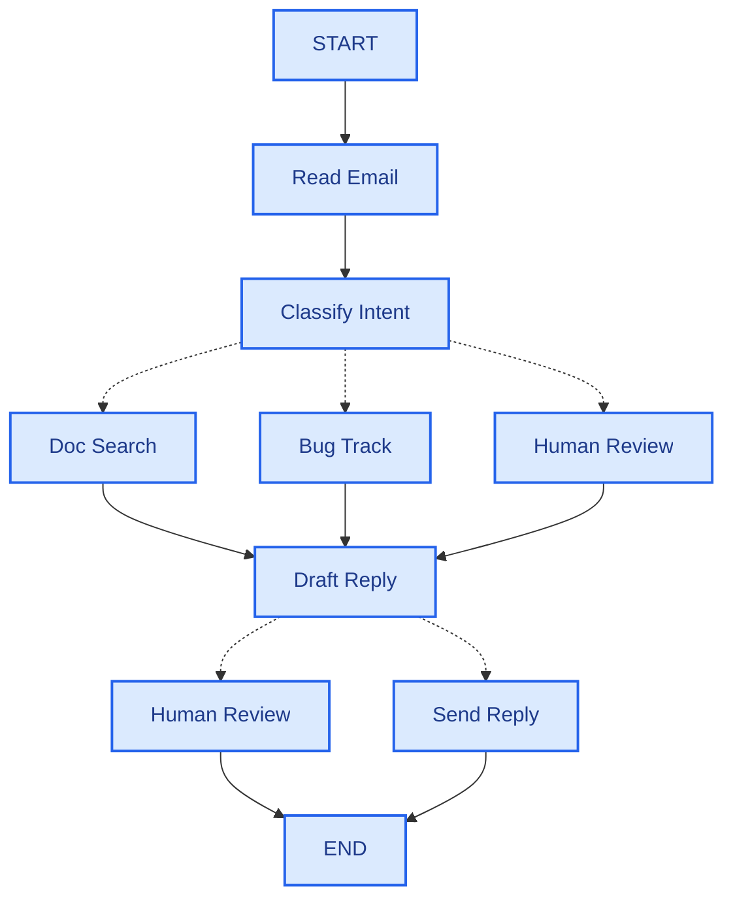

# LangGraph

LangGraph에서 에이전트를 구현하려면 일반적으로 다음 다섯 단계를 따릅니다.

### 1단계: 워크플로를 개별 단계로 구성하기

먼저 프로세스의 각 단계를 명확히 구분합니다. 각 단계는 노드(특정 작업을 수행하는 함수)가 됩니다. 그런 다음 이러한 단계들이 서로 어떻게 연결되는지 스케치합니다.



이 다이어그램의 화살표는 가능한 경로를 보여주지만, 실제로 어떤 경로를 선택할지는 각 노드 내부에서 결정됩니다. 이제 워크플로의 구성 요소를 파악했으니 각 노드가 수행해야 하는 작업을 살펴보겠습니다.

- 이메일 읽기: 이메일 내용을 추출하고 분석합니다.
- 의도 분류: LLM을 사용하여 긴급도와 주제를 분류한 후 적절한 조치로 연결합니다.
- 문서 검색: 지식 기반에서 관련 정보를 검색합니다.
- 버그 추적: 추적 시스템에서 문제를 생성하거나 업데이트합니다.
- 답변 초안 작성: 적절한 답변을 생성합니다.
- 담당자 검토: 승인 또는 처리를 위해 담당자에게 전달합니다.
- 답변 전송: 이메일 답변을 발송합니다.

### 2단계: 각 단계에서 수행해야 할 작업을 파악합니다.

그래프의 각 노드에 대해 해당 노드가 나타내는 작업 유형과 제대로 작동하는 데 필요한 컨텍스트를 결정합니다.

- LLM 단계
  단계에서 이해, 분석, 텍스트 생성 또는 추론 결정이 필요한 경우:

- 데이터 단계
  외부 소스에서 정보를 가져와야 하는 단계:

- 실행 단계
  단계에서 외부 작업을 수행해야 하는 경우:

- 사용자 입력 단계
  사람의 개입이 필요한 단계:

### 3단계: 상태 설계

상태는 에이전트의 모든 노드가 접근할 수 있는 공유 메모리입니다. 에이전트가 프로세스를 진행하면서 학습하고 결정하는 모든 내용을 기록하는 데 사용하는 노트북이라고 생각하면 됩니다.

상태에 무엇이 속해야 할까요?
여러 단계에 걸쳐 유지되어야 하는 데이터는 저장하고, 다른 데이터에서 파생할 수 있는 데이터는 필요할때 계산합니다.

이메일 에이전트의 경우 다음과 같은 정보를 추적해야 합니다.

- 원본 이메일 및 발신자 정보(나중에 복구할 수 없음)
- 분류 결과(여러 하위 노드에서 필요함)
- 검색 결과 및 고객 데이터(다시 가져오는 데 비용이 많이 듦)
- 초안 응답(검토 과정 동안 유지되어야 함)
- 실행 메타데이터(디버깅 및 복구용)

상태는 원시 데이터로 유지하고, 프롬프트는 필요할 때만 포맷하세요.
핵심 원칙은 상태에 포맷되지 않은 원시 데이터를 저장해야 한다는 것입니다. 프롬프트는 필요할 때 노드 내부에서 포맷하세요.
이러한 분리의 이점은 다음과 같습니다.

- 각 노드는 필요에 따라 동일한 데이터를 서로 다른 형식으로 포맷할 수 있습니다.
- 상태 스키마를 수정하지 않고도 프롬프트 템플릿을 변경할 수 있습니다.
- 디버깅이 더 명확해집니다. 각 노드가 어떤 데이터를 수신했는지 정확하게 확인할 수 있습니다.
- 기존 상태를 손상시키지 않고 에이전트를 발전시킬 수 있습니다.

### 4단계: 노드 구현

이제 각 단계를 함수로 구현합니다. LangGraph의 노드는 현재 상태를 입력받아 상태를 업데이트하는 JavaScript 함수입니다.

오류 유형에 따라 적절한 처리 전략이 필요합니다.

- 시스템(자동)
  - 일시적 오류(네트워크 문제, 속도 제한)
  - 재시도 정책: 재시도 시 해결되는 일시적 오류

  ```javascript
  import type { RetryPolicy } from "@langchain/langgraph";

    workflow.addNode(
    "searchDocumentation",
    searchDocumentation,
    {
        retryPolicy: { maxAttempts: 3, initialInterval: 1.0 },
    },
    );
  ```

- LLM
  - LLM 복구 가능 오류(도구 오류, 구문 분석 문제)
  - 오류를 상태에 저장하고 반복 처리
  - LLM이 오류를 확인하고 접근 방식을 조정

  ```javascript
  import { Command, GraphNode } from "@langchain/langgraph";

    const executeTool: GraphNode<typeof State> = async (state, config) => {
    try {
        const result = await runTool(state.toolCall);
        return new Command({
        update: { toolResult: result },
        goto: "agent",
        });
    } catch (error) {
        // Let the LLM see what went wrong and try again
        return new Command({
        update: { toolResult: `Tool error: ${error}` },
        goto: "agent"
        });
    }
    };
  ```

- 사용자 수정
  - 사용자 수정 가능 오류(정보 누락, 불명확한 지침)
  - interrupt() 함수를 사용하여 일시 중지
  - 진행하려면 사용자 입력 필요

  ```javascript
  import { Command, GraphNode, interrupt } from "@langchain/langgraph";

    const lookupCustomerHistory: GraphNode<typeof State> = async (state, config) => {
    if (!state.customerId) {
        const userInput = interrupt({
        message: "Customer ID needed",
        request: "Please provide the customer's account ID to look up their subscription history",
        });
        return new Command({
        update: { customerId: userInput.customerId },
        goto: "lookupCustomerHistory",
        });
    }
    // Now proceed with the lookup
    const customerData = await fetchCustomerHistory(state.customerId);
    return new Command({
        update: { customerHistory: customerData },
        goto: "draftResponse",
    });
    }
  ```

- 개발자 수정
  - 예기치 않은 오류
  - 디버깅이 필요한 알 수 없는 문제

  ```javascript
  import { Command, GraphNode } from "@langchain/langgraph";

    const sendReply: GraphNode<typeof EmailAgentState> = async (state, config) => {
    try {
        await emailService.send(state.responseText);
    } catch (error) {
        throw error;  // Surface unexpected errors
    }
    }
  ```
