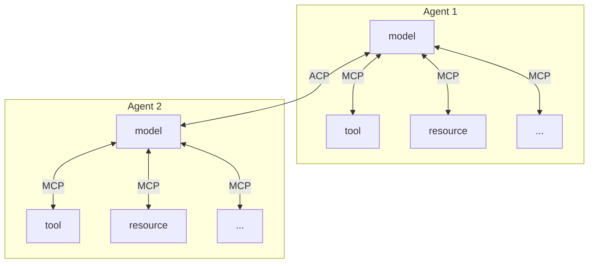

# Model Context Protocol

MCP(Model Context Protocol)는 AI 애플리케이션을 외부 시스템에 연결하기 위한 오픈 소스 표준입니다.

### 사용사례

- 상담원은 사용자의 Google 캘린더와 Notion에 접근하여 더욱 개인화된 AI 비서 역할을 할 수 있습니다.
- Claude Code는 Figma 디자인을 사용하여 전체 웹 앱을 생성할 수 있습니다.
- 기업용 챗봇은 조직 전체의 여러 데이터베이스에 연결하여 사용자가 채팅을 통해 데이터를 분석할 수 있도록 지원합니다.
- AI 모델은 Blender에서 3D 디자인을 만들고 3D 프린터로 출력할 수 있습니다.

### 핵심 구성 요소

- 기본 프로토콜: Core JSON-RPC 메시지 유형
- 수명주기 관리: 연결 초기화, 기능 협상 및 세션 제어
- 권한 부여: HTTP 기반 전송을 위한 인증 및 권한 부여 프레임워크
- 서버 기능: 서버에서 제공하는 리소스, 프롬프트 및 도구
- 클라이언트 기능: 클라이언트에서 제공하는 샘플링 및 루트 디렉터리 목록
- 유틸리티: 로깅 및 인자 자동 완성과 같은 공통 관심사

### Architecture

https://modelcontextprotocol.io/specification/2025-11-25/architecture

# Agent Comunication Protocol

### 소개

에이전트 통신 프로토콜(ACP)은 AI 에이전트, 애플리케이션 및 인간을 연결하는 데 있어 점점 더 중요해지는 과제를 해결하기 위한 개방형 에이전트 상호 운용성 프로토콜입니다. 최신 AI 에이전트는 종종 서로 다른 프레임워크, 팀 및 인프라에 걸쳐 독립적으로 구축됩니다. 이러한 파편화는 혁신을 저해하고 에이전트 간의 효과적인 협업을 어렵게 만듭니다. ACP는 에이전트가 표준화된 RESTful API를 통해 통신할 수 있도록 함으로써 이러한 문제를 해결합니다.

### 현문제점
- 통합 장벽 - 서로 다른 에이전트를 연결하려면 맞춤형 솔루션이 필요합니다.
- 중복 작업 - 팀에서 유사한 기능을 재구축해야 합니다.
- 확장성 문제 - 지점 간 통합은 확장성이 떨어집니다.
- 일관성 없는 개발자 경험 - 각 프레임워크마다 고유한 패턴이 있습니다.

### 사용사례

- Flexible Agent Replacement(유연한 에이전트 교체)
- Multi-Agent Collaboration(다중 에이전트 협업)
- Cross-Platform Integration(크로스 플랫폼 통합)
- Inter-Company Partnerships(기업 간 파트너십)

# A2A

[github.com/a2aproject/a2a-js](http://github.com/a2aproject/a2a-js)

### ACP vs A2A

IBM이 2025년 3월에 출시한 에이전트 통신 프로토콜(ACP)과 구글이 2025년 4월에 출시한 에이전트 간 통신 프로토콜(A2A)은 모두 에이전트 간 통신을 위한 표준 인터페이스를 만드는 것을 목표로 합니다. ACP의 장점은 다음과 같습니다.

- Open Governance
- Co-developed with BeeAI
- REST-based Communication
- Offline Agent Discovery
- Message Structure
- Agent Support
- Native SDK

## ACP vs MCP

AI 모델(주로 LLM)에 컨텍스트(리소스, 도구 등)를 제공합니다. MCP는 LLM과 해당 도구/리소스 간의 연결을 가능하게 하므로 "단일 에이전트" 환경 내에서 효과적으로 작동합니다. 반면, 에이전트 통신 프로토콜(ACP)은 에이전트 간의 통신을 가능하게 하는 프로토콜입니다.

