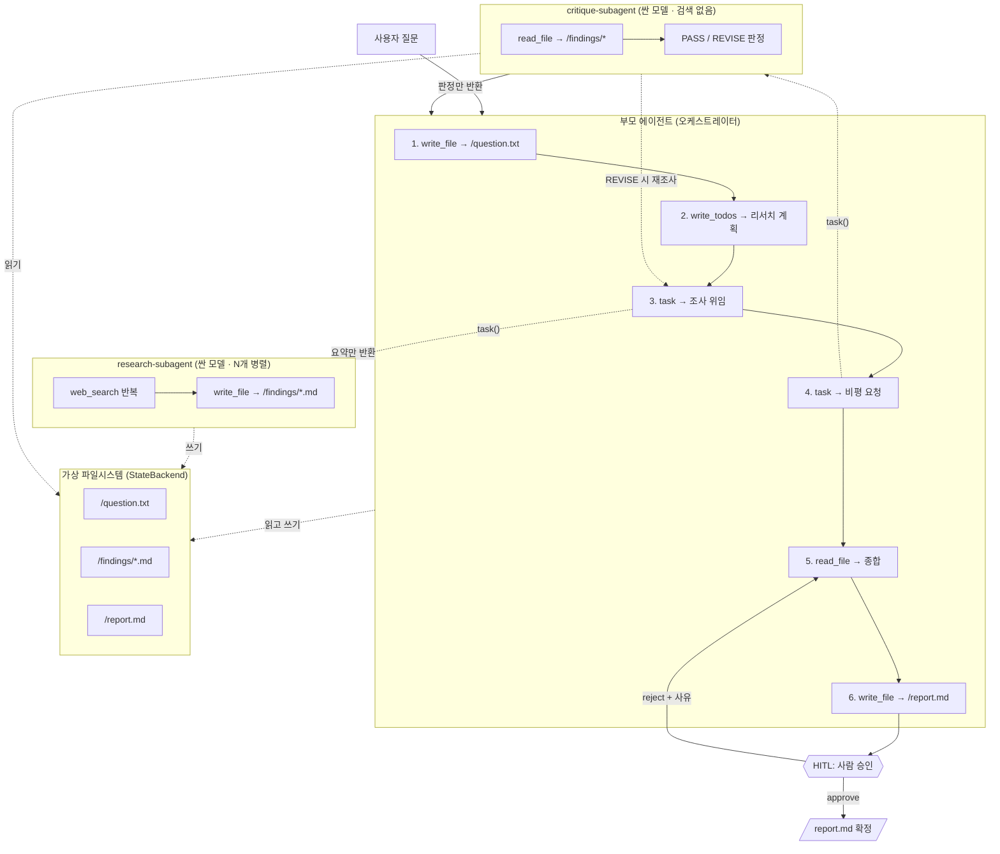

# Step 12 — 종합 프로젝트: 딥 리서치 에이전트

> **학습 목표**
> - 요구사항에서 출발해 딥 리서치 에이전트의 **아키텍처를 직접 설계**한다
> - 검색 도구를 붙이고, **API 키 없이도 도는 목(mock) 검색**으로 개발 루프를 돌린다
> - 조사/비평 **서브에이전트를 역할과 모델별로 분리**하고, 종합은 부모가 맡는 구조를 만든다
> - 파일시스템(`question.txt` / `findings/*.md` / `report.md`)으로 **컨텍스트를 관리**한다
> - `write_todos` 로 리서치 단계를 계획하고, HITL 로 **최종 보고서를 승인**받는다
> - 비용과 품질을 **측정**하고, 어디를 튜닝해야 효과가 큰지 판단한다
>
> **선행 스텝**: Step 01 ~ 11 전부. 특히 [Step 06 — 서브에이전트](../step-06-subagents/), [Step 07 — 시스템 프롬프트 설계](../step-07-prompting/), [Step 09 — HITL과 권한 제어](../step-09-hitl-permissions/)
> **예상 소요**: 180분+

지금까지 Deep Agent 의 부품을 하나씩 봤습니다. 계획(`write_todos`), 파일시스템, 백엔드, 서브에이전트, 프롬프트, 미들웨어, HITL, 스트리밍. 이 스텝에서는 **그 부품을 전부 써서 하나의 완성된 물건**을 만듭니다.

만들 것은 **딥 리서치 에이전트**입니다. 질문을 하나 던지면, 스스로 계획을 세우고, 조사를 서브에이전트에게 나눠 시키고, 결과를 비평하고, 인용이 달린 보고서를 써 냅니다. 이것은 장난감이 아니라 LangChain 이 공식 예제로 제시하는 실제 아키텍처이며, `deepagents` 라이브러리가 존재하는 이유 그 자체입니다.

이 스텝은 문서를 셋으로 나눴습니다.

- **이 문서(`index.md`)** — 처음부터 끝까지 만드는 과정
- [`problems.md`](./problems.md) — 확장 과제 8개 (먼저 스스로 푸세요)
- [`solutions.md`](./solutions.md) — 과제별 정답 코드 + 해설

---

## 12-1. 요구사항과 설계

### 무엇을 만드나

한 문장으로: **"질문 하나를 받아서, 인용이 달린 조사 보고서 하나를 뱉는 CLI"** 입니다.

```bash
npx tsx docs/reference/deepagent/step-12-final-project/cli.ts "RAG와 파인튜닝의 차이는?"
# → /report.md 생성
```

요구사항을 구체적으로 적어 봅시다. 애매한 요구사항은 애매한 에이전트를 만듭니다.

| # | 요구사항 | 왜 |
|---|---|---|
| R1 | 질문을 받아 스스로 조사 계획을 세운다 | 사람이 검색어를 하나하나 지정할 거면 에이전트가 필요 없습니다 |
| R2 | 조사는 서브에이전트에게 위임한다 | 검색 결과 원문이 부모 컨텍스트에 쌓이면 몇 번 만에 터집니다 |
| R3 | 모든 사실 주장에 출처를 단다 | 출처 없는 리서치 보고서는 소설입니다 |
| R4 | 조사 결과를 비평하고, 부족하면 다시 조사한다 | 1회 조사는 거의 항상 구멍이 있습니다 |
| R5 | 중간 산출물을 파일로 남긴다 | 컨텍스트에서 밀려나도 살아남아야 합니다 |
| R6 | 최종 보고서는 사람이 승인한 뒤 확정한다 | 조사 보고서는 되돌리기 어려운 산출물입니다 |
| R7 | API 키 없이도 개발할 수 있어야 한다 | 프롬프트 한 줄 고칠 때마다 돈이 나가면 개발이 안 됩니다 |

R7 은 교육용 편의처럼 보이지만 실무에서도 중요합니다. 검색 API 가 유료이거나 rate limit 이 빡빡할 때, 목(mock)으로 개발 루프를 돌리는 것은 기본기입니다.

### 아키텍처



이 그림에서 **화살표 방향**이 설계의 핵심입니다.

- `web_search` 는 오직 `research-subagent` 만 갖습니다. 부모에게는 없습니다.
- 서브에이전트는 부모에게 **요약만** 돌려줍니다. 검색 결과 원문은 파일에만 남습니다.
- 비평가는 **검색이 없습니다**. 읽고 판정만 합니다.

### 왜 이렇게 나누나 — 컨텍스트 경제학

검색 결과 하나가 8,000자라고 합시다. 조사 10번이면 80,000자, 대략 30,000 토큰입니다. 이걸 전부 부모 컨텍스트에 쌓으면 어떻게 될까요?

| 구조 | 부모 컨텍스트에 쌓이는 것 | 10회 조사 후 |
|---|---|---|
| 부모가 직접 검색 | 검색 결과 원문 10개 | 약 30,000 토큰 — 종합할 여유가 없음 |
| 서브에이전트에 위임 | 요약 10개 (각 300자) | 약 1,000 토큰 — 여유 있음 |

서브에이전트의 존재 이유는 "역할 분담"이 아니라 **컨텍스트 격리**입니다. 이 점을 놓치면 서브에이전트를 써 놓고도 부모에게 검색 도구를 쥐여 주는 실수를 합니다.

> 💡 **실무 팁**: 멀티 에이전트를 설계할 때 "이 에이전트가 무슨 일을 하나"보다 **"이 에이전트의 컨텍스트에 무엇이 쌓이나"** 를 먼저 그리세요. 토큰이 쌓이는 곳이 곧 비용이 터지고 품질이 무너지는 곳입니다. 역할 분담은 그 다음 문제입니다.

> ⚠️ **함정**: 서브에이전트는 부모의 대화 내용을 **볼 수 없습니다.** 부모가 `task()` 에 적어 보낸 지시문이 서브에이전트가 가진 정보의 전부입니다. 이걸 모르고 "위에서 말한 그 주제를 조사해"라고 지시하면, 서브에이전트는 '그 주제'가 뭔지 몰라서 엉뚱한 걸 검색하거나 되묻습니다. 그런데 **에러가 나지 않기 때문에** 조용히 잘못된 조사 결과가 돌아옵니다. 그래서 12-6 의 부모 프롬프트에 "자기완결적으로 지시하라"를 명시적으로 못 박아 둡니다. 이건 의도된 격리이지 버그가 아닙니다 — [Step 06](../step-06-subagents/) 에서 다룬 그 성질입니다.

### 파일 구성

```
step-12-final-project/
├── mock-corpus.ts   ← 목 검색이 뒤질 오프라인 문서 6개
├── tools.ts         ← 검색 도구 (목 / Tavily)
├── prompts.ts       ← 시스템 프롬프트 전문
├── subagents.ts     ← 조사/비평 서브에이전트 + 모델 선택
├── agent.ts         ← createDeepAgent 배선
└── cli.ts           ← 진입점 + HITL 승인 루프
```

프롬프트를 `prompts.ts` 로 뺀 이유가 있습니다. 이 프로젝트에서 **가장 자주 고치는 파일이 프롬프트**입니다. 배선 코드와 섞여 있으면 "프롬프트만 고쳤는데 diff 가 200줄"인 상황이 됩니다.

---

## 12-2. 검색 도구 붙이기

### 목(mock) 검색부터

먼저 **API 키 없이 도는 검색**을 만듭니다. 순서가 중요합니다. 목을 먼저 만들면 프롬프트를 100번 고쳐도 돈이 안 나가고, 결과가 결정적이라 "프롬프트를 고쳤더니 좋아진 건지 검색 결과가 달라진 건지" 헷갈리지 않습니다.

`mock-corpus.ts` 에 문서 6개를 하드코딩해 뒀습니다. 주제는 "RAG vs 파인튜닝"입니다.

```ts
export interface CorpusDoc {
  url: string;
  title: string;
  topic: "general" | "news" | "finance";
  content: string;
}

export const MOCK_CORPUS: CorpusDoc[] = [
  {
    url: "https://example.com/docs/rag-overview",
    title: "RAG(검색 증강 생성) 개요",
    topic: "general",
    content: "...",
  },
  // ... 총 6개
];
```

검색은 임베딩이 아니라 **키워드 점수**로 합니다. 제목에 맞으면 3점, 본문에 맞으면 1점.

```ts
function scoreDoc(queryTokens: string[], doc: CorpusDoc): number {
  const title = doc.title.toLowerCase();
  const content = doc.content.toLowerCase();
  let score = 0;
  for (const t of queryTokens) {
    if (title.includes(t)) score += 3;
    if (content.includes(t)) score += 1;
  }
  return score;
}
```

조잡해 보이지만 의도적입니다. 목 검색의 목적은 "좋은 검색"이 아니라 **"결정적이고 공짜인 검색"** 입니다. 벡터 검색을 흉내 내면 목을 디버깅하는 데 시간을 쓰게 됩니다.

도구 정의는 이렇습니다.

```ts
import { tool } from "langchain";
import * as z from "zod";

export const mockSearch = tool(
  async ({ query, maxResults = 3, topic = "general" }) => {
    const tokens = tokenize(query);
    const pool =
      topic === "general" ? MOCK_CORPUS : MOCK_CORPUS.filter((d) => d.topic === topic);

    const hits = pool
      .map((doc) => ({ doc, score: scoreDoc(tokens, doc) }))
      .filter((x) => x.score > 0)
      .sort((a, b) => b.score - a.score)
      .slice(0, maxResults)
      .map(({ doc }) => ({ url: doc.url, title: doc.title, content: doc.content }));

    return formatHits(query, hits);
  },
  {
    name: "web_search",
    description:
      "웹에서 주제에 대한 정보를 검색합니다. 관련 문서의 제목, URL, 본문을 돌려줍니다. " +
      "사실 확인이 필요한 모든 주장에 대해 호출하세요.",
    schema: z.object({
      query: z.string().describe("검색어. 구체적이고 서술적으로 작성하세요."),
      maxResults: z.number().optional().describe("돌려받을 최대 결과 수 (기본 3)"),
      topic: z
        .enum(["general", "news", "finance"])
        .optional()
        .describe("주제 필터. 'general'(기본) / 'news'(시사) / 'finance'(금융)"),
    }),
  },
);
```

직접 돌려봅시다. 이건 모델을 안 부르므로 **API 키가 전혀 필요 없고 결과가 항상 같습니다.**

```bash
npx tsx docs/reference/deepagent/step-12-final-project/tools.ts
```

**출력** (목 검색은 결정적이므로 매번 동일합니다)

```
'RAG와 파인튜닝의 비용 차이' 에 대해 2건을 찾았습니다:

## [결과 1] RAG와 파인튜닝, 무엇을 언제 쓰나 — 의사결정 가이드
**URL:** https://example.com/blog/rag-vs-finetuning-decision

둘은 경쟁 관계가 아니라 서로 다른 문제를 푼다. 한 문장으로 요약하면:
**RAG는 모델이 '무엇을 아는가'를 바꾸고, 파인튜닝은 '어떻게 행동하는가'를 바꾼다.**
...
---
## [결과 2] RAG 시스템의 비용 구조 분석
**URL:** https://example.com/research/rag-cost-analysis
...
```

### 결과 포맷이 프롬프트다

`formatHits` 를 그냥 지나치지 마세요. 여기가 인용 품질을 결정합니다.

```ts
export function formatHits(query: string, hits: SearchHit[]): string {
  if (hits.length === 0) {
    return `'${query}' 에 대한 검색 결과가 없습니다. 다른 키워드로 다시 시도하세요.`;
  }
  const body = hits
    .map(
      (h, i) =>
        `## [결과 ${i + 1}] ${h.title}\n**URL:** ${h.url}\n\n${h.content}\n\n---`,
    )
    .join("\n");
  return `'${query}' 에 대해 ${hits.length}건을 찾았습니다:\n\n${body}`;
}
```

두 가지 결정이 들어 있습니다.

1. **URL 을 결과마다 `**URL:**` 로 눈에 띄게 박는다.** 모델은 프롬프트에서 본 것만 인용할 수 있습니다. 결과에 URL 이 없으면 "인용을 달아라"고 아무리 시켜도 그럴듯한 URL 을 **지어냅니다**.
2. **빈 결과일 때 빈 문자열이 아니라 문장을 돌려준다.** 빈 문자열을 받으면 모델은 도구가 고장난 건지 결과가 없는 건지 구분하지 못하고 같은 질의를 반복합니다.

> ⚠️ **함정**: 도구가 빈 문자열이나 `[]` 를 돌려주는 것은 조용한 사고의 단골 원인입니다. 에러는 안 납니다. 모델은 그냥 같은 검색을 3번 더 하고, 토큰을 3배 쓰고, 결국 "정보를 찾을 수 없었습니다"라고 답합니다. **도구의 실패와 빈 결과는 반드시 자연어 문장으로 말해 주세요.** 모델은 문장을 읽고 대처할 수 있지만 침묵은 읽지 못합니다.

### 진짜 검색 — Tavily

목으로 프롬프트를 다 다듬은 뒤에 진짜 검색을 붙입니다. [Tavily](https://tavily.com) 는 무료 티어가 있습니다.

```ts
export const tavilySearch = tool(
  async ({ query, maxResults = 3, topic = "general" }) => {
    const apiKey = process.env.TAVILY_API_KEY;
    if (!apiKey) {
      return "TAVILY_API_KEY 가 설정되지 않아 검색할 수 없습니다.";
    }
    try {
      const response = await fetch("https://api.tavily.com/search", {
        method: "POST",
        headers: {
          "Content-Type": "application/json",
          Authorization: `Bearer ${apiKey}`,
        },
        body: JSON.stringify({ query, max_results: maxResults, topic }),
      });
      if (!response.ok) {
        return `검색 실패: Tavily HTTP ${response.status}`;
      }
      const data = (await response.json()) as {
        results?: Array<{ url: string; title: string }>;
      };
      const results = data.results ?? [];

      const hits: SearchHit[] = await Promise.all(
        results.map(async (r) => ({
          url: r.url,
          title: r.title,
          content: await fetchWebpageContent(r.url),
        })),
      );
      return formatHits(query, hits);
    } catch (e) {
      return `검색 실패: ${String(e)}`;
    }
  },
  {
    name: "web_search", // ← 목과 완전히 같은 이름
    description: "...", // ← 목과 완전히 같은 설명
    schema: z.object({ /* ← 목과 완전히 같은 스키마 */ }),
  },
);
```

Tavily 는 URL 과 짧은 스니펫만 돌려줍니다. 깊은 조사를 하려면 본문을 직접 가져와야 합니다.

```ts
async function fetchWebpageContent(url: string, timeoutMs = 10_000): Promise<string> {
  const controller = new AbortController();
  const timer = setTimeout(() => controller.abort(), timeoutMs);
  try {
    const response = await fetch(url, {
      headers: { "User-Agent": "Mozilla/5.0 ..." },
      signal: controller.signal,
    });
    if (!response.ok) {
      return `(${url} 을 가져오지 못했습니다: HTTP ${response.status})`;
    }
    const text = await response.text();
    return text.slice(0, 8_000);  // 본문을 통째로 넣으면 토큰이 터집니다
  } catch (e) {
    return `(${url} 을 가져오지 못했습니다: ${String(e)})`;
  } finally {
    clearTimeout(timer);
  }
}
```

세 가지 방어가 들어 있습니다.

- **`AbortController` 타임아웃**: 응답 없는 서버 하나가 에이전트 전체를 무한정 멈추는 것을 막습니다.
- **`slice(0, 8_000)`**: HTML 태그까지 다 넣으면 문서 하나가 컨텍스트를 삼킵니다.
- **`throw` 하지 않고 문자열 반환**: 아래 함정 참고.
- **`Promise.all` 로 병렬 fetch**: 순차로 하면 결과 수만큼 느려집니다.

> ⚠️ **함정 (도구가 throw 하면 루프가 죽는다)**: `fetch` 실패를 그대로 `throw` 하면 에이전트 루프 전체가 예외로 종료됩니다. 30분간 조사한 결과가 마지막 URL 하나의 404 때문에 통째로 날아갑니다. **도구 안에서는 예외를 잡아서 문자열로 돌려주세요.** 모델은 "가져오지 못했습니다"를 읽고 다른 출처를 찾아갑니다. 이것이 도구 작성의 제1원칙입니다 — 도구는 실패해도 **말로** 실패해야 합니다.

### 자동 선택

두 도구의 이름·설명·스키마가 완전히 같기 때문에, 나머지 코드는 어느 쪽인지 알 필요가 없습니다.

```ts
export function createSearchTool() {
  return process.env.TAVILY_API_KEY ? tavilySearch : mockSearch;
}
```

> 💡 **실무 팁**: 목과 실물의 **이름과 스키마를 반드시 동일하게** 맞추세요. 목 도구 이름을 `mock_search` 로 지으면 프롬프트에 `mock_search` 라고 쓰게 되고, 실물로 갈아끼울 때 프롬프트를 고쳐야 하며, 그 순간 "목에서는 되던 게 실물에서 안 되는" 상황이 시작됩니다. 목의 목적은 **실물과 구분되지 않는 것**입니다.

---

## 12-3. 서브에이전트 설계

### 역할 분리

세 역할로 나눕니다.

| 역할 | 누가 | 도구 | 모델 | 왜 |
|---|---|---|---|---|
| 조사 | `research-subagent` | `web_search` + 파일 | 싼 모델 | 호출이 가장 많음. 일은 단순(검색→요약) |
| 비평 | `critique-subagent` | 파일만 (**검색 없음**) | 싼 모델 | 판정만 함 |
| 종합 | **부모** | 파일만 (**검색 없음**) | 좋은 모델 | 가장 어려운 일 |

**종합을 부모가 하는 이유**는 부모만이 전체 그림을 보기 때문입니다. 서브에이전트는 자기가 조사한 것만 압니다. "A 조사와 B 조사가 서로 모순된다"는 판단은 둘 다 본 사람만 할 수 있습니다.

### 모델 선택

```ts
export const ORCHESTRATOR_MODEL =
  process.env.ORCHESTRATOR_MODEL ?? "anthropic:claude-sonnet-4-6";

export const RESEARCH_MODEL =
  process.env.RESEARCH_MODEL ?? "anthropic:claude-haiku-4-5";

export const CRITIQUE_MODEL = process.env.CRITIQUE_MODEL ?? RESEARCH_MODEL;
```

역할별로 모델을 다르게 두는 것이 이 아키텍처가 주는 **가장 큰 비용 절감 지점**입니다. 조사 서브에이전트는 호출 횟수가 가장 많고 일은 가장 단순합니다. 여기를 싼 모델로 내리면 전체 비용이 눈에 띄게 떨어지는데, 보고서 품질은 거의 그대로입니다 — 종합은 여전히 좋은 모델이 하니까요.

OpenAI 로 돌리려면 환경변수만 바꾸면 됩니다.

```bash
ORCHESTRATOR_MODEL=openai:gpt-5.5 RESEARCH_MODEL=openai:gpt-5.5-mini \
  npx tsx docs/reference/deepagent/step-12-final-project/cli.ts "질문"
```

### 조사 서브에이전트

```ts
import type { SubAgent } from "deepagents";

export const researchSubagent: SubAgent = {
  name: "research-subagent",
  description:
    "웹 검색으로 하나의 구체적인 주제를 깊이 조사하고, 결과를 /findings/ 에 저장한 뒤 요약을 돌려줍니다. " +
    "한 번에 하나의 주제만 주세요. 배경 설명을 포함해 자기완결적으로 지시해야 합니다.",
  systemPrompt: RESEARCHER_PROMPT,
  tools: [createSearchTool()],
  model: RESEARCH_MODEL,
};
```

`description` 을 대충 쓰면 안 됩니다.

> ⚠️ **함정 (description 이 곧 부모의 프롬프트다)**: 부모는 서브에이전트의 `systemPrompt` 를 **볼 수 없습니다.** 부모가 "이 서브에이전트를 언제, 어떻게 부를지" 판단하는 유일한 근거는 `description` 입니다. `description: "리서치 담당"` 이라고만 쓰면 부모는 언제 부를지, 뭘 줘야 할지 모릅니다. 그런데 에러는 안 납니다 — 부모가 그냥 **안 부르고** 혼자 답을 지어내거나, 한 번에 5개 주제를 뭉쳐서 던집니다. `description` 에는 **무엇을 하는지 + 언제 부르는지 + 무엇을 줘야 하는지**를 다 적으세요.

### 비평 서브에이전트

```ts
export const critiqueSubagent: SubAgent = {
  name: "critique-subagent",
  description:
    "/findings/ 의 조사 결과를 심사해 PASS 또는 REVISE 를 판정합니다. 검색은 하지 않습니다. " +
    "인용 누락, 출처 유령, 질문 미달, 근거 빈약, 모순을 찾아냅니다. 조사가 끝난 뒤 호출하세요.",
  systemPrompt: CRITIQUE_PROMPT,
  model: CRITIQUE_MODEL,
};
```

여기서 `tools` 를 **지정하지 않은 것**이 설계입니다. `SubAgent.tools` 의 동작을 정확히 알아야 합니다.

| `tools` 값 | 결과 |
|---|---|
| 생략 | 부모의 도구를 상속. 파일시스템 도구는 그대로 들어옴 |
| `[someTool]` | 지정한 것으로 **교체**. 부모 도구는 안 들어옴 |
| `[]` (빈 배열) | 도구 교체 → 커스텀 도구 없음 |

비평가에게 검색을 주지 않으려고 `tools: []` 라고 쓰고 싶어지지만, 여기서는 생략이 맞습니다. 부모가 `tools: []` 로 만들어져 있어 상속받을 커스텀 도구가 애초에 없고, 파일시스템 도구(`ls`/`read_file`)는 `createFilesystemMiddleware` 가 넣어 주므로 그대로 남습니다.

> 💡 **실무 팁**: 비평가에게 검색 도구를 주지 마세요. 주면 비평가가 심사를 하다 말고 **자기가 조사를 시작합니다.** 그러면 (1) 조사 서브에이전트와 일이 겹치고 (2) 비평 결과에 출처 없는 새 주장이 섞여 들어오고 (3) 비용이 두 배가 됩니다. "이 에이전트가 할 수 없어야 하는 일"을 도구 목록으로 강제하는 것이 프롬프트로 부탁하는 것보다 훨씬 확실합니다. **프롬프트는 부탁이고 도구 목록은 강제입니다.**

---

## 12-4. 파일시스템으로 컨텍스트 관리

### 왜 파일인가

에이전트가 오래 돌면 초반 메시지는 컨텍스트에서 밀려납니다. 요약 미들웨어가 붙어 있으면 요약되면서 디테일이 날아갑니다. **파일은 그 바깥에 있습니다.** 컨텍스트가 어떻게 되든 `read_file` 로 언제든 원본을 다시 가져올 수 있습니다.

파일 구조는 이렇게 씁니다.

| 경로 | 누가 쓰나 | 누가 읽나 | 역할 |
|---|---|---|---|
| `/question.txt` | 부모 (맨 처음) | 부모(마지막 검증), 비평가 | **기준점**. "내가 무슨 질문에 답하고 있었지?" |
| `/findings/<슬러그>.md` | 조사 서브에이전트 | 부모(종합), 비평가 | 조사 원본. 요약 손실 방지 |
| `/report.md` | 부모 (마지막) | 사람 | 최종 산출물 |

`/question.txt` 가 특히 중요합니다. 리서치가 길어지면 에이전트는 **원래 질문에서 표류합니다.** 조사하다 보면 흥미로운 곁가지가 나오고, 그걸 따라가다가 처음 질문과 상관없는 보고서를 씁니다. 원본 질문을 파일로 박아 두고 마지막에 다시 읽게 하는 것은 값싸고 효과적인 방어입니다.

### 백엔드 — StateBackend

백엔드를 지정하지 않으면 기본값은 `StateBackend` 입니다. 파일이 **실제 디스크가 아니라 에이전트 상태(state) 안**에만 존재합니다.

| | `StateBackend` (기본) | `FilesystemBackend` |
|---|---|---|
| 파일 위치 | 에이전트 state 안 (메모리) | 진짜 디스크 |
| 스레드 격리 | 스레드마다 독립 | 전부 공유 |
| 프로세스 재시작 | 사라짐 | 남음 |
| 안전성 | 실제 파일을 건드릴 수 없음 | 실수하면 진짜 파일이 날아감 |

리서치 에이전트에는 `StateBackend` 가 맞습니다. 조사 중간 산출물이 사용자 디스크를 어지럽힐 이유가 없고, 스레드마다 격리되는 것이 자연스럽습니다. 최종 보고서만 `--out` 으로 꺼내면 됩니다.

### 상태에서 파일 꺼내기 — v1/v2 형식

실행이 끝나면 `result.files` 에 파일이 들어 있습니다. 그런데 여기에 함정이 있습니다.

```ts
export function readStateFile(
  files: Record<string, unknown> | undefined,
  path: string,
): string | undefined {
  const entry = files?.[path] as { content?: unknown } | undefined;
  if (!entry) return undefined;

  const content = entry.content;
  if (typeof content === "string") return content;              // v2 텍스트
  if (Array.isArray(content)) return content.join("\n");        // v1 줄 배열
  if (content instanceof Uint8Array) {
    return new TextDecoder().decode(content);                   // v2 바이너리
  }
  return undefined;
}
```

`deepagents` 의 파일 데이터에는 **두 가지 형식**이 있습니다. 타입 정의를 직접 보면 이렇습니다.

```ts
interface FileDataV1 {
  content: string[];        // 줄 배열
  created_at: string;
  modified_at: string;
}

interface FileDataV2 {
  content: string | Uint8Array;   // 텍스트 또는 바이너리
  // ... mime_type 등
}
```

> ⚠️ **함정 (파일 content 형식 가정)**: `result.files["/report.md"].content.join("\n")` 라고 쓰면 v1 에서는 잘 돌아가다가 v2 에서 `TypeError: content.join is not a function` 이 납니다. 반대로 `content` 를 그냥 문자열로 쓰면 v1 에서 `"줄1,줄2"` 처럼 **쉼표로 이어붙은 이상한 문자열**이 조용히 나옵니다(배열의 암묵적 `toString`). 이건 에러도 안 나서 더 나쁩니다. 위처럼 **세 형식을 모두 받아내는 헬퍼 하나**를 만들어 쓰세요. `deepagents` 는 `filesValue` 라는 리듀서도 export 하지만, 단순히 읽기만 할 거면 이 헬퍼로 충분합니다.

---

## 12-5. 계획 — write_todos

`write_todos` 는 `deepagents` 가 기본으로 넣어 주는 도구입니다. 따로 붙일 필요가 없습니다. 우리가 할 일은 **언제 어떻게 쓸지 프롬프트로 지시**하는 것뿐입니다.

부모 프롬프트의 해당 부분:

```
2. **계획**: write_todos 로 리서치 단계를 3~6개의 할 일로 쪼갭니다.
   할 일은 "무엇을 알아낼 것인가"로 쓰세요. "검색한다" 같은 행위가 아니라
   "X의 비용 구조를 파악한다" 처럼.
```

"행위가 아니라 알아낼 것"으로 쓰라는 지시가 핵심입니다. 차이를 보세요.

| 나쁜 todo | 좋은 todo |
|---|---|
| "RAG를 검색한다" | "RAG의 추론 비용 구조와 절감 기법을 파악한다" |
| "자료를 더 찾는다" | "파인튜닝의 데이터셋 구축 비용을 파악한다" |
| "보고서를 쓴다" | "두 방식의 선택 기준을 표로 정리한다" |

왼쪽은 **완료 조건이 없습니다.** "검색한다"는 언제 끝나나요? 한 번 검색하면 끝인가요? 완료 조건이 없는 todo 는 에이전트가 임의로 체크하거나 영원히 붙들고 있습니다. 오른쪽은 "파악했는가?"로 판정할 수 있습니다.

> 💡 **실무 팁**: `write_todos` 의 진짜 효용은 "계획을 세우는 것"보다 **"계획을 컨텍스트에 계속 떠 있게 하는 것"** 입니다. todo 리스트는 매 턴 상태에 남아 모델에게 다시 보입니다. 대화가 길어져 초반 지시가 밀려나도, todo 는 "아직 이게 남았다"를 계속 상기시킵니다. 긴 작업에서 에이전트가 표류하는 것을 막는 값싼 닻입니다.

> ⚠️ **함정**: todo 를 너무 잘게 쪼개면 오히려 나빠집니다. 15개짜리 todo 리스트는 그 자체로 매 턴 수백 토큰을 먹고, 모델이 "todo 관리"에 집중하느라 정작 조사를 얕게 합니다. 3~6개가 적당합니다. 공식 딥 리서치 프롬프트도 "비슷한 조사 과제는 하나의 TODO 로 묶어 오버헤드를 줄이라"고 명시합니다.

---

## 12-6. 시스템 프롬프트 작성

### systemPrompt 는 어디에 붙나

`deepagents` 의 `systemPrompt` 에 문자열을 주면, 그 문자열은 내장 Deep Agent 기본 프롬프트 **앞**에 붙습니다. 기본 프롬프트가 사라지는 게 아닙니다.

```ts
createDeepAgent({
  systemPrompt: "내 프롬프트",  // → "내 프롬프트" + 내장 기본 프롬프트
});
```

기본 프롬프트에는 `write_todos`, 파일 도구, `task` 를 어떻게 쓰는지에 대한 설명이 들어 있습니다. 그래서 우리는 그걸 다시 설명할 필요가 없고, **우리 도메인 규칙만** 쓰면 됩니다.

완전히 갈아엎고 싶으면 구조체를 줍니다.

```ts
createDeepAgent({
  systemPrompt: {
    prefix: "앞에 붙일 것",
    base: null,          // ← 내장 기본 프롬프트 제거
    suffix: "뒤에 붙일 것",
  },
});
```

> ⚠️ **함정**: `base: null` 로 기본 프롬프트를 지우면 `write_todos`, `task`, 파일 도구 사용법 설명이 통째로 사라집니다. 도구는 여전히 붙어 있지만 **모델이 쓰는 법을 모릅니다.** 에러는 안 나고, 그냥 도구를 안 부르거나 이상하게 부릅니다. 특별한 이유가 없으면 `base` 는 건드리지 말고 문자열만 주세요.

### 부모 프롬프트 전문

`prompts.ts` 의 `ORCHESTRATOR_PROMPT` 입니다.

```ts
export const TODAY = new Date().toISOString().split("T")[0];

export const ORCHESTRATOR_PROMPT = `당신은 딥 리서치 오케스트레이터입니다. 오늘 날짜는 ${TODAY} 입니다.

당신의 역할은 **직접 조사하는 것이 아니라, 조사를 지휘하고 결과를 종합하는 것**입니다.
당신에게는 web_search 도구가 없습니다. 모든 조사는 task() 로 서브에이전트에게 위임하세요.

# 작업 절차

아래 순서를 반드시 지키세요.

1. **질문 저장**: write_file 로 사용자의 원래 질문을 \`/question.txt\` 에 그대로 저장합니다.
   나중에 "내가 무슨 질문에 답하고 있었지?"를 확인하는 기준점이 됩니다.
2. **계획**: write_todos 로 리서치 단계를 3~6개의 할 일로 쪼갭니다.
   할 일은 "무엇을 알아낼 것인가"로 쓰세요. "검색한다" 같은 행위가 아니라 "X의 비용 구조를 파악한다" 처럼.
3. **조사 위임**: task() 로 research-subagent 를 호출합니다.
   - 서브에이전트에게는 **한 번에 하나의 구체적인 주제**만 줍니다.
   - 서브에이전트는 당신의 대화 내용을 볼 수 없습니다. 배경을 포함해 **자기완결적으로** 지시하세요.
     나쁜 예: "그것에 대해 더 조사해줘"
     좋은 예: "RAG(검색 증강 생성)의 추론 비용 구조를 조사해라. 특히 토큰 오버헤드와 절감 기법을 다뤄라."
   - 조사 결과는 write_file 로 \`/findings/<주제-슬러그>.md\` 에 저장하라고 지시하세요.
4. **비평**: 조사가 끝나면 task() 로 critique-subagent 를 호출해 \`/findings/\` 를 검토시킵니다.
   비평이 지적한 구멍은 다시 research-subagent 에게 보내 메웁니다.
5. **보고서 작성**: 모든 findings 를 read_file 로 읽고 종합해 \`/report.md\` 에 씁니다.
6. **검증**: \`/question.txt\` 를 다시 읽고, 보고서가 질문의 모든 측면에 답했는지 확인합니다.

# 위임 전략

- **기본은 서브에이전트 1개**입니다. 단순 질문을 여러 개로 쪼개면 토큰만 낭비됩니다.
  "X가 무엇인가" → 1개.
- **명시적 비교나 독립된 축이 있을 때만 병렬로** 나눕니다.
  "A와 B를 비교하라" → A 담당 1개 + B 담당 1개.
  "유럽/아시아/북미의 현황" → 지역별 3개.
- 한 번에 최대 3개까지만 병렬로 띄우세요. 병렬 실행은 한 응답에서 task() 를 여러 번 호출하면 됩니다.
- 위임 라운드는 최대 3회입니다. 그 안에 충분한 근거를 못 모았으면, 모은 것으로 답하고
  보고서에 "무엇을 확인하지 못했는지" 한계를 명시하세요.

# 보고서 작성 규칙

\`/report.md\` 는 다음을 지킵니다.

- 구조: 비교 질문이면 (도입 → A 개요 → B 개요 → 상세 비교 → 결론).
  개요 질문이면 (개요 → 핵심 개념들 → 결론). 목록 질문이면 도입 없이 바로 항목 나열.
- 문체: **평서문, 문단 중심**으로 씁니다. 불릿만 나열하지 마세요.
- 자기 지칭 금지: "제가 조사한 결과", "찾아보니" 같은 표현을 쓰지 마세요.
  보고서는 리서처의 일기가 아니라 **문서**입니다.
- 섹션 제목은 \`##\`, 하위는 \`###\` 를 씁니다.

# 인용 규칙 (엄격)

- 모든 사실 주장 뒤에 \`[1]\`, \`[2]\` 형식으로 출처 번호를 답니다.
- **번호는 URL 단위로 전역에서 유일**해야 합니다. 서로 다른 findings 파일이 같은 URL 을 쓰면 같은 번호를 씁니다.
- 보고서 맨 끝에 \`### 출처\` 섹션을 만들고, 번호 순서대로 빠짐없이(1,2,3...) 나열합니다.
- 형식: \`[1] 문서 제목: URL\` — 한 줄에 하나씩.
- **findings 에 없는 URL 을 지어내지 마세요.** 출처가 없는 주장은 아예 쓰지 마세요.

# 절대 규칙

- 당신은 web_search 를 갖고 있지 않습니다. 조사는 반드시 위임하세요.
- findings 에 근거가 없는 내용을 보고서에 쓰지 마세요. 모르면 "확인되지 않음"이라고 쓰세요.
- 최종 보고서는 반드시 \`/report.md\` 에 write_file 로 저장하세요. 채팅 답변으로만 끝내지 마세요.`;
```

### 왜 날짜를 넣나

```ts
export const TODAY = new Date().toISOString().split("T")[0];
```

> ⚠️ **함정**: 모델은 **오늘이 며칠인지 모릅니다.** 안 알려주면 학습 데이터 시점을 오늘이라고 가정합니다. 리서치 에이전트에서 이건 치명적입니다 — "최신 동향"을 검색하라고 하면 모델이 `2024년 최신 동향` 같은 질의를 만들어 냅니다. 에러는 없습니다. 그냥 **조용히 낡은 정보**를 조사해 옵니다. 시간 개념이 필요한 모든 에이전트의 프롬프트에는 오늘 날짜를 박으세요.

### 조사 서브에이전트 프롬프트에서 중요한 것 — 예산

`RESEARCHER_PROMPT` 의 핵심은 **검색 예산**입니다.

```
# 검색 예산 (반드시 지킬 것)

- 단순한 주제: 검색 **2~3회**.
- 복잡한 주제: 검색 **최대 5회**.
- 5회를 넘기면 무조건 멈추고, 지금까지 찾은 것으로 답하세요.

# 즉시 멈춰야 하는 조건

- 질문에 충분히 답할 수 있게 되었을 때
- 관련 출처를 3개 이상 확보했을 때
- **최근 2회 검색이 비슷한 내용만 돌려줄 때** (더 해도 안 나옵니다)
```

상한이 없으면 모델은 "조금만 더 찾으면 완벽해질 것 같은" 상태에 빠져 검색을 반복합니다. **비용이 터지는 곳이 정확히 여기입니다.** 세 번째 조건("최근 2회가 비슷하면 멈춰라")이 특히 효과적입니다 — 검색이 수렴했다는 신호를 모델이 스스로 감지하게 합니다.

### 비평가 프롬프트에서 중요한 것 — 출력 형식 고정

```
# 출력 형식

반드시 아래 형식으로만 답하세요. 다른 말은 하지 마세요.

판정: PASS 또는 REVISE

PASS 는 위 기준에 걸리는 것이 하나도 없을 때만 줍니다. 어정쩡하면 REVISE 입니다.

REVISE 인 경우, 다음을 각 항목마다 적습니다.
- 문제: (무엇이 잘못되었는가)
- 위치: (어느 파일의 어느 부분인가)
- 조치: (부모가 재조사를 지시할 수 있도록, **구체적인 조사 주제 한 문장**으로 쓸 것)

칭찬하지 마세요. 잘된 점을 적지 마세요. 문제만 적으세요.
```

두 가지 장치가 있습니다.

- **"어정쩡하면 REVISE"**: 모델은 기본적으로 사람을 기쁘게 하려 합니다(sycophancy). 그냥 "평가해라"라고 하면 웬만하면 PASS 를 줍니다. 판정 기준을 비대칭으로 기울여야 비평가가 제 일을 합니다.
- **"칭찬하지 마세요"**: 칭찬은 토큰이고, 부모가 읽어야 할 노이즈입니다. 부모가 필요한 건 "고칠 것"뿐입니다.
- **"조치는 조사 주제 한 문장으로"**: 이렇게 받아야 부모가 그 문장을 그대로 `task()` 에 넣어 재조사를 시킬 수 있습니다. 비평 결과를 **다음 행동으로 바로 변환 가능한 모양**으로 받는 것입니다.

> 💡 **실무 팁**: 판정을 더 확실히 기계가 읽게 하려면 `responseFormat` 에 zod 스키마를 주세요. `SubAgent.responseFormat` 을 지정하면 서브에이전트가 구조화된 JSON 을 돌려주고, 부모는 문자열 파싱 없이 `verdict === "REVISE"` 로 분기할 수 있습니다. [`problems.md`](./problems.md) 의 과제 2 가 정확히 이걸 다룹니다.

---

## 12-7. HITL — 최종 보고서 승인

### 무엇을 언제 멈출 것인가

`interruptOn` 으로 특정 도구 호출 직전에 멈춰 사람의 승인을 받습니다.

```ts
export function buildResearchAgent(options: BuildOptions = {}) {
  const { requireApproval = false } = options;

  const checkpointer = requireApproval ? new MemorySaver() : undefined;

  return createDeepAgent({
    model: ORCHESTRATOR_MODEL,
    systemPrompt: ORCHESTRATOR_PROMPT,
    tools: [],
    subagents: allSubagents,
    checkpointer,
    interruptOn: requireApproval
      ? {
          write_file: {
            allowedDecisions: ["approve", "edit", "reject"],
            when: (request) =>
              String(request.toolCall.args.file_path ?? "") === "/report.md",
          },
        }
      : undefined,
  });
}
```

`when` 술어가 핵심입니다.

> ⚠️ **함정 (승인 지옥)**: `interruptOn: { write_file: true }` 라고 쓰면 **모든** `write_file` 에서 멈춥니다. `/question.txt` 저장할 때 멈추고, findings 5개 저장할 때마다 멈추고, 마지막에 또 멈춥니다. 승인 창이 7번 뜹니다. 사람은 3번째쯤에 내용을 안 읽고 `y` 를 누르기 시작하고, 그 순간 HITL 은 **아무것도 지키지 못하는 형식적 절차**로 전락합니다. `when` 으로 **정말 되돌리기 어려운 것 하나**만 거세요. 승인 요청은 희소해야 사람이 읽습니다.

### 체크포인터가 없으면 HITL 이 안 된다

```ts
const checkpointer = requireApproval ? new MemorySaver() : undefined;
```

> ⚠️ **함정**: `interruptOn` 만 주고 `checkpointer` 를 안 주면 HITL 이 동작하지 않습니다. `interrupt` 는 "여기서 멈췄다"는 상태를 어딘가에 적어야 나중에 이어서 재개할 수 있는데, 그 어딘가가 체크포인터입니다. `SubAgent.interruptOn` 의 타입 문서에도 "Requires a checkpointer" 라고 못 박혀 있습니다. 그리고 재개할 때는 반드시 **같은 `thread_id`** 로 호출해야 합니다 — thread_id 가 다르면 체크포인터는 그냥 새 대화로 취급합니다.

### 승인 루프

```ts
const config = { configurable: { thread_id: crypto.randomUUID() } };

let result = await agent.invoke(input, { ...config, recursionLimit: 100 });

while (requireApproval && "__interrupt__" in result) {
  const interrupts = (result as Record<string, unknown>)["__interrupt__"] as Array<{
    value?: unknown;
  }>;

  const payload = interrupts?.[0]?.value as
    | { actionRequests?: Array<{ name: string; args: Record<string, unknown> }> }
    | undefined;
  const action = payload?.actionRequests?.[0];

  const draft = String(action?.args?.content ?? "");
  console.log(draft.slice(0, 1_500));

  const rl = readline.createInterface({ input: stdin, output: stdout });
  const answer = (await rl.question("승인하시겠습니까? [y=승인 / n=거절] : "))
    .trim()
    .toLowerCase();
  rl.close();

  if (answer === "y") {
    result = await agent.invoke(
      new Command({ resume: { decisions: [{ type: "approve" }] } }),
      { ...config, recursionLimit: 100 },
    );
  } else {
    // ... 거절 사유를 받아서
    result = await agent.invoke(
      new Command({ resume: { decisions: [{ type: "reject", message: reason }] } }),
      { ...config, recursionLimit: 100 },
    );
  }
}
```

구조가 결정적인 것들이라 정확히 적습니다.

| 항목 | 정확한 값 |
|---|---|
| 인터럽트 감지 | 결과 객체에 `__interrupt__` 키가 생김 |
| 인터럽트 페이로드 | `interrupts[0].value` → `{ actionRequests, reviewConfigs }` |
| 재개 방법 | `agent.invoke(new Command({ resume: ... }), config)` |
| resume 페이로드 | `{ decisions: [Decision] }` — **배열이 아니라 객체** |
| Decision 종류 | `{ type: "approve" }` / `{ type: "edit", editedAction }` / `{ type: "reject", message? }` |

`while` 로 감싼 이유는, 거절하면 모델이 보고서를 다시 쓰려 하고 그러면 **또 인터럽트가 걸리기 때문**입니다. `if` 로 한 번만 처리하면 두 번째 인터럽트가 처리되지 않은 채 프로그램이 끝나 버립니다.

> ⚠️ **함정 (resume 페이로드 모양)**: `resume` 에 `[{ type: "approve" }]` 처럼 배열을 바로 주거나 `{ type: "approve" }` 처럼 Decision 하나를 주면 안 됩니다. `{ decisions: [...] }` 객체여야 합니다. 모양이 틀리면 재개가 조용히 실패하거나 이상한 곳에서 터집니다. 한 번에 여러 도구 호출이 승인 대기할 수 있어서 `decisions` 가 배열인 것입니다.

> 💡 **실무 팁**: 승인 화면에 보고서 전문을 다 뿌리면 터미널이 넘쳐서 사람이 앞부분을 못 봅니다. `draft.slice(0, 1_500)` 로 앞부분만 보여주고 총 길이를 알려주는 게 실용적입니다. 진짜 프로덕션이라면 `--out` 으로 파일에 떨궈 에디터로 보게 하거나, 웹 UI 에서 diff 를 보여줍니다.

---

## 12-8. CLI로 돌려보기

### 준비

```bash
cd docs/reference/deepagent
npm install
```

`.env` 에 키를 넣습니다.

```bash
# 모델 호출에는 반드시 필요합니다
ANTHROPIC_API_KEY=sk-ant-...

# 없어도 됩니다. 없으면 목 검색으로 동작합니다.
TAVILY_API_KEY=tvly-...
```

> 💡 **실무 팁**: `TAVILY_API_KEY` 없이 시작하세요. 목 검색으로 전체 흐름이 도는 것을 먼저 확인하고, 그 다음에 실제 검색을 붙이는 게 순서입니다. 목에서 안 되는 게 실물에서 될 리 없고, 목에서는 문제를 5초 만에 재현할 수 있습니다.

### 실행

```bash
npx tsx docs/reference/deepagent/step-12-final-project/cli.ts "RAG와 파인튜닝의 주요 차이점은 무엇인가?"
```

승인을 켜려면:

```bash
npx tsx docs/reference/deepagent/step-12-final-project/cli.ts --approve "RAG와 파인튜닝의 차이는?"
```

보고서를 파일로 꺼내려면:

```bash
npx tsx docs/reference/deepagent/step-12-final-project/cli.ts --out ./report.md "질문"
```

### 실행 로그

배너는 **결정적**입니다. 항상 이 모양입니다.

```
========================================================================
딥 리서치 에이전트
========================================================================
질문   : RAG와 파인튜닝의 주요 차이점은 무엇인가?
검색   : Mock (오프라인 코퍼스)
승인   : 켜짐 (/report.md 쓰기 전 확인)
========================================================================
```

`검색` 줄이 `Mock (오프라인 코퍼스)` 인지 `Tavily (실제 웹)` 인지로 **지금 뭐가 붙어 있는지**를 항상 확인할 수 있습니다. 이 한 줄이 "왜 결과가 이상하지?" 를 디버깅하는 시간을 크게 줄여 줍니다.

그 다음부터는 모델이 하는 일이라 **매번 다릅니다.** 아래는 흐름을 보여주기 위한 **예시**입니다.

**출력 예시** (모델 응답이므로 매번 다릅니다 — 위임 횟수, 파일 이름, 보고서 문장이 모두 달라집니다)

```
------------------------------------------------------------------------
[승인 요청] 에이전트가 최종 보고서를 쓰려 합니다.
------------------------------------------------------------------------
# RAG와 파인튜닝의 주요 차이점

## 개요

RAG(검색 증강 생성)와 파인튜닝은 대규모 언어 모델을 특정 용도에 맞추는 두 가지
접근이다. 둘은 경쟁 관계가 아니라 서로 다른 문제를 해결한다. RAG는 모델이 무엇을
아는가를 바꾸고, 파인튜닝은 모델이 어떻게 행동하는가를 바꾼다 [1].

## RAG

RAG는 모델의 가중치를 변경하지 않고, 질문과 관련된 문서를 외부 저장소에서 검색해
프롬프트에 포함시키는 방식이다 [2]. ...

... (총 4820자 중 앞 1500자만 표시)
------------------------------------------------------------------------
승인하시겠습니까? [y=승인 / n=거절] : y

========================================================================
생성된 파일
========================================================================
  /findings/fine-tuning-overview.md  (1204자)
  /findings/rag-overview.md  (1388자)
  /question.txt  (31자)
  /report.md  (4820자)

========================================================================
최종 보고서 (/report.md)
========================================================================
# RAG와 파인튜닝의 주요 차이점
...
### 출처
[1] RAG와 파인튜닝, 무엇을 언제 쓰나 — 의사결정 가이드: https://example.com/blog/rag-vs-finetuning-decision
[2] RAG(검색 증강 생성) 개요: https://example.com/docs/rag-overview

========================================================================
사용량 (부모 에이전트만 — 서브에이전트 토큰은 포함되지 않습니다)
========================================================================
  입력 토큰 : 24,183
  출력 토큰 : 3,401
  메시지 수 : 14
```

### 무엇이 결정적이고 무엇이 아닌가

이 구분은 이 코스 전체에서 가장 중요한 습관입니다.

| 결정적 (테스트로 검증 가능) | 비결정적 (검증 불가) |
|---|---|
| 배너 형식, `검색 :` 줄의 값 | 조사 위임 횟수 |
| 목 검색의 결과와 순서 | findings 파일 이름 |
| `result.files` 가 객체라는 것 | 생성된 파일 개수 |
| `__interrupt__` 키의 존재와 구조 | 보고서 문장 |
| `usage_metadata` 필드명 | 토큰 수 |
| `/report.md` 경로 | 인용 번호 매핑 |

> ⚠️ **함정 (temperature: 0 이 결정성을 보장하지 않는다)**: 위 표의 오른쪽을 `temperature: 0` 으로 결정적으로 만들 수 있다고 생각하기 쉽지만 **아닙니다.** temperature 0 은 샘플링에서 최고 확률 토큰을 고르게 할 뿐이고, 부동소수점 연산 순서, 배치 구성, 서버 측 모델 업데이트 때문에 같은 입력에도 다른 출력이 나옵니다. 게다가 이 에이전트는 서브에이전트를 병렬로 띄우므로 **결과가 돌아오는 순서 자체가 비결정적**입니다. 에이전트 테스트는 "출력 문자열 비교"가 아니라 **"구조와 불변식 검사"** 로 써야 합니다. 예: `/report.md` 가 존재하는가, 출처 섹션이 있는가, 본문의 모든 `[n]` 이 출처 목록에 있는가. 이것이 [`problems.md`](./problems.md) 과제 7(평가 하네스)의 주제입니다.

### recursionLimit

```ts
let result = await agent.invoke(input, { ...config, recursionLimit: 100 });
```

> ⚠️ **함정**: `recursionLimit` 기본값은 **25** 입니다. 딥 리서치에는 턱없이 부족합니다. 계획 → 위임 → 비평 → 재조사 → 종합만 해도 스텝이 수십 개입니다. 넘으면 `GraphRecursionError` 가 나면서 **그때까지의 작업이 통째로 날아갑니다.** 이걸 보고 "무한 루프에 빠졌나?" 하고 프롬프트를 고치기 시작하는 게 전형적인 함정인데, 대개는 그냥 **일이 많은 것**입니다. 딥 리서치처럼 긴 작업은 100 이상으로 넉넉히 주세요. 공식 문서도 프론트엔드 연동 시 "긴 실행이 잘리지 않도록 recursionLimit 을 높게 설정하라"고 권합니다. 물론 진짜 무한 루프도 있으니, 한도를 올리기 전에 로그로 같은 도구를 반복 호출하는지 한 번은 확인하세요.

---

## 12-9. 비용/품질 측정과 개선

### 측정 먼저

```ts
const messages = result.messages ?? [];
let inputTokens = 0;
let outputTokens = 0;
for (const m of messages) {
  const usage = (m as unknown as { usage_metadata?: unknown }).usage_metadata as
    | { input_tokens?: number; output_tokens?: number }
    | undefined;
  if (usage) {
    inputTokens += usage.input_tokens ?? 0;
    outputTokens += usage.output_tokens ?? 0;
  }
}
```

`usage_metadata` 의 필드명은 결정적입니다: `input_tokens`, `output_tokens`, `total_tokens`. (스네이크 케이스입니다 — 카멜 케이스로 쓰면 `undefined` 가 나오는데 **에러는 안 나고 조용히 0 이 됩니다.**)

> ⚠️ **함정 (서브에이전트 토큰은 안 잡힌다)**: 위 코드가 세는 것은 **부모 메시지의 토큰뿐**입니다. 서브에이전트가 쓴 토큰은 부모의 `messages` 에 나타나지 않습니다 — 그게 컨텍스트 격리의 요점이니까요. 그런데 이 아키텍처에서는 **토큰의 대부분을 서브에이전트가 씁니다**(검색 결과 원문을 읽는 게 걔들이니까). 그래서 이 숫자만 보고 "우리 에이전트 싸네"라고 결론 내리면 실제 청구서와 몇 배 차이가 납니다. 그래서 CLI 출력에도 "부모 에이전트만"이라고 명시해 뒀습니다. **전체 비용을 보려면 LangSmith 같은 추적 도구를 붙여야 합니다** — 서브에이전트 호출까지 트레이스로 잡힙니다.

### 실제로 무엇을 튜닝했나

이 프로젝트를 만들면서 실제로 손댄 것들입니다.

**1. 조사 모델을 Sonnet → Haiku 로 내렸다.**

조사 서브에이전트가 하는 일은 "검색 결과를 읽고 요약"입니다. 어려운 추론이 아닙니다. 반면 호출 횟수는 가장 많습니다. 여기를 내리는 게 비용 대비 효과가 가장 큽니다. 종합은 여전히 Sonnet 이 하므로 보고서 품질은 유지됩니다.

**2. 검색 예산을 프롬프트에 박았다.**

예산 문구가 없을 때 조사 서브에이전트는 검색을 계속 반복했습니다. "최근 2회 검색이 비슷하면 멈춰라"는 조건이 특히 잘 들었습니다.

**3. 본문을 8,000자로 잘랐다.**

`fetchWebpageContent` 의 `slice(0, 8_000)`. HTML 전문을 넣으면 문서 하나가 컨텍스트를 삼킵니다. 자르지 않으면 조사 3번 만에 서브에이전트 컨텍스트가 한계에 부딪힙니다.

**4. 부모에게서 검색 도구를 뺐다.**

초기 버전에서는 부모에게도 `web_search` 를 줬습니다(공식 예제도 부모 `tools` 에 검색을 넣습니다). 그랬더니 부모가 위임하지 않고 **직접 검색하기 시작했습니다.** 프롬프트로 "직접 조사하지 마라"고 아무리 말해도, 도구가 손에 있으면 씁니다. 빼는 게 확실합니다.

**5. `when` 으로 승인 대상을 `/report.md` 하나로 좁혔다.**

처음엔 `write_file: true` 로 걸었다가 승인 창이 7번 떠서 실습이 불가능했습니다.

> 💡 **실무 팁**: 위 5개 중 **4번과 5번은 프롬프트가 아니라 구조를 바꾼 것**입니다. 에이전트가 말을 안 들을 때 프롬프트를 더 강하게 쓰는 것은 대개 지는 싸움입니다. "하지 마라"고 열 번 쓰는 것보다 **할 수 없게 만드는 것**(도구를 빼거나, 술어로 막거나)이 언제나 확실합니다. 프롬프트 튜닝은 구조로 해결이 안 될 때의 차선책입니다.

### 품질은 어떻게 재나

비용은 숫자로 나오지만 품질은 그렇지 않습니다. 그래서 **불변식(invariant)** 을 검사합니다.

| 검사 | 무엇을 잡나 |
|---|---|
| `/report.md` 가 존재하는가 | 채팅으로만 답하고 파일을 안 쓴 경우 |
| `### 출처` 섹션이 있는가 | 인용 규칙 무시 |
| 본문의 모든 `[n]` 이 출처 목록에 있는가 | **출처 유령** (지어낸 인용) |
| 출처 목록의 모든 URL 이 findings 에 있는가 | **URL 환각** |
| 출처 번호가 1부터 빈틈없이 이어지는가 | 번호 매핑 실패 |

이 검사들은 전부 **결정적**이라 CI 에서 돌릴 수 있습니다. 모델 출력이 매번 달라도 이 불변식은 항상 성립해야 합니다. [`problems.md`](./problems.md) 의 과제 1(인용 강제)과 과제 7(평가 하네스)이 이것을 구현합니다.

> 💡 **실무 팁**: 에이전트 품질 평가에서 "LLM 에게 채점을 시키는" 방법(LLM-as-judge)은 편리하지만 마지막에 쓰세요. 먼저 **기계적으로 검사 가능한 불변식**을 최대한 짜내는 게 순서입니다. 훨씬 싸고, 빠르고, 무엇보다 판정이 흔들리지 않습니다. judge 는 "글이 잘 읽히는가" 같은 진짜 주관적인 것에만 씁니다. 그리고 judge 를 쓴다면 최소 수십 개는 사람이 직접 채점해서 judge 와 일치하는지 검증한 뒤에 신뢰하세요.

---

## 12-10. 한계와 다음 단계

지금 만든 것의 한계를 정직하게 적습니다. 이걸 아는 것이 다음 단계입니다.

| 한계 | 지금 상태 | 어떻게 넘나 |
|---|---|---|
| 비평이 재조사로 이어지지 않음 | 비평 결과를 부모가 읽지만, REVISE 라도 재조사가 강제되지 않음 | 과제 2 — 구조화된 판정 + 루프 |
| 조사가 순차적 | 프롬프트로 병렬을 권할 뿐, 강제하지 못함 | 과제 3 — 병렬 위임 |
| 토큰 상한이 없음 | 예산은 프롬프트 부탁일 뿐. 모델이 어기면 그만 | 과제 4 — 미들웨어로 하드 상한 |
| 재시작하면 다 날아감 | `MemorySaver` 는 프로세스 메모리 | 과제 5 — `SqliteSaver` 등 |
| 도메인이 고정 | 프롬프트에 리서치가 하드코딩됨 | 과제 6 — 다른 도메인 이식 |
| 품질 측정이 수동 | 사람이 눈으로 봄 | 과제 7 — 평가 하네스 |
| CLI 뿐 | 터미널에서만 | 과제 8 — 웹 UI |
| 서브에이전트 비용이 안 보임 | 부모 토큰만 셈 | LangSmith 추적 |
| 목 코퍼스가 6개뿐 | 오프라인 실습용 | Tavily 붙이기 |

이 한계들이 [`problems.md`](./problems.md) 의 과제 8개와 그대로 대응합니다. 문제를 위한 문제가 아니라, **실제로 이 프로젝트에 남아 있는 구멍**입니다.

---

## 정리

| 설계 결정 | 이유 |
|---|---|
| 부모에게 검색 도구를 안 줌 | 컨텍스트 격리. 프롬프트가 아니라 구조로 강제 |
| 조사/비평은 싼 모델, 종합은 좋은 모델 | 호출이 많고 쉬운 일에 비용이 몰림 |
| 비평가에게 검색 없음 | 있으면 심사 대신 조사를 시작함 |
| 목 검색을 먼저 만듦 | 공짜 + 결정적 → 개발 루프가 빨라짐 |
| 목과 실물의 이름·스키마 동일 | 프롬프트 수정 없이 교체 |
| `/question.txt` 를 남김 | 긴 리서치에서 원 질문 표류 방지 |
| `StateBackend` (기본값) | 사용자 디스크를 안 건드림, 스레드 격리 |
| `when` 으로 `/report.md` 만 승인 | 승인이 희소해야 사람이 읽음 |
| `recursionLimit: 100` | 기본 25는 딥 리서치에 부족 |
| 도구는 예외를 문자열로 반환 | throw 하면 루프 전체가 죽음 |

**핵심 함정 3가지**

1. **서브에이전트는 부모 컨텍스트를 못 본다.** 의도된 격리인데, 모르고 "그것에 대해 조사해"라고 지시하면 에러 없이 엉뚱한 조사가 돌아온다. `task()` 지시는 자기완결적으로.
2. **`interruptOn` 만 주고 `checkpointer` 를 안 주면 HITL 이 안 된다.** 그리고 `when` 없이 걸면 승인 창이 쏟아져서 사람이 안 읽고 `y` 를 누른다 — 형식만 남고 안전은 사라진다.
3. **`temperature: 0` 은 결정성을 보장하지 않는다.** 게다가 병렬 서브에이전트는 완료 순서 자체가 비결정적이다. 에이전트 테스트는 출력 비교가 아니라 **불변식 검사**로 써야 한다.

**부수적으로 알아야 할 것들**

- 파일 `content` 는 `string[]`(v1) 일 수도 `string | Uint8Array`(v2) 일 수도 있다. 가정하면 조용히 깨진다.
- `usage_metadata` 는 스네이크 케이스(`input_tokens`)이고, **서브에이전트 토큰은 안 잡힌다.**
- `createDeepAgent` 는 1.11.0 기준 Promise 를 반환하지 않는다 — `await` 를 붙여도 무해하고(공식 문서도 붙여 씁니다), 향후 비동기화에 대비해 붙여 두는 편이 안전하다.
- `systemPrompt` 문자열은 내장 기본 프롬프트를 **대체하지 않고 앞에 붙는다.** `base: null` 로 지우면 도구 사용법 설명이 사라진다.

---

## 연습문제

확장 과제 8개는 [`problems.md`](./problems.md) 에 있습니다. 정답과 해설은 [`solutions.md`](./solutions.md) 입니다.

1. **인용 강제하기** — 출처 없는 주장을 기계적으로 잡아내기
2. **비평 → 재조사 루프** — 비평가가 REVISE 를 내면 강제로 다시 조사시키기
3. **병렬 조사** — 여러 서브에이전트를 실제로 동시에 띄우기
4. **토큰 예산 상한** — 프롬프트 부탁이 아니라 미들웨어로 하드 상한
5. **중단 후 재개** — 프로세스를 껐다 켜도 이어서 하기
6. **다른 도메인으로 이식** — 리서치가 아닌 것 만들기
7. **평가 하네스** — 품질을 자동으로 재기
8. **웹 UI** — 스트리밍으로 진행 상황 보여주기

**먼저 스스로 푸세요.** 8개 중 5개를 풀면 이 코스를 완주한 것입니다.

---

## 이제 무엇을 할 수 있게 되었나

Step 01 의 "Deep Agent 가 뭔가요"에서 여기까지 왔습니다. 이제 할 수 있는 것들입니다.

**만들 수 있는 것**

- 계획(`write_todos`)을 세우고 스스로 실행하는 장기 실행 에이전트
- 컨텍스트 격리를 위해 **서브에이전트로 일을 쪼개는** 아키텍처
- 가상 파일시스템으로 컨텍스트 한계를 넘어 **중간 산출물을 관리**하는 구조
- 역할별로 모델을 나눠 **비용을 통제**하는 시스템
- 되돌리기 어려운 행동 앞에서 **사람에게 물어보는** HITL
- 권한과 도구 목록으로 **에이전트가 할 수 없는 일을 강제**하는 가드레일

**판단할 수 있는 것**

- 이 일을 서브에이전트로 나눠야 하는가, 하나로 두는 게 나은가 (기준: 컨텍스트에 무엇이 쌓이나)
- 이 문제를 프롬프트로 고칠 것인가, 구조로 고칠 것인가 (기본: 구조)
- 이 도구를 이 에이전트에게 줘도 되는가 (기준: 주면 그걸로 뭘 할까)
- 어디를 승인 지점으로 삼을 것인가 (기준: 되돌리기 어려운가)
- 무엇이 결정적이고 무엇이 아닌가 (테스트를 어디에 걸 것인가)

**디버깅할 수 있는 것**

- 서브에이전트가 엉뚱한 걸 조사할 때 → `task()` 지시가 자기완결적인가, `description` 이 충분한가
- 에이전트가 도구를 안 부를 때 → `description` 이 프롬프트 역할을 하는가
- `GraphRecursionError` → 진짜 루프인가 그냥 일이 많은가
- HITL 이 안 걸릴 때 → 체크포인터가 있는가, `thread_id` 가 같은가
- 비용이 예상보다 클 때 → 어느 에이전트의 컨텍스트에 뭐가 쌓이는가

---

## 더 배울 것

### 1) 관측성 — 지금 가장 시급한 것

이 프로젝트의 가장 큰 구멍은 **서브에이전트 비용이 안 보인다**는 것입니다. LangSmith 를 붙이면 서브에이전트 호출까지 트레이스로 잡혀서, 어느 서브에이전트가 몇 토큰을 썼는지, 어느 도구가 몇 번 불렸는지가 다 보입니다.

```bash
LANGSMITH_TRACING=true
LANGSMITH_API_KEY=lsv2_...
```

환경변수만 넣으면 코드 수정 없이 켜집니다. 프로덕션에 올릴 거라면 이게 1번입니다. → [LangChain Step 19 — 관측·테스트·평가](../../langchain/step-19-observability-eval/)

### 2) 프로덕션 배포

지금은 CLI 입니다. 실제 서비스로 만들려면 생각할 게 더 있습니다.

- **스레드/유저/어시스턴트** 세 가지 스코프를 구분해 설계하기
- **`CompositeBackend`** 로 스레드 임시 공간(`StateBackend`)과 영구 저장(`StoreBackend`)을 조합하기
- **인증/멀티테넌시** — 유저별 메모리 격리
- **영구 체크포인터** — `MemorySaver` 말고 진짜 DB
- **`langgraph.json`** 으로 배포 설정

→ [Step 11 — 스트리밍과 프로덕션](../step-11-streaming-production/), [LangChain Step 20 — 프로덕션](../../langchain/step-20-production/)

> ⚠️ **함정 (공유 메모리는 프롬프트 인젝션 통로다)**: 공식 문서가 명시적으로 경고합니다 — 한 유저가 쓴 메모리를 다른 유저의 대화가 읽을 수 있으면, 악의적 유저가 **지시문을 심을 수 있습니다.** 메모리를 유저 단위(`(user_id)`)로 격리하는 게 기본이고, 공유해야 한다면 읽기 전용 정책 문서 정도로 제한하세요.

### 3) 샌드박스와 코드 실행

`execute` 도구는 샌드박스 백엔드에서만 동작합니다. 에이전트에게 코드 실행을 시키면 할 수 있는 일이 크게 늘어나지만(데이터 분석, 차트 생성), 격리된 컨테이너와 시크릿 관리가 필요합니다. 공식 문서는 **auth proxy** 로 시크릿이 컨테이너 안에 아예 들어가지 않게 하는 방식을 권합니다.

### 4) 스킬과 메모리

`skills` 로 절차적 지식을, `memory`(AGENTS.md)로 지속적 지침을 주입할 수 있습니다. 이 프로젝트의 프롬프트가 길어진다면, 보고서 작성 규칙을 스킬로 빼는 게 자연스러운 다음 단계입니다. → [Step 10 — 장기 메모리와 스킬](../step-10-memory-skills/)

### 5) 더 넓게

- **MCP** — 도구를 직접 만들지 않고 표준 프로토콜로 붙이기
- **LangGraph 직접 쓰기** — `createDeepAgent` 가 못 하는 흐름 제어가 필요할 때 → [LangChain Step 17 — LangGraph](../../langchain/step-17-langgraph/)
- **RAG 붙이기** — 웹 검색 대신 사내 문서를 조사하게 하기 → [LangChain Step 16 — 검색과 RAG](../../langchain/step-16-retrieval-rag/)
- **평가 문화** — 이게 진짜 어려운 것입니다. 코드는 하루면 짜지만, "우리 에이전트가 좋아졌는가"를 말할 수 있게 되는 데는 훨씬 오래 걸립니다.

---

## 코스를 마치며

Step 01 에서 "Deep Agent 는 그냥 도구 루프에 파일시스템과 계획을 얹은 것"이라는 이야기로 시작했습니다. 여기까지 오고 나면 그 문장이 다르게 읽힐 겁니다. 어려운 건 부품이 아니라 **부품을 어떻게 배치하느냐**였습니다.

이 코스에서 반복해서 나온 교훈이 셋 있습니다.

1. **컨텍스트가 전부다.** 무엇을 넣을지보다 **무엇을 안 넣을지**가 중요합니다. 서브에이전트도, 파일시스템도, 요약도 전부 이 문제를 푸는 도구입니다.
2. **프롬프트는 부탁이고 구조는 강제다.** 에이전트가 말을 안 들으면 프롬프트를 강하게 쓰기 전에 구조를 먼저 보세요. 도구를 빼고, 권한을 막고, 술어로 거르세요.
3. **조용히 잘못 도는 것이 에러보다 나쁘다.** 이 코스의 `⚠️ 함정` 블록은 거의 전부 "에러가 안 나는 버그"였습니다. 에이전트는 틀려도 그럴듯한 문장을 뱉기 때문에, **틀린 걸 알아채는 능력**이 만드는 능력보다 중요합니다.

남은 건 실제로 만들어 보는 것뿐입니다. 이 리서치 에이전트를 여러분의 도메인으로 가져가서, 도구를 바꾸고, 프롬프트를 다시 쓰고, 어디서 터지는지 보세요. 그게 다음 단계입니다.

수고하셨습니다. 🎓

---

## 다음 단계

이 코스의 마지막 스텝입니다.

- 확장 과제 → [`problems.md`](./problems.md)
- LangChain 코스를 아직 안 봤다면 → [LangChain Step 01 — 환경 구축](../../langchain/step-01-setup/)
- 프로덕션으로 → [LangChain Step 20 — 프로덕션](../../langchain/step-20-production/)

← [Step 11 — 스트리밍과 프로덕션](../step-11-streaming-production/)

---

## 실습 파일

이 스텝의 소스는 6개 파일입니다. 다른 스텝의 `practice.ts` / `exercise.ts` / `solution.ts` 구조와 달리, 여기서는 **하나의 실제 프로젝트**를 구성하는 모듈들입니다. 종합 프로젝트이므로 "예제 모음"이 아니라 "돌아가는 물건"이어야 하기 때문입니다.

읽는 순서는 `mock-corpus.ts` → `tools.ts` → `prompts.ts` → `subagents.ts` → `agent.ts` → `cli.ts` 를 권합니다. 아래쪽으로 갈수록 위의 것들을 조립합니다.

실행은 `cli.ts` 하나로 합니다.

```bash
cd docs/reference/deepagent && npm install
npx tsx step-12-final-project/cli.ts "질문"
```

### mock-corpus.ts

목 검색이 뒤질 오프라인 문서 6개입니다. API 키 없이 실습을 끝까지 할 수 있게 하는 파일입니다.

- 문서 주제는 **RAG vs 파인튜닝**으로 통일했습니다. 공식 딥 리서치 예제의 기본 질문과 맞춰 둔 것이라, 기본 질문으로 돌리면 6개 문서가 모두 관련 결과로 걸립니다.
- `topic` 필드가 `"general" | "news" | "finance"` 로 나뉘어 있어, 검색 도구의 `topic` 필터가 실제로 동작하는 것을 확인할 수 있습니다. `finance` 로 검색하면 비용 분석 문서만, `news` 로 검색하면 현장 보고 문서만 걸립니다.
- 문서 내용은 **교육용으로 작성한 요약문**이며 실제 논문/기사가 아닙니다. URL 도 `example.com` 으로 실재하지 않습니다. 파일 상단 주석에 이 점을 명시해 뒀습니다 — 목 데이터를 진짜 출처로 착각하는 것이 이 종류의 실습에서 가장 흔한 사고입니다.
- 일부러 **문서 간에 겹치는 주장**을 넣어 뒀습니다(예: "RAG는 지식을, 파인튜닝은 행동을 바꾼다"가 여러 문서에 등장). 인용 번호를 URL 단위로 통합하는 규칙(12-6)이 제대로 동작하는지 확인하는 데 쓰입니다.

```ts file="./mock-corpus.ts"
```

### tools.ts

검색 도구 두 개(목 / Tavily)와 자동 선택 함수입니다.

- `mockSearch` 와 `tavilySearch` 의 **`name`, `description`, `schema` 가 완전히 동일**합니다. 이게 이 파일에서 가장 중요한 부분입니다. 덕분에 프롬프트를 한 글자도 안 고치고 `createSearchTool()` 이 둘을 갈아끼웁니다.
- `formatHits` 가 인용 품질을 결정합니다. `**URL:**` 로 URL 을 눈에 띄게 박고, 빈 결과일 때 빈 문자열이 아니라 문장을 돌려줍니다(12-2 의 함정 참고).
- `fetchWebpageContent` 는 실패를 **throw 하지 않고 문자열로** 돌려줍니다. `AbortController` 타임아웃과 `slice(0, 8_000)` 도 여기 있습니다. 도구 작성의 방어 패턴 3종이 한 함수에 모여 있습니다.
- 파일 맨 아래 `if (import.meta.url === \`file://${process.argv[1]}\`)` 블록 덕분에 이 파일을 **직접 실행하면 목 검색을 바로 시험**해 볼 수 있습니다. import 될 때는 실행되지 않습니다. 모델을 안 부르므로 API 키가 필요 없고 결과가 항상 같습니다.

```ts file="./tools.ts"
```

### prompts.ts

시스템 프롬프트 세 개(부모/조사/비평)의 전문입니다.

- 프롬프트를 코드에서 분리한 이유는 **가장 자주 고치는 파일**이기 때문입니다. 배선과 섞여 있으면 프롬프트 한 줄 고친 diff 를 읽을 수 없게 됩니다.
- `TODAY` 를 계산해 세 프롬프트에 모두 주입합니다. 모델은 오늘이 며칠인지 모릅니다(12-6 의 함정).
- `ORCHESTRATOR_PROMPT` 에서 눈여겨볼 것은 "당신에게는 web_search 도구가 없습니다"라고 **명시**한 부분입니다. 실제로 없기도 하지만, 없다는 사실을 알려주면 모델이 헛되이 시도하지 않습니다.
- `RESEARCHER_PROMPT` 의 검색 예산과 정지 조건이 비용을 통제합니다. 특히 "최근 2회 검색이 비슷하면 멈춰라"가 잘 듭니다.
- `CRITIQUE_PROMPT` 의 "어정쩡하면 REVISE" 와 "칭찬하지 마세요"는 모델의 sycophancy 를 상쇄하려는 장치입니다. 그냥 평가하라고 하면 웬만하면 PASS 를 줍니다.

```ts file="./prompts.ts"
```

### subagents.ts

서브에이전트 두 개와 역할별 모델 선택입니다.

- `ORCHESTRATOR_MODEL` / `RESEARCH_MODEL` / `CRITIQUE_MODEL` 이 전부 환경변수로 덮어쓸 수 있게 되어 있습니다. OpenAI 로 통째로 바꿔 돌려보는 실험을 코드 수정 없이 할 수 있습니다.
- `researchSubagent.description` 이 길고 구체적인 것에 주목하세요. 부모는 `systemPrompt` 를 못 보고 `description` 만 봅니다 — 여기가 부실하면 부모가 서브에이전트를 안 부릅니다(12-3 의 함정).
- `critiqueSubagent` 에 **`tools` 가 없는 것이 의도**입니다. 생략하면 상속, `[]` 면 교체입니다. 부모가 `tools: []` 라 상속받을 커스텀 도구가 없고, 파일 도구는 미들웨어가 넣어 주므로 결과적으로 "파일은 읽되 검색은 못 하는" 비평가가 됩니다.

```ts file="./subagents.ts"
```

### agent.ts

`createDeepAgent` 배선과 상태 파일 헬퍼입니다.

- `tools: []` 가 이 파일의 핵심 설계 결정입니다. 비어 있는 게 실수가 아니라 의도입니다 — 부모에게 검색을 주면 위임하지 않고 직접 검색합니다(12-9 의 튜닝 4번).
- `checkpointer` 와 `interruptOn` 이 **함께** 켜지고 함께 꺼집니다. 하나만 있으면 HITL 이 조용히 동작하지 않습니다.
- `when` 술어가 `/report.md` 하나만 승인 대상으로 좁힙니다. 이게 없으면 승인 창이 7번 뜹니다.
- `readStateFile` 은 파일 `content` 의 **세 가지 형식**(v1 `string[]`, v2 `string`, v2 `Uint8Array`)을 모두 받아냅니다. 형식을 가정하면 조용히 깨지는 지점이라, 헬퍼 하나로 막아 둔 것입니다(12-4 의 함정).

```ts file="./agent.ts"
```

### cli.ts

진입점입니다. 인자 파싱 → 실행 → HITL 승인 루프 → 결과 출력 → 사용량 집계.

- `recursionLimit: 100` 이 `invoke` 호출마다 들어갑니다. **재개(`Command`) 호출에도 반드시 넣어야 합니다** — 빼먹으면 재개 시에만 기본값 25 로 돌아가 거기서 터집니다. 놓치기 쉬운 곳입니다.
- HITL 처리가 `if` 가 아니라 **`while`** 인 이유는, 거절하면 모델이 보고서를 다시 쓰고 그때 또 인터럽트가 걸리기 때문입니다.
- `thread_id` 를 `config` 에 담아 두고 최초 호출과 재개 호출에 **같은 것**을 씁니다. 다르면 체크포인터가 새 대화로 취급해 재개가 안 됩니다.
- 마지막 사용량 집계에 "부모 에이전트만"이라고 못 박아 두었습니다. 이 아키텍처에서 토큰 대부분은 서브에이전트가 쓰므로, 이 숫자를 전체 비용으로 오해하면 실제 청구서와 몇 배 차이가 납니다(12-9 의 함정).

```ts file="./cli.ts"
```
