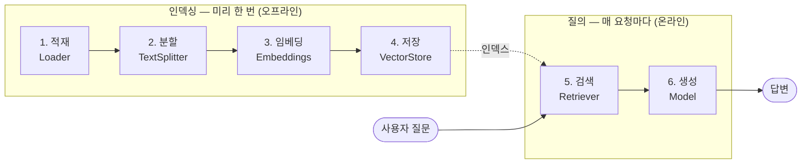

# Step 16 — 검색과 RAG

> **학습 목표**
> - RAG 파이프라인의 6단계(적재 → 분할 → 임베딩 → 저장 → 검색 → 생성)를 코드로 구현한다
> - `DirectoryLoader` / `TextLoader` 로 로컬 문서를 `Document` 로 적재한다
> - `RecursiveCharacterTextSplitter` 의 `chunkSize` / `chunkOverlap` 을 근거를 갖고 정한다
> - `MemoryVectorStore` 에 인덱스를 만들고 `similaritySearch` / MMR / 점수 임계값으로 검색한다
> - **고전 RAG**(항상 검색)와 **에이전틱 RAG**(모델이 검색 여부를 결정)를 구분해서 쓴다
> - 검색 실패를 감지하고 **인용(citation)** 을 강제해 환각을 줄인다
>
> **선행 스텝**: [Step 15 — 장기 메모리와 Store](../step-15-long-term-memory/)
> **예상 소요**: 90분

[Step 15](../step-15-long-term-memory/) 에서는 에이전트가 **자기가 겪은 것**을 기억하게 만들었습니다. 이번 스텝은 반대 방향입니다. 에이전트가 **한 번도 본 적 없는 지식** — 사내 위키, 제품 문서, 작년 계약서 — 을 끌어다 쓰게 만듭니다. 모델의 가중치는 학습 시점에 얼어붙어 있고 여러분 회사의 환불 규정은 거기 없으니까요.

이 스텝은 **LangChain 으로 RAG 를 구현하는 법**만 다룹니다. RAG 가 왜 필요한지, 임베딩이 수학적으로 무엇인지, 청킹·질의 확장·HyDE 같은 검색 기법의 이론은 이 사이트의 별도 문서에 이미 정리되어 있습니다 — [RAG 개요](/ai/04-rag/01-rag), [임베딩](/ai/70-Embedding), 그리고 기법별로 [렉시컬 검색](/ai/04-rag/tech/02-lexical), [멀티 쿼리](/ai/04-rag/tech/05-multiQuery), [HyDE](/ai/04-rag/tech/07-hyde), [질의 확장](/ai/04-rag/tech/08-expansion), [질의 분해](/ai/04-rag/tech/09-decomposition) 문서를 참고하세요. 여기서는 그 개념들이 **어떤 클래스와 어떤 import 경로로 코드가 되는가**에 집중합니다.

그리고 이 스텝의 진짜 목적지는 16-8 입니다. LangChain v1 의 관점에서 RAG 는 **파이프라인이 아니라 도구**입니다. 검색을 `tool` 로 감싸는 순간, 앞의 15개 스텝에서 쌓아 온 에이전트가 그대로 RAG 시스템이 됩니다.

---

## 16-0. 이 스텝만 추가로 필요한 것

RAG 에 쓰이는 로더·분할기·벡터 스토어는 `langchain` 본체가 아니라 별도 패키지에 있습니다.

```bash
npm install @langchain/classic @langchain/textsplitters
```

| 패키지 | 검증 버전 | 이 스텝에서 쓰는 것 |
|---|---|---|
| `@langchain/classic` | 1.0.40 | `DirectoryLoader`, `TextLoader`, `MemoryVectorStore`, `createRetrieverTool` |
| `@langchain/textsplitters` | 1.0.1 | `RecursiveCharacterTextSplitter` |
| `@langchain/openai` | 1.5.5 | `OpenAIEmbeddings` |

그리고 **환경변수가 하나 더 필요합니다.**

```bash
# project/.env
ANTHROPIC_API_KEY=sk-ant-api03-...   # 생성(generation)용 — 지금까지 써 온 것
OPENAI_API_KEY=sk-proj-...           # 임베딩(embedding)용 — 이번 스텝부터 필요
```

> ⚠️ **함정 (Anthropic 에는 임베딩 API 가 없다)**: 이 코스는 `anthropic:claude-sonnet-4-6` 을 기본 모델로 써 왔습니다. 그런데 `@langchain/anthropic` 패키지가 내보내는 것은 `ChatAnthropic` 뿐입니다. `AnthropicEmbeddings` 같은 클래스는 **존재하지 않습니다.** Anthropic 이 임베딩 엔드포인트를 제공하지 않기 때문입니다. 그래서 RAG 를 하려면 **생성과 임베딩의 제공자가 갈라집니다** — 생성은 Anthropic, 임베딩은 OpenAI(또는 Cohere, Voyage, VertexAI…). 이건 LangChain 의 한계가 아니라 제공자의 사실이고, "왜 키가 두 개나 필요하냐"는 질문의 답입니다. 뒤집어 말하면 이게 LangChain 을 쓰는 이유이기도 합니다 — 두 제공자를 한 코드에서 섞는 게 `new OpenAIEmbeddings()` 한 줄입니다.

---

## 16-1. RAG 파이프라인 전체 그림

RAG 는 6단계지만, **두 덩어리로 나뉜다**는 게 핵심입니다. 앞 4단계는 미리 한 번, 뒤 2단계는 요청마다입니다.



이 분리가 왜 중요한가:

| | 인덱싱 (1~4) | 질의 (5~6) |
|---|---|---|
| 언제 | 문서가 바뀔 때만 | 사용자가 물을 때마다 |
| 비용 | 임베딩 API (문서량 비례) | 검색(거의 공짜) + 생성 LLM |
| 지연 | 수 분~수 시간 (상관없음) | 수백 ms (사용자가 기다림) |
| 어디서 | 배치 잡, CI | 요청 핸들러 |

**인덱싱을 요청 경로에 두면** 사용자가 질문할 때마다 전체 문서를 다시 임베딩합니다. 문서 1만 개짜리 위키라면 질문 한 번에 수십 달러가 나가고 응답은 몇 분 걸립니다. 이 스텝의 실습이 `MemoryVectorStore` 를 쓰는 탓에 바로 이 실수를 저지르기 쉽습니다 — 16-5 에서 다룹니다.

이제 6단계를 하나씩 코드로 밟습니다.

---

## 16-2. Document 로더 — 무엇을 넣을 것인가

RAG 의 모든 것은 `Document` 라는 객체 하나로 흐릅니다. 필드는 두 개뿐입니다.

```ts
import { Document } from "@langchain/core/documents";

const doc = new Document({
  pageContent: "Nimbus 는 2019년에 설립되었습니다.",   // 임베딩되고 모델에게 보여질 본문
  metadata: { source: "company.md", title: "회사 소개" }, // 임베딩되지 않는 부가 정보
});
```

`pageContent` 는 벡터가 되고, `metadata` 는 **벡터가 되지 않습니다.** 검색 후 필터링하거나 인용을 붙일 때 쓰는 꼬리표입니다. 이 구분이 16-9 의 인용에서 결정적입니다.

로더는 결국 이 `Document` 를 만들어 주는 도구일 뿐입니다. 로컬 마크다운 디렉터리를 통째로 읽어 봅시다.

```ts
import { DirectoryLoader } from "@langchain/classic/document_loaders/fs/directory";
import { TextLoader } from "@langchain/classic/document_loaders/fs/text";

// 확장자별로 어떤 로더를 쓸지 매핑합니다.
const loader = new DirectoryLoader(kbDir, {
  ".md": (path) => new TextLoader(path),
});
const rawDocs = await loader.load();
```

**출력**

```
적재된 문서 수: 4
  - limits.md  (297자)
  - pricing.md  (321자)
  - refund.md  (359자)
  - support.md  (300자)
```

파일 하나가 `Document` 하나가 되고, `metadata.source` 에 **절대 경로**가 자동으로 들어갑니다.

```
metadata: {"source":"/var/folders/.../nimbus-kb-bvV6MJ/limits.md"}
```

주요 로더는 이렇습니다.

| 대상 | 클래스 | import 경로 |
|---|---|---|
| 텍스트/마크다운 | `TextLoader` | `@langchain/classic/document_loaders/fs/text` |
| 디렉터리 (재귀) | `DirectoryLoader` | `@langchain/classic/document_loaders/fs/directory` |
| JSON | `JSONLoader` | `@langchain/classic/document_loaders/fs/json` |
| 여러 파일 | `MultiFileLoader` | `@langchain/classic/document_loaders/fs/multi_file` |
| 웹/PDF/Notion/S3… | 각종 | `@langchain/community/document_loaders/...` |

**PDF** 는 공식 문서가 로더 클래스 대신 `pdf-parse` 를 직접 쓰고 `Document` 를 손으로 만드는 방식을 보여 줍니다. 페이지 번호를 metadata 에 넣을 수 있어서 인용에 유리합니다.

```ts
import { readFileSync } from "node:fs";
import { Document } from "@langchain/core/documents";
import { PDFParse } from "pdf-parse";

async function loadPdfPages(filePath: string): Promise<Document[]> {
  const parser = new PDFParse({ data: new Uint8Array(readFileSync(filePath)) });
  try {
    const { pages } = await parser.getText();
    return pages.map(
      (page) =>
        new Document({
          pageContent: page.text,
          metadata: { source: filePath, page: page.num - 1 },  // ← 페이지 번호 보존
        }),
    );
  } finally {
    await parser.destroy();   // 반드시 해제
  }
}
```

> 💡 **실무 팁**: 로더 선택보다 **metadata 설계**가 훨씬 중요합니다. 나중에 "2024년 이후 문서만", "재무팀 문서만" 으로 좁히려면 그 정보가 인덱싱 시점에 metadata 에 들어가 있어야 합니다. 검색 단계에서는 만들어 낼 수 없습니다. 최소한 `source`, `title`, `updatedAt`, 접근 권한을 나눌 거라면 `tenantId` / `visibility` 를 넣어 두세요. 나중에 추가하려면 **전체 재인덱싱**입니다.

> ⚠️ **함정 (파일 이름이 곧 출처가 아니다)**: `TextLoader` 가 넣어 주는 `source` 는 **로컬 절대 경로**(`/var/folders/.../limits.md`)입니다. 이걸 그대로 사용자에게 인용으로 보여 주면 서버의 디렉터리 구조가 노출됩니다. 인용에 쓸 값은 인덱싱할 때 `basename` 이나 실제 문서 URL 로 **정규화해서 따로 넣어 두세요.**

---

## 16-3. 텍스트 분할 — 이 스텝에서 가장 조용히 망하는 곳

왜 자르는가. 이유는 두 개입니다.

1. **임베딩은 긴 글을 뭉갠다.** 10페이지를 벡터 하나로 만들면 그 벡터는 "이 문서는 대충 회사 정책에 관한 것" 이라는 평균값이 됩니다. "환불 며칠?" 같은 구체적 질문과 매칭되지 않습니다.
2. **컨텍스트가 유한하다.** 검색 결과를 프롬프트에 넣어야 하는데, 문서 전체를 넣을 거면 애초에 검색이 필요 없습니다.

`RecursiveCharacterTextSplitter` 는 이름 그대로 **재귀적으로** 자릅니다. 먼저 `\n\n`(문단)으로 나눠 보고, 조각이 여전히 `chunkSize` 보다 크면 `\n`(줄)로, 그래도 크면 공백으로, 최후엔 글자 단위로 내려갑니다. **의미 단위를 최대한 늦게 깨는** 전략입니다.

```ts
import { RecursiveCharacterTextSplitter } from "@langchain/textsplitters";

const splitter = new RecursiveCharacterTextSplitter({
  chunkSize: 300,      // 청크 하나의 최대 길이(문자)
  chunkOverlap: 60,    // 이웃 청크끼리 겹칠 길이
});
const splits = await splitter.splitDocuments(rawDocs);
```

`splitDocuments` 는 원본의 `metadata` 를 **각 청크에 복사해 주고**, 줄 번호(`loc`)를 덧붙입니다.

```
원본 4개 문서 → 청크 5개
첫 청크 metadata: {"source":"/var/folders/.../limits.md","loc":{"lines":{"from":1,"to":5}}}
```

### chunkOverlap 이 0이면 무슨 일이 벌어지는가

말로 하면 와닿지 않으니 직접 잘라 봅시다. 문단 하나를 `chunkSize: 60` 으로 자릅니다(효과를 보려고 일부러 작게).

```ts
const refundPara =
  "Nimbus 클라우드의 유료 플랜은 결제일로부터 14일 이내에 환불을 요청할 수 있습니다. " +
  "환불은 요청 후 영업일 기준 5일 이내에 원결제 수단으로 처리됩니다. " +
  "단, 해당 기간에 누적 사용량이 무료 한도의 3배를 넘은 계정은 환불 대상에서 제외됩니다.";

const a = new RecursiveCharacterTextSplitter({ chunkSize: 60, chunkOverlap: 0 });
console.log(await a.splitText(refundPara));
```

**출력** (분할은 결정적입니다 — 그대로 재현됩니다)

```
(A) chunkOverlap: 0 → 3개 청크
  [0] "Nimbus 클라우드의 유료 플랜은 결제일로부터 14일 이내에 환불을 요청할 수 있습니다. 환불은 요청 후"
  [1] "영업일 기준 5일 이내에 원결제 수단으로 처리됩니다. 단, 해당 기간에 누적 사용량이 무료 한도의 3배를"
  [2] "넘은 계정은 환불 대상에서 제외됩니다."
```

`[0]` 이 **"환불은 요청 후"** 에서 끊겼습니다. 그 문장의 나머지 "영업일 기준 5일 이내에 원결제 수단으로 처리됩니다" 는 `[1]` 에 있습니다.

이제 "환불은 며칠 만에 처리되나요?" 라고 물으면 어떻게 될까요. `[0]` 은 "환불", "요청" 이 있어 그럭저럭 유사도가 나오지만 **답(5일)이 없습니다.** `[1]` 은 답이 있지만 "환불" 이라는 단어가 없어서 **유사도가 낮습니다.** 답을 가진 청크가 검색되지 않고, 검색된 청크에는 답이 없습니다. 모델은 문맥에서 답을 못 찾고 — 지어냅니다.

`chunkOverlap` 을 주면 경계가 겹칩니다.

```ts
const b = new RecursiveCharacterTextSplitter({ chunkSize: 60, chunkOverlap: 30 });
```

**출력**

```
(B) chunkOverlap: 30 → 4개 청크
  [0] "Nimbus 클라우드의 유료 플랜은 결제일로부터 14일 이내에 환불을 요청할 수 있습니다. 환불은 요청 후"
  [1] "이내에 환불을 요청할 수 있습니다. 환불은 요청 후 영업일 기준 5일 이내에 원결제 수단으로 처리됩니다."
  [2] "영업일 기준 5일 이내에 원결제 수단으로 처리됩니다. 단, 해당 기간에 누적 사용량이 무료 한도의 3배를"
  [3] "단, 해당 기간에 누적 사용량이 무료 한도의 3배를 넘은 계정은 환불 대상에서 제외됩니다."
```

`[1]` 안에 **"환불은 요청 후 영업일 기준 5일 이내에 원결제 수단으로 처리됩니다."** 가 통째로 들어왔습니다. 질문의 단어("환불")와 답("5일")이 같은 청크에 있으니 이제 검색됩니다.

대가도 보입니다. **청크가 3개에서 4개로 늘었습니다.** 같은 문장이 여러 청크에 중복 저장됩니다.

> ⚠️ **함정 (chunkOverlap: 0)**: overlap 이 0이면 청크 경계에 걸친 문장이 두 동강 납니다. 질문의 키워드는 앞 청크에, 답은 뒤 청크에 있게 되어 **어느 쪽도 검색되지 않거나, 검색돼도 답이 없습니다.** 에러는 안 납니다. 그냥 모델이 조용히 틀린 답을 만듭니다. 기본값처럼 쓰이는 비율은 **chunkSize 의 10~20%** 입니다(300이면 30~60). 0으로 두지 마세요. 반대로 50% 를 넘기면 인덱스가 배로 부풀고 같은 내용이 검색 결과 상위를 도배해 `k` 를 낭비합니다.

### chunkSize 는 어떻게 정하나

정답은 없지만 **정하는 방법**은 있습니다. 기준은 "답 하나가 온전히 들어가는 최소 크기".

| chunkSize | 성격 | 문제 |
|---|---|---|
| 작다 (~100자) | 검색 정확도 ↑, 벡터가 뾰족함 | 답이 잘림. 문맥이 없어 모델이 해석 못 함 |
| 중간 (300~1000자) | 대부분의 산문 문서 | — |
| 크다 (2000자~) | 문맥 풍부 | 벡터가 뭉개져 검색이 안 됨. 프롬프트 낭비 |

실무 감각:

- **FAQ·정책 문서**: 300~500. 질문 하나에 답 하나가 한두 문장.
- **기술 문서·산문**: 800~1500. 설명이 이어져야 뜻이 통함.
- **코드**: 문자 수보다 **함수 경계**가 중요합니다. `RecursiveCharacterTextSplitter.fromLanguage()` 로 언어별 구분자(`\nclass `, `\nfunction ` 등)를 씁니다.
- **표·CSV**: 문자 분할기를 쓰면 안 됩니다. 행 단위로 직접 `Document` 를 만드세요.

> 💡 **실무 팁 (청킹은 튜닝 대상이지 설정이 아니다)**: chunkSize 를 회의로 정하지 마세요. 실제 질문 20~30개를 **평가셋**으로 만들어 놓고 (300, 60) / (800, 120) / (1500, 200) 세 조합으로 인덱스를 만든 뒤 "정답 문서가 상위 k 에 들어왔는가"(recall@k)를 세면 답이 나옵니다. 이 측정은 LLM 없이 됩니다 — 검색 결과의 `source` 가 기대한 파일인지만 보면 되니 빠르고 공짜입니다. 자세한 건 [Step 19 — 관측·테스트·평가](../step-19-observability-eval/) 에서. 한국어 문서는 같은 글자 수에 정보가 더 많아, 영어 기준 권장값보다 작게 잡아도 대개 잘 됩니다.

---

## 16-4. 임베딩 — 텍스트를 벡터로

```ts
import { OpenAIEmbeddings } from "@langchain/openai";

const embeddings = new OpenAIEmbeddings({ model: "text-embedding-3-small" });

const vec = await embeddings.embedQuery("환불은 며칠 안에 되나요?");
console.log(vec.length);          // 1536
```

메서드는 두 개뿐입니다.

| 메서드 | 용도 |
|---|---|
| `embedQuery(text)` | 질문 하나 → 벡터 하나 |
| `embedDocuments(texts[])` | 문서 여러 개 → 벡터 여러 개 (배치, 훨씬 효율적) |

둘이 나뉜 이유가 있습니다. 일부 모델(Cohere, VertexAI 등)은 "질문용 벡터"와 "문서용 벡터"를 **다르게** 만듭니다. 질문과 문서는 생김새가 다르니까요("환불 며칠?" vs "환불은 요청 후 영업일 기준 5일 이내에…"). 그래서 직접 `embedQuery` 로 문서를 임베딩하지 말고, 벡터 스토어에게 맡기세요 — 알아서 올바른 메서드를 부릅니다.

### 모델 선택

| 모델 | 차원 | 특징 |
|---|---|---|
| `text-embedding-3-small` | 1536 | 기본값으로 추천. 싸고 충분히 좋음 |
| `text-embedding-3-large` | 3072 | 정확도 ↑, 비용·저장 ↑ |
| `text-embedding-ada-002` | 1536 | 구세대. 신규 프로젝트에서 쓸 이유 없음 |

`text-embedding-3-*` 는 **차원을 줄일 수 있습니다**(Matryoshka 방식으로 학습돼서 앞부분만 잘라 써도 의미가 유지됩니다).

```ts
const small = new OpenAIEmbeddings({
  model: "text-embedding-3-small",
  dimensions: 256,      // 1536 → 256
});
```

1536차원 float 하나가 4바이트니 벡터 하나에 6KB, 100만 청크면 6GB 입니다. 256차원으로 줄이면 1GB 로 떨어지고 검색도 빨라집니다. 정확도는 조금 손해지만, 대부분의 사내 검색에서는 체감되지 않는 수준입니다.

다른 제공자도 클래스만 바꾸면 됩니다 — 나머지 코드는 그대로입니다.

```ts
import { CohereEmbeddings } from "@langchain/cohere";           // multilingual 강함
import { VertexAIEmbeddings } from "@langchain/google-vertexai";
import { BedrockEmbeddings } from "@langchain/aws";
import { MistralAIEmbeddings } from "@langchain/mistralai";
```

> ⚠️ **함정 (임베딩 모델을 바꾸면 인덱스를 전부 다시 만들어야 한다)**: 임베딩 모델마다 벡터 공간이 **완전히 다릅니다.** `text-embedding-3-small` 로 만든 문서 벡터와 `text-embedding-3-large` 로 만든 질문 벡터를 비교하는 건 한국어 문장과 스와힐리어 문장의 글자 수를 비교하는 것과 같습니다 — 숫자는 나오는데 의미가 없습니다. 차원이 다르면(1536 vs 3072) 그나마 에러라도 나서 다행이지만, **`text-embedding-3-small`(1536) → `ada-002`(1536)** 처럼 **차원이 같으면 에러조차 안 납니다.** 코사인 유사도는 멀쩡히 계산되고, 검색 품질만 조용히 쓰레기가 됩니다. `dimensions: 256` 으로 줄인 것과 안 줄인 것도 섞이면 안 됩니다.
>
> 방어법: **인덱스 메타데이터에 임베딩 모델명과 차원을 박아 두고**, 앱 시작 시 현재 설정과 비교해 다르면 죽게 만드세요.
>
> ```ts
> const INDEX_META = { model: "text-embedding-3-small", dimensions: 1536 };
> if (stored.model !== INDEX_META.model) {
>   throw new Error(`임베딩 모델 불일치: 인덱스=${stored.model}, 현재=${INDEX_META.model}. 재인덱싱이 필요합니다.`);
> }
> ```
>
> 모델을 바꾸는 것은 설정 변경이 아니라 **마이그레이션**입니다.

> 💡 **실무 팁**: 임베딩 비용은 생성보다 훨씬 쌉니다(`text-embedding-3-small` 기준 1M 토큰에 몇 센트). 그래서 "임베딩 비용" 자체가 문제되는 일은 드뭅니다. 진짜 비용은 **재인덱싱에 걸리는 시간과 그동안 검색이 반쪽이 되는 것**입니다. 100만 청크를 재임베딩하려면 레이트 리밋에 걸려 몇 시간이 걸립니다. 그래서 무중단으로 하려면 새 인덱스를 옆에 만들고 다 채운 뒤 스위치를 넘기는(blue-green) 방식을 씁니다.

---

## 16-5. 벡터 스토어 — MemoryVectorStore 로 시작

```ts
import { MemoryVectorStore } from "@langchain/classic/vectorstores/memory";

// fromDocuments 가 내부에서 embedDocuments 를 호출합니다.
const vectorStore = await MemoryVectorStore.fromDocuments(splits, embeddings);

// 나중에 더 넣기
await vectorStore.addDocuments([handMade]);
```

**출력**

```
청크 5개 인덱싱 완료 (612ms)
문서 1개 추가 → 총 6개 벡터
```

`MemoryVectorStore` 는 이름 그대로입니다. 벡터를 **자바스크립트 배열**에 담아 두고, 검색할 때 전부와 코사인 유사도를 계산합니다. 인덱스 구조도 없고 근사 알고리즘도 없습니다. 그래서 학습에는 완벽하고 (설치할 것도, 띄울 것도 없음) 프로덕션에는 쓸 수 없습니다.

> ⚠️ **함정 (MemoryVectorStore 는 매 실행마다 임베딩 비용을 다시 낸다)**: `MemoryVectorStore` 는 프로세스 메모리에만 삽니다. `npx tsx practice.ts` 를 다시 돌리면 **문서를 처음부터 다시 읽고, 다시 자르고, 다시 임베딩합니다.** 실습에서 청크 5개일 땐 안 보입니다. 문서 5만 개짜리 위키에 이 코드를 그대로 올리면 **서버가 재시작될 때마다 수십 분과 수십 달러**가 나갑니다. 오토스케일링으로 인스턴스가 10개 뜨면 10배입니다.
>
> 더 고약한 변형은 인덱싱을 **요청 핸들러 안에 두는 것**입니다.
>
> ```ts
> // ❌ 절대 이러면 안 됩니다 — 질문 한 번에 전체 문서를 재임베딩
> app.post("/ask", async (req, res) => {
>   const store = await MemoryVectorStore.fromDocuments(await loadAll(), embeddings);
>   ...
> });
> ```
>
> 인덱싱은 **요청 경로 밖**(배치 잡·시작 시 1회)에 두고, 그 결과는 **프로세스 밖**(진짜 벡터 DB)에 두세요. 16-10 에서 `buildIndex()` 를 따로 뗀 이유가 이것입니다.

### 실전 옵션 비교

| 스토어 | import | 운영 형태 | 언제 쓰나 |
|---|---|---|---|
| `MemoryVectorStore` | `@langchain/classic/vectorstores/memory` | 없음 (프로세스 메모리) | 학습, 테스트, 문서 수백 개 이하의 CLI |
| **pgvector** | `@langchain/community/vectorstores/pgvector` | 기존 Postgres 확장 | **이미 Postgres 를 쓴다면 1순위.** 트랜잭션·조인·백업이 공짜 |
| Chroma | `@langchain/community/vectorstores/chroma` | 로컬 서버/임베디드 | 로컬 개발, 프로토타입 |
| Qdrant | `@langchain/qdrant` | 셀프호스팅/클라우드 | 필터링 성능이 좋음. 오픈소스 |
| Pinecone | `@langchain/pinecone` | 완전 관리형 SaaS | 운영을 맡기고 싶을 때. 규모 크면 비쌈 |
| MongoDB Atlas | `@langchain/mongodb` | 관리형 | 이미 Mongo 를 쓴다면 |
| Redis | `@langchain/redis` | 셀프/관리형 | 이미 Redis 를 쓰고 지연이 중요할 때 |

인터페이스는 전부 같습니다. `similaritySearch`, `addDocuments`, `asRetriever`. 그래서 `MemoryVectorStore` 로 배운 게 그대로 이전됩니다.

```ts
// 바꾸는 건 이 두 줄뿐입니다.
import { PGVectorStore } from "@langchain/community/vectorstores/pgvector";
const vectorStore = await PGVectorStore.initialize(embeddings, { postgresConnectionOptions, tableName: "docs" });
// 아래 코드는 한 글자도 안 바뀝니다.
```

> 💡 **실무 팁 (pgvector 부터 시작하세요)**: 벡터 DB 를 고르는 회의에 하루를 쓰기 전에, 이미 쓰고 있는 Postgres 에 `CREATE EXTENSION vector;` 를 치는 게 거의 항상 낫습니다. 이유는 검색 성능이 아니라 **운영**입니다 — 백업, 권한, 마이그레이션, 모니터링이 이미 있고, 무엇보다 `WHERE tenant_id = $1 AND created_at > $2` 같은 **일반 SQL 필터와 벡터 검색을 한 쿼리에서** 할 수 있습니다. 전용 벡터 DB 는 이 메타데이터 필터링이 의외로 약하거나 비쌉니다. 수천만 벡터를 넘어 지연이 실제로 문제가 됐을 때 옮겨도 늦지 않습니다. LangChain 을 쓰는 한 그 이사는 두 줄입니다.

---

## 16-6. Retriever — 어떻게 찾을 것인가

### (A) 기본 — 상위 k개

```ts
const hits = await vectorStore.similaritySearch("환불은 며칠 안에 되나요?", 2);
```

두 번째 인자가 `k` — **몇 개를 가져올지**입니다.

### (B) 점수까지 보기

```ts
const scored = await vectorStore.similaritySearchWithScore("환불은 며칠 안에 되나요?", 4);
for (const [doc, score] of scored) {   // ← [Document, number] 튜플 배열
  console.log(score.toFixed(4), doc.metadata["source"]);
}
```

반환 타입이 `[Document, number][]` 라는 게 포인트입니다. `MemoryVectorStore` 의 점수는 **코사인 유사도**라 1에 가까울수록 유사합니다.

**출력** (점수는 임베딩 모델에 따라 달라집니다 — 아래는 형태를 보여 주는 예시입니다)

```
  0.5231  refund.md
  0.3104  pricing.md
  0.2286  limits.md
  0.1975  support.md
```

> ⚠️ **함정 (점수의 의미는 스토어마다 다르다)**: `MemoryVectorStore` 는 코사인 **유사도**(클수록 유사)를 주지만, 어떤 스토어는 **거리**(작을수록 유사)를 줍니다. Chroma 는 L2 거리라 `0` 이 완벽 일치이고, pgvector 는 연산자(`<->`, `<=>`)에 따라 다릅니다. **`score > 0.7` 같은 코드를 스토어를 바꾸면서 그대로 들고 가면 필터가 정확히 거꾸로 동작합니다.** 스토어를 바꿀 때는 반드시 점수 몇 개를 직접 찍어 방향부터 확인하세요.

### (C) 검색이 실패하는 모습

여기가 이 절의 핵심입니다. 지식 베이스에 **전혀 없는** 걸 물어봅시다.

```ts
const offTopic = await vectorStore.similaritySearchWithScore("피자 굽는 온도는?", 2);
```

**출력**

```
(C) 지식 베이스에 없는 질문 — '피자 굽는 온도는?'
  0.2794  refund.md  ← 관련 없는데도 반환됨
  0.1099  company.md  ← 관련 없는데도 반환됨
```

**빈 배열이 아닙니다.** 벡터 검색은 "관련 있는 것"을 찾는 게 아니라 **"가장 덜 관련 없는 것 k개"** 를 찾습니다. 지식 베이스가 피자와 아무 상관 없어도 요청한 `k` 개를 채워서 돌려줍니다. 이게 RAG 환각의 가장 흔한 경로입니다 — 검색기는 쓰레기를 주고, 모델은 그게 근거인 줄 알고 그럴듯한 답을 만듭니다.

> ⚠️ **함정 (상위 k개가 정답을 담고 있다는 보장이 없다)**: `similaritySearch` 는 **항상 k개를 돌려줍니다.** 답이 없어도, 문서가 주제와 무관해도. 반환 배열이 비어 있지 않다는 것은 "찾았다"는 뜻이 **전혀 아닙니다.** `if (docs.length > 0) { /* 찾았다! */ }` 같은 코드는 언제나 참입니다. 방어는 세 겹입니다: ① 점수 임계값으로 거르고, ② 프롬프트에 "근거가 없으면 모른다고 답하라"를 넣고, ③ 16-9 처럼 모델에게 "근거가 충분했는지"를 **구조화된 출력으로 자백**시키세요.

### (D) asRetriever — Runnable 로 감싸기

```ts
const retriever = vectorStore.asRetriever({ k: 3 });
const docs = await retriever.invoke("Pro 플랜 가격이 얼마인가요?");
await retriever.batch(["질문1", "질문2"]);   // 여러 개 한 번에
```

`Retriever` 는 `invoke` / `batch` / `stream` 을 갖춘 Runnable 입니다. 벡터 스토어를 감싸는 얇은 껍데기지만, 이 인터페이스 덕분에 **벡터 검색이 아닌 것도 retriever 가 될 수 있습니다** — Elasticsearch, 사내 검색 API, 심지어 SQL 쿼리도. 16-8 에서 도구로 감쌀 때 이 추상화가 값을 합니다.

### (E) MMR — 다양성

유사도 상위 k개에는 함정이 있습니다. **비슷한 청크끼리도 서로 비슷합니다.** 같은 내용이 세 문서에 반복되면 상위 3개가 전부 같은 말이 되고, `k=3` 을 썼는데 실제로 얻은 정보는 1개분입니다. overlap 을 크게 준 인덱스에서 특히 잘 일어납니다.

**MMR**(Maximal Marginal Relevance)은 "질문과의 유사도"와 "이미 뽑은 것과의 차이"를 함께 봅니다.

```ts
const mmrRetriever = vectorStore.asRetriever({
  searchType: "mmr",
  k: 3,                                    // 최종 반환 개수
  searchKwargs: { fetchK: 8, lambda: 0.5 }, // 후보 8개를 가져와 그중 3개를 고름
});
```

| 옵션 | 뜻 |
|---|---|
| `fetchK` | 유사도로 먼저 가져올 후보 수. `k` 보다 넉넉해야 고를 여지가 생김 |
| `lambda` | 1에 가까울수록 유사도 우선, 0에 가까울수록 다양성 우선. 0.5 가 무난 |

`fetchK` 를 `k` 와 같게 두면 고를 후보가 없어 MMR 이 무의미해집니다. `fetchK` 는 `k` 의 3~5배쯤 잡으세요.

### (F) 점수 임계값

"유사도 0.3 미만은 버린다" 를 하려면 직접 거르면 됩니다.

```ts
const filtered = scored.filter(([, s]) => s >= 0.3);
```

`ScoreThresholdRetriever` 라는 전용 클래스도 있습니다.

```ts
import { ScoreThresholdRetriever } from "@langchain/classic/retrievers/score_threshold";

const retriever = ScoreThresholdRetriever.fromVectorStore(vectorStore, {
  minSimilarityScore: 0.3,
  maxK: 5,
  kIncrement: 2,
});
```

> ⚠️ **함정 (임계값은 절대 기준이 아니다)**: "0.7 이상이면 관련 있음" 같은 보편 상수는 **없습니다.** 임계값은 임베딩 모델, 문서 도메인, 질문 길이에 따라 전부 다릅니다. 어떤 모델은 무관한 문서에도 0.7 을 주고, 어떤 모델은 정답에도 0.4 를 줍니다. 게다가 임계값을 걸면 **결과가 0개가 될 수 있습니다** — `k` 개를 기대한 아래 코드가 조용히 빈 컨텍스트로 모델을 부르게 됩니다. 임계값은 반드시 **여러분의 데이터에서 점수 분포를 직접 찍어 보고** 정하고, 0개일 때의 분기를 반드시 만드세요.

---

## 16-7. 고전 RAG — 항상 검색하고, 끼워넣고, 생성한다

이제 조각을 붙입니다. 고전 RAG 는 놀랄 만큼 단순합니다 — **그냥 함수입니다.** 체인도 그래프도 필요 없습니다.

```ts
async function classicRag(question: string): Promise<string> {
  // 1) 검색 — 무조건 합니다.
  const docs = await vectorStore.similaritySearch(question, 3);

  // 2) 프롬프트에 끼워넣기 — 출처를 함께 넣어야 인용을 시킬 수 있습니다.
  const context = docs
    .map((d, i) => `[${i + 1}] (출처: ${basename(String(d.metadata["source"]))})\n${d.pageContent}`)
    .join("\n\n");

  // 3) 생성
  const agent = createAgent({
    model: "anthropic:claude-sonnet-4-6",
    tools: [],
    systemPrompt: [
      "너는 Nimbus 클라우드의 고객 지원 담당자다.",
      "아래 <context> 안의 내용만 근거로 답하라.",
      "context 에 답이 없으면 반드시 '제공된 문서에서 찾을 수 없습니다'라고 답하라. 추측하지 마라.",
      "답변 끝에 사용한 출처를 [1] 형식으로 표시하라.",
      "",
      `<context>\n${context}\n</context>`,
    ].join("\n"),
  });

  const result = await agent.invoke({ messages: [{ role: "user", content: question }] });
  return result.messages.at(-1)?.text ?? "";
}
```

**출력 예시** (모델 응답이므로 매번 다릅니다)

```
Q: 환불은 며칠 이내에 요청해야 하나요?
A: 결제일로부터 14일 이내에 환불을 요청하실 수 있습니다. 환불은 요청 후 영업일 기준
   5일 이내에 원결제 수단으로 처리됩니다. [1]

Q: Nimbus 는 쿠버네티스를 지원하나요?  ← 문서에 없는 내용
A: 제공된 문서에서 찾을 수 없습니다.
```

두 번째 질문에서도 **검색은 3개를 가져왔습니다.** 요금제·환불·한도 문서가 컨텍스트에 들어갔죠. 다만 프롬프트의 "context 에 답이 없으면 모른다고 하라"가 모델을 붙잡아 준 겁니다. 이 한 줄이 없으면 모델은 요금제 문서를 보며 "Enterprise 플랜에서 지원합니다" 같은 걸 지어냅니다.

구조를 뜯어보면 세 가지 특징이 있습니다.

1. **항상 검색합니다.** "안녕하세요" 에도 벡터 검색이 돕니다.
2. **한 번만 검색합니다.** 첫 검색이 실패하면 그걸로 끝입니다.
3. **질문을 그대로 검색어로 씁니다.** "그거 얼마야?" 같은 대화형 질문은 검색어로 형편없습니다.

이 세 가지가 전부 16-8 의 동기입니다.

> 💡 **실무 팁**: 고전 RAG 를 낡은 것으로 여기지 마세요. **질문의 성격이 균일하고 항상 검색이 필요한 시스템**(예: 사내 문서 검색창)이라면 고전 RAG 가 더 낫습니다. 지연이 예측 가능하고(LLM 호출 딱 1번), 비용이 고정이고, 디버깅이 쉽습니다. 에이전틱 RAG 는 LLM 을 최소 2번 부르고 몇 번 부를지 알 수 없습니다.

---

## 16-8. 에이전틱 RAG — 검색을 도구로

공식 문서는 이 스텝의 결론을 한 문장으로 정리합니다:

> "에이전트가 RAG 를 하게 만드는 데 필요한 것은 지식을 가져오는 **도구** 하나뿐이다."

[Step 06 — 도구](../step-06-tools/) 와 [Step 08 — createAgent](../step-08-create-agent/) 를 이미 했다면, 여러분은 이미 RAG 를 만들 줄 압니다. 검색을 `tool` 로 감싸기만 하면 됩니다.

```ts
import { createRetrieverTool } from "@langchain/classic/tools/retriever";

const retrieverTool = createRetrieverTool(vectorStore.asRetriever({ k: 3 }), {
  name: "search_nimbus_docs",
  description:
    "Nimbus 클라우드의 공식 문서(요금제, 환불 정책, 사용 한도, 지원 정책)를 검색한다. " +
    "Nimbus 의 정책·가격·한도에 관한 질문에는 반드시 이 도구를 먼저 호출하라.",
});

const ragAgent = createAgent({
  model: "anthropic:claude-sonnet-4-6",
  tools: [retrieverTool],
  systemPrompt: [
    "너는 Nimbus 클라우드의 고객 지원 담당자다.",
    "Nimbus 에 관한 사실 질문에는 반드시 search_nimbus_docs 를 호출해 근거를 찾아라.",
    "검색 결과에 답이 없으면 '문서에서 찾을 수 없습니다'라고 답하라. 지어내지 마라.",
    "필요하면 검색어를 바꿔 여러 번 호출해도 된다.",
  ].join("\n"),
});
```

`createRetrieverTool` 이 만들어 주는 도구의 규격은 이렇습니다(타입 정의에서 확인된 사실입니다).

| 항목 | 값 |
|---|---|
| 스키마 | `{ query: string }` |
| 반환 | `string` — 검색된 문서들의 `pageContent` 를 이어붙인 것 |

### 검색이 필요한 질문

```
(A) Q: Pro 플랜에서 한도를 넘기면 얼마가 더 나오나요?
```

**출력 예시** (모델 응답이므로 매번 다릅니다)

```
HUMAN  │ Pro 플랜에서 한도를 넘기면 얼마가 더 나오나요?
AI     │
       │ → tool search_nimbus_docs({"query":"Pro 플랜 한도 초과 추가 과금"})
TOOL   │ # 요금제

Free 플랜은 월 5,000회 API 호출과 1GB 저장 공간을 무료로 제공합니다...
       │ ↳ tool_call_id: toolu_01ABC...
AI     │ Pro 플랜에서 월 한도(500,000회)를 초과하면 1,000회당 0.5달러가 추가 과금됩니다.
       │ 추가 과금은 다음 결제일에 합산 청구되며, 대시보드에서 상한선을 설정하면 그 금액에
       │ 도달했을 때 API 가 차단됩니다.
```

모델이 사용자의 문장("얼마가 더 나오나요")을 그대로 검색하지 않고 **"Pro 플랜 한도 초과 추가 과금"** 이라는 검색어로 다듬은 것에 주목하세요. 고전 RAG 가 못 하는 일입니다. 이걸 공짜로 얻습니다.

### 검색이 필요 없는 질문

```
(B) Q: 안녕하세요!
```

**출력 예시**

```
HUMAN  │ 안녕하세요!
AI     │ 안녕하세요! Nimbus 클라우드 고객 지원입니다. 무엇을 도와드릴까요?
```

`TOOL` 메시지가 **없습니다.** 모델이 "이건 검색할 게 없네"라고 판단하고 건너뛰었습니다. 고전 RAG 였다면 "안녕하세요"를 임베딩해서 환불 정책 문서를 가져왔을 겁니다.

메시지 개수로 확인할 수 있습니다.

```ts
console.log(`(A)는 메시지 ${a1.messages.length}개, (B)는 ${a2.messages.length}개`);
// (A)는 4개 (human, ai+tool_call, tool, ai) / (B)는 2개 (human, ai)
```

### 여러 문서를 넘나드는 질문

```
(C) Q: Free 랑 Enterprise 는 지원이랑 레이트 리밋이 각각 어떻게 다른가요?
```

이 질문의 답은 `support.md` 와 `limits.md` 두 문서에 흩어져 있습니다. 고전 RAG 는 한 번의 검색에서 `k=3` 안에 둘 다 들어오길 기도해야 합니다. 에이전트는 **검색을 두 번** 할 수 있습니다 — "지원 정책 플랜별 차이" 로 한 번, "레이트 리밋 Enterprise" 로 또 한 번. 이게 [질의 분해](/ai/04-rag/tech/09-decomposition) 를 프롬프트 한 줄("필요하면 여러 번 호출해도 된다")로 얻는 방법입니다.

### 고전 RAG vs 에이전틱 RAG

| | 고전 RAG | 에이전틱 RAG |
|---|---|---|
| 검색 시점 | **항상**, 질문 전에 무조건 | 모델이 결정 |
| 검색 횟수 | 정확히 1번 | 0번 ~ N번 |
| 검색어 | 사용자 질문 원문 | 모델이 다듬음 |
| 실패 시 | 그대로 끝. 나쁜 문맥으로 생성 | 검색어를 바꿔 재시도 가능 |
| 여러 소스 | 한 번의 `k` 안에 다 들어와야 함 | 소스별로 도구를 나눠 각각 호출 |
| LLM 호출 | 1번 | 최소 2번, 상한 불명 |
| 지연 | 예측 가능 | 들쭉날쭉 |
| 비용 | 고정 | 가변 (더 비쌈) |
| 디버깅 | 쉬움 (경로가 하나) | 어려움 (경로가 매번 다름) |
| 대화 맥락 | 못 씀 ("그거 얼마야?" → 검색 실패) | 씀 (앞 대화를 보고 검색어 구성) |

**언제 무엇을**:

- 문서 검색창, FAQ 봇처럼 **모든 질문이 검색을 필요로 하고 균일**하다 → **고전 RAG**. 싸고 빠르고 예측 가능합니다.
- 여러 지식 소스가 있거나, 대화형이거나, 잡담과 질문이 섞이거나, 한 질문에 여러 번 찾아야 한다 → **에이전틱 RAG**.

> 💡 **실무 팁 (도구를 소스별로 쪼개세요)**: 지식 소스가 여러 개일 때 전부 한 벡터 스토어에 때려 넣고 도구 하나로 검색하게 만드는 것보다, **`search_hr_policy`, `search_engineering_docs`, `search_incident_history`** 처럼 도구를 나누는 게 대개 낫습니다. 모델이 description 을 읽고 **어디를 뒤질지 먼저 판단**하므로 검색 공간이 좁아지고 정확도가 올라갑니다. 각 도구에 다른 `k` 나 다른 필터를 걸 수도 있고, 무엇보다 로그에서 "어느 소스를 몇 번 뒤졌나"가 보입니다.

> ⚠️ **함정 (도구 description 이 곧 검색 정책이다)**: `createRetrieverTool` 의 `description` 은 문서화가 아니라 **프롬프트**입니다. `"문서를 검색한다"` 라고만 쓰면 모델은 언제 불러야 할지 몰라 그냥 안 부르고 자기 지식으로 답합니다 — 그리고 그게 환각입니다. **무엇이 들어 있는지**(요금제·환불·한도·지원)와 **언제 불러야 하는지**("정책·가격 질문에는 반드시")를 둘 다 적으세요. 도구를 안 부르는 문제의 원인은 대부분 모델이 아니라 description 입니다.

> ⚠️ **함정 (에이전틱 RAG 는 검색을 아예 건너뛸 수 있다)**: 이건 장점이자 가장 위험한 단점입니다. 모델은 **"이건 내가 아는데?"** 라고 판단하면 검색을 건너뜁니다. "환불 정책이 어떻게 되나요?" 에 대해 검색 없이 일반적인 SaaS 환불 정책을 그럴듯하게 지어낼 수 있습니다 — 여러분의 문서에는 14일이라고 쓰여 있는데 30일이라고 답하는 식으로요. 사용자에겐 검색을 했는지 안 했는지 보이지 않습니다.
>
> 방어법 세 가지:
> 1. systemPrompt 에 **"사실 질문에는 반드시 도구를 호출하라"** 를 명시 (완벽하진 않음)
> 2. 응답에 `tool_calls` 가 하나도 없으면 **코드로 감지**해 거부하거나 재시도
> 3. 정말 항상 검색해야 한다면 — **그냥 고전 RAG 를 쓰세요.** 에이전트에게 재량을 준다는 건 그 재량을 잘못 쓸 수 있다는 뜻입니다.
>
> ```ts
> const usedSearch = result.messages.some(
>   (m) => ((m as { tool_calls?: unknown[] }).tool_calls?.length ?? 0) > 0,
> );
> if (!usedSearch) console.warn("⚠️ 검색 없이 답변함 — 환각 가능성");
> ```

---

## 16-9. 품질 — 어디서 망가지고, 인용을 어떻게 붙이나

RAG 가 틀린 답을 내면 원인은 셋 중 하나입니다. **순서대로** 의심하세요.

| 실패 | 증상 | 확인 방법 | 처방 |
|---|---|---|---|
| **청킹 실패** | 답이 청크 경계에 걸려 두 동강 | 청크를 눈으로 출력해 본다 | `chunkOverlap` ↑, `chunkSize` 조정, 구분자 변경 |
| **검색 실패** | 정답 문서가 상위 k 에 없음 | 검색 결과의 `source` 를 찍어 본다 | `k` ↑, MMR, 질의 재작성, 하이브리드 검색 |
| **생성 실패** | 문맥엔 답이 있는데 모델이 틀리게 말함 | 컨텍스트를 직접 읽어 본다 | 프롬프트 강화, 인용 강제, 모델 교체 |

> 💡 **실무 팁 (디버깅 순서)**: RAG 가 틀렸을 때 사람들은 곧장 프롬프트부터 고칩니다. 거의 항상 헛수고입니다. **먼저 검색 결과를 출력해 정답 문서가 거기 있는지 보세요.** 없으면 프롬프트를 아무리 다듬어도 소용없습니다 — 모델은 없는 걸 읽을 수 없으니까요. 이 한 줄이면 됩니다:
>
> ```ts
> console.log(docs.map((d) => d.metadata["source"]));
> ```
>
> 정답 문서가 있는데도 틀리면 그때부터 생성 문제입니다. 대부분의 "RAG 가 이상해요" 는 검색 문제입니다.

### 인용 붙이기

`createRetrieverTool` 은 편하지만 **치명적인 한계**가 있습니다. 반환값이 `pageContent` 를 이어붙인 **문자열**이라 `metadata` 가 통째로 사라집니다. 모델은 그 내용이 어느 문서에서 왔는지 알 방법이 없습니다. 그러니 인용을 시킬 수 없고, 시켜 봐야 지어냅니다.

인용을 원하면 **도구를 직접 만드세요.** 출처를 본문과 함께 실어 보내는 게 전부입니다.

```ts
import { createAgent, tool } from "langchain";
import * as z from "zod";

const citedSearch = tool(
  async ({ query }) => {
    const results = await vectorStore.similaritySearchWithScore(query, 3);
    if (results.length === 0) return "검색 결과가 없습니다.";

    return results
      .map(([doc, score]) => {
        const src = basename(String(doc.metadata["source"]));
        // 점수를 같이 넘기면 모델이 "이건 별로 관련 없네"를 판단할 재료가 됩니다.
        return `<document source="${src}" score="${score.toFixed(3)}">\n${doc.pageContent}\n</document>`;
      })
      .join("\n\n");
  },
  {
    name: "search_with_citations",
    description:
      "Nimbus 클라우드 공식 문서를 검색한다. 각 결과에 source(파일명)와 score(0~1 유사도)가 붙어서 반환된다.",
    schema: z.object({
      query: z.string().describe("검색어. 사용자 질문을 그대로 넣지 말고 핵심 키워드로 다듬어라."),
    }),
  },
);
```

포인트 두 개:

1. **XML 태그로 감쌌습니다.** 모델은 `<document source="...">` 같은 구조를 잘 읽습니다. 어디서 어디까지가 한 문서인지 경계가 분명해집니다.
2. **점수를 같이 보냈습니다.** 모델에게 "score 0.3 미만은 무시하라"고 지시할 수 있게 됩니다 — 검색 실패 판단을 모델에게 위임하는 겁니다.

그리고 [Step 05 — 구조화된 출력](../step-05-structured-output/) 을 얹어 **근거가 있었는지 자백**시킵니다.

```ts
const citedAgent = createAgent({
  model: "anthropic:claude-sonnet-4-6",
  tools: [citedSearch],
  systemPrompt: [
    "너는 Nimbus 클라우드의 고객 지원 담당자다.",
    "사실 질문에는 반드시 search_with_citations 를 호출하라.",
    "답변의 모든 문장 끝에 근거 문서를 (출처: 파일명) 형식으로 붙여라.",
    "score 가 0.3 미만인 문서는 관련 없다고 보고 근거로 쓰지 마라.",
    "쓸 만한 근거가 하나도 없으면 '문서에서 찾을 수 없습니다'라고만 답하라.",
  ].join("\n"),
  responseFormat: z.object({
    answer: z.string().describe("사용자 질문에 대한 답변"),
    sources: z.array(z.string()).describe("근거로 사용한 문서의 파일명 목록. 없으면 빈 배열"),
    confident: z.boolean().describe("문서에 충분한 근거가 있었으면 true"),
  }),
});
```

**출력 예시** (모델 응답이므로 매번 다릅니다. `structuredResponse` 의 **구조**는 스키마대로 항상 같습니다)

```json
Q: 연간 결제를 중간에 해지하면 환불받을 수 있나요?
{
  "answer": "네. 연간 결제 플랜은 잔여 기간을 일할 계산하여 부분 환불됩니다. 다만 이 경우 이미 제공된 할인은 회수됩니다. (출처: refund.md)",
  "sources": ["refund.md"],
  "confident": true
}

Q: Nimbus 서버는 어느 나라에 있나요?   ← 문서에 없는 내용
{
  "answer": "문서에서 찾을 수 없습니다.",
  "sources": [],
  "confident": false
}
```

`confident: false` 와 빈 `sources` 가 왜 중요한가 — **검색 실패를 코드로 감지할 수 있게** 되기 때문입니다.

```ts
const r = await citedAgent.invoke({ messages: [{ role: "user", content: q }] });
if (!r.structuredResponse.confident || r.structuredResponse.sources.length === 0) {
  return "죄송합니다. 문서에서 답을 찾지 못했습니다. 상담원에게 연결해 드릴까요?";
}
```

이게 없으면 여러분의 앱은 환각과 정답을 **구분할 방법이 없습니다.** 둘 다 그냥 자신감 있는 문자열입니다.

> ⚠️ **함정 (모델이 출처를 지어낸다)**: "출처를 붙여라"라고만 하면 모델은 그럴듯한 파일명을 **지어냅니다** — 컨텍스트에 없는 `policy_2024.pdf` 같은 걸 만들어 내죠. 인용이 붙어 있다는 사실 자체는 그 인용이 진짜라는 보장이 **전혀 아닙니다.** 사용자는 인용이 붙어 있으면 무조건 믿기 때문에 오히려 더 위험합니다. **반드시 코드로 검증하세요** — 반환된 `sources` 가 실제로 검색된 문서 집합의 부분집합인지.
>
> ```ts
> const retrieved = new Set(docs.map((d) => basename(String(d.metadata["source"]))));
> const fake = r.structuredResponse.sources.filter((s) => !retrieved.has(s));
> if (fake.length > 0) throw new Error(`존재하지 않는 출처를 인용함: ${fake.join(", ")}`);
> ```

> 💡 **실무 팁 (더 나은 검색은 프롬프트가 아니라 검색기에서 온다)**: 프롬프트를 아무리 다듬어도 검색기가 정답을 못 찾으면 끝입니다. 검색 품질을 올리는 정석은 이 순서입니다.
> 1. **하이브리드 검색** — 벡터 검색은 "환불" 과 "리펀드" 를 잇지만 정확한 제품 코드(`NB-1024`)나 희귀 고유명사에 약합니다. 키워드 검색([렉시컬](/ai/04-rag/tech/02-lexical))과 섞으면 크게 올라갑니다. LangChain 은 `EnsembleRetriever`(`@langchain/classic/retrievers/ensemble`)로 여러 retriever 의 결과를 합쳐 줍니다.
> 2. **리랭킹** — `k=20` 으로 넉넉히 가져온 뒤 cross-encoder 로 다시 정렬해 상위 3개만 씁니다. 비용 대비 효과가 가장 좋은 개선인 경우가 많습니다.
> 3. **질의 재작성** — [멀티 쿼리](/ai/04-rag/tech/05-multiQuery)(`@langchain/classic/retrievers/multi_query`), [HyDE](/ai/04-rag/tech/07-hyde)(`.../retrievers/hyde`). **에이전틱 RAG 는 이걸 공짜로 어느 정도 해 줍니다** — 모델이 알아서 검색어를 다듬으니까요.
> 4. **Parent Document** — 작게 잘라 검색하고(정확도), 답할 땐 부모 문서를 통째로 줍니다(문맥). `.../retrievers/parent_document`. 16-3 의 chunkSize 딜레마를 구조로 푸는 방법입니다.

---

## 16-10. 종합 — 인덱싱은 한 번, 질의는 여러 번

마지막으로 16-5 의 함정을 구조로 막아 봅시다. **인덱싱을 함수로 떼어내면** "한 번만 하고 재사용한다"가 코드에 드러납니다.

```ts
async function buildIndex(dir: string): Promise<MemoryVectorStore> {
  const l = new DirectoryLoader(dir, { ".md": (p) => new TextLoader(p) });
  const docs = await l.load();
  const s = new RecursiveCharacterTextSplitter({ chunkSize: 300, chunkOverlap: 60 });
  const chunks = await s.splitDocuments(docs);
  return MemoryVectorStore.fromDocuments(
    chunks,
    new OpenAIEmbeddings({ model: "text-embedding-3-small" }),
  );
}

const store = await buildIndex(kbDir);   // ← 임베딩 비용은 여기서 딱 한 번

const agent = createAgent({
  model: "anthropic:claude-sonnet-4-6",
  tools: [
    createRetrieverTool(store.asRetriever({ k: 3 }), {
      name: "search_nimbus_docs",
      description: "Nimbus 클라우드 공식 문서를 검색한다. 정책·가격·한도 질문에 사용하라.",
    }),
  ],
  systemPrompt: "Nimbus 고객 지원 담당자다. 사실 질문은 반드시 검색하고, 없으면 모른다고 답하라.",
});

// 질의는 몇 번을 해도 임베딩 비용이 다시 들지 않습니다(질문 임베딩만).
for (const q of ["레이트 리밋은 API 키마다 따로인가요?", "Enterprise 는 응답이 얼마나 빠른가요?"]) {
  const r = await agent.invoke({ messages: [{ role: "user", content: q }] });
  console.log(`Q: ${q}\nA: ${r.messages.at(-1)?.text ?? ""}`);
}
```

**출력 예시** (모델 응답이므로 매번 다릅니다)

```
Q: 레이트 리밋은 API 키마다 따로인가요?
A: 아니요. 레이트 리밋은 API 키 단위가 아니라 계정 단위로 계산됩니다. 따라서 키를 여러 개
   발급하셔도 한도가 늘어나지 않습니다.

Q: Enterprise 는 응답이 얼마나 빠른가요?
A: Enterprise 플랜은 전담 슬랙 채널과 1시간 이내 응답 SLA 를 제공합니다. SLA 를 위반한
   경우 해당 월 요금의 10%를 크레딧으로 보상받으실 수 있습니다.
```

첫 질문의 답("계정 단위")은 `limits.md` 의 **두 번째 문단**에 있습니다. 청킹이 제대로 됐고, 검색이 그 청크를 찾았고, 모델이 그걸 읽었기 때문에 나온 답입니다. 셋 중 하나만 어긋나도 "네, API 키마다 따로입니다" 라는 그럴듯한 거짓말이 나옵니다.

프로덕션에서는 여기서 두 가지를 더 바꿉니다.

```ts
// 1. MemoryVectorStore → 진짜 벡터 DB (프로세스 재시작에도 살아남음)
const store = await PGVectorStore.initialize(embeddings, { postgresConnectionOptions, tableName: "docs" });

// 2. buildIndex 는 앱이 아니라 배치 잡에서 (문서가 바뀔 때만)
//    npm run reindex
```

---

## 정리

**RAG 6단계와 LangChain 대응**

| 단계 | 클래스 | import |
|---|---|---|
| 1. 적재 | `DirectoryLoader`, `TextLoader` | `@langchain/classic/document_loaders/fs/*` |
| 2. 분할 | `RecursiveCharacterTextSplitter` | `@langchain/textsplitters` |
| 3. 임베딩 | `OpenAIEmbeddings` | `@langchain/openai` |
| 4. 저장 | `MemoryVectorStore` | `@langchain/classic/vectorstores/memory` |
| 5. 검색 | `.asRetriever()`, `.similaritySearch()` | (벡터 스토어의 메서드) |
| 6. 생성 | `createAgent` | `langchain` |
| 5+6 (에이전틱) | `createRetrieverTool` | `@langchain/classic/tools/retriever` |

**검색 방법**

| 방법 | 코드 | 언제 |
|---|---|---|
| 기본 | `similaritySearch(q, k)` | 기본값 |
| 점수 포함 | `similaritySearchWithScore(q, k)` → `[Document, number][]` | 임계값 필터, 디버깅 |
| Runnable | `asRetriever({ k })` | 도구로 감쌀 때 |
| MMR | `asRetriever({ searchType: "mmr", k, searchKwargs: { fetchK, lambda } })` | 결과가 중복될 때 |
| 임계값 | `ScoreThresholdRetriever.fromVectorStore(vs, { minSimilarityScore, maxK })` | 무관한 결과를 잘라낼 때 |

**핵심 함정 3가지**

1. **`chunkOverlap: 0` 은 문장을 두 동강 낸다.** 질문의 키워드는 앞 청크에, 답은 뒤 청크에 남아 어느 쪽도 답이 못 된다. 에러는 안 나고 모델이 조용히 지어낸다. **chunkSize 의 10~20%** 를 주자.
2. **임베딩 모델을 바꾸면 인덱스를 전부 다시 만들어야 한다.** 차원이 같으면(1536 → 1536) **에러조차 안 나고** 검색 품질만 조용히 무너진다. 모델명을 인덱스에 박아 두고 불일치 시 죽게 하자.
3. **상위 k개가 정답을 담고 있다는 보장이 없다.** `similaritySearch` 는 답이 없어도 **항상 k개**를 채워 준다. `docs.length > 0` 은 "찾았다"가 아니다. 점수 임계값 + "모르면 모른다고 하라" 프롬프트 + 구조화된 `confident` 필드, 세 겹으로 막자.

**추가로 기억할 것**

- **`MemoryVectorStore` 는 매 실행마다 임베딩 비용을 다시 낸다.** 인덱싱은 요청 경로 밖으로, 저장은 프로세스 밖으로.
- **에이전틱 RAG 는 검색을 아예 건너뛸 수 있다.** 재량을 준다는 건 잘못 쓸 수 있다는 뜻이다. 항상 검색해야 한다면 고전 RAG 를 쓰자.
- **Anthropic 에는 임베딩 API 가 없다.** 생성과 임베딩의 제공자가 갈라진다.
- **`createRetrieverTool` 은 metadata 를 버린다.** 인용이 필요하면 도구를 직접 만들자.

---

## 연습문제

1. `chunkSize: 300, chunkOverlap: 60` 으로 만든 인덱스와 `chunkSize: 60, chunkOverlap: 0` 으로 만든 인덱스에 **같은 질문**("환불은 며칠 만에 처리되나요?")을 던져, 검색된 청크를 각각 출력하세요. 후자에서 답이 어떻게 쪼개지는지 확인하세요.
2. `similaritySearchWithScore` 로 **지식 베이스와 무관한 질문 3개**("김치찌개 레시피", "축구 경기 결과", "비트코인 시세")를 던져 점수를 출력하세요. 무관한 질문의 최고 점수와, 관련 있는 질문의 최고 점수를 비교해 **이 인덱스에 적절한 임계값**을 정하고 근거를 주석으로 쓰세요.
3. MMR 이 실제로 다르게 동작하는지 확인하세요. `searchType: "mmr"` 인 retriever 와 기본 retriever에 같은 질문("플랜별로 뭐가 다른가요?")을 던져 반환된 `source` 목록을 비교하세요. (힌트: 차이를 보려면 `fetchK` 가 `k` 보다 충분히 커야 합니다)
4. 16-8 의 `ragAgent` 에 **"안녕하세요"** 와 **"환불 정책 알려줘"** 를 각각 던지고, 응답 메시지에서 `tool_calls` 가 있는 AI 메시지 수를 세어 출력하세요. 그리고 **검색 없이 답한 경우를 감지해 경고를 찍는** 함수 `assertSearched(messages)` 를 작성하세요.
5. `createRetrieverTool` 대신 **metadata 의 `loc.lines` 까지 인용에 포함하는** 도구를 직접 만드세요. 반환 형식은 `<document source="refund.md" lines="3-5">...</document>` 입니다. (힌트: `splitDocuments` 가 넣어 준 `metadata.loc.lines.from` / `.to`)
6. 16-9 의 인용 검증을 구현하세요. 에이전트가 반환한 `sources` 중 **실제로 검색되지 않은 파일명**이 있으면 에러를 던지는 코드를 작성하세요. 그리고 이 검증이 왜 필요한지 주석으로 설명하세요.
7. `buildIndex()` 를 **두 번 호출**하고 각각 걸린 시간을 측정해 출력하세요. 두 번째도 첫 번째와 비슷하게 걸린다는 것(= 캐시가 없다는 것)을 확인하고, 이것이 프로덕션에서 왜 문제인지 주석으로 쓰세요.
8. (심화) 지식 소스를 **둘로 쪼개** 도구를 두 개 만드세요 — `search_billing`(refund.md, pricing.md)과 `search_technical`(limits.md, support.md). 에이전트에게 "Pro 플랜 환불되나요?" 와 "레이트 리밋 얼마예요?" 를 던져 **각각 어느 도구를 골랐는지** 확인하세요.

문제만 담긴 파일은 `exercise.ts`, 정답과 해설은 `solution.ts` 입니다. 두 파일 모두 아래 [실습 파일](#실습-파일) 섹션에 전문이 실려 있습니다.

---

## 다음 단계

→ [Step 17 — LangGraph 그래프 API](../step-17-langgraph/)

16-8 에서 본 에이전틱 RAG 는 `createAgent` 가 알아서 루프를 돌려 준 것이었습니다. 하지만 "검색 → **결과가 쓸 만한지 평가** → 별로면 질문을 다시 써서 재검색 → 생성" 같은 **명시적인 흐름**을 강제하고 싶다면 그래프를 직접 그려야 합니다. LangGraph 공식 문서의 Agentic RAG 예제가 바로 이 구조(`gradeDocuments` → `rewrite` → `generate`)이며, Step 17 에서 `StateGraph` 로 이걸 직접 만듭니다.

---

## 실습 파일

이 스텝은 TypeScript 파일 3개로 구성됩니다. 본문(16-1 ~ 16-10)의 예제를 순서대로 담은 `practice.ts` 를 먼저 실행해 결과를 눈으로 확인하고, 그다음 `exercise.ts` 의 8개 문제를 직접 풀어본 뒤, 마지막으로 `solution.ts` 로 채점하고 해설을 읽는 흐름입니다.

세 파일 모두 **API 키가 두 개** 필요합니다(`ANTHROPIC_API_KEY`, `OPENAI_API_KEY`). 그리고 이 스텝에서만 쓰는 패키지를 먼저 설치해야 합니다.

```bash
cd docs/reference/langchain/project
npm install @langchain/classic @langchain/textsplitters
npx tsx ../step-16-retrieval-rag/practice.ts
```

세 파일 모두 실습용 지식 베이스(`refund.md`, `pricing.md`, `limits.md`, `support.md`)를 **런타임에 임시 디렉터리로 생성**합니다. 저장소에 `.md` 파일을 두면 이 문서 사이트가 그걸 페이지로 만들어 버리기 때문입니다. 덕분에 파일을 복사해 아무 데서나 실행해도 그대로 돕니다.

### practice.ts

본문을 따라가며 손으로 쳐볼 예제를 `[16-1] ~ [16-10]` 주석 번호로 묶어 놓은 파일입니다. 절 번호가 본문 소제목과 1:1 로 대응하므로, 본문을 읽다가 막히면 같은 번호의 블록을 찾아 실행해 보면 됩니다.

- `[16-3]` 이 이 파일의 핵심입니다. 같은 문단을 `chunkOverlap: 0` 과 `30` 으로 각각 잘라 **나란히 출력**합니다. 이 출력은 LLM 이 개입하지 않아 **결정적**입니다 — 본문에 실린 것과 글자 하나까지 똑같이 재현됩니다. overlap 0 에서 `[0]` 이 `"환불은 요청 후"` 로 끝나고 `[1]` 이 `"영업일 기준..."` 으로 시작하는 것을, overlap 30 에서 그 문장이 `[1]` 에 통째로 들어오는 것을 눈으로 확인하세요.
- `[16-6]` 의 `(C)` 블록은 **"피자 굽는 온도는?"** 이라는 완전히 무관한 질문을 던집니다. 빈 배열이 아니라 환불 정책 문서가 점수와 함께 반환되는 것이 이 절의 학습 포인트입니다. 벡터 검색이 "관련 있는 것"이 아니라 "가장 덜 관련 없는 것 k개"를 준다는 사실을 여기서 체감하세요.
- `[16-8]` 의 `(A)` 와 `(B)` 는 **메시지 개수를 비교**하도록 짜여 있습니다. 검색을 한 질문은 4개(human, ai+tool_call, tool, ai), 인사는 2개(human, ai)입니다. 이 차이가 곧 "에이전트가 검색을 건너뛰었다"는 증거입니다.
- `[16-9]` 의 `citedSearch` 는 `createRetrieverTool` 과 달리 **직접 만든 도구**입니다. `<document source="..." score="...">` 로 감싸 metadata 를 살려 보내는 게 요점입니다. 이어지는 `citedAgent` 의 `responseFormat` 이 `confident: boolean` 을 강제하므로, 문서에 없는 질문("Nimbus 서버는 어느 나라에?")에서 `confident: false` 와 빈 `sources` 가 나오는지 확인하세요.
- `[16-4]` 와 `[16-5]` 는 **실제로 OpenAI 임베딩 API 를 호출합니다.** 청크가 5개뿐이라 비용은 무시할 수준이지만, `[16-5]` 가 출력하는 인덱싱 소요 시간(`(612ms)` 같은 값)을 기억해 두세요 — 이 시간이 문서 수에 비례해 늘어나고, **매 실행마다 다시 든다**는 게 16-5 함정의 전부입니다.

```ts file="./practice.ts"
```

### exercise.ts

본문 "연습문제" 8개를 그대로 옮겨 담은 **빈칸 채우기용 파일**입니다. 각 문제는 `[문제 N]` 주석 블록으로 구분되어 있고 그 아래가 비어 있으니, 거기에 직접 코드를 써 넣고 파일을 실행해 검증하면 됩니다.

- 파일 상단의 `buildIndex()` 와 지식 베이스 생성 코드는 **이미 작성되어 있습니다.** 문제를 푸는 데 매번 로더·분할기를 다시 쓰는 건 학습 목적이 아니기 때문입니다. 다만 `[문제 1]` 과 `[문제 7]` 은 이 함수의 인자를 바꿔 가며 호출해야 하므로 `chunkSize` / `chunkOverlap` 을 파라미터로 받게 만들어 두었습니다.
- `[문제 2]` 는 답이 하나로 정해지지 않습니다. **여러분의 인덱스에서 나온 실제 점수 분포**를 보고 임계값을 정하는 게 목적입니다. 정답 파일의 숫자와 달라도 근거가 타당하면 맞습니다 — 오히려 "0.7 같은 보편 상수는 없다"는 16-6 의 함정을 몸으로 겪는 문제입니다.
- `[문제 3]` 의 힌트 `fetchK 가 k 보다 충분히 커야 합니다` 를 무시하면 MMR 과 기본 검색의 결과가 **똑같이 나옵니다.** 그리고 "MMR 이 원래 그런가 보다" 하고 넘어가기 쉽습니다. 차이가 안 보이면 힌트를 다시 읽으세요.
- `[문제 4]` 의 `assertSearched()` 는 실무에서 그대로 쓸 수 있는 함수입니다. 16-8 마지막 함정의 방어 코드 ②번을 직접 구현하는 문제입니다.
- `[문제 8]` 은 정답이 **모델 응답에 달려 있어** 매번 같지 않을 수 있습니다. 도구 선택이 기대와 다르게 나왔다면 실패가 아니라 관찰 대상입니다 — description 을 고쳐 가며 선택이 어떻게 바뀌는지 보세요. 그게 이 문제의 진짜 목적입니다.

```ts file="./exercise.ts"
```

### solution.ts

8문제의 정답 코드와 해설 주석을 담은 파일입니다. `exercise.ts` 를 스스로 풀어본 **뒤에** 열어보세요.

- `[정답 1]` 의 결과가 이 파일에서 가장 중요합니다. `chunkSize: 60, chunkOverlap: 0` 인덱스에서 "환불은 며칠 만에 처리되나요?" 를 검색하면 **답("5일")이 없는 청크가 1위로 올라오는 것**을 볼 수 있습니다. "환불"이라는 단어가 든 청크가 유사도는 높지만 정답은 옆 청크에 있기 때문입니다. 청킹 실패가 검색 실패로, 검색 실패가 환각으로 이어지는 사슬의 첫 고리입니다.
- `[정답 2]` 는 숫자를 단정하지 않습니다. 무관한 질문도 **0 이 아니라 0.1~0.3 대의 점수**를 받는다는 것, 그래서 "점수가 0보다 크면 관련 있다"는 직관이 틀렸다는 것만 확인하면 됩니다. 임계값은 관련 질문의 최저점과 무관 질문의 최고점 **사이**에 있어야 하는데, 이 둘이 겹치면 임계값만으로는 못 거릅니다 — 그때 리랭킹이 필요해집니다.
- `[정답 4]` 의 `assertSearched()` 는 `tool_calls` 를 **구조적으로** 검사합니다. `instanceof AIMessage` 를 쓰지 않은 이유는 `@langchain/core` 가 두 벌 설치되면 `instanceof` 가 조용히 false 가 되기 때문입니다(Step 01 의 함정). `project/src/lib/print.ts` 가 같은 이유로 같은 방식을 씁니다.
- `[정답 6]` 의 인용 검증은 `Set` 의 부분집합 검사입니다. 짧지만 이 코드가 없으면 **모델이 지어낸 출처와 진짜 출처를 구분할 방법이 없습니다.** 인용이 붙어 있다는 사실 자체는 아무것도 보장하지 않는다는 16-9 함정의 실물입니다.
- `[정답 7]` 의 두 번째 `buildIndex()` 호출은 첫 번째와 **거의 같은 시간**이 걸립니다. 캐시가 전혀 없다는 뜻입니다. 실습에선 청크 5개라 몇백 ms 지만, 이 숫자에 문서 수를 곱해 보라는 게 이 문제의 전부입니다.
- `[정답 8]` 은 도구를 나눴을 때 **검색 공간이 좁아지는 것**을 보여 줍니다. `search_billing` 은 문서 2개만 뒤지므로 `k=3` 이 훨씬 정확해집니다. 다만 도구 선택 자체가 모델 판단이라 결과는 비결정적입니다 — description 이 부실하면 엉뚱한 도구를 고릅니다.

```ts file="./solution.ts"
```
