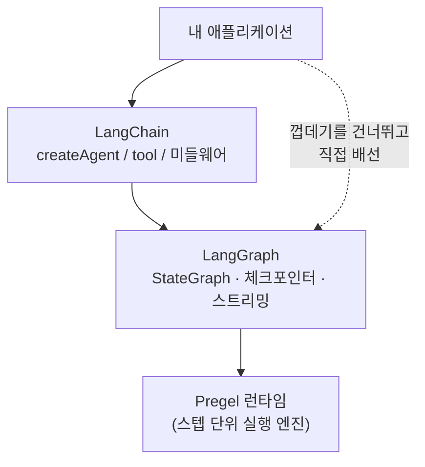
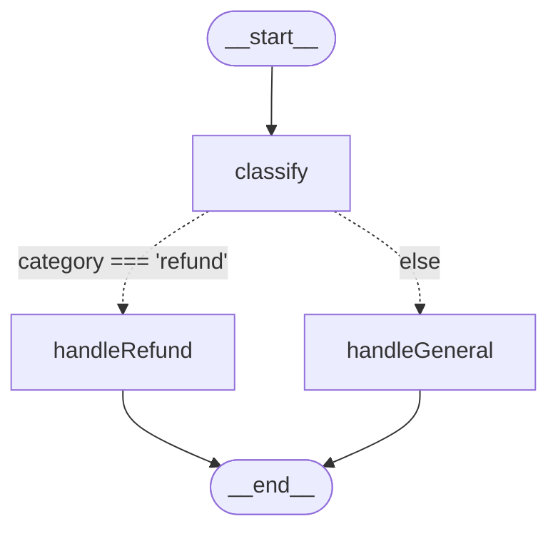
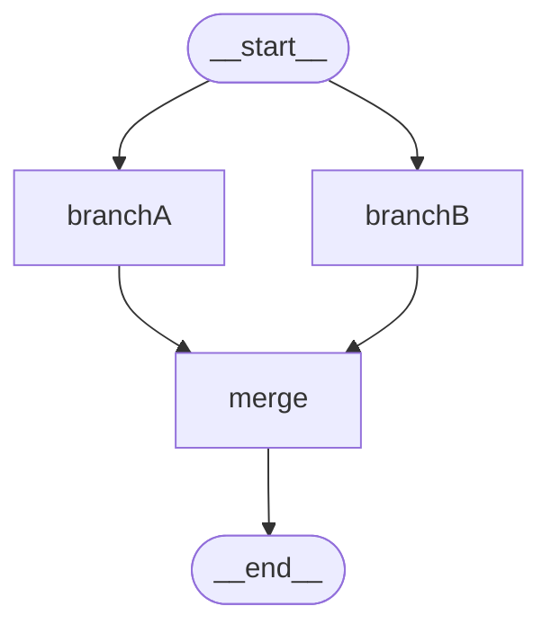
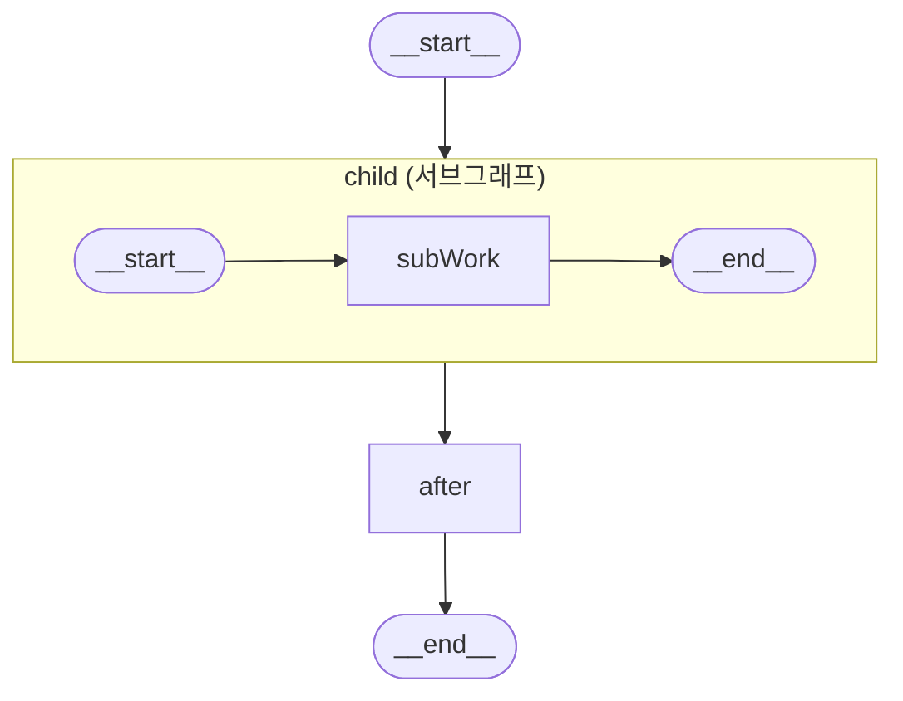
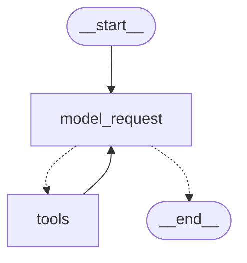

# Step 17 — LangGraph 그래프 API

> **학습 목표**
> - LangGraph 를 **상태 머신**으로 이해하고 LangChain 과의 관계를 설명한다
> - **State / Node / Edge** 3요소로 그래프를 조립한다
> - **리듀서(reducer)** 가 왜 필요한지 알고, 병렬 실행에서 직접 작성한다
> - `addConditionalEdges` 로 **조건부 분기**를, `Send` 로 **동적 fan-out** 을 만든다
> - `Command` 로 상태 갱신과 라우팅을 한 번에 처리한다
> - **`createAgent` 가 사실 LangGraph 그래프임을 직접 확인**하고, 언제 직접 그래프를 짜야 하는지 판단한다
>
> **선행 스텝**: [Step 16 — 검색과 RAG](../step-16-retrieval-rag/)
> **예상 소요**: 90분

[Step 08](../step-08-create-agent/) 부터 우리는 `createAgent` 를 써 왔습니다. 모델과 도구를 넘기면 알아서 도구를 부르고, 결과를 받아 다시 모델에게 넘기고, 더 부를 게 없으면 답을 내놓았습니다. 편했지만 그 안에서 무슨 일이 벌어지는지는 보이지 않았습니다.

이 스텝에서 껍데기를 벗깁니다. `createAgent` 는 마법이 아니라 **LangGraph 그래프**입니다. 노드 두 개(`model_request`, `tools`)와 엣지 몇 개로 된 아주 단순한 그래프죠. 이걸 눈으로 확인하고 나면 두 가지가 생깁니다. 첫째, 에이전트가 이상하게 굴 때 **어디를 봐야 하는지** 알게 됩니다. 둘째, `createAgent` 로 표현할 수 없는 흐름(승인 절차가 중간에 끼거나, 세 갈래로 갈라졌다 합쳐지거나, 단계마다 다른 모델을 써야 하거나)을 만났을 때 **직접 그래프를 짤 수 있게** 됩니다.

이 스텝의 예제는 [17-11] 을 빼면 **API 키 없이 전부 돌아갑니다.** 그래프 조립과 실행은 모델 호출과 무관하기 때문입니다. 덕분에 비용 없이, 비결정적인 LLM 응답에 방해받지 않고 그래프의 역학만 순수하게 관찰할 수 있습니다.

---

## 17-1. LangGraph 가 무엇인가 — 상태 머신

LangGraph 는 공식 문서의 표현으로 *"오래 실행되는 상태 기반 에이전트를 만들기 위한 저수준 오케스트레이션 프레임워크이자 런타임"* 입니다. 말이 어렵지만 실체는 단순합니다. **상태 머신(state machine)** 입니다.

- 하나의 **상태(State)** 객체가 있습니다.
- **노드(Node)** 들이 그 상태를 읽고, 바뀐 부분을 돌려줍니다.
- **엣지(Edge)** 가 "다음에 어느 노드로 갈지" 를 정합니다.
- 더 갈 곳이 없으면 끝나고, 최종 상태가 결과입니다.

그게 전부입니다. LLM 이 필수도 아닙니다. 노드는 그냥 함수라서 DB 조회든 HTTP 호출이든 상관없습니다.

### LangChain 과 LangGraph 의 관계

둘은 경쟁 관계가 아니라 **층이 다릅니다.**

| | LangChain | LangGraph |
|---|---|---|
| 역할 | 모델·도구·메시지의 **추상화와 통합** | 그 조각들을 엮어 돌리는 **오케스트레이션 런타임** |
| 대표 API | `createAgent`, `tool`, `ChatAnthropic` | `StateGraph`, `StateSchema`, `Command` |
| 추상화 수준 | 높음 (조립 완료품) | 낮음 (부품과 배선) |
| 제어권 | 프레임워크가 흐름을 정함 | 내가 흐름을 정함 |
| 상태 | `messages` 중심으로 정해져 있음 | 내가 스키마를 설계 |
| 패키지 | `langchain` | `@langchain/langgraph` |
| 의존 | 내부적으로 LangGraph 위에서 돎 | LangChain 없이도 씀 |

핵심은 마지막 두 줄입니다. **`createAgent` 는 LangGraph 위에 얹힌 얇은 껍데기이고**, 반대로 *"LangGraph 를 쓰려고 LangChain 을 쓸 필요는 없다"* 고 공식 문서는 못박습니다. 노드에 LLM 이 하나도 없는 LangGraph 그래프도 완전히 정상입니다.



> 💡 **실무 팁**: 이 층 구분을 알면 디버깅 지도가 생깁니다. 도구 스키마·프롬프트·모델 파라미터 문제는 **LangChain 층**입니다. 반면 "왜 이 노드가 두 번 실행되지", "왜 상태가 덮어써지지", "왜 안 멈추지" 는 **LangGraph 층**입니다. 에러 메시지에 `InvalidUpdateError`, `GraphRecursionError` 처럼 `Graph` 가 들어 있으면 아래층 문제입니다.

---

## 17-2. 3요소: State / Node / Edge

가장 작은 그래프부터 봅시다. 공식 문서의 예제 그대로입니다.

```ts
import {
  StateSchema, MessagesValue, StateGraph, START, END,
  type GraphNode,
} from "@langchain/langgraph";

const State = new StateSchema({
  messages: MessagesValue,
});

const mockLlm: GraphNode<typeof State> = (state) => {
  const last = state.messages.at(-1);
  return { messages: [{ role: "ai", content: `echo: ${last?.content}` }] };
};

const graph = new StateGraph(State)
  .addNode("mock_llm", mockLlm)
  .addEdge(START, "mock_llm")
  .addEdge("mock_llm", END)
  .compile();

const result = await graph.invoke({ messages: [{ role: "user", content: "hi!" }] });
```

**출력**
```
[ 'human: hi!', 'ai: echo: hi!' ]
```

여기 이미 3요소가 다 있습니다.

- **State**: `new StateSchema({ messages: MessagesValue })` — 그래프가 들고 다닐 데이터의 모양.
- **Node**: `mockLlm` — 상태를 받아 **바뀐 부분만** 반환하는 함수.
- **Edge**: `addEdge(START, "mock_llm")`, `addEdge("mock_llm", END)` — 실행 순서.

`START` 와 `END` 는 특별한 예약 노드입니다. 실제 값은 문자열 `"__start__"` / `"__end__"` 이고, 그래서 공식 문서 일부 예제는 `.addEdge("__start__", "generateJoke")` 처럼 문자열을 직접 쓰기도 합니다. 같은 것이지만 상수를 쓰는 쪽이 오타에 안전합니다.

노드가 `{ messages: [...] }` 만 반환한다는 점을 눈여겨보세요. 상태 전체를 돌려주는 게 아니라 **부분 업데이트(partial update)** 를 돌려줍니다. 나머지 키는 알아서 유지됩니다. 이 성질이 다음 함정으로 이어집니다.

> ⚠️ **함정 (상태를 mutate 해도 반영되지 않는다)**: 노드 안에서 `state.count = 999` 처럼 상태를 **직접 고치는 것은 업데이트로 취급되지 않습니다.** 반드시 `return { count: 999 }` 로 반환해야 합니다. 무서운 건 실패하는 방식입니다 — 에러가 나지 않습니다. 아무 노드도 채널에 쓰지 않으면 `invoke()` 의 결과가 아예 **`undefined`** 로 나옵니다. `undefined.messages` 를 읽다 터지는 엉뚱한 곳에서 에러를 만나게 되죠.
>
> 더 고약한 변형도 있습니다. 최상위 키 재할당(`state.count = 1`)은 TypeScript 가 readonly 로 막아주지만, **중첩된 객체의 mutate(`state.profile.name = "x"`)는 타입 검사를 통과하고, 심지어 공유 참조 때문에 다음 노드에 값이 새어 나가기까지 합니다.** "동작하는 것처럼 보이는데" 체크포인트에는 기록되지 않아서, 재개(resume)하면 그 변경만 사라집니다. **노드는 순수 함수처럼 쓰고, 변경은 항상 반환값으로만 표현하세요.**

---

## 17-3. 상태 스키마와 리듀서

### v1 의 권장 방식은 `StateSchema` + zod 입니다

LangGraph 를 검색하면 `Annotation.Root({ ... })` 로 상태를 정의하는 예제가 쏟아집니다. 이건 **구버전 방식**입니다. `Annotation` 은 `@langchain/langgraph@1.4.8` 에도 여전히 export 되어 있어서 돌아가긴 하지만, **v1 문서가 권장하는 방식은 `StateSchema` 와 zod** 입니다. 새로 짜는 코드는 `StateSchema` 를 쓰세요.

```ts
import {
  StateSchema, MessagesValue, ReducedValue, UntrackedValue,
} from "@langchain/langgraph";
import * as z from "zod";

const AgentState = new StateSchema({
  // 1. 평범한 zod 스키마 → 마지막 값이 이긴다 (LastValue)
  currentStep: z.string().default(""),
  retryCount: z.number().default(0),

  // 2. ReducedValue → 합치는 방법을 내가 정한다
  allSteps: new ReducedValue(z.array(z.string()).default(() => []), {
    reducer: (current, update) => current.concat(update),
  }),

  // 3. MessagesValue → 메시지 전용 프리셋 리듀서
  messages: MessagesValue,

  // 4. UntrackedValue → 체크포인트에 저장되지 않는 임시값
  tempCache: new UntrackedValue(z.record(z.string(), z.unknown())),
});

type State = typeof AgentState.State;   // 노드가 읽는 타입
type Update = typeof AgentState.Update; // 노드가 반환하는 타입
```

네 가지 필드 종류를 표로 정리하면 이렇습니다.

| 종류 | 동작 | 병렬 쓰기 | 체크포인트 저장 | 언제 쓰나 |
|---|---|---|---|---|
| zod 스키마 그대로 | LastValue — 마지막 값이 이김 | ❌ 에러 | ✅ | 한 노드만 쓰는 평범한 값 |
| `ReducedValue` | 내가 준 reducer 로 합침 | ✅ | ✅ | 누적, 병렬 브랜치 결과 취합 |
| `MessagesValue` | append + id 같으면 교체 | ✅ | ✅ | 대화 메시지 |
| `UntrackedValue` | 값은 들고 다니되 저장 안 함 | — | ❌ | 커넥션·캐시 등 직렬화 불가한 것 |

### 리듀서란 결국 무엇인가

리듀서는 `(현재값, 이번 업데이트) => 새 값` 함수일 뿐입니다. `Array.prototype.reduce` 의 그 리듀서와 같은 개념입니다. 리듀서를 안 주면 LangGraph 는 "그냥 덮어쓰라는 뜻이군" 이라고 해석합니다.

```ts
const ReducerDemo = new StateSchema({
  lastOnly: z.string().default(""),                    // 리듀서 없음
  accumulated: new ReducedValue(                        // 리듀서 있음
    z.array(z.string()).default(() => []),
    { reducer: (current: string[], update: string[]) => current.concat(update) },
  ),
});

const graph = new StateGraph(ReducerDemo)
  .addNode("first",  () => ({ lastOnly: "첫 번째", accumulated: ["첫 번째"] }))
  .addNode("second", () => ({ lastOnly: "두 번째", accumulated: ["두 번째"] }))
  .addEdge(START, "first").addEdge("first", "second").addEdge("second", END)
  .compile();
```

**출력**
```
{ lastOnly: '두 번째', accumulated: [ '첫 번째', '두 번째' ] }
```

같은 두 노드가 같은 값을 썼는데 결과가 다릅니다. `lastOnly` 는 마지막 것만 남았고, `accumulated` 는 둘 다 남았습니다. **차이는 오직 리듀서의 유무입니다.**

### messages 리듀서가 왜 특별한가

`MessagesValue` 는 그냥 `concat` 이 아닙니다. 두 가지를 더 합니다.

1. **id 가 같은 메시지는 덧붙이지 않고 교체합니다.**
2. `{ role: "user", content: "..." }` 같은 **평범한 객체를 `HumanMessage` 인스턴스로 변환**해 줍니다.

```ts
const graph = new StateGraph(new StateSchema({ messages: MessagesValue }))
  .addNode("add",    () => ({ messages: [new AIMessage({ id: "fixed-id", content: "초안" })] }))
  .addNode("revise", () => ({ messages: [new AIMessage({ id: "fixed-id", content: "교체됨 (id 가 같으므로)" })] }))
  .addEdge(START, "add").addEdge("add", "revise").addEdge("revise", END)
  .compile();

await graph.invoke({ messages: [new HumanMessage("안녕")] });
```

**출력**
```
메시지 2개만 남습니다 (id 가 같은 것은 교체):
  human(2d972df8): 안녕
  ai(fixed-id): 교체됨 (id 가 같으므로)
```

노드가 메시지를 3개 추가했는데 결과는 2개입니다. `id: "fixed-id"` 가 겹쳐서 나중 것이 앞의 것을 교체했기 때문입니다.

이 성질이 실용적인 이유는, 이게 **메시지 수정과 삭제의 유일한 통로**이기 때문입니다. 리듀서가 append 만 한다면 이미 들어간 메시지를 고칠 방법이 없습니다. id 기반 교체 덕분에 "방금 그 AI 메시지를 다듬어서 다시 넣기" 가 가능합니다. `REMOVE_ALL_MESSAGES` 같은 상수도 이 리듀서가 해석합니다.

> ⚠️ **함정**: id 를 명시하지 않으면 LangGraph 가 UUID 를 자동으로 붙입니다. 그래서 "같은 내용" 을 두 번 넣으면 **id 가 달라 둘 다 남습니다.** 교체를 노렸다면 id 를 반드시 직접 지정해야 합니다. 반대로 메시지를 복사해 재사용할 때 id 까지 딸려오면 **의도치 않게 원본이 교체됩니다.** 메시지를 복제할 땐 id 를 새로 주거나 지우세요.

---

## 17-4. StateGraph 만들기

API 는 다섯 개면 충분합니다.

| 메서드 | 하는 일 |
|---|---|
| `new StateGraph(Schema)` | 빌더 생성 |
| `.addNode(이름, 함수, 옵션?)` | 노드 등록 |
| `.addEdge(출발, 도착)` | 무조건 가는 엣지 |
| `.addConditionalEdges(출발, 라우터, 도착목록?)` | 조건에 따라 갈리는 엣지 |
| `.compile(옵션?)` | 실행 가능한 그래프로 확정 |

```ts
const CounterState = new StateSchema({
  count: z.number().default(0),
  history: new ReducedValue(z.array(z.string()).default(() => []), {
    reducer: (a: string[], b: string[]) => a.concat(b),
  }),
});

const increment: GraphNode<typeof CounterState> = (state) => ({
  count: state.count + 1,
  history: [`count 를 ${state.count} → ${state.count + 1} 로 올림`],
});

const double: GraphNode<typeof CounterState> = (state) => ({
  count: state.count * 2,
  history: [`count 를 ${state.count} → ${state.count * 2} 로 두 배`],
});

const graph = new StateGraph(CounterState)
  .addNode("increment", increment)
  .addNode("double", double)
  .addEdge(START, "increment")
  .addEdge("increment", "double")
  .addEdge("double", END)
  .compile();

await graph.invoke({ count: 5 });
```

**출력**
```
{
  count: 12,
  history: [ 'count 를 5 → 6 로 올림', 'count 를 6 → 12 로 두 배' ]
}
```

`5 → 6 → 12`. `double` 노드가 읽은 `state.count` 는 이미 `increment` 가 반영된 `6` 입니다. **노드는 항상 "직전 스텝까지 반영된 상태" 를 봅니다.**

### 노드 함수의 타입

`GraphNode<Schema, Context, Nodes>` 로 노드를 타이핑합니다. 두 번째 인자가 라우팅 대상이 아니라 **런타임 컨텍스트**라는 점을 주의하세요.

```ts
// state 만 쓰는 평범한 노드
const node: GraphNode<typeof State> = (state) => ({ count: state.count + 1 });

// 두 번째 인자로 config 를 받는다
const withConfig: GraphNode<typeof State> = (state, config) => {
  const step = config.metadata?.langgraph_step;  // 몇 번째 스텝인지
  const nodeName = config.metadata?.langgraph_node;
  return {};
};
```

> ⚠️ **함정 (문서와 설치된 타입이 다르다)**: 공식 문서의 일부 예제는 `GraphNode<typeof State, "nodeB" | "nodeC">` 나 `ConditionalEdgeRouter<typeof State, "b" | "c">` 처럼 **두 번째 자리에 노드 이름**을 넣습니다. 하지만 `1.4.8` 에 설치된 실제 시그니처는 `<Schema, Context, Nodes>` **세 개**입니다. 문서대로 쓰면 노드 이름이 Context 자리에 들어가 `Type 'string' does not satisfy the constraint 'Record<string, any>'` 로 컴파일 에러가 납니다. 문서 예제가 최신 타입을 못 따라온 경우입니다.
>
> 가운데 Context 를 건너뛸 수 없으므로, **타입 백(type bag)** 형태가 가장 깔끔합니다. 이 스텝의 실습 파일은 전부 이 형태를 씁니다.
> ```ts
> const route: ConditionalEdgeRouter<{
>   InputSchema: typeof RouteState;
>   Nodes: "handleRefund" | "handleGeneral";
> }> = (state) => (state.category === "refund" ? "handleRefund" : "handleGeneral");
> ```
> **교훈**: 문서와 설치된 `.d.ts` 가 어긋나면 **`.d.ts` 가 진실입니다.** `node_modules/@langchain/langgraph/dist/graph/types.d.ts` 를 직접 열어보는 습관을 들이세요.

---

## 17-5. 컴파일과 실행

`.compile()` 은 선택이 아닙니다. 빌더는 **설계도**일 뿐이고, 컴파일해야 실행 가능한 그래프가 됩니다.

> ⚠️ **함정 (compile 안 하면 실행 자체가 없다)**: 컴파일하지 않은 빌더에는 `invoke` 메서드가 **아예 존재하지 않습니다**(`typeof builder.invoke === "undefined"`). 그래서 실수하면 `TypeError: builder.invoke is not a function` 이라는, 원인과 거리가 먼 메시지를 만납니다. 다행히 TypeScript 를 쓰면 컴파일 타임에 잡힙니다 — 이게 이 코스가 TS 를 쓰는 이유 중 하나입니다.

### 체크포인터와 스레드

`compile({ checkpointer })` 를 주면 그래프가 **각 스텝마다 상태를 저장**합니다. [Step 10](../step-10-memory/) 에서 `createAgent` 에 넘겼던 그 체크포인터가 사실 이 층의 기능이었습니다.

```ts
const graph = new StateGraph(CounterState)
  .addNode("increment", increment)
  .addEdge(START, "increment")
  .addEdge("increment", END)
  .compile({ checkpointer: new MemorySaver() });

const cfg = { configurable: { thread_id: "thread-A" } };
await graph.invoke({}, cfg);   // count: 1
await graph.invoke({}, cfg);   // count: 2
await graph.invoke({}, cfg);   // count: 3
await graph.invoke({}, { configurable: { thread_id: "thread-B" } });  // count: 1
```

**출력**
```
thread_id 없이 호출: Failed to put checkpoint
thread-A 첫 번째 호출 count: 1
thread-A 두 번째 호출 count: 2
thread-A 세 번째 호출 count: 3 ← 상태가 이어집니다
thread-B 첫 호출 count: 1 ← 다른 스레드는 처음부터
```

같은 `thread_id` 로 부르면 상태가 이어지고, 다른 `thread_id` 면 처음부터입니다. 첫 줄이 중요합니다 — **체크포인터를 달아놓고 `thread_id` 를 안 주면 즉시 에러가 납니다.** 조용히 메모리 없이 도는 게 아니라 명확한 메시지로 터집니다: *"The passed RunnableConfig is missing a required `thread_id` field."* 반대 방향(체크포인터 없이 `thread_id` 만 주기)이 진짜 조용한 함정인데, 그건 [Step 10](../step-10-memory/) 에서 다뤘습니다.

### invoke 와 stream

`invoke` 는 최종 상태를, `stream` 은 중간 과정을 줍니다.

```ts
for await (const chunk of await graph.stream({ count: 1 }, { streamMode: "updates" })) {
  console.log(chunk);
}
```

**출력**
```
{"increment":{"count":2,"history":["count 를 1 → 2 로 올림"]}}
{"double":{"count":4,"history":["count 를 2 → 4 로 두 배"]}}
```

`streamMode: "updates"` 는 **노드가 끝날 때마다 그 노드가 반환한 업데이트**를 흘려보냅니다. 키가 노드 이름이라는 점이 유용합니다 — "지금 어느 노드가 끝났는지" 를 바로 알 수 있어 진행 표시나 디버깅에 그대로 씁니다. `"values"` 로 주면 매 스텝의 전체 상태가 나옵니다.

> 💡 **실무 팁**: 그래프가 이상하게 돌 때 첫 번째로 할 일은 `streamMode: "updates"` 로 돌려보는 것입니다. 어느 노드가 어떤 순서로 실행됐고 각자 뭘 썼는지가 한눈에 보입니다. `console.log` 를 노드마다 심는 것보다 훨씬 빠르고, 병렬 실행에서는 유일하게 믿을 만한 관찰 수단입니다.

---

## 17-6. 조건부 분기 — 라우팅 노드

`addConditionalEdges(출발노드, 라우터함수, 도착목록?)` 는 라우터 함수가 반환한 **문자열을 노드 이름으로 해석**해 그리로 보냅니다.

여기서 초보자가 가장 많이 헷갈리는 지점을 먼저 짚습니다. **라우팅 "노드" 와 라우팅 "함수" 는 다른 것입니다.**

- **라우팅 노드**: 판단을 하고 그 결과를 **상태에 적는** 보통의 노드. (예: LLM 을 불러 분류)
- **라우팅 함수**: 상태를 읽고 **노드 이름만 반환**. 상태를 바꿀 수 없다.

```ts
const RouteState = new StateSchema({
  input: z.string().default(""),
  category: z.string().default(""),
  output: z.string().default(""),
});

// 라우팅 "노드" — 판단 결과를 상태에 남긴다
const classify: GraphNode<typeof RouteState> = (state) => ({
  category: state.input.includes("환불") ? "refund" : "general",
});

// 라우팅 "함수" — 상태를 읽고 갈 곳만 정한다
const route: ConditionalEdgeRouter<{
  InputSchema: typeof RouteState;
  Nodes: "handleRefund" | "handleGeneral";
}> = (state) => (state.category === "refund" ? "handleRefund" : "handleGeneral");

const graph = new StateGraph(RouteState)
  .addNode("classify", classify)
  .addNode("handleRefund", () => ({ output: "환불 팀으로 연결합니다." }))
  .addNode("handleGeneral", () => ({ output: "일반 상담으로 처리합니다." }))
  .addEdge(START, "classify")
  .addConditionalEdges("classify", route, ["handleRefund", "handleGeneral"])
  .addEdge("handleRefund", END)
  .addEdge("handleGeneral", END)
  .compile();
```

**출력**
```
{ input: '환불 해주세요',      category: 'refund',  output: '환불 팀으로 연결합니다.' }
{ input: '영업시간 알려주세요', category: 'general', output: '일반 상담으로 처리합니다.' }
```



왜 판단을 라우터 함수 안에서 다 하지 않고 `classify` 노드를 따로 둘까요? 라우터 함수는 **상태를 바꿀 수 없기** 때문입니다. LLM 을 불러 분류했다면 그 분류 결과(`category`)는 기록으로 남아야 합니다 — 디버깅에도, 나중 노드가 참조하기에도 필요하죠. 라우터 안에서 LLM 을 부르면 그 결과가 어디에도 남지 않고 증발합니다. **비싼 판단은 노드에서, 값싼 분기는 라우터에서.**

세 번째 인자 `["handleRefund", "handleGeneral"]` 은 생략 가능하지만 주는 편이 낫습니다. 타입이 좁혀지고, 시각화할 때 도착지가 제대로 그려집니다. 객체 매핑도 됩니다:

```ts
.addConditionalEdges("classify", route, { refund: "handleRefund", general: "handleGeneral" })
// 이때 route 는 "refund" / "general" 을 반환하고, 매핑이 노드 이름으로 번역해 준다
```

> ⚠️ **함정 (존재하지 않는 노드로 라우팅하면 조용히 끝난다)**: 라우터가 등록되지 않은 이름(오타 등)을 반환하면 **에러가 나지 않고 그래프가 그냥 종료됩니다.** `.addConditionalEdges("a", () => "ghost")` 는 컴파일도 되고 invoke 도 성공하며, 그냥 그 시점 상태를 반환합니다. "노드가 왜 실행이 안 되지?" 하고 노드 내부를 아무리 뒤져봐야 답이 없습니다 — 애초에 호출되지 않았으니까요.
>
> **방어법 두 가지**: (1) 세 번째 인자로 도착 가능한 노드를 **명시**하고, (2) 라우터에 `ConditionalEdgeRouter` 타입을 붙여 반환 문자열을 컴파일 타임에 좁히세요. 둘 다 하면 오타는 `tsc` 에서 잡힙니다.

> ⚠️ **함정 (END 를 반환하지 않으면 무한 루프)**: 라우터에 종료 조건이 없으면 그래프가 영원히 돕니다. `recursionLimit`(기본 25) 이 `GraphRecursionError` 로 끊어주지만 **그건 안전벨트일 뿐 종료 조건이 아닙니다.** 특히 ReAct 처럼 되돌아오는 루프를 손으로 짤 때, `shouldContinue` 가 모든 경로에서 `END` 를 반환할 수 있는지 반드시 확인하세요. `recursionLimit` 을 올려서 "해결" 하려 든다면 십중팔구 잘못된 방향입니다 — 한도를 25에서 100으로 올려도 안 끝나는 루프는 안 끝납니다. 느려지고 비싸질 뿐입니다.

---

## 17-7. 병렬 실행(fan-out / fan-in)과 리듀서의 필요성

한 노드에서 여러 엣지가 뻗어나가면 그 노드들은 **동시에** 실행됩니다(fan-out). 여러 엣지가 한 노드로 모이면 그 노드는 **모두 끝난 뒤 한 번만** 실행됩니다(fan-in).



여기서 이 스텝에서 가장 중요한 함정이 나옵니다.

### 리듀서 없는 키에 두 노드가 동시에 쓰면

```ts
const BadParallel = new StateSchema({
  value: z.string().default(""),   // ← 리듀서 없음
});

const badGraph = new StateGraph(BadParallel)
  .addNode("branchA", () => ({ value: "A" }))
  .addNode("branchB", () => ({ value: "B" }))
  .addEdge(START, "branchA")
  .addEdge(START, "branchB")
  .addEdge("branchA", END)
  .addEdge("branchB", END)
  .compile();

await badGraph.invoke({});
```

**출력**
```
InvalidUpdateError
Invalid update for channel "value" with values ["A","B"]: LastValue can only receive one value per step.
```

> ⚠️ **함정 (InvalidUpdateError)**: 리듀서가 없는 키는 **`LastValue` 채널**이 됩니다. `LastValue` 는 이름과 달리 "마지막 것이 이긴다" 가 아니라 **"한 스텝에 값을 하나만 받는다"** 입니다. `branchA` 와 `branchB` 가 같은 스텝에 동시에 쓰면 어느 쪽을 택해야 할지 알 수 없으므로 `InvalidUpdateError` 로 터집니다.
>
> 이건 **좋은 함정**입니다. 조용히 아무거나 골라 비결정적으로 도는 대신 명시적으로 실패하니까요. 에러 메시지에 문제 채널 이름(`"value"`)과 충돌한 값들(`["A","B"]`)이 그대로 찍혀서 원인을 바로 알 수 있습니다. **`InvalidUpdateError` 를 보면 "이 키에 리듀서를 달라는 뜻" 으로 읽으세요.**

### 리듀서를 주면 합쳐진다

```ts
const GoodParallel = new StateSchema({
  value: new ReducedValue(z.array(z.string()).default(() => []), {
    reducer: (a: string[], b: string[]) => a.concat(b),
  }),
});

const goodGraph = new StateGraph(GoodParallel)
  .addNode("branchA", () => ({ value: ["A"] }))
  .addNode("branchB", () => ({ value: ["B"] }))
  .addNode("merge", (state) => {
    console.log("fan-in 노드는 두 브랜치가 모두 끝난 뒤 한 번만 실행됩니다:", state.value);
    return {};
  })
  .addEdge(START, "branchA").addEdge(START, "branchB")
  .addEdge("branchA", "merge").addEdge("branchB", "merge")
  .addEdge("merge", END)
  .compile();
```

**출력**
```
    fan-in 노드는 두 브랜치가 모두 끝난 뒤 한 번만 실행됩니다: [ 'A', 'B' ]
(B) 리듀서 있음: { value: [ 'A', 'B' ] }
```

`merge` 가 **한 번만** 실행됐고, 그때 이미 두 브랜치 결과가 모두 들어 있습니다. 이게 fan-in 의 핵심입니다 — 브랜치마다 한 번씩 실행되는 게 아닙니다.

### 실행 순서를 가정하면 틀린다

```ts
const orderGraph = new StateGraph(OrderState)
  .addNode("slow", delayed("slow(50ms)", 50))  // 먼저 선언
  .addNode("fast", delayed("fast(0ms)", 0))    // 나중에 선언
  .addEdge(START, "slow").addEdge(START, "fast")
  .addEdge("slow", END).addEdge("fast", END)
  .compile();
```

**출력**
```
(C) 선언 순서는 slow → fast 지만 결과는: [ 'fast(0ms)', 'slow(50ms)' ]
```

> ⚠️ **함정 (병렬 브랜치의 실행 순서를 가정하면 틀린다)**: 선언 순서도, 엣지를 추가한 순서도 실행·완료 순서를 보장하지 않습니다. 위에서 `slow` 를 먼저 선언했지만 결과 배열엔 `fast` 가 앞에 있습니다. 실제로 이 스텝의 `solution.ts` 를 돌려보면 같은 그래프가 `[ '주문 조회', '유저 조회' ]` 처럼 **선언과 뒤집힌 순서**로 나옵니다.
>
> 그래서 **리듀서는 순서에 의존하지 않게 짜는 것이 안전합니다.** `concat` 은 순서에 의존하고(결과 배열 순서가 달라짐), `Math.max` 나 합계는 그렇지 않습니다(교환법칙 성립). 순서가 정말 중요하다면 방법은 셋입니다: (1) 애초에 병렬로 만들지 말고 순차 엣지로 잇기, (2) 각 항목에 인덱스를 함께 넣고 fan-in 노드에서 정렬, (3) 리듀서 자체를 정렬하도록 작성. **"보통 이 순서로 나오던데" 는 근거가 아닙니다** — 부하가 걸리거나 네트워크가 느려지면 순서가 바뀝니다.

### Send — 개수를 런타임에 정하는 fan-out

엣지는 **미리 그려두는** 것입니다. 그런데 "검색 결과 개수만큼 워커를 띄워라" 처럼 개수를 실행 전에 모르면 어떻게 할까요? `Send` 를 씁니다.

```ts
import { Send } from "@langchain/langgraph";

const mapReduceGraph = new StateGraph(MapReduce)
  .addNode("worker", worker)
  .addConditionalEdges(
    START,
    (state) => state.subjects.map((s) => new Send("worker", { subject: s })),
    ["worker"],
  )
  .addEdge("worker", END)
  .compile();

await mapReduceGraph.invoke({ subjects: ["고양이", "강아지", "햄스터"] });
```

**출력**
```
(D) Send fan-out: [ '고양이 처리 완료', '강아지 처리 완료', '햄스터 처리 완료' ]
```

`new Send(노드이름, 그 노드에게만 줄 상태)` 입니다. 조건부 엣지가 `Send` 배열을 반환하면 그 개수만큼 노드 인스턴스가 병렬로 뜹니다. 이게 공식 문서의 **orchestrator-worker** 패턴이자 map-reduce 입니다.

> ⚠️ **함정**: `Send` 로 보낸 상태는 **그 워커에게만** 갑니다. 워커가 전체 상태를 볼 거라 기대하면 틀립니다. 그래서 공식 문서도 워커 전용 스키마(`WorkerState`)를 따로 정의합니다. 그리고 워커 N개가 동시에 결과를 쓰므로 **결과 키에는 반드시 리듀서**가 있어야 합니다 — 없으면 위의 `InvalidUpdateError` 입니다.

---

## 17-8. Command — 상태 갱신 + 라우팅 동시에

지금까지는 "상태 갱신은 노드가, 라우팅은 조건부 엣지가" 였습니다. `Command` 는 **둘을 노드 하나가 같이** 합니다.

```ts
import { Command } from "@langchain/langgraph";

const evaluate: GraphNode<{
  InputSchema: typeof CmdState;
  Nodes: "pass" | "fail";
}> = (state) => {
  const score = state.score + 60;
  return new Command({
    update: { score },                        // 상태를 갱신하면서
    goto: score >= 60 ? "pass" : "fail",      // 동시에 다음 노드를 정한다
  });
};

const cmdGraph = new StateGraph(CmdState)
  .addNode("evaluate", evaluate, { ends: ["pass", "fail"] })  // ← ends 가 필수
  .addNode("pass", () => ({ verdict: "합격" }))
  .addNode("fail", () => ({ verdict: "불합격" }))
  .addEdge(START, "evaluate")
  .addEdge("pass", END).addEdge("fail", END)
  .compile();

await cmdGraph.invoke({ score: 10 });
```

**출력**
```
{ score: 70, verdict: '합격' }
```

`addConditionalEdges` 가 아예 없습니다. 노드가 스스로 갈 곳을 정했습니다.

| | 조건부 엣지 | Command |
|---|---|---|
| 상태 갱신 | 노드가 따로 | `update` 로 함께 |
| 라우팅 | 라우터 함수가 | `goto` 로 함께 |
| 판단 근거 | 상태에 남겨야 함 | 노드 안에 있어도 됨 |
| 그래프 구조 | 엣지로 드러남 | `ends` 로 알려줘야 드러남 |
| 부모 그래프로 점프 | 불가 | `graph: Command.PARENT` 로 가능 |

**언제 무엇을 쓰나**: 판단에 쓴 데이터를 **다음 노드도 봐야 하면** 조건부 엣지가 낫습니다(상태에 남으니까). 판단이 그 노드 내부 사정이고 **밖에 노출할 필요가 없으면** `Command` 가 응집도가 높습니다. 공식 문서의 *thinking in LangGraph* 는 후자를 기본으로 권합니다 — *"필수 엣지로만 노드를 잇고, 라우팅은 노드가 처리하게 하라."*

> ⚠️ **함정 (`ends` 를 빠뜨리면)**: `Command` 로 `goto` 하는 노드는 `addNode` 의 세 번째 인자에 `{ ends: [...] }` 를 줘야 합니다. 안 주면 그래프는 이 노드가 어디로 갈 수 있는지 **알 수 없습니다.** 시각화하면 도착지가 연결되지 않은 채로 그려지고, 무엇보다 그래프 구조를 정적으로 분석할 수 없게 됩니다. `Command` 의 대가는 **구조가 코드 안으로 숨는다는 것**이고, `ends` 는 그 대가를 일부 되돌려 받는 장치입니다.

---

## 17-9. 서브그래프

서브그래프는 특별한 것이 아닙니다. **컴파일된 그래프를 부모의 `addNode` 에 함수 대신 넣으면 그게 서브그래프입니다.**

```ts
const SharedState = new StateSchema({
  messages: MessagesValue,
  note: z.string().default(""),
});

const subgraph = new StateGraph(SharedState)
  .addNode("subWork", () => ({
    note: "서브그래프가 씀",
    messages: [new AIMessage("서브그래프에서 처리했습니다")],
  }))
  .addEdge(START, "subWork").addEdge("subWork", END)
  .compile();

const parentGraph = new StateGraph(SharedState)
  .addNode("child", subgraph)   // ← 컴파일된 그래프가 곧 노드
  .addNode("after", (state) => ({ note: `${state.note} → 부모가 이어받음` }))
  .addEdge(START, "child").addEdge("child", "after").addEdge("after", END)
  .compile();

await parentGraph.invoke({ messages: [new HumanMessage("시작")] });
```

**출력**
```
note: 서브그래프가 씀 → 부모가 이어받음
messages: [ '시작', '서브그래프에서 처리했습니다' ]
```



부모와 자식이 **같은 이름의 키**(`messages`, `note`)를 공유하므로 상태가 자동으로 오갔습니다. 부모의 `after` 노드가 자식이 쓴 `note` 를 그대로 읽었죠.

`Command.PARENT` 를 쓰면 서브그래프 안에서 **부모 그래프의 노드로 점프**할 수도 있습니다. 이게 [Step 18](../step-18-multi-agent/) 의 핸드오프(handoff)가 동작하는 원리입니다.

```ts
return new Command({
  update: { foo: "bar" },
  goto: "otherSubgraph",
  graph: Command.PARENT,   // 부모 그래프 기준으로 goto 를 해석
});
```

> ⚠️ **함정 (키 이름이 다르면 조용히 아무것도 안 넘어간다)**: 부모와 자식이 상태를 공유하는 유일한 근거는 **키 이름의 일치**입니다. 자식이 `summary` 를 쓰는데 부모 스키마엔 `summaryText` 라고 되어 있으면, 에러가 나는 게 아니라 **그냥 아무것도 전달되지 않고 기본값으로 동작합니다.** 서브그래프를 쓸 땐 공유 키를 하나의 `StateSchema` 상수로 뽑아서 부모·자식이 같은 것을 참조하게 하는 게 가장 안전합니다(위 예제의 `SharedState` 처럼). 스키마가 다를 수밖에 없다면, 서브그래프를 함수로 감싸 명시적으로 변환해 넣으세요.

---

## 17-10. 시각화

그래프의 큰 장점 하나는 **그림으로 볼 수 있다**는 것입니다.

```ts
const drawable = await graph.getGraphAsync();
console.log(drawable.drawMermaid());     // mermaid 소스 문자열

// PNG 로 저장
import * as fs from "node:fs/promises";
const image = await drawable.drawMermaidPng();
await fs.writeFile("graph.png", new Uint8Array(await image.arrayBuffer()));
```

`drawMermaid()` 의 실제 출력입니다 (17-6 의 `routeGraph`).

```
%%{init: {'flowchart': {'curve': 'linear'}}}%%
graph TD;
	__start__([<p>__start__</p>]):::first
	classify(classify)
	handleRefund(handleRefund)
	handleGeneral(handleGeneral)
	__end__([<p>__end__</p>]):::last
	__start__ --> classify;
	handleGeneral --> __end__;
	handleRefund --> __end__;
	classify -.-> handleRefund;
	classify -.-> handleGeneral;
	classDef default fill:#f2f0ff,line-height:1.2;
	classDef first fill-opacity:0;
	classDef last fill:#bfb6fc;
```

읽는 법이 있습니다. **실선(`-->`)은 무조건 가는 엣지, 점선(`-.->`)은 조건부 엣지**입니다. 위 그림에서 `classify` 에서 나가는 두 화살표만 점선이죠. 그래서 그림만 보고도 "여기서 갈림길이 있구나" 를 알 수 있습니다.

> 💡 **실무 팁**: `drawMermaidPng()` 은 **외부 렌더링 서비스(mermaid.ink)로 네트워크 요청**을 보냅니다. 오프라인이거나 사내망이면 실패하고, 그래프 구조가 외부로 나간다는 점도 고려해야 합니다. 대부분의 경우 `drawMermaid()` 로 **소스만 뽑아 문서에 붙이는 편이 낫습니다** — 네트워크도 필요 없고, 텍스트라서 git diff 에 변경이 보이고, 이 문서처럼 렌더링도 됩니다. PR 에 그래프 구조 변경을 리뷰 가능한 형태로 남기고 싶다면 mermaid 소스를 커밋하세요.

---

## 17-11. ReAct 에이전트를 그래프로 직접 구현 → createAgent 와 같음을 확인

이제 이 스텝의 핵심입니다. `createAgent` 를 직접 열어봅시다.

### 먼저 껍데기를 벗겨본다

```ts
import { createAgent, tool } from "langchain";

const getWeather = tool(({ city }: { city: string }) => `${city}: 맑음, 24도`, {
  name: "get_weather",
  description: "도시의 현재 날씨를 조회한다",
  schema: z.object({ city: z.string().describe("도시 이름") }),
});

const packaged = createAgent({ model: "anthropic:claude-sonnet-4-6", tools: [getWeather] });

console.log(packaged.constructor.name);
console.log(Object.keys((await packaged.getGraphAsync()).nodes));
console.log((await packaged.getGraphAsync()).drawMermaid());
```

**출력** (API 키 없이도 나옵니다 — 그래프 조립에는 모델 호출이 필요 없기 때문입니다)
```
createAgent 가 돌려준 것의 클래스: ReactAgent
createAgent 내부 그래프의 노드: [ '__start__', 'model_request', 'tools', '__end__' ]
```



이게 `createAgent` 의 전부입니다. 노드 두 개, 엣지 네 개. 우리가 [Step 07](../step-07-tool-loop/) 에서 `while` 루프로 손수 짰던 그 흐름이 그래프로 표현되어 있을 뿐입니다.

### 같은 것을 손으로 짠다

```ts
import { ToolNode } from "@langchain/langgraph/prebuilt";
import { ChatAnthropic } from "@langchain/anthropic";

const llm = new ChatAnthropic({ model: "claude-sonnet-4-6" });
// OpenAI 를 쓰려면: new ChatOpenAI({ model: "gpt-5.5" })
const llmWithTools = llm.bindTools([getWeather]);

const AgentState = new StateSchema({ messages: MessagesValue });

// 노드 1 — 모델을 부른다
const callModel: GraphNode<typeof AgentState> = async (state) => {
  const response = await llmWithTools.invoke([
    { role: "system", content: "너는 날씨를 알려주는 비서다." },
    ...state.messages,
  ]);
  return { messages: [response] };
};

// 노드 2 — 도구를 실행한다
const toolNode = new ToolNode([getWeather]);

// 엣지 — 도구 호출이 남아 있으면 tools 로, 아니면 END 로
const shouldContinue: ConditionalEdgeRouter<{
  InputSchema: typeof AgentState;
  Nodes: "tools";
}> = (state) => {
  const last = state.messages.at(-1) as AIMessage;
  return last?.tool_calls?.length ? "tools" : END;   // ← END 를 반환하지 않으면 무한 루프
};

const handBuilt = new StateGraph(AgentState)
  .addNode("model_request", callModel)
  .addNode("tools", toolNode)
  .addEdge(START, "model_request")
  .addConditionalEdges("model_request", shouldContinue, ["tools", END])
  .addEdge("tools", "model_request")   // 도구 결과를 들고 모델로 되돌아간다 = 루프
  .compile();
```

`handBuilt.getGraphAsync().drawMermaid()` 의 출력은 **`createAgent` 의 것과 글자 하나까지 같습니다.** 노드 이름을 `model_request` / `tools` 로 맞췄기 때문입니다. 같은 그래프를 만든 것입니다.

**출력** (모델 응답이므로 매번 다릅니다)
```
손으로 짠 ReAct 결과:
  human: "서울 날씨 어때?"
  ai: [{"type":"tool_use","name":"get_weather",...}]
  tool: "서울: 맑음, 24도"
  ai: "서울은 현재 맑고 기온은 24도입니다."
```

### 여기서 배울 것

- **`ToolNode` 가 대신해 주는 일**: [Step 07](../step-07-tool-loop/) 에서 우리를 괴롭혔던 것 — 도구 실행 결과를 `tool_call_id` 를 맞춰 `ToolMessage` 로 돌려주는 일 — 을 `ToolNode` 가 합니다. 직접 확인해 보면 `ToolNode` 는 `{"type":"tool","content":"42","tool_call_id":"call_1"}` 형태를 정확히 만들어 줍니다.
- **루프는 엣지 하나**: `.addEdge("tools", "model_request")` 이 한 줄이 ReAct 의 "다시 생각하기" 입니다. 그래프에서 사이클은 특별한 문법이 아니라 그냥 되돌아가는 엣지입니다.
- **종료 조건은 라우터에**: `tool_calls` 가 비면 `END`. 이 조건이 없으면 영원히 돕니다.

> 💡 **실무 팁**: 그렇다고 ReAct 를 손으로 짜서 쓰라는 게 아닙니다. **`createAgent` 를 쓰세요.** 재시도, 에러 처리, 스트리밍, 미들웨어, 구조화 출력이 전부 붙어 있습니다. 이 절의 목적은 *"내가 언제든 이걸 열어볼 수 있고, 필요하면 갈아엎을 수 있다"* 는 감각입니다. 실무에서 이 지식이 실제로 쓰이는 순간은 `createAgent` 를 버릴 때가 아니라, **에이전트가 이상하게 굴 때 `agent.getGraphAsync()` 로 구조를 확인하고 `streamMode: "updates"` 로 노드 실행 순서를 들여다볼 때**입니다.

---

## 17-12. 언제 그래프 API 를 쓰나 — createAgent vs Graph API vs Functional API

세 가지 선택지가 있습니다.

| | `createAgent` | Graph API | Functional API |
|---|---|---|---|
| 패키지 | `langchain` | `@langchain/langgraph` | `@langchain/langgraph` |
| 대표 API | `createAgent({...})` | `new StateGraph(...)` | `entrypoint`, `task` |
| 스타일 | 설정 | 선언형 (노드·엣지) | 명령형 (if/else, 루프) |
| 상태 | `messages` 로 고정 | 내가 설계 | 함수 스코프 변수 |
| 흐름 제어 | ReAct 루프 고정 | 엣지로 명시 | 평범한 JS 제어문 |
| 시각화 | 자동 (하지만 항상 같은 모양) | ✅ 구조가 그대로 그림 | ❌ |
| 코드량 | 가장 적음 | 가장 많음 | 중간 |
| 병렬 fan-out/fan-in | ❌ | ✅ | 제한적 |

### 판단 기준

**`createAgent` 로 충분한 경우** — 여기서 멈추세요. 대부분이 여기 해당합니다.
- 흐름이 "모델 → 도구 → 모델 → 답" 인 ReAct 루프다
- 상태가 사실상 대화 기록이다
- 필요한 커스터마이징이 미들웨어([Step 11](../step-11-middleware-builtin/), [Step 12](../step-12-middleware-custom/))로 해결된다

**Graph API 가 필요한 경우** — 공식 문서가 드는 조건들입니다.
- **여러 결정 지점**이 있고 분기가 복잡하다 (분류 → 라우팅 → 처리 → 검토)
- **병렬 실행 후 합류**가 필요하다 (세 곳에서 동시에 검색하고 합치기)
- `messages` 외에 **공유 상태**가 필요하다 (초안, 점수, 승인 여부…)
- 단계마다 **다른 모델·다른 에러 전략**을 써야 한다
- **흐름을 그림으로 남겨** 팀과 공유하고 문서화해야 한다
- 흐름 중간에 **사람의 승인**이 끼어야 한다 ([Step 13](../step-13-hitl/))

**Functional API 를 고려하는 경우**
- 이미 있는 절차적 코드에 **최소한의 변경**으로 durable execution 을 입히고 싶다
- 흐름이 선형이고 분기가 단순하다
- 상태 스키마를 설계할 만큼 상태가 복잡하지 않다

두 API 는 **같은 런타임을 공유하고 한 앱에서 섞어 쓸 수 있습니다.** Functional 로 시작해 복잡해지면 Graph 로 옮기는 것도, 반대도 가능합니다.

> 💡 **실무 팁 — 순서대로 올라가세요**: `createAgent` → 미들웨어 → 서브에이전트 → 직접 그래프. 처음부터 그래프로 시작하는 것은 대부분 **조기 최적화**입니다. 그래프는 표현력이 큰 대신 **직접 짜야 할 것도 많습니다** — 재시도, 에러 처리, 토큰 관리, 요약을 전부 손으로 붙여야 하죠. 실무에서 흔한 실패는 "LangGraph 를 배웠으니 그래프로 짜자" 며 `createAgent` 가 공짜로 주던 것들을 반년에 걸쳐 다시 만드는 것입니다. **`createAgent` 로 표현이 안 되는 구체적 요구가 생겼을 때** 내려가세요. 그리고 그때도 전부 갈아엎지 말고, 그래프의 한 노드로 `createAgent` 를 넣을 수 있다는 걸 기억하세요 — 에이전트도 결국 그래프라서 서브그래프처럼 붙습니다.

---

## 정리

| 개념 | API | 한 줄 요약 |
|---|---|---|
| 상태 스키마 | `new StateSchema({...})` | v1 권장. `Annotation` 은 구버전 |
| 기본 필드 | `z.string()` 등 | LastValue — 한 스텝에 하나만 |
| 리듀서 필드 | `new ReducedValue(schema, { reducer })` | 병렬 쓰기와 누적의 필수 조건 |
| 메시지 필드 | `MessagesValue` | append + id 같으면 교체 |
| 임시 필드 | `new UntrackedValue(...)` | 체크포인트에 저장 안 함 |
| 노드 | `.addNode(이름, 함수, { ends })` | 상태 받아 **부분 업데이트 반환** |
| 엣지 | `.addEdge(from, to)` | 무조건 이동. 여러 개면 병렬 |
| 조건부 엣지 | `.addConditionalEdges(from, router, ends)` | 라우터가 노드 이름 반환 |
| 동적 fan-out | `new Send(노드, 상태)` | 개수를 런타임에 결정 |
| 갱신+라우팅 | `new Command({ update, goto })` | 노드가 스스로 행선지 결정 |
| 서브그래프 | `.addNode("child", 컴파일된그래프)` | 같은 키 이름으로 상태 공유 |
| 컴파일 | `.compile({ checkpointer })` | **안 하면 invoke 자체가 없다** |
| 시각화 | `(await g.getGraphAsync()).drawMermaid()` | 실선=일반, 점선=조건부 |

**핵심 함정 3가지**

1. **리듀서 없는 키에 병렬 쓰기 → `InvalidUpdateError`**: 리듀서 없는 키는 `LastValue` 채널이라 한 스텝에 값을 하나만 받습니다. 두 노드가 동시에 쓰면 터집니다. 다행히 조용히 틀리지 않고 채널 이름과 충돌 값까지 찍어줍니다. **"리듀서를 달라는 뜻" 으로 읽으세요.**
2. **상태를 mutate 해도 반영되지 않는다**: `state.x = 1` 이 아니라 `return { x: 1 }` 입니다. 아무 노드도 안 쓰면 `invoke()` 결과가 **`undefined`** 로 나옵니다. 최상위 재할당은 TS 가 막아주지만 **중첩 객체 mutate 는 타입 검사를 통과하고 공유 참조로 새어나가기까지** 해서 더 위험합니다 — 동작하는 듯 보이지만 체크포인트엔 없습니다.
3. **조건부 엣지의 종착점**: `END` 를 반환할 조건이 없으면 무한 루프이고, `recursionLimit` 은 안전벨트일 뿐 종료 조건이 아닙니다. 더 조용한 건 **없는 노드 이름을 반환하면 에러 없이 그냥 끝난다**는 것 — 세 번째 인자로 도착지를 명시하고 라우터에 타입을 붙여 막으세요.

**그 외 기억할 것**: 병렬 브랜치의 실행 순서는 보장되지 않는다(선언 순서도 아니다). `compile()` 을 빼면 `invoke` 가 아예 없다. 서브그래프는 **키 이름이 같아야** 상태가 오간다. 공식 문서의 `GraphNode<State, "a"|"b">` 예제는 **설치된 타입과 다르다** — 실제는 `<Schema, Context, Nodes>` 3개다.

**검증 버전**: `@langchain/langgraph@1.4.8`, `@langchain/core@1.2.3`, `langchain@1.5.3`, `zod@4.1.5`, Node 22.

---

## 연습문제

1. 상태에 `text: string` 하나를 두고 `trim → upper → exclaim` 세 노드를 순차로 이어, `invoke({ text: "  hello graph  " })` 가 `{ text: "HELLO GRAPH!" }` 가 되게 하세요.
2. `maxScore: number` 키에 **최댓값만 살아남는 리듀서**를 달고, 세 노드가 각각 30/90/50 을 병렬로 쓰게 하세요. 결과가 `{ maxScore: 90 }` 이어야 합니다. (힌트: `Math.max`)
3. `amount` 를 보고 `tier` 를 정하는 `classify` 노드와, `tier` 를 읽어 분기하는 라우터를 만드세요. `addConditionalEdges` 의 세 번째 인자를 반드시 쓰세요. 판단을 라우터 안에서 하지 않고 노드로 뺀 이유를 주석으로 설명하세요.
4. `exercise.ts` 의 `brokenGraph` 는 `InvalidUpdateError` 로 터집니다. 왜 터지는지 확인하고 `logs` 키에 리듀서를 달아 두 브랜치 결과가 모두 남게 고치세요. 고친 뒤에도 **결과 순서를 신뢰하면 안 되는 이유**를 주석으로 적으세요.
5. `tryTask` 노드가 `attempts` 를 늘리면서 3 미만이면 자기 자신으로, 3 이상이면 `giveUp` 으로 가게 하세요. **`addConditionalEdges` 없이 `Command` 만으로** 구현합니다. `{ ends: [...] }` 를 빠뜨리면 어떻게 되는지도 확인하세요.
6. `words: string[]` 를 받아 `Send` 로 각 단어를 `measure` 노드에 뿌리고, 길이를 `lengths` 에 모으세요. 워커 전용 스키마를 따로 두는 이유와, `lengths` 에 리듀서가 필요한 이유를 주석으로 설명하세요.
7. `messages` 와 `summary` 를 공유하는 서브그래프를 만들어 부모 그래프의 노드로 넣으세요. 부모의 `report` 노드가 자식이 쓴 `summary` 를 읽을 수 있어야 합니다. 공유 키 이름을 하나만 바꾸면 어떻게 되는지도 실험해 보세요.
8. 실제 모델 없이 **mock 으로 ReAct 루프**를 구현하세요(`model` ↔ `tools` 사이클). 정상 종료를 확인한 뒤, 라우터가 `END` 를 절대 반환하지 않게 바꿔 어떤 에러가 나는지 확인하고 그 에러가 "해결책" 이 아닌 이유를 주석으로 적으세요.

문제만 담긴 파일은 `exercise.ts`, 정답과 해설은 `solution.ts` 입니다. 두 파일 모두 아래 [실습 파일](#실습-파일) 섹션에 전문이 실려 있습니다.

---

## 다음 단계

→ [Step 18 — 멀티 에이전트](../step-18-multi-agent/)

이 스텝에서 배운 서브그래프와 `Command.PARENT` 가 그대로 쓰입니다. 에이전트 사이의 **핸드오프(handoff)** 는 결국 "서브그래프에서 부모 그래프의 다른 노드로 `goto` 하는 것" 이기 때문입니다. 그래프를 이해하고 나면 멀티 에이전트는 새로운 개념이 아니라 **그래프의 응용**으로 보입니다.

---

## 실습 파일

이 스텝은 TypeScript 파일 3개로 구성됩니다. 본문(17-1 ~ 17-12)의 예제를 순서대로 담은 `practice.ts` 를 먼저 실행해 결과를 눈으로 확인하고, `exercise.ts` 의 8개 문제를 직접 푼 뒤, `solution.ts` 로 채점하고 해설을 읽는 흐름입니다.

세 파일 모두 `project/` 에서 실행합니다:

```bash
npx tsx docs/reference/langchain/step-17-langgraph/practice.ts
```

**중요**: 이 스텝은 `practice.ts` 의 [17-11] 을 제외하면 **API 키 없이 전부 돌아갑니다.** `exercise.ts` 와 `solution.ts` 는 8문제 모두 키가 필요 없습니다. 그래프의 역학(리듀서, 병렬, 라우팅, 루프)은 모델 호출과 무관하고, 오히려 LLM 의 비결정적 응답이 없어야 **실행 순서와 상태 변화를 정확히 관찰**할 수 있기 때문입니다. 그래서 이 스텝의 출력 예시는 [17-11] 을 빼고 전부 **결정적**이며, 위에 적힌 값이 그대로 나와야 합니다 — 병렬 순서만 예외입니다.

### practice.ts

본문을 따라가며 손으로 쳐볼 예제를 `[17-1] ~ [17-12]` 주석 번호로 묶은 파일입니다. 절 번호가 본문 소제목과 1:1 대응하므로, 읽다 막히면 같은 번호 블록을 실행해 보면 됩니다.

- `[17-3]` 은 `lastOnly` 와 `accumulated` 를 **한 스키마 안에 나란히** 두고 같은 두 노드가 양쪽에 씁니다. 결과가 `'두 번째'` vs `['첫 번째','두 번째']` 로 갈리는 것이 리듀서의 전부입니다. 이어지는 `msgGraph` 는 `id: "fixed-id"` 를 겹치게 써서 **메시지 3개를 넣었는데 2개만 남는** 것을 보여줍니다.
- `[17-5]` 첫 줄은 일부러 `thread_id` 없이 호출해 `Failed to put checkpoint` 를 띄웁니다. 체크포인터를 달았으면 `thread_id` 는 선택이 아니라는 걸 에러로 각인시키는 블록입니다.
- `[17-7]` 이 이 파일의 심장입니다. (A) 리듀서 없는 병렬 → `InvalidUpdateError`, (B) 리듀서 있음 → 합쳐짐, (C) `slow` 를 먼저 선언했는데 `fast` 가 먼저 나오는 순서 함정, (D) `Send` fan-out 을 **연달아** 실행해 네 가지를 한 화면에서 비교합니다.
- `[17-11]` 은 API 키가 없어도 **`createAgent` 의 내부 그래프 구조와 mermaid 를 출력합니다.** `ReactAgent` 라는 클래스명과 `['__start__','model_request','tools','__end__']` 노드 목록이 이 스텝의 핵심 증거입니다. 키가 있으면 그 아래에서 손으로 짠 그래프와 `createAgent` 를 같은 질문으로 나란히 돌려 비교합니다.
- `[17-12]` 는 `END` 를 절대 반환하지 않는 라우터를 만들어 `GraphRecursionError` 를 일부러 냅니다. `recursionLimit: 6` 으로 낮춰 놨으니 몇 초 안에 끝납니다.

```ts file="./practice.ts"
```

### exercise.ts

본문 연습문제 8개를 담은 파일입니다. 각 문제는 `[문제 N]` 주석 블록으로 구분되고 그 아래가 비어 있으니, 직접 채워 넣고 실행해 검증하면 됩니다.

- `[문제 4]` 만 예외적으로 **코드가 이미 들어 있습니다.** `brokenGraph` 는 실행하면 `InvalidUpdateError` 로 터지도록 일부러 망가뜨려 둔 것이고, 여러분이 할 일은 그 아래에 고친 버전을 쓰는 것입니다. 파일을 그대로 실행하면 `고치기 전: InvalidUpdateError` 가 찍히는 게 정상입니다.
- `[문제 2]` 의 "최댓값만 살아남는 리듀서" 는 겉보기보다 중요한 문제입니다. `concat` 과 달리 `Math.max` 는 **순서에 의존하지 않아서** 병렬 브랜치의 완료 순서가 뒤바뀌어도 결과가 항상 같습니다. 문제 4의 순서 함정과 짝지어 읽으세요.
- `[문제 8]` 은 모델 없이 `toolCallsLeft` 카운터로 도구 호출을 흉내 냅니다. 실제 LLM 없이도 ReAct 의 **구조**는 완전히 재현되며, 오히려 비결정성이 없어 루프 횟수를 정확히 셀 수 있습니다.
- 파일을 그대로 실행하면 문제 4의 에러 한 줄과 각 절 제목만 나오고 나머지는 아무것도 출력되지 않습니다. 정상입니다.

```ts file="./exercise.ts"
```

### solution.ts

8문제의 정답과 해설 주석을 담은 파일입니다. 스스로 풀어본 **뒤에** 열어보세요. 각 정답 위 주석에 기대 결과값이 적혀 있어 채점표로 바로 쓸 수 있습니다.

- `[정답 2]` 의 해설이 이 파일에서 가장 중요합니다. 리듀서가 **교환법칙을 만족해야** 병렬 실행 결과가 결정적이 된다는 점 — `Math.max(a,b) === Math.max(b,a)` 이므로 브랜치 순서가 어떻든 90이 나옵니다. `concat` 은 그렇지 않아서 순서가 결과에 남습니다.
- `[정답 4]` 를 실제로 돌리면 `{ logs: [ '주문 조회', '유저 조회' ] }` 가 나옵니다 — **선언 순서와 뒤집혀 있습니다.** 본문 17-7 의 (C) 예제가 인위적인 지연으로 만든 상황이 아니라 평범한 그래프에서도 일어난다는 실물 증거입니다. 주석도 이 실제 출력에 맞춰 적어 두었습니다.
- `[정답 5]` 는 `goto: "tryTask"` 로 **자기 자신을 가리킵니다.** `Command` 로도 사이클을 만들 수 있고, `{ ends: ["tryTask", "giveUp"] }` 에 자기 이름을 포함시켜야 한다는 점이 포인트입니다.
- `[정답 6]` 은 `WordState` 와 `MeasureState` 를 **따로** 정의합니다. `Send` 로 넘긴 `{ word }` 는 그 워커에게만 가므로 워커는 `words` 배열 전체를 볼 수 없습니다. 두 스키마 모두 `lengths` 에 같은 리듀서를 다는 것도 놓치기 쉬운 대목입니다.
- `[정답 8]` 의 마지막 블록은 `END` 없는 라우터로 `GraphRecursionError` 를 재현합니다. 주석에 적었듯 `recursionLimit` 을 올리는 것은 해결책이 아닙니다 — 25에서 100으로 올려도 안 끝나는 루프는 안 끝나고, 느려지고 비싸질 뿐입니다.

```ts file="./solution.ts"
```
