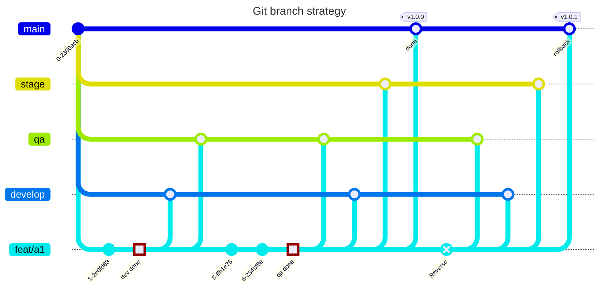
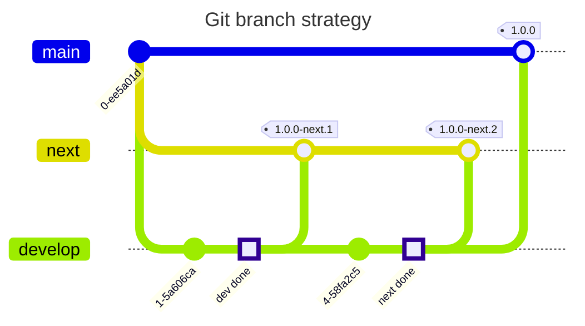

# Git

```mermaid
---
title: Git branch strategy
---
gitGraph
   commit
   branch stage
   branch qa
   branch develop
   branch feat/a1
   commit
   commit id: "dev done" type: HIGHLIGHT
   checkout develop
   merge feat/a1
   checkout qa
   merge feat/a1
   checkout feat/a1
   commit
   commit
   commit id: "qa done" type: HIGHLIGHT
   checkout qa
   merge feat/a1
   checkout develop
   merge feat/a1
   checkout stage
   merge feat/a1
   checkout main
   merge feat/a1 tag: "v1.0.0" id: "done"
   checkout feat/a1
   commit id: "Reverse" type: REVERSE
   checkout qa
   merge feat/a1
   checkout develop
   merge feat/a1
   checkout stage
   merge feat/a1
   checkout main
   merge feat/a1 tag: "v1.0.1" id: "rollback"
```

```mermaid
---
title: Git branch strategy
---
gitGraph
   commit
   branch next
   branch develop
   commit
   commit id: "dev done" type: HIGHLIGHT
   checkout next
   merge develop tag: "1.0.0-next.1"
   checkout develop
   commit
   commit id: "next done" type: HIGHLIGHT
   checkout next
   merge develop tag: "1.0.0-next.2"
   checkout main
   merge develop tag: "1.0.0"
```
